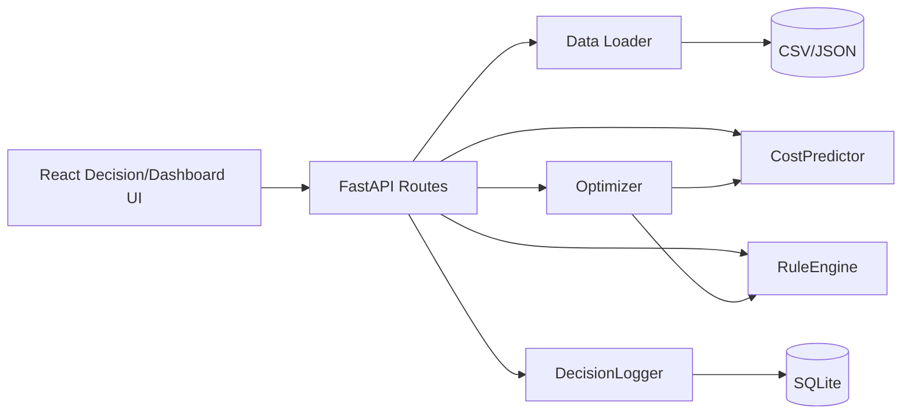
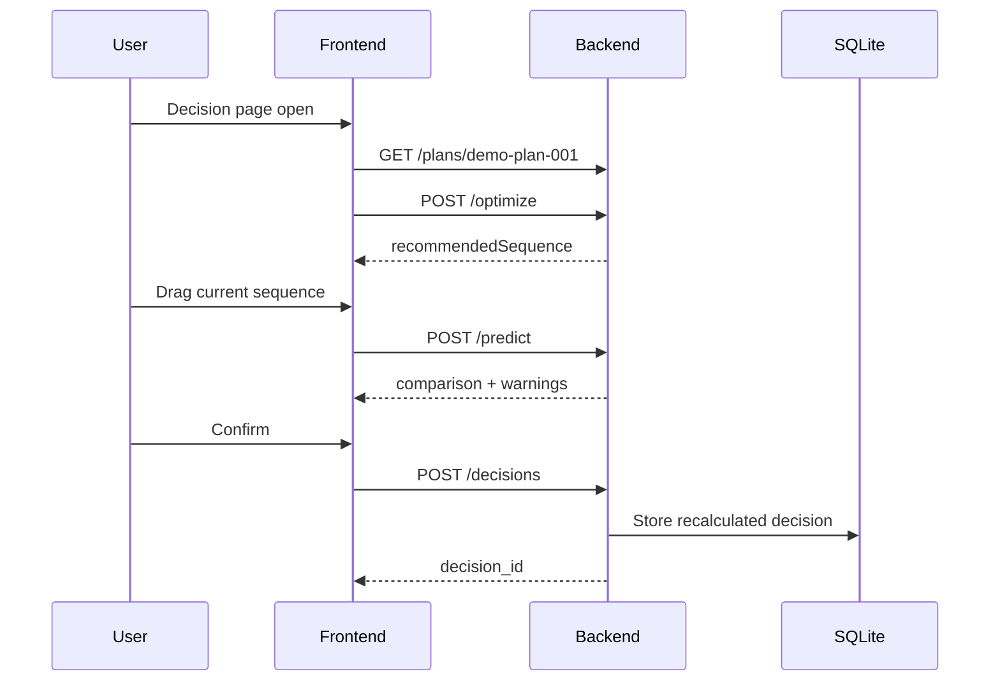

# SmartFactoryV2 아키텍처

## 1. Context

SmartFactoryV2는 해커톤에서 다품종 도료 생산순서 추천과 what-if 비교를 빠르게 보여주기 위한 MVP입니다. 현재 단계에서는 실제 MES/ERP나 운영 DB와 연결하지 않고, 합성 데이터와 SQLite 로그만으로 전체 의사결정 흐름을 구성합니다. 구현의 핵심은 추천 순서 생성, 사용자의 순서 수정, 비용/리스크 재계산, 확정 로그 저장, KPI 반영이 한 번에 이어지는 것입니다. 이 구조가 없으면 각 기능을 따로 보여줄 수는 있어도 운영 의사결정 지원 시스템이라는 메시지가 약해집니다.

## 2. Goals & Non-Goals

### Goals

| Goal | Description |
|---|---|
| 실행 가능한 MVP 골격 | FastAPI, React, SQLite, 합성 데이터 구조를 한 저장소에서 실행 가능하게 구성합니다. |
| fallback-safe AI 경로 | XGBoost/OR-tools가 없어도 heuristic/brute-force로 API가 동작합니다. |
| 문서 기반 구현 | roadmap, API, DB, data, demo 문서를 코드와 함께 유지합니다. |

### Non-Goals

| Non-Goal | Reason |
|---|---|
| MES/ERP 연동 | 해커톤 P2 범위이며 외부 의존성이 큽니다. |
| 다중 라인 최적화 | MVP 핵심인 색상 전환 시연을 흐립니다. |
| 실제 LLM 호출 | 환경변수와 비용/지연 의존성을 피하기 위해 template 설명을 우선합니다. |

## 3. Architecture

프론트엔드는 의사결정 화면과 대시보드 화면을 담당합니다. 백엔드는 route handler와 service logic을 분리하고, 비용 예측/룰 평가/순서 최적화/저장 책임을 서비스 파일로 나눕니다. 기준정보와 학습 데이터는 CSV/JSON 파일에서 읽고, 최종 decision과 KPI 원천은 SQLite에 저장합니다.

## 4. Sequence / Flow

## 5. Risks & Verification

| Risk | 대응 |
|---|---|
| XGBoost/OR-tools 설치 실패 | fallback 코드 경로를 유지합니다. |
| sequence key 혼동 | 모든 문서와 schema에서 `plan_item_id[]`를 명시합니다. |
| seed data 누락 | `scripts/seed_data.py`를 반복 실행 가능하게 유지합니다. |

검증은 seed 생성, `/health`, `/plans`, `/optimize`, `/predict`, `/decisions`, `/dashboard` smoke test 순서로 진행합니다.
