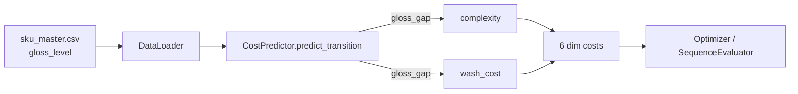
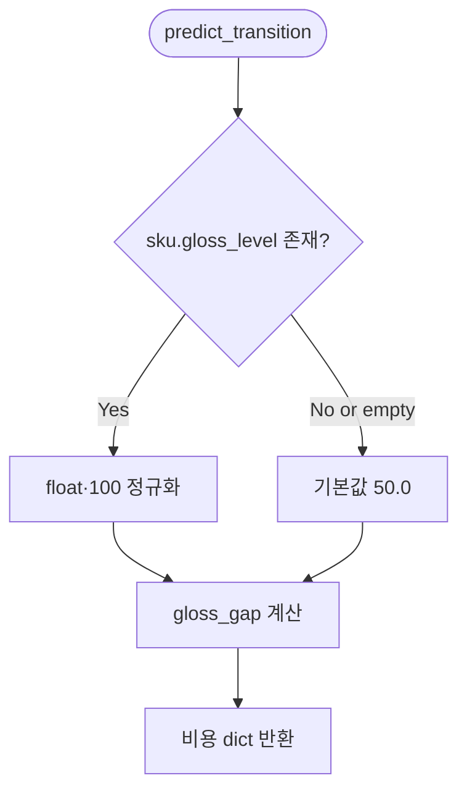

# Cost Heuristic Gloss Adoption Design Document

> Status: Approved
> Created: 2026-05-20
> Owner: backend

## Context

`backend/app/data/raw/sku_master.csv`의 `gloss_level` 컬럼은 `DataLoader`가 SKU dict에 그대로 실어 보내지만, `CostPredictor.predict_transition()`은 이 값을 사용하지 않습니다(`grep -rn "gloss" backend/app` 0건). 결과적으로 같은 카테고리 내에서 광택 차이가 큰 전환(예: `SKU-LGRAY-001 gloss=0.6 → SKU-WHITE-001 gloss=0.8`)이 비용에 반영되지 않아 데이터-계산 정합성이 깨져 있습니다. `sequence_rules.json`의 SR-003/SR-004는 `category in {metal, special}`로 광택 잔류 리스크를 거시적으로만 잡고 있어, 같은 카테고리 안의 광택 그라데이션은 누락됩니다. 본 변경은 휴리스틱 cost predictor에 `gloss_gap` 항을 도입해 이 빈틈을 메우는 것이 목표입니다.

## Goals & Non-Goals

### Goals

| Goal | Description |
|---|---|
| 광택 잔류 신호 반영 | `gloss_level` 수치를 cost 계산 입력으로 사용 |
| 의미 있는 차원 강조 | 광택 잔류의 도메인 시그널인 `wash_cost`에 직접 가산 |
| 6 차원 부드러운 전파 | `complexity` 항에도 소량 가산해 setup/labor/downtime에 자연 전파 |

### Non-Goals

| Non-Goal | Reason |
|---|---|
| `sequence_rules.json` 변경 | 룰은 카테고리 안전 임계를 담당하므로 중복 페널티 피함 |
| XGBoost 학습 데이터 갱신 | 학습기는 P1 stub이고 `transition_history.csv`에 gloss 컬럼이 없음 |
| 프론트엔드 PlanItem 확장 | UI는 6 차원 결과로 자연 반영되므로 본 변경 범위 밖 |

## Architecture



`CostPredictor`는 sku dict에서 `gloss_level`을 직접 읽어 `_gloss_level()` 헬퍼로 0~100 레벨로 정규화하고, `gloss_gap = |from - to|`을 산출합니다. 이 값은 `complexity`와 `wash_cost` 두 곳에 가산되며 다른 모듈 변경은 없습니다.

## Sequence / Flow

### 정상 흐름

```mermaid
sequenceDiagram
  participant Opt as Optimizer
  participant Pred as CostPredictor
  participant Sku as sku dict

  Opt->>Pred: predict_transition(from_item, to_item, ctx)
  Pred->>Sku: from["gloss_level"], to["gloss_level"]
  Pred->>Pred: gloss_gap = |from_gloss - to_gloss| * 100
  Pred->>Pred: complexity += gloss_gap / 140
  Pred->>Pred: wash_cost += 90 * gloss_gap
  Pred-->>Opt: 6 dim cost dict
```

| Step | Description |
|---:|---|
| 1 | Optimizer가 인접 plan item 쌍에 대해 predict_transition 호출 |
| 2 | predictor가 sku dict에서 gloss_level을 읽어 정규화 |
| 3 | gloss_gap 계산 후 complexity와 wash_cost에 가산 |
| 4 | 6 차원 cost dict 반환 |

### 주요 에러 흐름



| Case | Handling |
|---|---|
| `gloss_level` 키 부재 | 기본값 0.5(레벨 50.0) 사용 |
| 값이 빈 문자열 또는 None | 기본값 50.0 사용 |
| 값이 이미 0~100 스케일 | `≤1.0` 가드로 재정규화 회피 |

## Decisions & Rationale

### Decision 1: gloss 영향 차원 선택

| Item | Description |
|---|---|
| Decision | `wash_cost`에 직접 항(`90 * gloss_gap`) + `complexity`에 소량 항(`gloss_gap / 140`) |
| Alternatives | (a) complexity 단독, (b) wash + material_loss + complexity 세 곳 가산 |
| Rationale | 광택 잔류는 도메인상 세척 부담의 직접 신호. complexity 전파만으로는 wash 의미가 모호하고, material_loss까지 손대면 신호 분산. |
| Impact | wash_cost가 광택 차이에 민감해지고 다른 차원은 complexity 경로로 완만하게 상승. |

### Decision 2: 룰 엔진 변경 여부

| Item | Description |
|---|---|
| Decision | `sequence_rules.json` 변경 없음. 휴리스틱 단독 추가. |
| Alternatives | 숫자 임계값 신규 룰(`gloss_gap ≥ 0.5 → penalty`) 추가 |
| Rationale | 룰=카테고리 안전 임계, heuristic=연속 그라데이션으로 책임 분리. 동일 신호에 두 페널티 부여 시 이중 카운트 우려. |
| Impact | 광택 차이가 큰 같은-카테고리 전환은 cost로만 표현되며 severity 라벨에는 영향 없음. |

### Decision 3: gloss 헬퍼 스케일

| Item | Description |
|---|---|
| Decision | `_gloss_level()`이 0~100 레벨을 반환(viscosity와 동일 스케일) |
| Alternatives | 0~1 원본 그대로 사용 |
| Rationale | 기존 `_brightness_level`·`_viscosity_level`이 0~100을 반환하므로 일관성 유지. gap 계수(`/140`, `*90`)도 viscosity와 유사한 크기로 비교 가능. |
| Impact | 호출자 코드(현 시점 1곳)는 자동 호환. 향후 입력 형식이 바뀌어도 헬퍼 한 곳에서 흡수. |

## Edge Cases & Error Handling

| Case | Handling | Impact |
|---|---|---|
| sku dict에 `gloss_level` 키 없음 | 헬퍼가 50.0 반환 | gloss_gap=0 → 비용 변동 없음 |
| 값이 문자열(`"0.80"`) | `float()` 변환 후 0~100 정규화 | 정상 처리(테스트 fixture 형식 호환) |
| 같은 SKU 자체 전환(gloss 동일) | gloss_gap=0 | 추가 비용 0, 기존 동작 유지 |
| metal/special처럼 gloss가 0.95~0.98로 매우 높은 SKU | 큰 gloss_gap 발생 → wash_cost 최대 ~6300원 가산 | 카테고리 룰 페널티와 별도. 의도된 효과(같은 신호의 연속/이산 분담) |

## Out of Scope

| Item | Reason |
|---|---|
| XGBoost 학습 데이터에 gloss 컬럼 추가 | `train_xgboost.py`는 P1 stub. 모델 실제 학습 시 함께 처리 |
| `sequence_rules.json` 광택 수치 룰 신설 | Decision 2에 따라 의도적 보류 |
| `PlanItem` 타입 / SkuCard에 광택 표시 | UI 변경은 별도 후속 |

---

## Data Model

_해당없음_

## API / Interface

_해당없음_

## Workflow

_해당없음_

## Performance

_해당없음_

## Security

_해당없음_

## Observability

_해당없음_

## Migration / Rollback

본 변경은 코드 변경만 포함하며 데이터 마이그레이션이 없습니다. 롤백은 해당 커밋 revert로 충분합니다.

## Open Questions

_해당없음_
