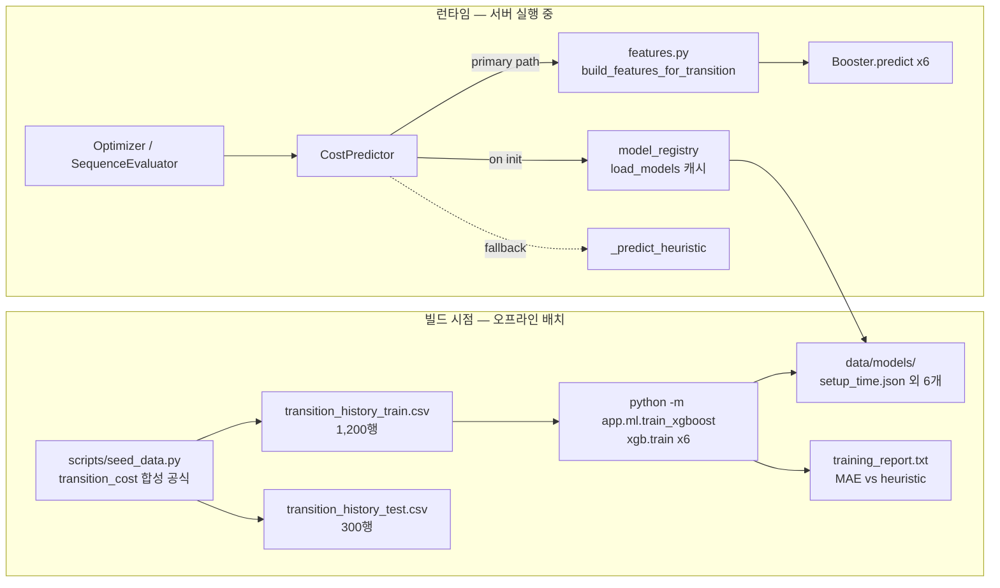

# XGBoost 비용 예측기 — MVP 범위·한계·확장 시연 자료

> Status: Reference (시연용)
> Created: 2026-05-21
> Audience: 본선 시연 발표자, 후속 기여자
> Related: `docs/learning/xgboost-cost-predictor-walkthrough.md` (코드 워크스루), `docs/design/cost-predictor/xgboost-cost-predictor-integration.md` (구현 설계), `docs/implementation_log.md`

## 1. 이 문서의 목적

본선 시연에서 "왜 이 정도까지 만들었는가" + "운영 환경에서는 어떻게 확장되는가"를 정직하고 일관되게 설명하기 위한 발표 자료입니다. 코드·구현 결정 자체는 `xgboost-cost-predictor-integration.md`가 다루고, 학습 자료의 코드 워크스루는 `docs/learning/xgboost-cost-predictor-walkthrough.md`가 다룹니다. 본 문서는 그 위에 **MVP 범위와 한계를 청중 관점에서 명시적으로 묘사**합니다.

읽는 사람:
- **발표자**: 슬라이드 텍스트와 verbal script로 그대로 사용.
- **심사자/청중**: 발표 직후 자료 공유 시 본 문서로 인계.
- **후속 기여자**: "다음 단계가 무엇인지" 확인.

---

## 2. 구현된 구조 (What's built)

### 2.1 데이터 흐름



### 2.2 구성요소 한눈에

| 컴포넌트 | 파일 | 책임 |
|---|---|---|
| 합성 데이터 생성기 | `scripts/seed_data.py` | 1,200건 train + 300건 test row를 결정론적(seed 고정)으로 생성 |
| 학습 파이프라인 | `backend/app/ml/train_xgboost.py` | 6개 차원 독립 회귀 모델 학습, native JSON 저장 |
| 공통 feature 함수 | `backend/app/ml/features.py` | 학습/추론이 같은 12개 컬럼 사용 (drift 차단) |
| 모델 로더·캐시 | `backend/app/ml/model_registry.py` | 디스크 → 메모리 1회 로드, 모듈 캐시 |
| 추론 분기 | `backend/app/services/cost_predictor.py` | XGBoost 우선, 없으면 heuristic 자동 fallback |
| 회귀 테스트 | `backend/tests/test_xgboost.py` | feature drift / fallback / xgb 경로 3건 |

### 2.3 수치 결과 (test set 300건, MAE)

| 차원 | heuristic | XGBoost | 개선 |
|---|---:|---:|---:|
| setup_time (분) | 14.06 | 2.54 | **−81.9%** |
| labor_cost (원) | 29,771 | 6,556 | **−78.0%** |
| material_loss (L) | 1.38 | 0.25 | **−81.6%** |
| wash_cost (원) | 18,093 | 4,582 | **−74.7%** |
| downtime (분) | 4.30 | 1.76 | −59.1% |
| packaging_time (분) | 3.05 | 1.74 | −42.9% |

6개 차원 평균 약 **70% MAE 감소**. 절대 단위가 큰 비용(labor, wash)에서 절대 오차 축소 폭이 가장 큼.

### 2.4 운영 비용

| 항목 | 값 |
|---|---|
| 학습 1회 | ~10초 (Apple Silicon) |
| 1회 추론 (predict_transition) | ~1.2ms |
| `/optimize` 1회 (N=10 plan items) | predict ~110ms + OR-tools ~5,000ms ≈ **5.1초** |
| 모델 산출물 총 디스크 | ~3.8MB (6 × 650KB) |
| 메모리 (모듈 캐시 1회 로드 후) | ~4MB |
| 새 의존성 | sklearn/joblib **없음**, xgboost 3.2.0 + macOS libomp |

---

## 3. MVP 범위 한계 (상세)

다음 7가지가 의도된 한계입니다. **모두 demo 안정성·정직성·범위 trade-off의 결과**이며, 운영 환경 확장 시 어떻게 해소되는지는 §4에서 다룹니다.

### 한계 1. 학습은 오프라인 배치, 서버 기동 시 자동 학습 없음

**무엇이 한계인가**
- `python -m app.ml.train_xgboost`를 수동으로 실행해야 모델 파일이 생깁니다.
- 서버(`uvicorn ...`)는 학습하지 않습니다. 디스크에 이미 있는 모델 JSON 6개를 메모리로 로드만 합니다.
- 학습된 이후 데이터(`decisions` 테이블 등)가 쌓여도 모델은 자동으로 갱신되지 않습니다.

**왜 이 선택인가**
- 학습 도중 사용자 요청이 들어오면 race condition risk. 데모 환경에서 학습은 보장된 시점에서만 발생해야 안정적.
- 자동 학습을 도입하려면 "재학습 라벨이 무엇인가"가 명확해야 하는데, MVP에는 실 관측치 채널이 없어 라벨 출처가 합성 공식뿐. 자기 학습 feedback loop 위험.

**데모에서 어떻게 보이나**
- 데모 시작 전 학습 1회 실행 → 서버 기동 → 시연 동안 모델은 고정.
- 화면의 추천 순서·objective_score·7차원 비용은 모두 그 고정 모델 기준으로 계산됨.
- 사용자의 우선순위 슬라이더 / D&D 조작은 **모델은 그대로**이고 **OR-tools가 다른 순서를 선택**하면서 결과가 바뀜.

**운영 환경에서**
- 실 관측치 누적 → 주기적 자동 재학습 → mtime 기반 캐시 무효화로 무중단 갱신 (§4.1).

### 한계 2. 학습 라벨이 합성 공식으로 만들어진 ground truth

**무엇이 한계인가**
- `transition_history_train.csv`의 6개 target 컬럼(setup_time 등)은 `seed_data.transition_cost()` 함수가 가우스 노이즈를 더해 만든 합성 값입니다.
- 실제 공정에서 측정한 setup_time이 아닙니다. 즉 "AI가 학습한 ground truth"가 통계적 시뮬레이션입니다.

**왜 이 선택인가**
- 해커톤 MVP 단계에서 실 공장 측정 채널을 연동하기에는 범위가 너무 큼 (MES/ERP 연동은 P2).
- 합성 공식이 도메인 지식(pigment_intensity 차이, equipment_condition 영향 등)을 반영하므로 baseline으로는 충분.
- 학습 코드·feature 함수·모델 구조는 실 데이터로 교체할 때 그대로 재사용 가능.

**데모에서 어떻게 보이나**
- "1,200건 합성 전환 이력으로 학습"이라고 정직하게 표현.
- 청중이 "합성 라벨로 학습한 게 의미 있느냐"고 물으면: "도메인 지식 기반 합성이라 baseline으로 충분하고, 운영에서는 같은 학습 파이프라인에 실 측정값을 흘려넣기만 하면 됩니다"라고 답.

**운영 환경에서**
- MES/ERP에서 실제 setup_time, labor_cost, wash_cost 등을 수집 → 동일 CSV 스키마로 변환 → `transition_history_live.csv`에 append → 재학습 (§4.2).

### 한계 3. `/predict`·`/optimize` 호출이 학습에 기여하지 않음

**무엇이 한계인가**
- 사용자가 화면에서 D&D로 순서를 바꾸거나 우선순위 슬라이더를 조작해도, 그 인터랙션은 학습 데이터에 **추가되지 않습니다**.
- `/predict`와 `/optimize`는 무상태 계산만 수행. 어떤 로그도 남기지 않음.
- 유일한 영속 지점은 `/decisions` POST (SQLite `decisions` 테이블).

**왜 이 선택인가**
- `/decisions`에 저장되는 `confirmed_cost_vector`는 **모델의 예측치**이지 실제 관측치가 아님. 그대로 라벨로 쓰면 feedback loop.
- 사용자 D&D 자체는 "선호 순서" 정보지 "비용 라벨"이 아니므로 회귀 학습에 직접 사용 불가.

**데모에서 어떻게 보이나**
- "사용자 인터랙션이 모델을 학습시킨다"는 narrative는 사용하지 않음.
- 대신 "사용자 인터랙션이 OR-tools 최적화·우선순위 가중치를 통해 결과에 반영된다"는 narrative.

**운영 환경에서**
- 실 관측치 채널이 별도로 들어오면 인터랙션 ↔ 학습은 분리된 상태로 안전하게 공존 가능.
- 사용자 선호를 학습에 반영하려면 회귀가 아닌 ranking/preference learning이 필요 — 별도 ML 문제로 분기.

### 한계 4. 단일 라인·단일 plan 가정

**무엇이 한계인가**
- 학습·추론 모두 `LINE-01` 한 라인을 전제로 합니다.
- `daily_plan.csv`에 multi-line plan이 들어와도 cross-line 최적화는 하지 않습니다.
- `sku_master.csv`의 11 SKU 범위 내에서만 학습됨.

**왜 이 선택인가**
- 시연 가치 vs 구현 비용 trade-off. 다중 라인은 OR-tools 모델링 복잡도가 크게 증가.
- `docs/roadmap.md`에서 다중 라인은 명시적으로 P2로 분류됨.

**데모에서 어떻게 보이나**
- 시연은 `demo-plan-001` 단일 plan으로 진행. 라인 ID는 화면에 표시되지만 변경 옵션 없음.

**운영 환경에서**
- 라인별 모델 6개씩 × N개 라인. 또는 라인을 추가 feature로 넣어 단일 모델 유지. 데이터량과 라인 간 분포 차이에 따라 선택.

### 한계 5. Hyperparameter 튜닝 없음

**무엇이 한계인가**
- `HYPERPARAMS`(`max_depth=5`, `learning_rate=0.08`, `n_rounds=200`)는 코드에 하드코딩되어 있고, validation set으로 튜닝하지 않았습니다.
- 차원별로 따로 튜닝하지도 않습니다 — 6개 모델 모두 같은 hyperparams.

**왜 이 선택인가**
- 시연 가치 vs 구현 비용. 튜닝으로 절대 정확도 차이를 좁힐 수 있지만 발표 청중에게 의미가 약함.
- "재현 가능한 학습"이 demo 안정성 측면에서 더 중요.

**데모에서 어떻게 보이나**
- `training_report.txt`의 MAE 그대로 인용. "튜닝하지 않은 평범한 기본값으로도 heuristic 대비 70% 개선"이라고 표현하면 오히려 baseline 강도가 부각됨.

**운영 환경에서**
- Optuna / Hyperopt 등으로 차원별 hyperparam 탐색. validation set 분리.

### 한계 6. 학습 결과의 화면 자동 반영 없음 (캐시 무효화)

**무엇이 한계인가**
- 서버가 실행 중인 상태에서 별도 터미널로 `train_xgboost`를 다시 돌려도, 같은 서버 프로세스에서는 **여전히 옛 모델을 사용**합니다.
- `model_registry._MODEL_CACHE`가 디렉토리 경로 기준으로만 무효화되고, 파일 mtime은 보지 않기 때문입니다.

**왜 이 선택인가**
- 데모 안정성. 학습 도중에 cache가 reload되면 part-trained model로 서빙될 risk.
- 캐시 무효화 정책은 §4.3에서 mtime 기반으로 확장 가능.

**데모에서 어떻게 보이나**
- 데모 진행 중에는 재학습하지 않으므로 이 한계는 외부에서 보이지 않음.
- 재학습이 필요하면 **uvicorn 재시작 1회**로 해결.

**운영 환경에서**
- mtime 기반 자동 reload 또는 `POST /admin/reload-model` endpoint로 무중단 갱신 (§4.3).

### 한계 7. macOS 환경 의존 (`libomp`)

**무엇이 한계인가**
- macOS에서 XGBoost가 동작하려면 시스템 전역 `libomp` 패키지가 필요합니다 (`brew install libomp`).
- 미설치 시 학습·추론 모두 실패. 단, `CostPredictor`가 자동으로 heuristic으로 fallback 하므로 API는 정상 동작.

**왜 이 선택인가**
- XGBoost 공식 wheel이 macOS에서 libomp를 별도 시스템 의존성으로 요구.
- conda·custom wheel 등의 대안은 모두 더 복잡.

**데모에서 어떻게 보이나**
- 데모 환경 셋업 단계에서 1회 처리. 시연 자체에 나타나지 않음.
- README와 CLAUDE.md에 사전 요구사항으로 명시되어 있음.

**운영 환경에서**
- Linux 컨테이너로 배포 시 이 이슈 없음. 도커 이미지에 패키지로 포함.

---

## 4. 운영 확장 시 변경 사항 (How it extends)

### 4.1 자동 재학습 트리거

```text
현재:  사용자 → 수동 학습 → 서버 재시작 → 반영
운영:  관측치 누적 → 임계값 충족 → 백그라운드 재학습 → cache 무효화 → 다음 요청부터 반영
```

| 구성요소 | 현재 | 운영 확장 |
|---|---|---|
| 트리거 | 수동 명령 | (a) N건 누적 (b) 일/주 단위 cron (c) admin curl |
| 실행 환경 | 동일 프로세스 (blocking) | 백그라운드 큐 (Celery / RQ / FastAPI BackgroundTasks) |
| 산출물 적용 | 서버 재시작 필요 | cache 무효화로 무중단 |

### 4.2 실 관측치 수집 + 원본 보존

```text
[append-only 정책]
transition_history_train.csv  ← 1,200행, 영구 read-only 기준선
transition_history_live.csv   ← 운영 누적, append-only
                                 ↑
                                 MES/ERP에서 실 측정값 변환
```

| 항목 | 정책 |
|---|---|
| 원본 1,200행 | 절대 수정 금지. seed 데이터로 보존. |
| 신규 라이브 데이터 | 별도 CSV에 append-only. 학습 시 union. |
| 데이터 소스 신뢰성 | source 컬럼(`seed` / `mes` / `manual`)로 출처 추적. |
| 백업 | 학습 직전 snapshot 디렉토리에 timestamp 백업 권장. |

### 4.3 무중단 모델 갱신

| 옵션 | 설명 | 코드 비용 |
|---|---|---|
| **mtime 기반 자동 reload** | `load_models`가 디렉토리 + 파일 mtime 비교 후 변경 시 force_reload | ~10줄 |
| **`POST /admin/reload-model` endpoint** | 학습 스크립트 종료 시 curl 호출로 명시적 무효화 | ~30줄 |
| **버전드 디렉토리** | `models/v1/`, `models/v2/` 분리 후 `MODEL_DIR` 심볼릭링크 교체 | ~50줄 (운영 친화적) |

### 4.4 모델 버전 추적

| 항목 | 현재 | 운영 확장 |
|---|---|---|
| `model_version` 값 | `"xgboost-v1"` 고정 | `"xgboost-v1.2026-07-15"` 형태 timestamp 포함 |
| 학습 이력 | `training_report.txt` 1회분 | `training_history.jsonl` 누적 |
| 추적 가능성 | 모델 = 1개 (현재 시점) | decision 레코드와 model version join 가능 |

### 4.5 증분 학습 (Incremental boosting)

```python
# 현재: 매번 처음부터
booster = xgb.train(HYPERPARAMS, dtrain, num_boost_round=200)

# 운영 확장: 이전 모델 위에 추가 학습
booster = xgb.train(HYPERPARAMS, dtrain, num_boost_round=50, xgb_model="prev.json")
```

| 측면 | 효과 |
|---|---|
| 학습 시간 | 신규 row만 학습하면 되므로 감소 |
| 누적 가중치 | 이전 학습 정보 보존 |
| 위험 | 분포 shift가 큰 데이터에 over-fitting 가능 → 주기적 from-scratch 재학습으로 보정 |

### 4.6 MES/ERP 연동 지점

| 데이터 | 출처 (운영) | 현재 (MVP) |
|---|---|---|
| 실제 setup_time | PLC 시간 기록 | 합성 (seed_data) |
| 실제 wash_cost | 자재 소모 ERP | 합성 |
| 실제 downtime | 설비 가동 로그 | 합성 |
| 작업자 skill | HR 시스템 | 합성 (0.3~0.9 randint) |
| 설비 condition | CMMS / IoT 센서 | 합성 (0.3~1.0 randint) |

---

## 5. 시연 narrative — 3분 발표 스크립트

> 본 섹션은 발표자가 그대로 읽거나 슬라이드 노트로 사용할 수 있게 작성했습니다. 한국어, 존댓말, ~3분 분량.

### Slide 1 — 구조 (45초)

> "다품종 도료 공장에서 두 SKU 사이 전환에 드는 비용을 미리 알아야 OR-tools 최적화기가 최저 비용 순서를 골라줄 수 있습니다. 저희는 setup_time, labor_cost, material_loss, wash_cost, downtime, packaging_time 총 6가지 비용을 회귀로 예측합니다. 학습 데이터는 도메인 지식 기반 합성 공식으로 만든 전환 이력 1,200건. 모델은 XGBoost 6개 회귀를 독립 학습해 차원별 booster를 따로 만들었습니다. 학습은 오프라인 배치 1회로 끝납니다."

**시각자료 권장**: §2.1 데이터 흐름 다이어그램

### Slide 2 — 결과 (45초)

> "동일 test set 300건에서 heuristic 대비 6개 차원 전부 개선됐습니다. 가장 큰 폭은 setup_time(82% 감소)과 material_loss(82% 감소). 절대값이 큰 labor_cost는 평균 오차가 29,771원에서 6,556원으로 줄었습니다. 모델 파일은 차원당 약 650KB, 합 4MB. 1회 추론은 1.2ms 수준이라 OR-tools 탐색 시간(5초)에 묻혀 사용자 체감 latency에는 영향이 없습니다."

**시각자료 권장**: §2.3 MAE 표

### Slide 3 — MVP 한계 (45초)

> "MVP 단계에서 의도적으로 둔 한계가 두 가지입니다. 첫째, 학습이 오프라인 배치 1회입니다. 데모 시연 동안 사용자가 화면에서 무엇을 누르든 모델 가중치는 변하지 않습니다. 추천 순서와 비용 계산은 그 고정 모델로 일관됩니다. 둘째, 학습 라벨이 합성 공식으로 만들어진 ground truth입니다. 실 공정 측정값을 받는 채널이 MVP에는 없어요. 그래서 '학습이 실시간으로 일어나는 시연'은 일부러 안 만들었습니다 — 실 측정 없이 학습을 흉내내면 모델이 자기 자신을 학습하는 feedback loop가 생기기 때문입니다."

**시각자료 권장**: §3 한계 1·2의 요약 표

### Slide 4 — 확장 (45초)

> "운영 환경으로 확장하면 세 가지가 단계적으로 들어옵니다. 첫째, MES와 ERP에서 실제 setup_time과 wash_cost를 수집해 transition_history_live.csv에 append합니다. 원본 1,200행은 그대로 영구 보존됩니다. 둘째, N건 누적 또는 일·주 단위로 자동 재학습. 증분 학습(xgb_model 인자)으로 학습 비용도 줄입니다. 셋째, mtime 기반 캐시 무효화 또는 admin endpoint로 서버 재시작 없이 모델을 갱신합니다. 학습 코드와 feature 함수는 그대로 재사용됩니다 — 운영 데이터로 입력만 갈아끼우면 됩니다."

**시각자료 권장**: §4.1 자동 재학습 트리거 다이어그램

---

## 6. Q&A 대비

### 자주 받을 질문

| 질문 | 한 줄 답 | 깊이 답 |
|---|---|---|
| "왜 실시간으로 학습이 안 일어나나요?" | 실 측정 채널이 없어 합성 라벨에 의존하면 feedback loop가 생기기 때문입니다 | §한계 1·2·3 |
| "데모 중에 모델이 바뀌는 걸 보고 싶은데요?" | 의도된 설계입니다. 데모 안정성·정직성 우선. 운영 환경에서 자동 재학습이 들어옵니다 | §한계 1·6 |
| "합성 라벨로 학습한 게 의미 있나요?" | 합성 공식이 도메인 지식 기반이라 baseline으로 충분. 학습 파이프라인은 그대로 두고 실 데이터만 갈아끼우면 됩니다 | §한계 2 |
| "원본 1,200행이 학습 중에 사라지나요?" | 학습은 CSV를 read-only로만 읽습니다. 학습을 100번 돌려도 원본은 그대로 | §한계 2 + §4.2 |
| "같은 학습을 또 돌리면 다른 결과가 나오나요?" | 아니요. seed=42 고정이라 매번 동일한 모델·동일한 MAE가 나옵니다 | §한계 5 |
| "학습 데이터 1,200건이 부족하지 않나요?" | 합성 데이터는 분포가 균일하고 max_depth 제한으로 overfit 신호도 없습니다. 실 데이터에서는 재튜닝 필요 | §한계 5 |
| "이 정확도(70% 개선)가 운영 비용으로 환산하면 얼마인가요?" | labor_cost 기준 평균 6,556원/전환. 일 10건이면 약 65,560원/일 (단순 곱) | §2.3 |
| "MES 연동은 언제 들어가나요?" | P2. 본 MVP 범위 밖 | §4.6 |
| "XGBoost가 안 깔린 환경에서는요?" | CostPredictor가 자동으로 heuristic으로 떨어집니다. API 응답 shape는 동일하고 model_version만 "heuristic-v1"로 표시 | §한계 7 |
| "왜 sklearn을 안 쓰나요?" | 의존성 크기 최소화. xgb.train low-level API + numpy로 충분 | `xgboost-cost-predictor-integration.md` Decision 3 |
| "wash_cost가 광택·색상군에, downtime이 점도차에 묶인 근거는요?" | 도료 공정 직관입니다 — 광택·색상군 점프는 라인 잔류 세척 부담, 점도차는 펌프·노즐 재조정 시간으로 직결됩니다 | `priority-cost-decoupling.md` Decision 1 |
| "그 매핑이 학술적으로 검증된 건가요?" | MVP 수준에서는 도메인 직관 + 일반적 도료 공정 상식까지만 보장합니다. 실 측정값이 누적되면 동일 XGBoost 파이프라인이 각 차원의 실 기여도를 데이터에서 자동 학습해 매핑을 보정합니다 | `priority-cost-decoupling.md` Decision 1 + §4.2 |
| "우선순위 슬라이더를 바꿔도 추천 순서가 안 바뀌는데요?" | 6개 비용 차원을 서로 다른 SKU 특성에 분리해 의존시키는 작업이 들어있습니다. 작업 후에는 wash 강조 vs 납기 강조에서 서로 다른 순서가 나옵니다 | `priority-cost-decoupling.md` |

### 답하지 말아야 할 표현

| 피해야 할 답 | 이유 | 더 나은 표현 |
|---|---|---|
| "실시간 학습은 다음 버전에 들어갑니다" | 시점이 막연 | "실 측정 채널이 확보되면 자동 재학습으로 확장됩니다" |
| "정확도가 매우 높습니다" | 모호 | "test set 300건에서 평균 70% MAE 감소했습니다" |
| "합성 데이터지만 진짜처럼 학습됩니다" | 의심 유발 | "합성 데이터로 baseline을 확보했고, 운영 시 실 데이터로 교체합니다" |
| "이건 한계지만 별문제 아닙니다" | 방어적 | "이 한계는 의도된 범위 분리입니다. 운영 확장 시 (X)로 해소됩니다" |

---

## 7. 본 자료 사용법

| 시점 | 사용 방법 |
|---|---|
| 발표 슬라이드 제작 | §5의 4개 슬라이드를 그대로 텍스트로 사용. 시각자료 권장 차트 참고. |
| 발표 직전 리허설 | §5 verbal script 낭독 + §6 Q&A 첫 5개 항목 빠르게 훑기. |
| 발표 중 예상 외 질문 | §6 표에서 검색. 답이 없으면 "운영 확장 항목으로 분리되어 있습니다"로 안전 처리. |
| 발표 후 자료 공유 | 본 문서 링크 그대로 공유 가능. 청중이 자가 학습 시 §2~§4가 자족. |
| 후속 기여자 인계 | §3 한계 + §4 확장 매핑을 backlog 후보로 사용. 각 항목이 별도 design doc 후보. |

---

## 8. 관련 문서

| 문서 | 용도 |
|---|---|
| `docs/learning/xgboost-cost-predictor-walkthrough.md` | 코드 한 줄씩 따라가는 학습 자료. 본 자료의 §2를 코드 인용으로 펼친 버전. |
| `docs/design/cost-predictor/xgboost-cost-predictor-integration.md` | 구현 설계 결정의 출처. "왜 이렇게 만들었나"를 결정·대안·근거 표로 정리. |
| `docs/design/cost-predictor/xgboost-cost-predictor-adoption.md` | 사용자가 직접 구현하면서 학습하기 위한 가이드. (참고용) |
| `docs/implementation_log.md` 2026-05-20 항목 | 본 작업의 변경 내역, 검증 결과, fallback 케이스 매트릭스. |
| `docs/roadmap.md` | P0/P1/P2 우선순위. §3의 모든 한계가 어느 우선순위에 속하는지 확인용. |
| `~/.claude/plans/1-lexical-honey.md` (terminated) | online learning 검토 결과. "MVP 범위 초과"로 종료된 plan. |
