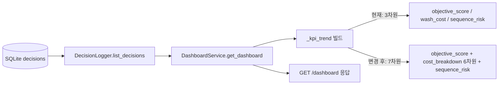
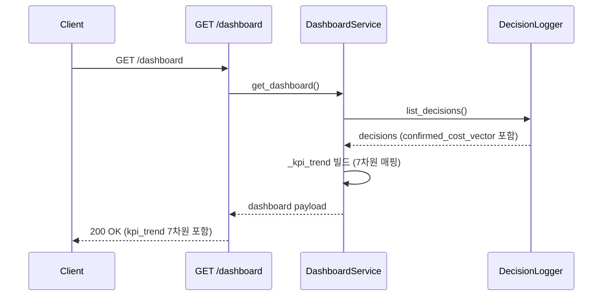
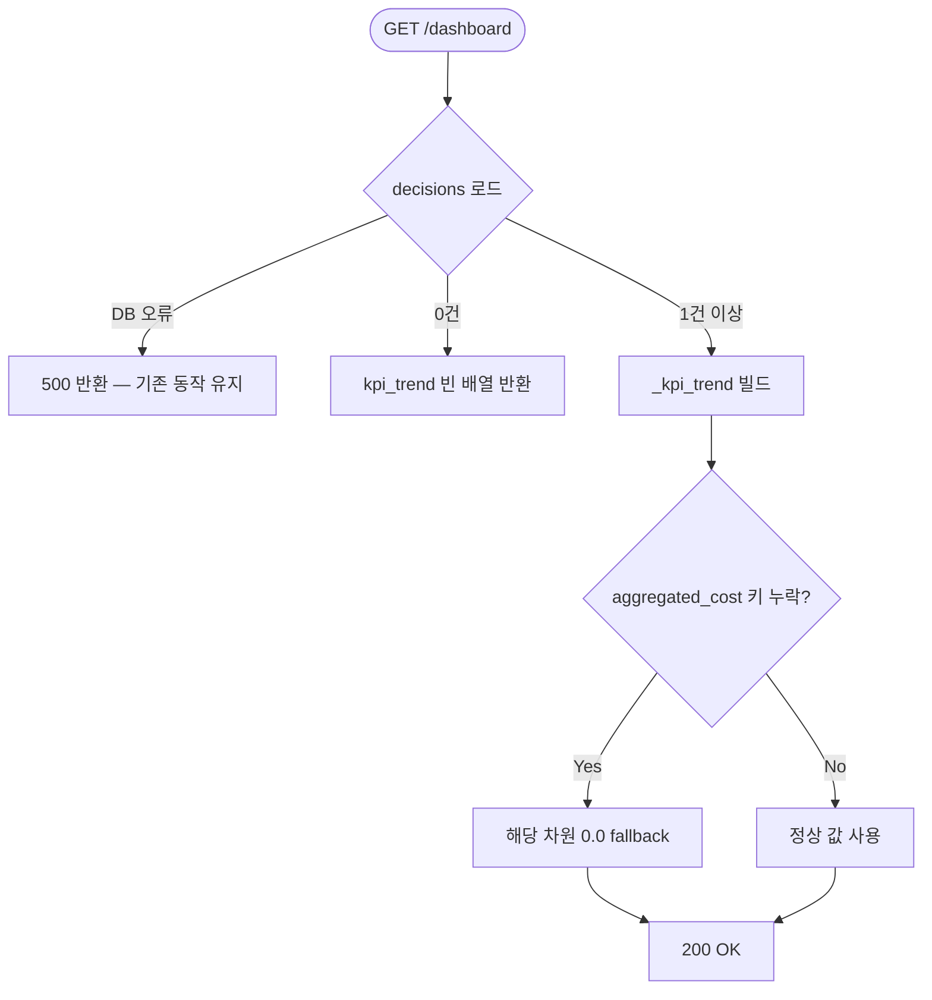

# Dashboard KPI 7차원 Trend 확장 Design Document

> Status: Draft
> Created: 2026-05-19
> Owner: backend

## Context

현재 `GET /dashboard`의 `kpi_trend` 배열은 의사결정 건당 `objective_score`, `wash_cost`, `sequence_risk` 3개 차원만 반환합니다 (`dashboard_service.py:31-40`). 그러나 `SequenceEvaluator`가 이미 7차원(`setup_time`, `labor_cost`, `material_loss`, `wash_cost`, `downtime`, `packaging_time`, `sequence_risk`)을 계산하고, `decision_logger`가 `confirmed_cost_vector` JSON에 전체를 저장하고 있습니다 (`decision_logger.py:59`). 즉 DB에는 7차원이 이미 존재하는데 응답에서 3차원만 꺼내는 것이 현재 상태입니다.

7차원 전체를 trend payload로 노출하면 프론트엔드 KPI 차트에서 비용 항목별 추이를 시각화할 수 있고, 데모 화면에서 색상 전환의 복합적 영향을 보여줄 수 있습니다. 이 변경은 `dashboard_service.py` 한 파일만 수정하며 API 시그니처, DB 스키마, CostPredictor 인터페이스를 건드리지 않습니다.

P1 백엔드 작업 순서 합의 문서(`p1-backend-sequencing.md`)에 따라 XGBoost 도입보다 먼저 진행합니다. CostPredictor 출력 키가 heuristic과 XGBoost에서 동일하므로, 이 변경은 XGBoost 도입 이후에도 수정 없이 유지됩니다.

## Goals & Non-Goals

### Goals

| Goal | Description |
|---|---|
| 7차원 trend 노출 | `kpi_trend` 배열 항목에 6개 비용 차원(`setup_time`, `labor_cost`, `material_loss`, `wash_cost`, `downtime`, `packaging_time`)과 `sequence_risk`를 모두 포함합니다. |
| 응답 shape 결정 | `cost_breakdown` 중첩 객체 vs 평탄 키 중 하나를 선택해 contract를 확정합니다. |
| 기존 smoke test 보존 | `GET /health`, seed → `/plans` → `/optimize` → `/predict` → `/decisions` → `/dashboard` 흐름이 깨지지 않아야 합니다. |

### Non-Goals

| Non-Goal | Reason |
|---|---|
| XGBoost 연동 | `p1-backend-sequencing.md` Decision 1에서 별도 작업으로 분리했습니다. |
| 주간 윈도우 필터 | `_weekly_summary`의 "최근 7일" 필터는 이번 PR 범위 밖입니다. 같은 파일이지만 크기 판단 후 분리 또는 묶을 수 있습니다. |
| 프론트엔드 차트 라인 추가 | Recharts 차트 수정은 프론트엔드 작업입니다. |
| `kpi_trend` 집계 방식 변경 | 현재 전건 조회 방식을 유지합니다. 페이지네이션이나 날짜 필터는 이번 범위가 아닙니다. |

## Architecture



| 컴포넌트 | 파일 | 변경 여부 |
|---|---|---|
| `DashboardService` | `backend/app/services/dashboard_service.py` | 수정 — `_kpi_trend` 빌드 로직 |
| `DecisionLogger` | `backend/app/services/decision_logger.py` | 변경 없음 |
| `SequenceEvaluator` | `backend/app/services/optimizer.py` | 변경 없음 |
| `/dashboard` 라우터 | `backend/app/api/v1/dashboard.py` | 변경 없음 |
| DB 스키마 | `backend/app/db/sqlite.py` | 변경 없음 |

변경은 `dashboard_service.py`의 `get_dashboard` 메서드 내 trend 빌드 블록(현재 5줄)을 확장하는 것으로 한정됩니다.

## Sequence / Flow

### 정상 흐름



| Step | Description |
|---:|---|
| 1 | `list_decisions()`는 `confirmed_at DESC` 정렬로 전건 반환합니다. |
| 2 | `_kpi_trend` 빌드 시 각 결정의 `confirmed_cost["aggregated_cost"]`에서 7개 키를 추출합니다. |
| 3 | 키가 없으면 `0.0`으로 fallback합니다 (기존 데이터 호환). |
| 4 | 차트 시계열 정렬은 `reversed(decisions)`를 유지합니다 (오래된 건부터 표시). |

### 에러 흐름



| Case | Handling |
|---|---|
| `confirmed_cost_vector`가 null이거나 파싱 실패 | `_row_to_decision`이 이미 빈 dict로 처리함. `aggregated_cost`가 없으면 모든 차원 `0.0`으로 fallback. |
| 구형 결정 레코드 — `aggregated_cost`에 일부 키 없음 | `.get(key, 0.0)`으로 안전하게 처리. 응답에는 항상 7개 키 모두 포함. |
| decisions 0건 | `kpi_trend: []` 반환. 기존 동작과 동일. |

## Decisions & Rationale

### Decision 1: 7개 차원 모두 평탄 키로 나열

| Item | Description |
|---|---|
| Decision | trend 항목에 6개 비용 차원과 `sequence_risk`를 모두 최상단 평탄 키로 추가합니다. 중첩 객체를 도입하지 않습니다. |
| Alternatives | (A) `cost_breakdown` 중첩 객체로 6차원을 묶기. (B) 전체를 `cost_breakdown`에 포함(`sequence_risk`도). |
| Rationale | `DashboardCharts.tsx`가 이미 `wash_cost`, `sequence_risk`를 평탄 키로 직접 읽고 있습니다. 중첩 객체로 바꾸면 프론트엔드 breaking change가 발생합니다. MVP 단계에서 중첩 구조가 주는 의미적 이점(그룹 구분, 동적 순회)은 실현되지 않으므로 수정 비용 대비 가치가 없습니다. 평탄 키를 유지하면 백엔드 한 파일만 수정하고 프론트엔드는 건드리지 않습니다. |
| Impact | 기존 `wash_cost`, `sequence_risk` 키 위치가 유지되므로 프론트엔드 코드 변경 없음. 새 4개 키(`setup_time`, `labor_cost`, `material_loss`, `downtime`, `packaging_time`)는 추가만 됩니다. |

**확정 응답 shape:**

```json
{
  "kpi_trend": [
    {
      "decision_id": "DEC-XXXXXXXXXXXX",
      "confirmed_at": "2026-05-19T10:00:00+00:00",
      "objective_score": 84.1,
      "setup_time": 88.0,
      "labor_cost": 326000.0,
      "material_loss": 15.1,
      "wash_cost": 192000.0,
      "downtime": 61.0,
      "packaging_time": 32.0,
      "sequence_risk": 2.0
    }
  ]
}
```

### Decision 2: 주간 윈도우 필터는 이번 PR에서 제외

| Item | Description |
|---|---|
| Decision | `_weekly_summary`는 현재 전건 카운트 기반 문자열을 유지합니다. "최근 7일" 또는 ISO week 필터 로직은 추가하지 않습니다. |
| Alternatives | trend 확장과 함께 같은 PR에 묶기. |
| Rationale | trend payload shape 결정이 이번 핵심 사안이고, weekly 필터는 추가 날짜 처리 로직이 필요합니다. 작업을 분리해 trend PR을 작게 유지합니다. `p1-backend-sequencing.md` Decision 2에서 "강제하지 않고 크기에 따라 분리 가능"으로 남겨두었습니다. |
| Impact | `weekly_summary` 문자열의 "이번 기간" 표현은 여전히 전체 기간을 의미합니다. |

## Edge Cases & Error Handling

| Case | Expected Handling | User/System Impact |
|---|---|---|
| `aggregated_cost`에 특정 차원 키 누락 (구형 레코드) | `dict.get(key, 0.0)`으로 0.0 반환 | 차트에서 해당 시점 차원이 0으로 표시됨. 데이터 손실 없음. |
| `confirmed_cost` 자체가 빈 dict | 모든 차원 `0.0`, `objective_score` `0.0` | 이미 기존 코드에서 동일하게 처리됨. |
| decisions 레코드 수천 건 | 전건 로드 후 Python 내 매핑 — DB IO가 병목. | 현재 데모 규모(수십 건)에서는 문제 없음. 대규모 운영은 이번 범위 밖. |

---

## Data Model

_해당없음_ — DB 스키마 변경 없음. `confirmed_cost_vector`에 이미 7차원이 저장되어 있음.

## API / Interface

`GET /dashboard` 응답의 `kpi_trend` 배열 항목 shape가 변경됩니다.

| Method | Path | 변경 사항 |
|---|---|---|
| GET | `/dashboard` | `kpi_trend` 항목에 `cost_breakdown` 객체 추가. `wash_cost`, `sequence_risk` 평탄 키 제거 후 재배치. |

**변경 전 항목 shape:**

```json
{
  "decision_id": "DEC-XXX",
  "confirmed_at": "...",
  "objective_score": 84.1,
  "wash_cost": 192000.0,
  "sequence_risk": 2.0
}
```

**변경 후 항목 shape:**

```json
{
  "decision_id": "DEC-XXX",
  "confirmed_at": "...",
  "objective_score": 84.1,
  "setup_time": 88.0,
  "labor_cost": 326000.0,
  "material_loss": 15.1,
  "wash_cost": 192000.0,
  "downtime": 61.0,
  "packaging_time": 32.0,
  "sequence_risk": 2.0
}
```

호환성 주의: 기존 `wash_cost`, `sequence_risk` 키는 위치 그대로 유지됩니다. 나머지 4개 키(`setup_time`, `labor_cost`, `material_loss`, `downtime`, `packaging_time`)가 추가됩니다. 프론트엔드 기존 코드 변경 없음.

## Workflow

_해당없음_

## Performance

| Item | Target |
|---|---|
| `GET /dashboard` 응답시간 | 데모 규모(결정 수십 건) 기준 현재와 동일 수준. Python 내 dict 매핑 7개 키 증가는 무시 가능. |

## Security

_해당없음_

## Observability

_해당없음_

## Migration / Rollback

DB 스키마 변경이 없으므로 롤백은 `dashboard_service.py` 파일 되돌리기로 충분합니다. 저장된 결정 레코드에는 영향 없습니다.

## Open Questions

| Question | Owner | Blocking? | Notes |
|---|---|---:|---|
| 주간 윈도우를 "최근 7일" vs ISO week 중 어느 기준으로 할지 | backend | No | 이번 PR에서 `_weekly_summary`를 건드리지 않으므로 blocking 아님. 후속 작업에서 결정. |

## Out of Scope

| Item | Reason |
|---|---|
| XGBoost 연동 | `p1-backend-sequencing.md` Decision 1에서 후속 작업으로 분리됨. |
| `_weekly_summary` "최근 7일" 필터 | Decision 2에서 이번 PR 범위 외로 결정됨. |
| 프론트엔드 Recharts 라인 추가 | 프론트엔드 별도 작업. |
| `kpi_trend` 페이지네이션 또는 날짜 범위 필터 파라미터 | P2 이상 범위. |
