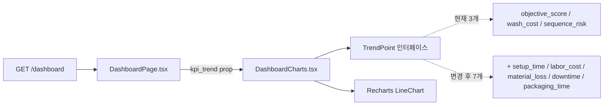
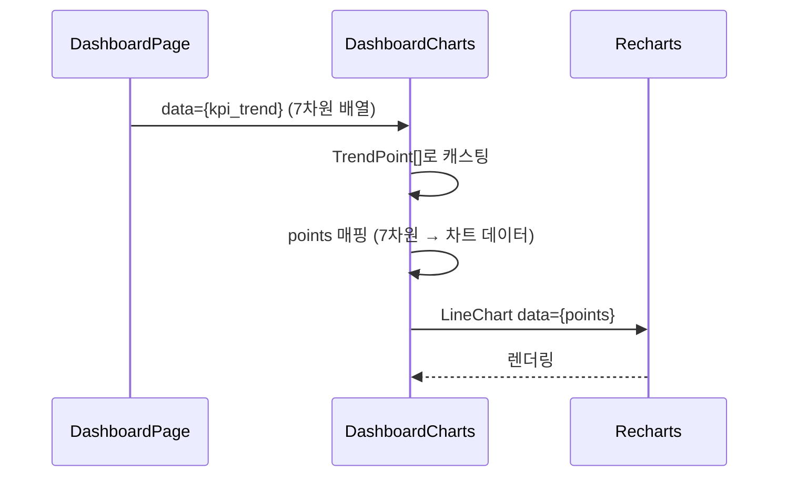

# Dashboard KPI 차트 7차원 프론트엔드 확장 Design Document

> Status: Draft
> Created: 2026-05-19
> Owner: frontend

## Context

백엔드 `dashboard-kpi-7dim-trend` 작업(`dashboard_service.py`)이 완료되어 `GET /dashboard`의 `kpi_trend` 배열이 7차원(`setup_time`, `labor_cost`, `material_loss`, `wash_cost`, `downtime`, `packaging_time`, `sequence_risk`) 전부를 반환합니다. 그러나 프론트엔드는 아직 3차원(`objective_score`, `wash_cost`, `sequence_risk`)만 인식합니다.

현재 두 가지 불일치가 존재합니다. 첫째, `DashboardCharts.tsx`의 `TrendPoint` 인터페이스가 3개 필드만 선언되어 있어 나머지 4개 필드는 TypeScript 타입 안전망 밖에 있습니다. 둘째, `types.ts`의 `DashboardResponse.kpi_trend`가 `Array<Record<string, unknown>>`으로 선언되어 구체적인 타입 추론이 없습니다.

이 문서는 타입 정의 업데이트와 차트 표시 방식 결정을 다룹니다.

## Goals & Non-Goals

### Goals

| Goal | Description |
|---|---|
| 타입 정합성 확보 | `TrendPoint` 인터페이스와 `DashboardResponse.kpi_trend` 타입에 7차원을 반영합니다. |
| 차트 표시 방식 결정 | 새 4개 차원을 기존 차트에 추가할지, 별도 차트로 분리할지 결정합니다. |
| 기존 3개 라인 유지 | `목적점수`, `세척비용`, `순서패널티` 라인은 그대로 유지합니다. |

### Non-Goals

| Non-Goal | Reason |
|---|---|
| 차트 라이브러리 교체 | Recharts를 그대로 사용합니다. |
| 차트 필터/토글 인터랙션 | 사용자가 라인을 on/off하는 기능은 P2입니다. |
| `DashboardPage.tsx` 레이아웃 변경 | 차트 컨테이너 배치는 이번 범위 밖입니다. |
| 금액 차원(`labor_cost`, `wash_cost`, `material_loss`) 별도 차트 추가 | 3개 차트는 MVP에서 과합니다. Decision 1 결과에 따라 타입만 추가하거나 후속 작업으로 미룹니다. |

## Architecture



| 파일 | 변경 여부 | 내용 |
|---|---|---|
| `frontend/src/components/DashboardCharts.tsx` | 수정 | `TrendPoint` 인터페이스 확장, 차트 라인 결정에 따라 추가 |
| `frontend/src/api/types.ts` | 수정 | `DashboardResponse.kpi_trend` 타입 구체화 |
| `frontend/src/pages/DashboardPage.tsx` | 변경 없음 | `kpi_trend`를 그대로 prop으로 내려보냄 |

## Sequence / Flow

### 정상 흐름



| Step | Description |
|---:|---|
| 1 | `DashboardPage`가 `kpi_trend`를 그대로 `DashboardCharts`에 전달합니다. |
| 2 | `DashboardCharts`가 `TrendPoint[]`로 캐스팅 후 `points` 배열을 만듭니다. |
| 3 | 각 point는 `name`(날짜), `id`, 그리고 표시할 차원 레이블 키로 구성됩니다. |
| 4 | Recharts `Line` 컴포넌트가 `dataKey`로 해당 레이블을 참조합니다. |

### 에러 흐름

```mermaid
flowchart TD
  Start([DashboardCharts 렌더]) --> Check{data.length === 0?}
  Check -->|Yes| Empty[빈 상태 메시지 표시 — 기존 동작 유지]
  Check -->|No| Cast[TrendPoint[]로 캐스팅]
  Cast --> Missing{신규 필드 누락된 레코드?}
  Missing -->|Yes| Zero[해당 차원 0으로 표시 — 백엔드 0.0 fallback]
  Missing -->|No| Render[정상 렌더링]
```

| Case | Handling |
|---|---|
| 구형 결정 레코드 — 신규 필드 없음 | 백엔드가 이미 `0.0` fallback으로 채워 전달하므로 프론트에서 별도 처리 불필요. |
| `data`가 빈 배열 | 기존 빈 상태 메시지 그대로 유지. |

## Decisions & Rationale

### Decision 1: 새 4개 차원을 기존 차트에 추가할지 여부

| Item | Description |
|---|---|
| Decision | **결정 필요.** 아래 두 옵션 중 선택합니다. |
| Option A | 기존 차트에 라인 추가 — 신규 차원을 시각화 |
| Option B | 기존 3개 라인 유지, 타입만 업데이트 — 차트 UI는 현재 유지 |
| Rationale | 아래 상세 분석 참고 |
| Impact | Option A 선택 시 Y축 전략(A-1~A-3 중 하나)도 함께 결정 필요. Option B 선택 시 타입 파일 2개 수정으로 작업 종료. |

#### Option A 상세 — 차트 라인 추가

7개 차원의 단위와 데모 데이터 기준 수치 범위는 다음과 같습니다.

| 차원 | 단위 | 예상 범위 | 성격 |
|---|---|---|---|
| `objective_score` | pt | 50 ~ 200 | 종합 점수 |
| `setup_time` | 분 | 6 ~ 30 | 시간 |
| `labor_cost` | 원 | 50,000 ~ 400,000 | 금액 |
| `material_loss` | L | 0.5 ~ 5 | 수량 |
| `wash_cost` | 원 | 14,000 ~ 200,000 | 금액 |
| `downtime` | 분 | 3 ~ 20 | 시간 |
| `packaging_time` | 분 | 5 ~ 15 | 시간 |
| `sequence_risk` | 건 | 0 ~ 5 | 위반 수 |

**핵심 문제**: `labor_cost`(최대 400,000)와 `material_loss`(최대 5)가 같은 Y축에 놓이면 스케일 차이가 80,000배입니다. `labor_cost` 라인 하나가 차트 상단을 점유하고 나머지 라인이 바닥에 수평으로 붙어 판독 불가능해집니다.

이를 해결하는 Y축 전략 세 가지:

**A-1. 차트를 두 개로 분리**

단위 성격이 유사한 차원끼리 묶어 차트를 두 개로 나눕니다.

```
차트 1 — 점수/위반 (pt, 건): objective_score, sequence_risk
차트 2 — 시간 (분):           setup_time, downtime, packaging_time
```

`labor_cost`, `wash_cost`, `material_loss`는 금액/수량 단위로 별도 차트가 필요하나, MVP에서 3개 차트는 과합니다. 금액 차원은 이번에 제외하고 타입만 추가하는 절충안이 현실적입니다.

- 장점: 단위가 같은 차원끼리 비교 가능. Recharts 구조 단순.
- 단점: `labor_cost`, `wash_cost`는 이번에 시각화 안 됨.

**A-2. 이중 Y축 (yAxisId)**

Recharts `YAxis`를 두 개(`left`, `right`) 선언하고 `Line`마다 `yAxisId`를 지정합니다.

```tsx
<YAxis yAxisId="left"  />   // 점수·시간 단위
<YAxis yAxisId="right" orientation="right" />  // 금액 단위
<Line yAxisId="left"  dataKey="셋업시간" ... />
<Line yAxisId="right" dataKey="세척비용" ... />
```

- 장점: 차트 한 개에 이질적 단위를 같이 표시 가능.
- 단점: 범례만으로 어떤 라인이 어느 축인지 파악하기 어렵습니다. 라인이 7개면 색상 구분이 어렵고 데모에서 오히려 혼란을 줍니다.

**A-3. 값 정규화 (0~1 스케일)**

각 차원의 값을 해당 데이터셋 내 최솟값·최댓값 기준으로 0~1로 정규화해 단일 Y축에 표시합니다.

```ts
const normalize = (val: number, min: number, max: number) =>
  max === min ? 0 : (val - min) / (max - min);
```

- 장점: 모든 차원이 같은 Y축 범위에 표시됩니다.
- 단점: 절대값이 사라져 "세척비용이 얼마인지"를 차트에서 읽을 수 없습니다. 데모에서 수치 질문이 들어오면 답하기 어렵습니다.

**Option A 권장 조합**: A-1(차트 분리) + 금액 차원 제외. 즉, 기존 차트(`objective_score`, `wash_cost`, `sequence_risk`)는 유지하고, 시간 차원 차트(`setup_time`, `downtime`, `packaging_time`)를 새로 추가합니다. `labor_cost`, `material_loss`는 타입은 추가하되 차트 미포함.

#### Option B 상세 — 타입만 업데이트

차트 UI를 현재 3개 라인(`목적점수`, `세척비용`, `순서패널티`)으로 유지하고, TypeScript 타입과 인터페이스만 7차원으로 확장합니다.

- `types.ts` — `KpiTrendPoint` 인터페이스에 7개 필드 선언, `DashboardResponse.kpi_trend` 타입 교체.
- `DashboardCharts.tsx` — `TrendPoint` 인터페이스에 4개 필드 추가. 차트 `Line`은 추가하지 않음.

수정 파일 2개, 수정 라인 10줄 이내로 종료됩니다.

- 장점: 작업 범위 최소. 데모 차트가 현재와 동일하게 동작. 단위 불일치 문제 미발생.
- 단점: 백엔드가 보내는 4개 신규 차원이 화면에 표시되지 않아 데모에서 "7차원 비용 추이"를 시각적으로 보여주지 못합니다.

### Decision 2: `DashboardResponse.kpi_trend` 타입 구체화

| Item | Description |
|---|---|
| Decision | `types.ts:798`의 `Array<Record<string, unknown>>`을 `KpiTrendPoint[]`로 교체합니다. `KpiTrendPoint` 인터페이스는 7차원 전부를 선언합니다. |
| Alternatives | `Record<string, unknown>` 유지. |
| Rationale | 현재 `DashboardCharts.tsx`에서 `as unknown as TrendPoint[]`로 강제 캐스팅을 하고 있습니다. 타입을 구체화하면 이 캐스팅이 불필요해지고, 필드 오타나 누락이 컴파일 시점에 잡힙니다. |
| Impact | `types.ts`에 `KpiTrendPoint` 인터페이스 추가, `DashboardResponse.kpi_trend` 타입 교체. `DashboardCharts.tsx`의 캐스팅 제거. |

## Edge Cases & Error Handling

| Case | Expected Handling | User/System Impact |
|---|---|---|
| 백엔드가 구형 3차원 응답을 반환하는 경우 | 신규 4개 필드가 `undefined`가 되나, 백엔드 fallback이 `0.0`을 보장하므로 실제로 발생하지 않음. | 없음. |
| `labor_cost`가 수십만 단위 — Y축 가독성 저하 | Decision 1에서 결정. Option A 선택 시 Y축 전략 추가 결정 필요. | Option B 선택 시 발생하지 않음. |

---

## Data Model

`types.ts`에 추가할 인터페이스:

```ts
export interface KpiTrendPoint {
  decision_id: string;
  confirmed_at: string;
  objective_score: number;
  setup_time: number;
  labor_cost: number;
  material_loss: number;
  wash_cost: number;
  downtime: number;
  packaging_time: number;
  sequence_risk: number;
}
```

`DashboardResponse.kpi_trend` 변경:
```ts
// 변경 전
kpi_trend: Array<Record<string, unknown>>;

// 변경 후
kpi_trend: KpiTrendPoint[];
```

## API / Interface

_해당없음_ — API 계약 변경 없음. 백엔드 응답 shape는 `dashboard-kpi-7dim-trend.md`에서 확정됨.

## Workflow

Decision 1 선택에 따라 구현 범위와 화면 결과가 달라집니다.

### Option B — 타입만 업데이트 (차트 UI 유지)

**수정 파일 및 변경 내용:**

| 파일 | 변경 위치 | 변경 내용 |
|---|---|---|
| `frontend/src/api/types.ts` | line 798 | `kpi_trend: Array<Record<string, unknown>>` → `kpi_trend: KpiTrendPoint[]`, `KpiTrendPoint` 인터페이스 추가 |
| `frontend/src/components/DashboardCharts.tsx` | line 12-18 | `TrendPoint` 인터페이스에 4개 필드 추가. `as unknown as TrendPoint[]` 캐스팅 제거 |

**화면 변화:** 없음. 차트는 현재와 동일하게 `목적점수`, `세척비용`, `순서패널티` 3개 라인 유지.

---

### Option A-1 — 차트 분리 (권장 조합)

기존 차트는 유지하고 시간 차원 차트를 새로 추가합니다. 금액 차원(`labor_cost`, `wash_cost`, `material_loss`)은 타입만 추가하고 시각화는 미포함합니다.

**수정 파일 및 변경 내용:**

| 파일 | 변경 위치 | 변경 내용 |
|---|---|---|
| `frontend/src/api/types.ts` | line 798 | Option B와 동일 |
| `frontend/src/components/DashboardCharts.tsx` | 전체 | `TrendPoint` 확장 + 기존 차트 유지 + 시간 차원 차트 컴포넌트 추가 |
| `frontend/src/pages/DashboardPage.tsx` | line 106 | 기존 `<DashboardCharts />` 아래 시간 차원 차트 컴포넌트 추가 |

**차트 1 (기존 유지) — 점수·위반 추이:**

```
Y축(pt/건)  │
    200 ─   │   ╭──╮
    150 ─   │ ╭─╯  ╰─╮    목적점수 ───
    100 ─   │─╯       ╰─  세척비용 ---
     50 ─   │             순서패널티 --
            └──────────────────────────
                날짜
```

**차트 2 (신규) — 전환 시간 추이:**

```
Y축(분)     │
     30 ─   │   ╭──╮
     20 ─   │ ╭─╯  ╰─╮    셋업시간 ───
     10 ─   │─╯       ╰─  정지시간 ---
      5 ─   │             패키징시간 --
            └──────────────────────────
                날짜
```

Recharts 구조 스케치:

```tsx
// 차트 2 — 시간 차원 (분 단위, 단일 Y축으로 표시 가능)
<LineChart data={timePoints}>
  <Line dataKey="셋업시간"   stroke="#0369a1" />
  <Line dataKey="정지시간"   stroke="#dc2626" />
  <Line dataKey="패키징시간" stroke="#16a34a" />
</LineChart>
```

---

### Option A-2 — 이중 Y축

기존 차트 한 개에 `yAxisId`를 추가해 이질적 단위를 같이 표시합니다.

**수정 파일 및 변경 내용:**

| 파일 | 변경 위치 | 변경 내용 |
|---|---|---|
| `frontend/src/api/types.ts` | line 798 | Option B와 동일 |
| `frontend/src/components/DashboardCharts.tsx` | 전체 | `TrendPoint` 확장 + `YAxis` 2개 선언 + `Line`에 `yAxisId` 지정 |

Recharts 구조 스케치:

```tsx
<LineChart data={points}>
  <YAxis yAxisId="left"  />                          {/* pt·분·건 */}
  <YAxis yAxisId="right" orientation="right" />      {/* 원 */}
  <Line yAxisId="left"  dataKey="목적점수"  ... />
  <Line yAxisId="left"  dataKey="셋업시간"  ... />
  <Line yAxisId="right" dataKey="세척비용"  ... />
  <Line yAxisId="right" dataKey="인건비"    ... />
</LineChart>
```

---

### Option A-3 — 값 정규화

`points` 매핑 단계에서 각 차원을 0~1로 정규화합니다.

**수정 파일 및 변경 내용:**

| 파일 | 변경 위치 | 변경 내용 |
|---|---|---|
| `frontend/src/api/types.ts` | line 798 | Option B와 동일 |
| `frontend/src/components/DashboardCharts.tsx` | 전체 | `TrendPoint` 확장 + `normalize` 함수 추가 + 7개 `Line` 추가 |

```ts
// 각 차원의 min/max를 전체 data에서 계산 후 정규화
const normalize = (val: number, min: number, max: number) =>
  max === min ? 0 : (val - min) / (max - min);
```

Tooltip에 정규화 전 원본 값을 표시하는 `formatter`가 추가로 필요합니다. Tooltip이 복잡해집니다.

## Performance

_해당없음_ — 라인 수 증가에 따른 Recharts 렌더링 부하는 데모 규모에서 무시 가능.

## Security

_해당없음_

## Observability

_해당없음_

## Migration / Rollback

`types.ts`와 `DashboardCharts.tsx` 파일 되돌리기로 충분합니다. 데이터 변경 없음.

## Open Questions

| Question | Owner | Blocking? | Notes |
|---|---|---:|---|
| Decision 1: 어떤 옵션을 선택할지 | frontend | **Yes** | B(타입만), A-1(차트 분리), A-2(이중 Y축), A-3(정규화) 중 하나. Workflow 섹션 참고. |

## Out of Scope

| Item | Reason |
|---|---|
| 금액 차원(`labor_cost`, `wash_cost`, `material_loss`) 차트 추가 | 단위 불일치 문제 + MVP 규모 초과. 타입만 추가하고 시각화는 후속 작업. |
| 차트 라인 on/off 토글 | P2 범위. |
| `DashboardPage.tsx` 레이아웃 변경 | 차트 컨테이너 위치 변경은 이번 작업 범위 아님. |
