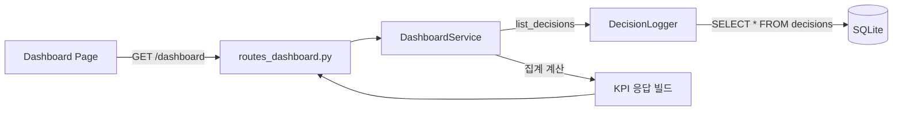
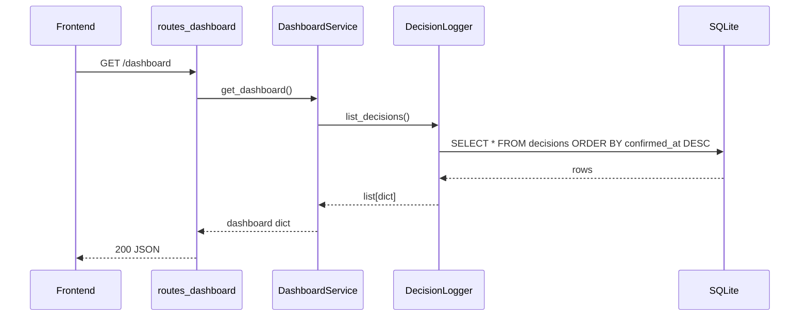
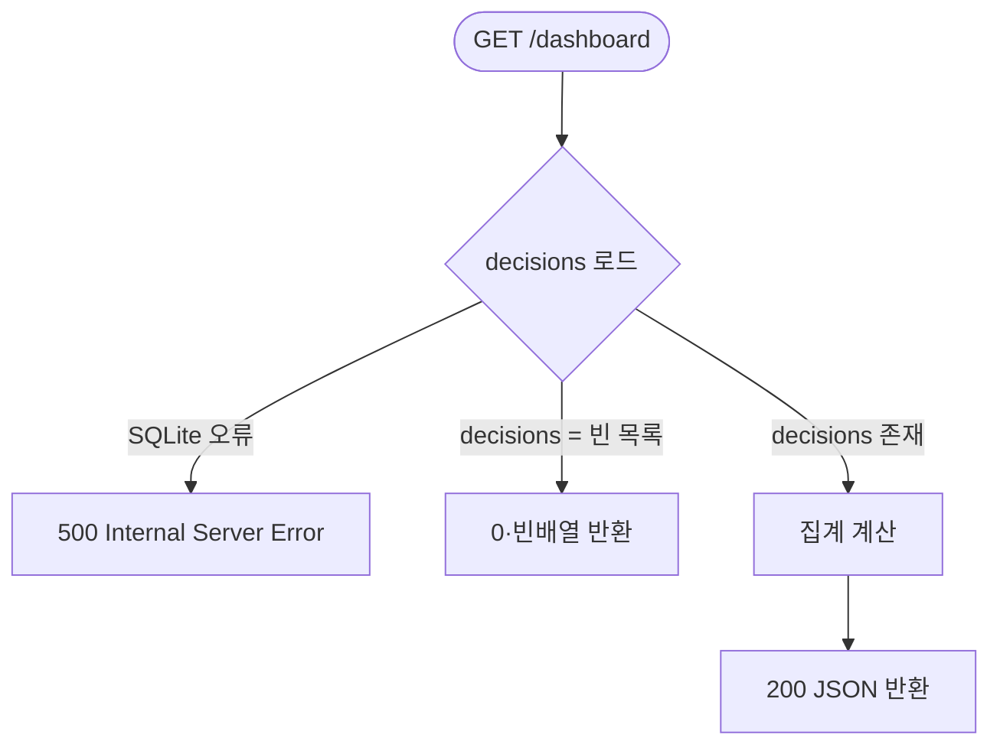

# Dashboard KPI 서비스 설계 문서

> Status: Approved  
> Created: 2026-05-17  
> Owner: SmartFactoryV2 백엔드 팀

## Context

SmartFactoryV2의 핵심 시연 흐름은 생산순서 확정 → SQLite 저장 → KPI 반영입니다. `POST /decisions`로 저장된 확정 로그를 운영 리뷰 화면에서 보여주지 못하면, 의사결정 지원 시스템이 아닌 순서 추천 도구에 그치게 됩니다. `GET /dashboard`는 이 로그를 집계해 KPI 카드·추이 차트·리스크 패턴·최근 결정 목록을 제공하는 엔드포인트입니다.

현재 `DashboardService`(`backend/app/services/dashboard_service.py`)는 구현이 완료되어 P1 기준을 충족합니다. 이 문서는 구현 결정의 근거와 응답 계약을 합의 기록으로 남기기 위해 작성합니다.

## Goals & Non-Goals

### Goals

| Goal | Description |
|---|---|
| KPI 카드 집계 | 결정 건수, 평균 objectiveScore, 고위험 전환 건수를 단일 응답으로 반환합니다. |
| 추이 차트 데이터 | 결정 시각·목적 점수·wash_cost·sequence_risk를 시간순으로 반환합니다. |
| 리스크 패턴 | rule_id별 발생 빈도를 집계해 반복 발생하는 고위험 전환을 식별합니다. |
| 최근 결정 목록 | 최근 5건의 결정 요약과 reviewed 상태를 반환합니다. |
| 빈 DB 안전 처리 | decisions 테이블이 비어 있을 때 0/빈배열로 정상 응답합니다. |

### Non-Goals

| Non-Goal | Reason |
|---|---|
| weekly_report_cache 테이블 활성화 | 현재 임시 template 문자열로 충분하며 캐시 쓰기는 P2 범위입니다. |
| 날짜 범위 필터링 | 시연 규모(decisions 수십 건)에서 불필요하며 복잡도만 높입니다. |
| 실시간 스트리밍/WebSocket | MVP 시연 흐름과 무관합니다. |
| MES/ERP KPI 병합 | P2 범위입니다. |

## Architecture



`DashboardService`는 `DecisionLogger.list_decisions()`를 통해 decisions 전체를 메모리에 읽어 Python으로 집계합니다. DB 집계 쿼리를 쓰지 않는 이유는 시연 규모(수십 건)에서 성능 차이가 없고, 복잡한 JSON 필드 파싱을 Python에서 처리하기 위해서입니다.

## Sequence / Flow

### 정상 흐름



| Step | Description |
|---:|---|
| 1 | decisions 전체를 `confirmed_at DESC` 순서로 읽습니다. |
| 2 | objective_scores, high_risk_count를 리스트 컴프리헨션으로 계산합니다. |
| 3 | kpi_trend는 시간순(오래된 것부터)으로 반환하기 위해 `reversed(decisions)`를 사용합니다. |
| 4 | recent_decisions는 최신 5건(`decisions[:5]`)을 사용합니다. |
| 5 | _risk_patterns는 rule_id별 카운트를 dict로 집계한 뒤 빈도 내림차순으로 정렬합니다. |

### 에러 흐름



| Case | Handling |
|---|---|
| decisions가 0건 | `decision_count=0`, `average_objective_score=0.0`, `high_risk_transition_count=0`, `kpi_trend=[]`, `risk_patterns=[]`, `recent_decisions=[]`를 반환합니다. `weekly_summary`는 안내 문자열을 반환합니다. |
| SQLite 파일 없음 | `initialize_database()`가 `DecisionLogger.__init__`에서 호출되므로 파일이 자동 생성됩니다. |
| `mean()` 호출 시 빈 리스트 | `if objective_scores` 조건으로 보호하고 `0.0`을 반환합니다. |

## Decisions & Rationale

### Decision 1: 전체 rows 메모리 로드 vs SQL 집계 쿼리

| Item | Description |
|---|---|
| Decision | decisions 전체를 Python 메모리에 로드해 집계합니다. |
| Alternatives | `COUNT`, `AVG`, `GROUP BY` SQL 집계 쿼리를 사용하는 방식 |
| Rationale | decisions의 violation_details 등 JSON 컬럼은 SQLite에서 집계하기 어렵습니다. 시연 규모(수십 건)에서 성능 차이가 없고, 코드 단순성을 우선합니다. |
| Impact | decisions가 수만 건으로 늘어나면 SQL 집계로 전환이 필요합니다. P2 이후 실운영 전환 시 재검토합니다. |

### Decision 2: kpi_trend 필드 선택

| Item | Description |
|---|---|
| Decision | `decision_id`, `confirmed_at`, `objective_score`, `wash_cost`, `sequence_risk`를 반환합니다. |
| Alternatives | aggregated_cost 전체 7차원을 모두 반환하는 방식 |
| Rationale | 시연 차트에서 가장 설명력 있는 2개 차원(wash_cost: 비용 대표, sequence_risk: 품질 리스크)을 선택합니다. 응답 크기를 최소화하고 프론트 차트 구현을 단순화합니다. |
| Impact | 추가 차원이 필요하면 aggregated_cost 전체를 내리거나 쿼리 파라미터로 선택합니다. |

## Edge Cases & Error Handling

| Case | Handling | Impact |
|---|---|---|
| decisions 0건 | 모든 집계 값을 0/빈배열로 반환. weekly_summary는 안내 메시지 | 빈 화면 없이 정상 렌더링 가능 |
| violation_details에 rule_id 없는 항목 | `warning.get("rule_id", "UNKNOWN")`으로 보호 | UNKNOWN으로 집계되어 risk_patterns에 표시 |
| confirmed_at 필드 없는 레거시 row | `decision.get("confirmed_at")`으로 None이 될 수 있음. 현재 INSERT는 항상 저장하므로 발생하지 않음 | 스키마 마이그레이션 없이 필드 추가 시 주의 필요 |

## Data Model

`DashboardService`가 decisions 테이블에서 읽는 컬럼과 응답 필드 매핑입니다.

| decisions 컬럼 | 응답 필드 | 가공 방식 |
|---|---|---|
| `decision_id` | `kpi_trend[].decision_id`, `recent_decisions[].decision_id` | 그대로 사용 |
| `plan_id` | `recent_decisions[].plan_id` | 그대로 사용 |
| `confirmed_at` | `kpi_trend[].confirmed_at`, `recent_decisions[].confirmed_at` | 그대로 사용 |
| `confirmed_cost_vector` (JSON) | `objective_score`, `aggregated_cost.*` | `json.loads` 후 파싱 |
| `violation_details` (JSON) | `high_risk_transition_count`, `risk_patterns`, `risk_warning_count` | severity == "HIGH" 카운트, rule_id 빈도 집계 |
| `reviewed` | `recent_decisions[].reviewed` | `bool()` 변환 |

## API / Interface

### `GET /dashboard`

```
GET /dashboard
```

응답 구조:

```json
{
  "dashboard_summary": {
    "decision_count": 3,
    "average_objective_score": 142.87,
    "high_risk_transition_count": 2
  },
  "kpi_trend": [
    {
      "decision_id": "DEC-XXXXXXXXXXXX",
      "confirmed_at": "2026-05-17T10:00:00+00:00",
      "objective_score": 138.5,
      "wash_cost": 168011.33,
      "sequence_risk": 55.0
    }
  ],
  "risk_patterns": [
    { "rule_id": "SR-001", "count": 2 },
    { "rule_id": "SR-003", "count": 1 }
  ],
  "recent_decisions": [
    {
      "decision_id": "DEC-XXXXXXXXXXXX",
      "plan_id": "demo-plan-001",
      "objective_score": 138.5,
      "risk_warning_count": 1,
      "reviewed": false,
      "confirmed_at": "2026-05-17T10:00:00+00:00"
    }
  ],
  "weekly_summary": "이번 기간에는 3건의 생산순서 결정이 저장되었고, 고위험 색상 전환은 2건 감지되었습니다."
}
```

| 필드 | 타입 | 설명 |
|---|---|---|
| `dashboard_summary.decision_count` | int | 저장된 전체 결정 건수 |
| `dashboard_summary.average_objective_score` | float | 전체 결정의 평균 objectiveScore |
| `dashboard_summary.high_risk_transition_count` | int | severity == "HIGH" 위반 총 건수 |
| `kpi_trend` | list | 시간순(오래된 것부터) 추이 데이터 |
| `risk_patterns` | list | rule_id별 발생 빈도, 내림차순 |
| `recent_decisions` | list | 최신 5건 요약 |
| `weekly_summary` | string | template 기반 한 줄 요약 |

에러 응답:

| HTTP | 조건 |
|---|---|
| 500 | SQLite 파일 접근 실패 또는 예상치 못한 예외 |

---

## Out of Scope

| Item | Reason |
|---|---|
| `weekly_report_cache` 테이블 쓰기 | P2 범위. 현재 template 문자열로 충분합니다. |
| 날짜/기간 필터 쿼리 파라미터 | 시연 규모에서 불필요합니다. |
| 차트 데이터 페이지네이션 | MVP 시연 데이터 크기에서 불필요합니다. |
| reviewed 토글 | `PATCH /decisions/{id}/reviewed`가 별도 엔드포인트로 분리되어 있습니다. |
