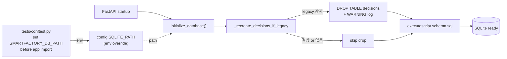
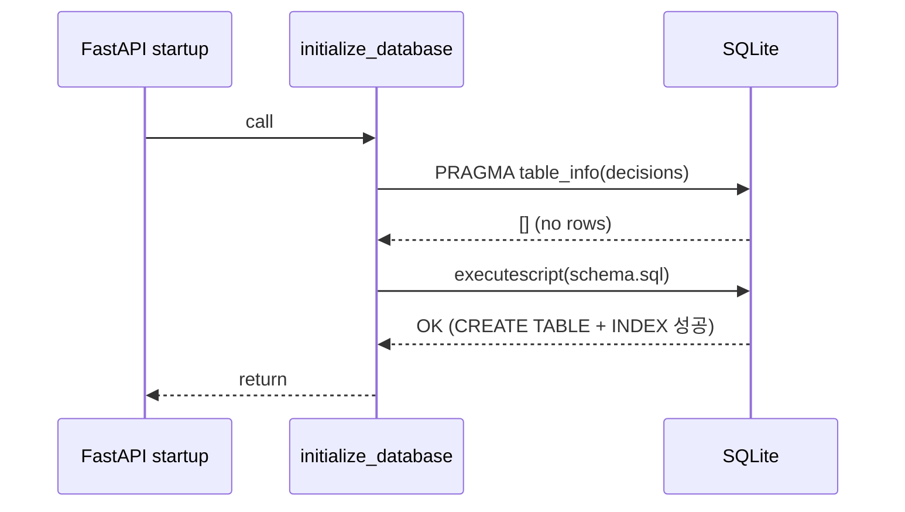
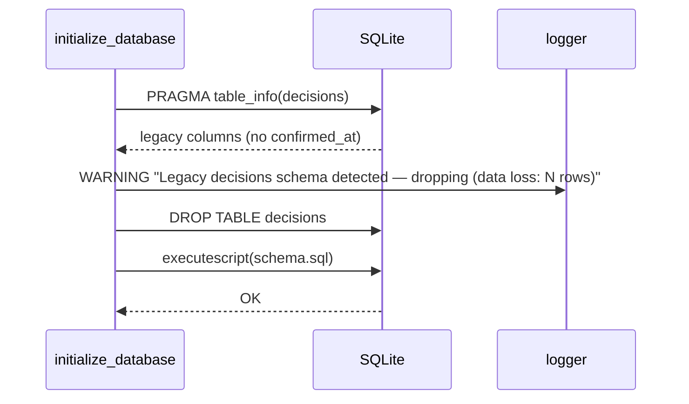
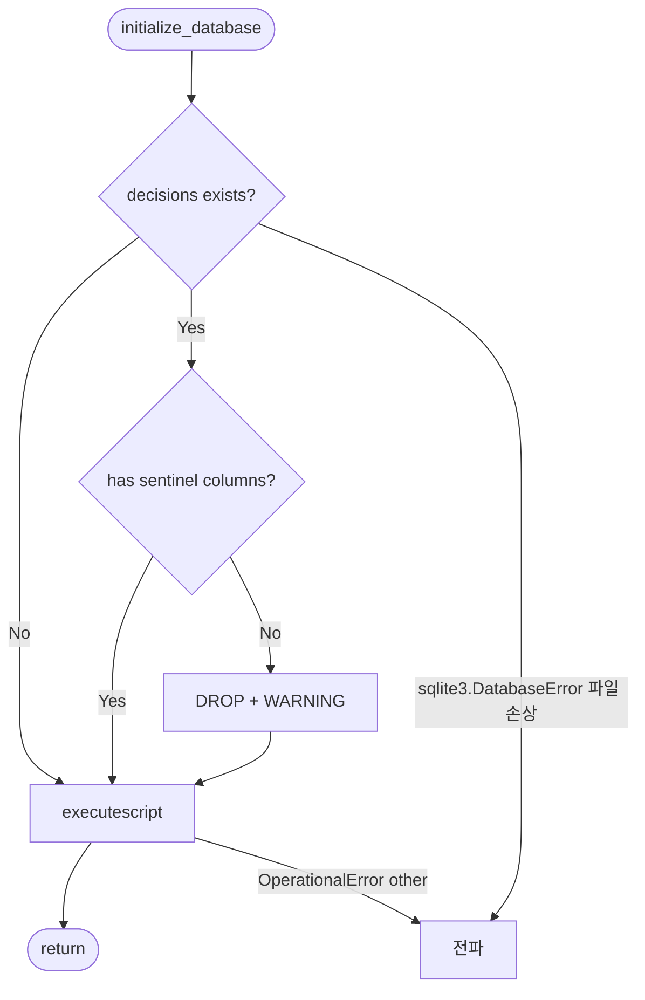

# DB Init Idempotency Design Doc

> Status: Design Approved
> Created: 2026-05-19

## Context

`backend/app/db/schema.sql`은 `decisions` 테이블을 새 스키마(`confirmed_at`, `applied_weights`, `context_snapshot`, `confirmed_cost_vector` 등 25컬럼)로 정의하고 있습니다. 그러나 기존 데모 DB 파일 `backend/app/data/smartfactory.sqlite3`에는 legacy 스키마(`created_at` + 14컬럼)가 남아 있고, `CREATE TABLE IF NOT EXISTS`라 새 정의가 무시됩니다. 이후 `schema.sql:174`의 `CREATE INDEX ... ON decisions (confirmed_at)`이 `sqlite3.OperationalError: no such column: confirmed_at`으로 깨지면서 `initialize_database()` 자체가 실패합니다.

영향:
- `from app.main import app` 시점의 startup 핸들러(`main.py:44-47`)에서 예외가 전파되어 서버가 뜨지 않거나, `/decisions` POST 호출 시 500이 떨어짐 (라이브 reproduce 확인: 2026-05-18)
- 현재 smoke test(`test_smoke.py`)는 `/decisions`를 호출하지 않아 회귀를 잡지 못함
- 시연 직전 `scripts/reset_demo_db.py` 실행을 잊으면 데모가 깨짐 — 해커톤 MVP 안전성 결함

또한 부수적으로, 테스트가 `app.core.config.SQLITE_PATH` 상수를 그대로 사용해 실DB 파일을 오염시킵니다. `/decisions` 라이프사이클을 smoke로 커버하려면 격리가 선결 조건입니다.

## Goals & Non-Goals

### Goals
- `initialize_database()`가 legacy decisions 테이블을 감지하면 자동으로 drop + 재생성, WARNING 로그 출력
- `SMARTFACTORY_DB_PATH` 환경변수로 SQLITE 경로 오버라이드 가능
- pytest 실행 시 실DB(`backend/app/data/smartfactory.sqlite3`) 무오염
- `/decisions` POST → GET → PATCH `/reviewed` → `/dashboard` 라이프사이클 smoke test 추가
- legacy schema 자동 복구 회귀 smoke test 추가

### Non-Goals
- legacy 데이터 보존 마이그레이션 (해커톤 demo 행은 재생성 가능)
- `schema_version` 메타테이블 도입 (MVP에 과설계)
- `sku_master`, `daily_plan` 등 다른 테이블의 idempotency (현재 SQLite 운영 대상은 `decisions`만, 나머지는 CSV/JSON 원천)
- `weekly_report_cache` 활용 또는 `on_event("startup")` 의 lifespan 마이그레이션 (별도 task)
- 마이그레이션 utility(`alembic` 등) 도입

## Architecture



`initialize_database()`는 schema.sql 실행 전에 기존 `decisions` 테이블의 컬럼 집합을 PRAGMA로 조회합니다. 필수 sentinel 컬럼이 누락되면 legacy로 판정하고 DROP 후 schema.sql을 다시 실행합니다. `SQLITE_PATH`는 `os.environ.get`으로 env 오버라이드를 허용하고, 테스트 conftest에서 import 시점 이전에 env를 세팅해 격리합니다.

## Sequence / Flow

### Happy Path (fresh DB)



### Legacy DB 자동 복구



### Error Paths



- `decisions` 테이블 없음 → 정상, CREATE가 생성
- 다른 테이블만 legacy (예: `sku_master`) → MVP는 SQLite에 적재하지 않으므로 무시 (Non-Goal)
- DB 파일 권한 없음 → `sqlite3.OperationalError` 그대로 전파 (해커톤 가정상 발생하지 않음)
- env var가 유효하지 않은 경로 → `mkdir` 또는 `connect`에서 OSError 전파

## Decisions & Rationale

### Decision 1: legacy decisions 감지 시 자동 DROP + 재생성

- **Decision**: PRAGMA로 컬럼을 읽어 sentinel set(`{confirmed_at, applied_weights, context_snapshot, confirmed_cost_vector}`) 중 하나라도 없으면 `DROP TABLE decisions` 후 schema.sql 재실행. 행 수와 함께 WARNING 로그.
- **Alternatives**:
  - (a) `ALTER TABLE ADD COLUMN` + `created_at → confirmed_at` 복사 마이그레이션
  - (b) `schema_version` 메타테이블 + 버전 매칭 시 마이그레이션 함수 호출
  - (c) 감지 시 `RuntimeError`로 startup 중단 + "scripts/reset_demo_db.py 실행" 안내
- **Rationale**: 해커톤 MVP는 시연 데이터를 어차피 `scripts/seed_data.py`로 재생성하고, decisions 테이블은 의사결정 로그라 demo 시연 도중 누적된 1~수 행을 잃어도 영향이 없음 (사용자 확인). (a)는 컬럼 mapping 로직이 복잡해지고, (b)는 메타테이블/버전 정책 도입이 과설계. (c)는 사용자가 매번 reset 스크립트를 기억해야 해 데모 안정성이 떨어짐.
- **Impact**: legacy DB가 있어도 startup이 무중단으로 복구. legacy 행은 손실되지만 WARNING 로그로 가시화. 추후 스키마가 또 바뀌면 sentinel set만 갱신하면 됨.

### Decision 2: `SMARTFACTORY_DB_PATH` env 오버라이드

- **Decision**: `app/core/config.py`의 `SQLITE_PATH`를 `Path(os.environ.get("SMARTFACTORY_DB_PATH", APP_DIR / "data" / "smartfactory.sqlite3"))`로 변경.
- **Alternatives**:
  - (a) `monkeypatch.setattr(config, "SQLITE_PATH", ...)` in conftest
  - (b) `initialize_database(path=...)` / `get_connection(path=...)` 시그니처 변경
- **Rationale**: 한 줄 패치로 끝나고 호출처 변경 불필요. (a)는 import 순서에 민감해서 깨지기 쉬움. (b)는 호출처(`decision_logger`, `dashboard_service`)를 전부 수정해야 해 침습적.
- **Impact**: production 배포 시에도 env로 경로 제어 가능 (CI/CD 친화적). 기본값은 그대로라 기존 동작에 영향 없음.

### Decision 3: sentinel 기반 fingerprint vs 전체 컬럼 비교

- **Decision**: 4개 sentinel 컬럼만 검사 (`confirmed_at`, `applied_weights`, `context_snapshot`, `confirmed_cost_vector`). 모두 새 스키마에서 NOT NULL이라 누락 시 INSERT가 깨지므로 판정 기준으로 충분.
- **Alternatives**:
  - (a) schema.sql을 파싱해 expected column set을 추출
  - (b) 전체 컬럼 집합을 코드에 하드코딩 (25개)
- **Rationale**: sentinel은 4줄이라 유지보수가 가장 가벼움. (a)는 SQL 파서 도입 부담. (b)는 25개를 코드와 DDL 양쪽에서 동기화해야 함.
- **Impact**: 향후 스키마 변경 시 sentinel set을 갱신하지 않으면 일부 누락 컬럼은 감지되지 않을 수 있음 → 주석으로 "schema.sql과 함께 갱신"을 명시.

## Edge Cases & Error Handling

- **`decisions` 테이블이 아예 없는 경우**: PRAGMA가 빈 리스트 반환 → legacy 아님으로 판정 → DROP 스킵 → CREATE TABLE이 처음으로 만듦. 정상 동작.
- **legacy 행이 0개인 깨끗한 legacy 테이블**: 동일 흐름, WARNING 로그에 `data loss: 0 rows` 출력.
- **새 스키마로 이미 만들어진 DB**: sentinel 모두 존재 → DROP 스킵 → `IF NOT EXISTS`라 무해. 인덱스도 IF NOT EXISTS라 무해.
- **WAL journal 모드 전환 충돌**: `PRAGMA journal_mode = WAL`은 schema.sql 안에서 매번 실행되는데 SQLite는 이미 WAL이면 no-op. 영향 없음.
- **conftest env 누락**: env 미설정 시 기본 경로로 fallback → 실DB 오염 가능. conftest를 module-level에서 env를 세팅하고 import 순서를 명시해 방어.
- **DROP TABLE 실패 (locked)**: 단일 프로세스 가정. 만약 다른 connection이 hold 중이면 `OperationalError`로 전파 (현재 demo 시나리오에서는 발생하지 않음).
- **schema.sql 자체에 오류**: `executescript`가 그대로 raise — fail-fast가 옳음.

---

## (Optional) Data Model

기존 `decisions` 테이블의 새 스키마는 변경 없이 유지. 본 작업은 기존 DDL을 그대로 실행하는 *흐름*만 수정합니다.

| 필드 | 타입 | 비고 |
|---|---|---|
| (변경 없음) | — | `schema.sql:134-169` 그대로 |

검출용 sentinel 4개:

| 컬럼 | 새 스키마에서 NOT NULL? | legacy DB에 존재? |
|---|---|---|
| `confirmed_at` | NOT NULL | ✗ (`created_at`이 대신 존재) |
| `applied_weights` | NOT NULL | ✗ |
| `context_snapshot` | NOT NULL | ✗ |
| `confirmed_cost_vector` | NOT NULL | ✗ |

## (Optional) API / Interface

API 응답 contract 변경 없음. 환경변수 1개 신설:

| 변수명 | 기본값 | 용도 |
|---|---|---|
| `SMARTFACTORY_DB_PATH` | `backend/app/data/smartfactory.sqlite3` | SQLite 파일 경로 오버라이드 (테스트/CI용) |

## (Optional) Workflow
_N/A_

## (Optional) Performance

DB 시작 시 PRAGMA 1회 추가 — 무시 가능한 비용.

## (Optional) Security
_N/A_

## (Optional) Open Questions
_N/A_

## (Optional) Out of Scope

- `@app.on_event("startup")` → lifespan 마이그레이션 (deprecation warning)
- 다른 테이블 (`sku_master` 등) idempotency
- `weekly_report_cache` 사용

---

# Implementation Plan

> 본 문서는 2026-05-19 사용자 승인 후 구현되었습니다.

## Target Files

| File | Action | Purpose |
|---|---|---|
| `backend/app/core/config.py` | Modify | `SQLITE_PATH`를 env 오버라이드 가능하게 변경 |
| `backend/app/db/sqlite.py` | Modify | `initialize_database()`에 legacy 감지 + drop 로직, logger 도입 |
| `backend/tests/conftest.py` | Create | module-level에서 `SMARTFACTORY_DB_PATH`를 tmp 경로로 세팅 |
| `backend/tests/test_smoke.py` | Modify | legacy 자동 복구 1건 + `/decisions` 라이프사이클 1건 추가 |

## Implementation Steps

### Step 1: `SQLITE_PATH` env 오버라이드

- **File**: `backend/app/core/config.py`
- **Action**: Modify
- **Key snippet**:
  ```python
  import os
  from pathlib import Path

  APP_DIR = Path(__file__).resolve().parents[1]
  SQLITE_PATH = Path(
      os.environ.get("SMARTFACTORY_DB_PATH", APP_DIR / "data" / "smartfactory.sqlite3")
  )
  SCHEMA_PATH = APP_DIR / "db" / "schema.sql"
  ```
- **Verify**:
  - `SMARTFACTORY_DB_PATH=/tmp/x.db python -c "from app.core.config import SQLITE_PATH; print(SQLITE_PATH)"` → `/tmp/x.db`
  - env 미설정 시 기존 경로 유지

### Step 2: `initialize_database()` legacy 감지/복구

- **File**: `backend/app/db/sqlite.py`
- **Action**: Modify
- **Key snippet**:
  ```python
  _DECISIONS_SENTINEL_COLUMNS = frozenset({
      "confirmed_at", "applied_weights", "context_snapshot", "confirmed_cost_vector",
  })

  def initialize_database() -> None:
      with get_connection() as connection:
          _recreate_decisions_if_legacy(connection)
          connection.executescript(SCHEMA_PATH.read_text(encoding="utf-8"))

  def _recreate_decisions_if_legacy(connection: sqlite3.Connection) -> None:
      rows = connection.execute("PRAGMA table_info(decisions)").fetchall()
      if not rows:
          return
      existing = {row[1] for row in rows}
      if _DECISIONS_SENTINEL_COLUMNS.issubset(existing):
          return
      row_count = connection.execute("SELECT COUNT(*) FROM decisions").fetchone()[0]
      _log.warning("Legacy decisions schema detected — dropping (data loss: %d rows)", row_count)
      connection.execute("DROP TABLE decisions")
  ```
- **Verify**: 수동으로 legacy 테이블을 만들고 `initialize_database()` 호출 → 새 컬럼이 모두 생기는지 확인

### Step 3: pytest conftest로 실DB 격리

- **File**: `backend/tests/conftest.py` (신규)
- **Action**: Create
- **Key snippet**:
  ```python
  _TMP_DB_DIR = Path(tempfile.mkdtemp(prefix="smartfactory-test-"))
  os.environ["SMARTFACTORY_DB_PATH"] = str(_TMP_DB_DIR / "test.sqlite3")
  ```
- **Verify**:
  - pytest 실행 후 실DB mtime이 변하지 않음
  - `$TMPDIR/smartfactory-test-*`에 임시 디렉토리 생성 확인

### Step 4: smoke test 추가 — legacy 복구 + decisions 라이프사이클

- **File**: `backend/tests/test_smoke.py`
- **Action**: Modify (2 케이스 추가)
- **Key snippet**: `test_initialize_database_recovers_from_legacy_decisions_schema` + `test_decisions_lifecycle_post_get_patch_dashboard`
- **Verify**: `cd backend && python -m pytest tests/ -v` → 기존 6 + 신규 2 = **8 PASS**

## Order Constraints

1 → 2 → 3 → 4 순서로만 진행합니다.
- Step 1 (config env) 없이는 Step 3의 conftest가 동작하지 않음.
- Step 2 없이는 Step 4의 legacy 복구 케이스가 실패.
- Step 3 없이 Step 4를 돌리면 실DB가 오염됨.

## 검증 결과 (2026-05-19)

- `pytest tests/ -v` → 8 passed (기존 6 + 신규 2)
- `ruff check app/ tests/` → All checks passed
- 실DB `backend/app/data/smartfactory.sqlite3` mtime 변동 없음 (격리 확인)
- 임시 DB 디렉토리 `$TMPDIR/smartfactory-test-*` 생성 확인
