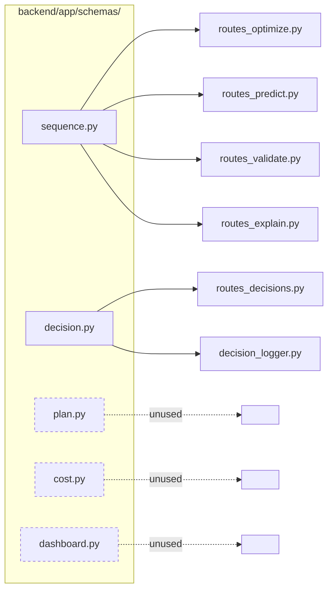
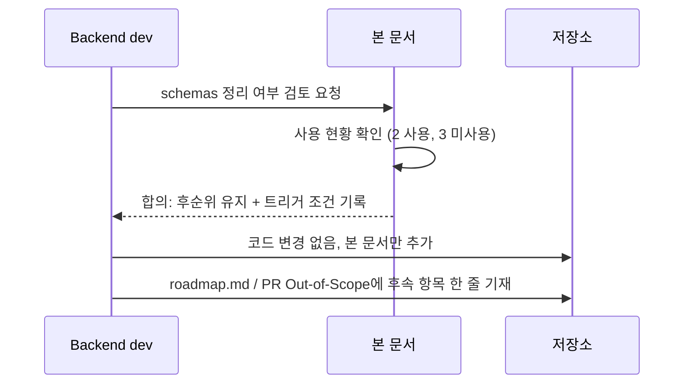
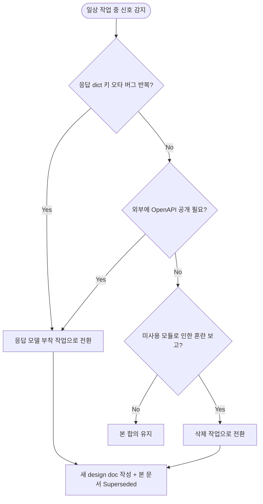

# `backend/app/schemas/` 정리 여부 합의 Design Document

> Status: Draft
> Created: 2026-05-20
> Owner: backend

## Context

현재 `backend/app/schemas/` 폴더에는 다섯 개의 Pydantic 모듈이 있고, 이 중 `sequence.py`와 `decision.py`만 실제 라우터/서비스에서 사용되고 있습니다. 나머지 세 모듈(`plan.py`의 `PlanItem`, `cost.py`의 `PrioritySetting`/`CostVector`, `dashboard.py`의 `DashboardSummary`)은 어디에서도 import 되지 않고 있으며, `grep`상 사용처가 0건입니다. 라우터의 응답 모델은 대부분 `dict[str, Any]`로 직렬화되고 있어 OpenAPI 문서가 응답 shape를 자동 추출하지 못합니다.

이 상태가 발생한 이유는 MVP 초기에 도메인 계약(DB_state v1.3)을 Pydantic으로 옮겨두고 점진적으로 서비스/라우터에 부착하려 했으나, 시연 일정상 요청 검증만 우선 부착하고 응답 측은 그대로 둔 채로 머물러 있기 때문입니다. 현재 시점에서 이 미사용 모델들을 즉시 정리할지(삭제), 응답에 부착할지(활용), 아니면 후순위로 유지할지에 대한 합의가 없습니다.

본 문서는 세 가지 옵션의 trade-off를 정리해 **현 시점에서는 정리/활용을 모두 후순위로 두고 미사용 모델을 그대로 유지**한다는 합의를 남기는 것을 목적으로 합니다. 합의가 바뀔 트리거 조건도 함께 명시해 추후 재논의 비용을 줄이려 합니다.

## Goals & Non-Goals

### Goals

| Goal | Description |
|---|---|
| 현 상태 정리 | `schemas/` 폴더의 사용 현황과 미사용 모델 목록을 단일 표로 정리합니다. |
| 옵션 비교 | 삭제, 활용, 유지 세 가지 후속 방향의 trade-off를 비교합니다. |
| 후순위 결정 기록 | 현 시점에서는 미사용 모델을 그대로 두는 결정을 근거와 함께 남깁니다. |
| 재논의 트리거 명시 | 어떤 신호가 나타나면 이 합의를 다시 검토할지 정의합니다. |

### Non-Goals

| Non-Goal | Reason |
|---|---|
| 실제 schemas 삭제 또는 응답 모델 부착 작업 | 본 문서는 후순위 결정 문서이며, 실제 변경은 합의가 갱신된 뒤 별도 design doc에서 다룹니다. |
| 프론트엔드 타입 동기화 방식 변경 | 프론트는 이미 `frontend/src/api/types.ts`에서 자체 타입을 보유하므로 본 결정과 독립적으로 유지됩니다. |
| `sequence.py` / `decision.py` 모델 구조 변경 | 사용 중인 두 모듈은 본 문서의 범위 밖입니다. |
| OpenAPI 문서 품질 개선 계획 수립 | 응답 모델 부착이 후순위인 한 자동 문서화 개선은 별도 작업입니다. |

## Architecture

본 문서는 코드 변경을 수반하지 않습니다. 현재 사용 관계만 정리합니다.



| 모듈 | 정의된 모델 | 사용처 | 상태 |
|---|---|---|---|
| `sequence.py` | `OptimizeRequest`, `PredictRequest`, `ValidateRequest`, `ExplainRequest` | `routes_optimize.py:5`, `routes_predict.py:5`, `routes_validate.py:5`, `routes_explain.py:5` | 사용 중 |
| `decision.py` | `DecisionCreateRequest`, `ReviewedUpdateRequest` | `routes_decisions.py:5`, `services/decision_logger.py:10` | 사용 중 |
| `plan.py` | `PlanItem` | 없음 | **미사용** |
| `cost.py` | `PrioritySetting`, `CostVector` | 없음 | **미사용** |
| `dashboard.py` | `DashboardSummary` | 없음 | **미사용** |

핵심 관찰: 미사용 세 모델은 모두 **응답 측 contract**를 표현하려던 모델입니다. 현재 라우터는 응답을 `dict[str, Any]`로 그대로 반환하고 있어 응답 검증/직렬화 모두 Pydantic을 거치지 않습니다.

## Sequence / Flow

### 정상 흐름 (본 합의의 적용 절차)



| Step | Description |
|---:|---|
| 1 | 백엔드 dev가 `schemas/` 미사용 모델 발견 후 정리 여부를 검토합니다. |
| 2 | 사용 관계를 grep으로 확인하고, 도메인 계약 문서(DB_state v1.3) 대비 누락 위험을 평가합니다. |
| 3 | 코드 변경 없이 후순위 유지로 합의하고 본 문서를 남깁니다. |
| 4 | `docs/roadmap.md` 또는 다음 PR body의 Out of Scope 섹션에 한 줄로 follow-up 항목을 적어둡니다. |

### 에러 흐름 (합의가 무너지는 경우)



| Case | Handling |
|---|---|
| 응답 `dict` 안의 키 오타로 인한 프론트 측 버그가 2회 이상 반복됨 | `schemas/`의 미사용 모델 또는 신규 응답 모델을 라우터 `response_model=`에 부착하는 design doc 작성으로 전환합니다. |
| `/docs` Swagger 응답 shape 공개가 외부 요구사항이 됨 | 동일하게 응답 모델 부착 design doc로 전환합니다. |
| 신규 contributor가 미사용 모듈로 인해 사용처를 잘못 짚는 사례 발생 | 삭제 design doc로 전환합니다. 단, 삭제 전 도메인 계약 표현으로서의 가치 여부를 한 번 더 검토합니다. |
| 합의 후 1주 이내에 위 신호가 없음 | 본 합의를 유지합니다. 본 문서를 만지지 않습니다. |

## Decisions & Rationale

### Decision 1: 미사용 schemas(`plan.py`, `cost.py`, `dashboard.py`) 정리·활용을 모두 후순위로 둠

| Item | Description |
|---|---|
| Decision | 현재 시점에서는 세 모듈을 삭제하지 않고, 응답 모델로 부착하지도 않습니다. 기존 위치에 그대로 둡니다. |
| Alternatives | (A) 즉시 삭제. (B) 라우터의 `response_model=`에 즉시 부착해 응답 검증을 강제. (C) 본 문서가 채택한 "후순위 유지". |
| Rationale | (A) 삭제는 단기 가독성은 좋아지지만 DB_state v1.3에서 정의한 7차원 벡터·KPI 요약을 코드로 표현해두는 가치를 잃습니다. 도메인 계약 표현은 미사용 상태에서도 문서적 가치가 있습니다. (B) 응답 부착은 효과가 크지만 라우터/서비스 시그니처 변경과 mappers 재검증을 동반해 P0/P1 일정에 압박을 줍니다. (C) 후순위 유지는 단기 비용 0, 도메인 계약 표현 유지, 트리거 발생 시 (A)·(B)로 모두 전환 가능하다는 옵션 가치를 보존합니다. |
| Impact | OpenAPI 응답 shape 공란 상태가 지속됩니다. 응답 `dict` 키 오타가 발생할 경우 런타임에 프론트 측에서 노출됩니다. 현재 프론트가 `frontend/src/api/types.ts`에서 별도 타입을 보유해 위험이 부분적으로 상쇄됩니다. |

### Decision 2: 합의 갱신 트리거는 명시적인 신호 기반으로만 발동

| Item | Description |
|---|---|
| Decision | 본 합의는 (a) 응답 dict 키 오타로 인한 프론트 버그가 2회 이상 반복, (b) `/docs` 응답 공개가 외부 요구사항이 됨, (c) 미사용 모듈로 인한 contributor 혼선 보고 중 하나가 관찰될 때만 재논의합니다. |
| Alternatives | 일정 기간(예: 매 sprint)마다 정기 재검토. |
| Rationale | 정기 재검토는 신호가 없을 때 회의 비용만 발생시킵니다. 본 작업은 demo-critical이 아니므로 신호 기반 발동이 비용 대비 효과적입니다. |
| Impact | 트리거가 발생하지 않으면 본 합의는 무기한 유지될 수 있습니다. 이는 의도된 결과입니다. |

### Decision 3: follow-up 항목은 `docs/roadmap.md` 또는 PR Out of Scope에 한 줄 기재

| Item | Description |
|---|---|
| Decision | 본 문서 외에도 다음 PR body의 "Out of Scope" 섹션에 한 줄(예: "`schemas/` 응답 모델 도입 — 라우터 `response_model` 부착 + 미사용 schemas 활용 또는 삭제. 트리거 발생 시 진행.")을 기재합니다. roadmap에는 별도 항목으로 끼우지 않습니다. |
| Alternatives | roadmap.md P2 섹션에 항목을 추가. |
| Rationale | roadmap의 P0/P1/P2는 시연 가치 기준 분류이며, 본 항목은 시연 기여도가 낮은 정리성 작업입니다. PR 단위로 캐리하면 잊혀도 데모 흐름에 영향이 없습니다. |
| Impact | follow-up이 흩어질 위험이 있으나 본 문서가 단일 출처 역할을 합니다. |

## Edge Cases & Error Handling

| Case | Expected Handling | User/System Impact |
|---|---|---|
| 미사용 모델이 후속 design doc(예: weekly summary, decision-detail-view)에서 우연히 필요해짐 | 해당 design doc에서 import 추가만 하면 됩니다. 본 문서를 갱신할 필요는 없습니다. | 미사용 → 사용 전환은 본 합의를 깨지 않습니다. |
| 합의 갱신 트리거 (a)(b)(c) 중 하나가 발생 | 새 design doc(예: `docs/design/db-schema/schemas-response-model-adoption.md` 또는 `schemas-cleanup-delete.md`)를 작성하고 본 문서를 `Superseded`로 표기합니다. | 결정 이력이 보존됩니다. |
| 신규 contributor가 미사용 모듈을 사용처로 오인 | 본 문서 링크로 안내합니다. 반복되면 트리거 (c)로 간주합니다. | 1회는 안내, 2회 이상은 합의 갱신. |
| `sequence.py` / `decision.py`에 새 모델을 추가해야 할 때 | 본 합의와 무관하게 정상 진행합니다. 본 문서는 미사용 3종에만 적용됩니다. | 영향 없음. |

---

## Data Model

_해당없음_

## API / Interface

_해당없음_

## Workflow

_해당없음_

## Performance

_해당없음_

## Security

_해당없음_

## Observability

_해당없음_

## Migration / Rollback

_해당없음_

## Open Questions

| Question | Owner | Blocking? | Notes |
|---|---|---:|---|
| 트리거 발생 시 "삭제"와 "응답 부착" 중 어느 방향으로 갈지 | backend | No | 신호 종류에 따라 결정합니다. (a)(b) → 응답 부착, (c) → 삭제가 자연스러운 매핑입니다. 실제 의사결정은 그 시점의 design doc에서 다룹니다. |

## Out of Scope

| Item | Reason |
|---|---|
| `dict[str, Any]` 응답을 Pydantic 응답 모델로 교체 | 본 결정의 후순위 대상 자체이며, 트리거 발생 시 별도 design doc에서 다룹니다. |
| 프론트엔드 타입(`types.ts`)과 백엔드 schemas의 단일 출처 도구화 (OpenAPI codegen 등) | 본 합의 범위 밖. 응답 모델 부착 이후에 검토 가능한 주제입니다. |
| `sku_master`, `sequence_rules` 등 CSV/JSON 원천 데이터의 Pydantic 모델화 | 본 작업과 별개입니다. CSV 로더가 직접 dict로 다루는 현 구조를 바꿀 요구가 아직 없습니다. |

---

# Implementation Plan

본 문서는 결정 문서이므로 코드 변경 단계가 없습니다. 합의 적용 절차만 남깁니다.

## Target Files

| File | Action | Purpose |
|---|---|---|
| `docs/design/db-schema/schemas-cleanup-followup.md` | Create | 본 문서. 후순위 결정과 트리거 조건을 기록합니다. |
| 다음 PR body | Modify | "Out of Scope" 섹션에 follow-up 한 줄 기재합니다. |

## Implementation Steps

### Step 1: 본 문서 추가

- **File**: `docs/design/db-schema/schemas-cleanup-followup.md`
- **Action**: Create
- **Key snippet**: (본 문서 전체)
- **Verify**: 파일이 추가되고 `Status: Draft`로 시작하며, `MEMORY.md` 또는 `docs/roadmap.md`를 건드리지 않았는지 확인합니다.

### Step 2: 다음 PR body에 follow-up 한 줄 기재

- **File**: PR body의 "Out of Scope" 섹션
- **Action**: Add
- **Key snippet**:
  ```markdown
  ## Out of scope
  - `backend/app/schemas/` 미사용 모델 정리 — 후순위 유지 결정.
    근거 및 트리거: `docs/design/db-schema/schemas-cleanup-followup.md`.
  ```
- **Verify**: PR 생성 시 해당 줄이 포함되어 있는지 확인합니다.

## Order Constraints

_Step 1 → Step 2 순서만 지키면 됩니다. 별도 의존성 없습니다._
