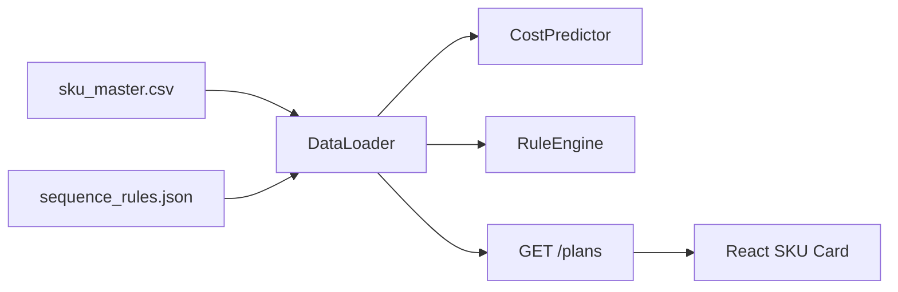
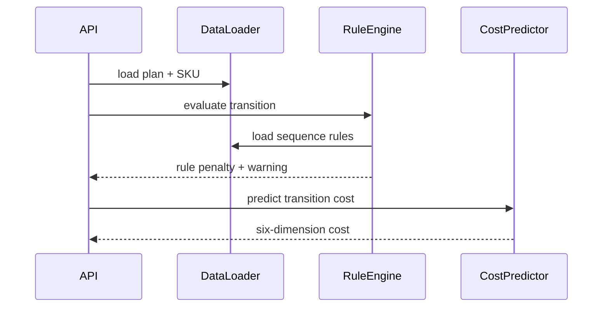
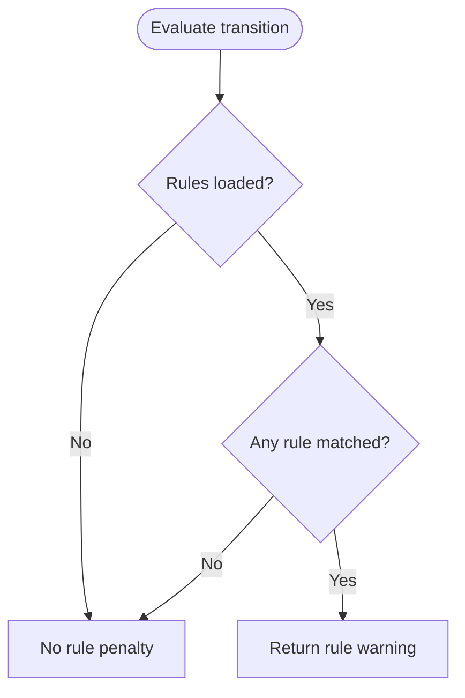
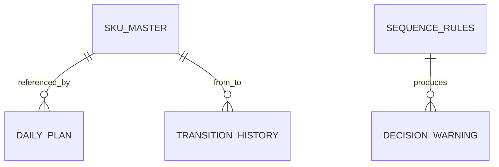

# 시퀀스 룰과 SKU 기준정보 채택 설계

## 1. Context

로드맵 Day 1은 합성 데이터 기준 파일을 확정하고 이후 API, 최적화, UI가 같은 데이터 contract를 사용하도록 요구합니다. 기존 `sku_master.csv`는 `color_hex`, `brightness_level`, `is_metallic` 같은 초기 MVP 필드를 사용했고, `sequence_rules.json`은 설명용 condition 문자열 중심이라 DB_state v1.3의 물리 스키마와 어긋났습니다. 새 후보 파일은 `pigment_intensity`, `gloss_level`, `viscosity`, `hex_code`와 명시적 from/to rule 필드를 사용하므로 기준 문서와 더 잘 맞습니다. 다만 기존 비용 예측과 프론트 UI는 구형 컬럼에 의존하고 있어 데이터만 교체하면 시연 흐름이 깨질 수 있습니다.

## 2. Goals & Non-Goals

### Goals

| Goal | Description |
|---|---|
| 후보 SKU 채택 | `sku_master.csv`를 DB_state v1.3 canonical 필드로 교체합니다. |
| 후보 rule 채택 | `sequence_rules.json`을 명시적 from/to 조건 배열로 교체합니다. |
| 엔진 호환 | Rule Engine이 JSON rule을 데이터 기반으로 매칭하게 합니다. |
| UI 호환 | 프론트 색상칩이 `hex_code`를 사용하도록 맞춥니다. |
| seed 재생성 | `scripts/seed_data.py`가 같은 canonical 데이터를 재생성하게 합니다. |

### Non-Goals

| Non-Goal | Reason |
|---|---|
| 정식 DB 적재 파이프라인 | 현재 MVP는 CSV/JSON 원천을 직접 읽습니다. |
| XGBoost 모델 재학습 자동화 | 학습 데이터 재생성은 가능하지만 모델 학습/저장은 별도 단계입니다. |
| 다중 라인/납기 제약 추가 | 이번 변경은 색상 전환 rule과 SKU 기준정보 채택에 한정합니다. |

## 3. Architecture

`DataLoader`는 rule 파일이 배열이든 `{ rules: [...] }` 객체이든 같은 내부 구조로 정규화합니다. `CostPredictor`는 canonical SKU의 `pigment_intensity`, `viscosity`, `category`에서 밝기, 점도, 메탈 여부를 파생합니다. `RuleEngine`은 하드코딩된 조건 대신 rule JSON의 `from_sku_id`, `to_sku_id`, category 조건을 우선순위대로 평가합니다.

## 4. Sequence / Flow

### 정상 흐름

| Step | Description |
|---:|---|
| 1 | `/plans/{planId}`는 새 SKU 필드를 포함한 plan item을 반환합니다. |
| 2 | `/optimize`, `/predict`, `/decisions`는 같은 `plan_item_id[]` 기준으로 전환을 평가합니다. |
| 3 | Rule Engine은 SKU 레벨 rule을 category rule보다 우선합니다. |
| 4 | 프론트는 `hex_code`로 색상칩을 렌더링합니다. |

### 주요 에러 흐름

| Case | Handling |
|---|---|
| rule 파일이 배열 형식 | `DataLoader.get_rules()`가 `{ rule_version, rules }`로 정규화합니다. |
| rule 미매칭 | `SR-000`, penalty `0.0`, warning 없음으로 처리합니다. |
| 기존 구형 SKU 필드가 들어오는 테스트/호환 입력 | `CostPredictor`는 구형 필드가 있으면 우선 사용하고 없으면 canonical 필드에서 파생합니다. |

## 5. Decisions & Rationale

### Decision 1: Rule Engine을 데이터 기반으로 변경

| Item | Description |
|---|---|
| Decision | `sequence_rules.json`의 명시 조건을 읽어 rule을 매칭합니다. |
| Alternatives | 기존 하드코딩 조건 유지 |
| Rationale | 새 rule 파일을 채택하려면 penalty, risk, reason, recommendation을 코드가 아닌 데이터에서 가져와야 합니다. |
| Impact | rule 변경 시 코드 수정 없이 JSON 수정으로 반영할 수 있습니다. |

### Decision 2: `SKU-SILVER-001`을 `SKU-METAL-001`로 교체

| Item | Description |
|---|---|
| Decision | demo plan의 메탈 항목을 후보 SKU 목록에 존재하는 `SKU-METAL-001`로 변경합니다. |
| Alternatives | 후보 SKU에 `SKU-SILVER-001` 추가 |
| Rationale | 사용자가 제공한 SKU 테이블을 기준으로 채택하기 위해 plan이 존재하지 않는 SKU를 참조하지 않게 합니다. |
| Impact | 데모 시 메탈/특수광택 rule이 실제로 작동하는 plan 구성이 유지됩니다. |

## 6. Edge Cases & Error Handling

| Case | Expected Handling | User/System Impact |
|---|---|---|
| 구형 `color_hex`만 있는 SKU 응답 | UI는 `hex_code`가 없으면 `color_hex`로 fallback합니다. | 구형 API 응답도 색상칩을 렌더링합니다. |
| canonical SKU에 밝기 필드 없음 | `pigment_intensity`에서 밝기를 파생합니다. | 비용 예측 fallback이 계속 동작합니다. |
| `metal`/`special` 이후 `light` | `SR-004`가 `SR-003`보다 구체적으로 매칭됩니다. | 밝은색 품질 리스크가 high warning으로 표시됩니다. |

## Data Model

| Field | Type | Required | Default | Description |
|---|---|---:|---|---|
| `sku_master.pigment_intensity` | number | Yes | none | 밝기와 세척 난이도 파생 입력 |
| `sku_master.gloss_level` | number | Yes | none | 광택 잔류 리스크 설명 입력 |
| `sku_master.viscosity` | number | Yes | none | 점도 차이 기반 비용 입력 |
| `sku_master.hex_code` | string | Yes | none | UI 색상칩 |
| `sequence_rules.from_category_in` | array/null | No | null | 복수 시작 category 조건 |

## API / Interface

| Method | Path | Description |
|---|---|---|
| `GET` | `/plans/{planId}` | `sku.hex_code`, `pigment_intensity`, `gloss_level`, `viscosity`를 포함합니다. |
| `POST` | `/optimize` | JSON rule 기반 penalty를 objective score에 반영합니다. |
| `POST` | `/predict` | JSON rule 기반 risk warning을 반환합니다. |
