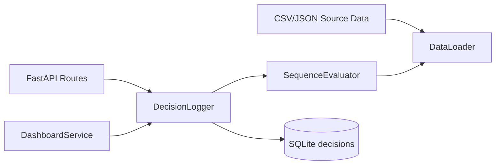
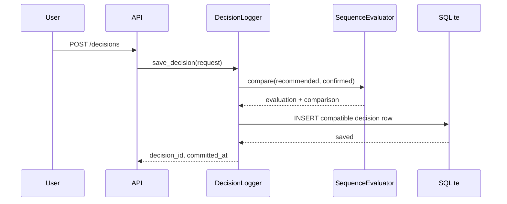
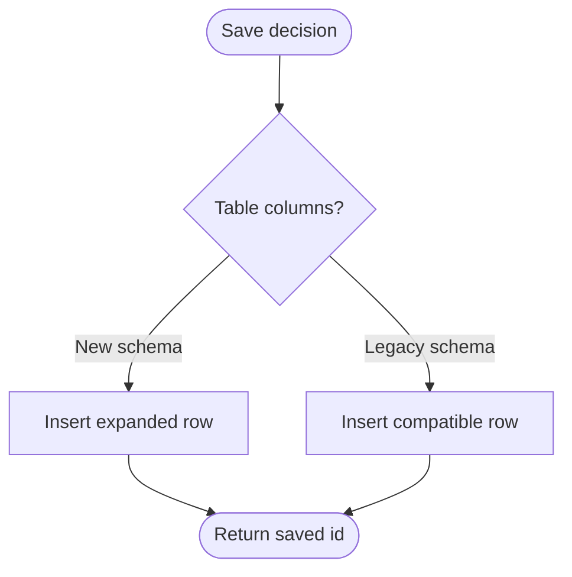
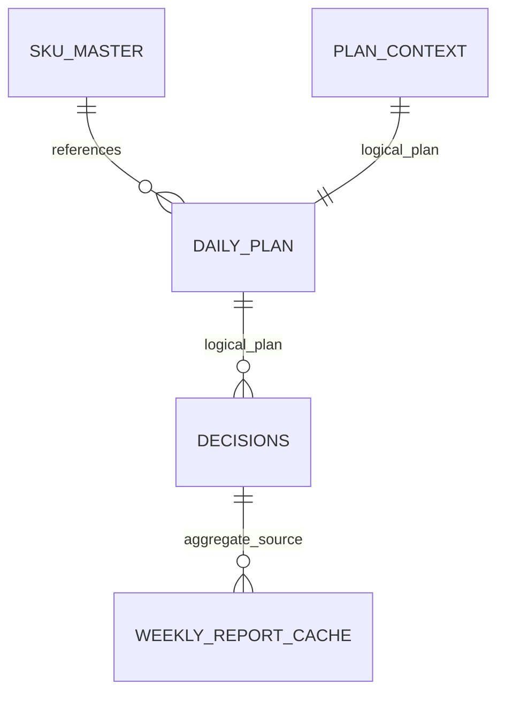

# SQLite 스키마 채택 설계

## 1. Context

로드맵 Day 1은 `backend/app/db/schema.sql`을 실행 가능한 SQLite 초기 물리 스키마로 확정하는 것을 요구합니다. 기존 스키마는 `decisions`, `plan_context`, `weekly_report_cache`만 포함해 MVP 저장 흐름은 가능했지만, `docs/source/DB_state_v1.3.md`의 기준정보와 의사결정 로그 필드를 충분히 표현하지 못했습니다. 새 후보 스키마는 문서 기준에 더 가깝지만 `daily_plan.plan_id` 단독 UNIQUE 제약처럼 하나의 계획에 여러 항목이 들어가는 domain contract와 충돌하는 부분이 있었습니다. 이번 변경은 후보 스키마를 채택하되 현재 CSV/JSON 기반 실행 흐름과 기존 demo DB 호환성을 유지하는 것을 목표로 합니다.

## 2. Goals & Non-Goals

### Goals

| Goal | Description |
|---|---|
| DB_state v1.3 반영 | `sku_master`, `sequence_rules`, `daily_plan`, `plan_context`, `decisions`, `weekly_report_cache`를 SQLite DDL로 정의합니다. |
| sequence contract 보존 | 추천/확정 순서는 항상 `plan_item_id[]` JSON 배열로 저장합니다. |
| 의사결정 로그 확장 | `applied_weights`, `context_snapshot`, 비용 벡터, `objective_score`, `confirmed_at`을 저장합니다. |
| 기존 demo DB 호환 | 구형 `decisions` 테이블이 남아 있어도 저장/조회 코드가 실패하지 않게 합니다. |

### Non-Goals

| Non-Goal | Reason |
|---|---|
| CSV/JSON 원천 제거 | MVP 런타임은 현재 `DataLoader`가 CSV/JSON을 읽는 구조이므로 이번 변경에서 DB 적재 파이프라인까지 바꾸지 않습니다. |
| 운영 마이그레이션 체계 도입 | 해커톤 MVP 범위에서는 Alembic 등 정식 migration 도입을 보류합니다. |
| XGBoost/OR-tools 로직 변경 | 이번 변경의 범위는 SQLite 스키마와 decision 저장 호환성입니다. |

## 3. Architecture

`DataLoader`는 계속 CSV/JSON을 원천으로 사용합니다. `DecisionLogger`는 확정 시점에 `SequenceEvaluator`로 추천안과 확정안을 재계산한 뒤 SQLite에 저장합니다. `DashboardService`는 `DecisionLogger`가 반환하는 호환 응답을 통해 KPI를 집계하므로, 물리 컬럼명이 신형이어도 기존 dashboard 응답 형태는 유지됩니다.

## 4. Sequence / Flow

### 정상 흐름

| Step | Description |
|---:|---|
| 1 | API는 추천 순서, 확정 순서, 우선순위 profile을 받습니다. |
| 2 | 서버는 프론트 비용값을 신뢰하지 않고 추천안/확정안을 다시 평가합니다. |
| 3 | 신형 `decisions` 테이블이면 확장 컬럼에 저장하고, 구형 demo DB이면 기존 컬럼에 저장합니다. |
| 4 | 조회 시 `confirmed_cost`, `created_at` 호환 alias를 만들어 기존 dashboard 로직을 보호합니다. |

### 주요 에러 흐름

| Case | Handling |
|---|---|
| 기존 demo DB가 구형 컬럼만 보유 | `PRAGMA table_info(decisions)`로 실제 컬럼만 골라 INSERT합니다. |
| 신형 DB가 legacy 컬럼을 보유하지 않음 | legacy-only 값은 INSERT 대상에서 제외합니다. |
| 하나의 `plan_id`에 여러 `plan_item_id` 존재 | `daily_plan`은 `(plan_id, plan_item_id)` 복합 PK만 사용하고 `plan_id` UNIQUE를 두지 않습니다. |

## 5. Decisions & Rationale

### Decision 1: `plan_id` 단독 UNIQUE/FK 제거

| Item | Description |
|---|---|
| Decision | `daily_plan.plan_id` 단독 UNIQUE 인덱스를 만들지 않고, `plan_context`, `decisions`는 `plan_id`를 논리 참조로 둡니다. |
| Alternatives | `plans` 헤더 테이블 추가, `plan_id` UNIQUE 유지 |
| Rationale | DB_state v1.3은 하나의 plan에 여러 plan item이 존재한다고 정의합니다. `plan_id` UNIQUE는 이 구조를 깨뜨립니다. |
| Impact | CSV 기반 MVP에서는 무결성을 앱 계층에서 보장하고, 향후 정식 DB 전환 시 `plans` 테이블을 추가할 수 있습니다. |

### Decision 2: 신/구 `decisions` 스키마 호환 저장

| Item | Description |
|---|---|
| Decision | `DecisionLogger`가 실제 테이블 컬럼을 읽어 가능한 컬럼에만 INSERT합니다. |
| Alternatives | 기존 DB 삭제 후 신형 스키마 강제 적용 |
| Rationale | 사용자 로컬 demo DB의 기존 로그를 임의 삭제하지 않고도 새 코드가 동작해야 합니다. |
| Impact | 새로 생성한 DB는 확장 스키마를 쓰고, 기존 DB는 legacy 컬럼으로 계속 저장됩니다. |

## 6. Edge Cases & Error Handling

| Case | Expected Handling | User/System Impact |
|---|---|---|
| `recommended_sequence`에 없는 `plan_item_id` 포함 | 기존 `SequenceEvaluator`가 plan item map 조회 중 실패합니다. | API validation 보강은 별도 작업으로 남습니다. |
| 구형 DB에 신형 컬럼이 없음 | 실제 컬럼만 골라 legacy INSERT를 수행합니다. | 기존 demo DB에서도 저장 API가 깨지지 않습니다. |
| 새 DDL을 기존 DB에 실행 | `CREATE TABLE IF NOT EXISTS` 특성상 기존 테이블은 자동 확장되지 않습니다. | 새 물리 스키마가 필요하면 demo DB 재생성이 필요합니다. |

## Data Model

| Field | Type | Required | Default | Description |
|---|---|---:|---|---|
| `decisions.applied_weights` | TEXT | Yes | none | 우선순위 multiplier 적용 후 재정규화된 가중치 JSON |
| `decisions.context_snapshot` | TEXT | Yes | none | visible/resolved 운영 조건 JSON |
| `decisions.confirmed_cost_vector` | TEXT | Yes | none | 서버 재계산 확정안 평가 결과 JSON |
| `decisions.objective_score` | REAL | Yes | none | `total_weighted_cost + sequence_penalty` |
| `decisions.confirmed_at` | TEXT | Yes | none | 확정 시각 ISO 문자열 |

## API / Interface

| Method | Path | Description |
|---|---|---|
| `POST` | `/decisions` | 요청 형식은 유지하고, 서버 저장 컬럼을 신형 스키마에 맞춰 확장합니다. |
| `GET` | `/decisions/{decision_id}` | 응답에는 기존 `confirmed_cost`, `created_at` alias를 유지합니다. |
| `GET` | `/dashboard` | 기존 dashboard 응답 구조를 유지합니다. |
