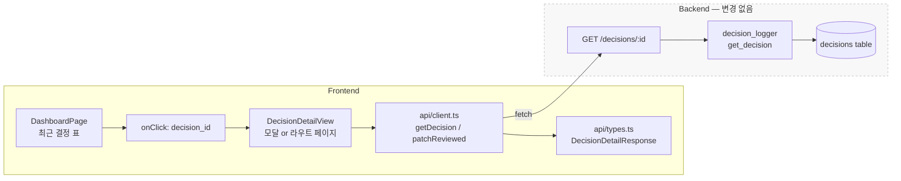
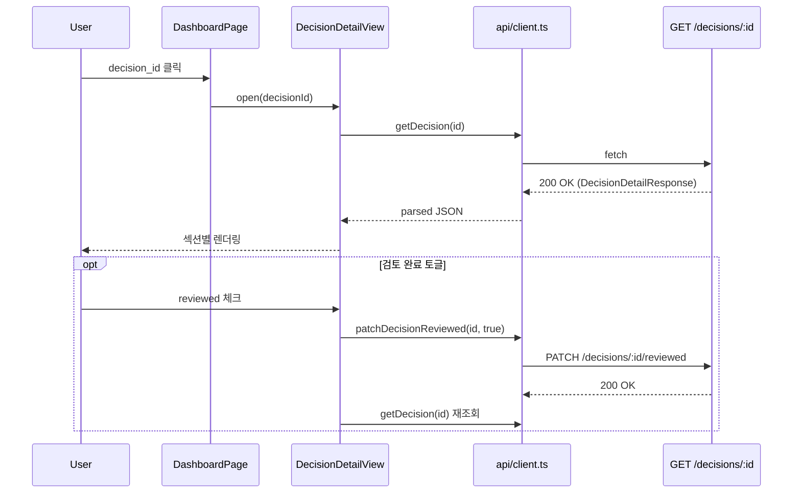
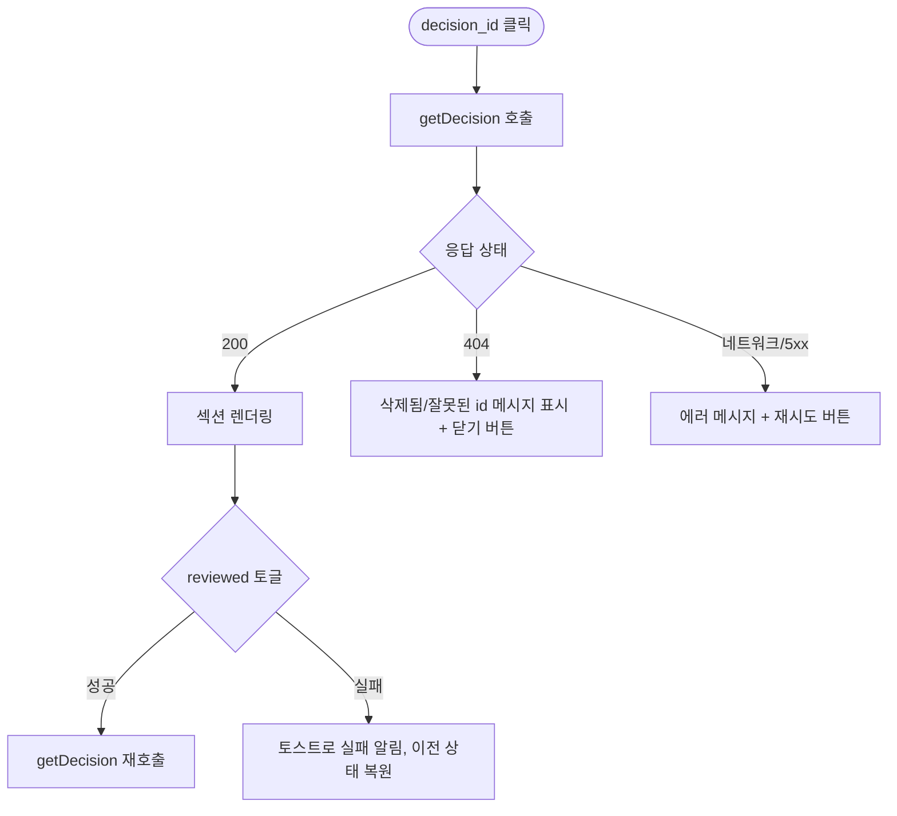
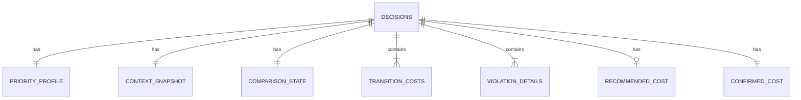

# Decision 상세 표출(Decision Detail View) Design Document

> Status: Draft
> Created: 2026-05-20
> Owner: frontend

## Context

`decisions` 테이블에는 확정 결정 1건당 추천/확정 순서, 7차원 비용 벡터, 전환별 cost, 위반 룰, 우선순위 프로파일, 컨텍스트 스냅샷, 비교 요약, 메모, 모델/룰 버전 등 사후 재구성 가능한 거의 모든 맥락이 저장됩니다(`backend/app/db/schema.sql:134-169`, `backend/app/services/decision_logger.py:91-100`). 백엔드는 `GET /decisions/{decision_id}` 라우트로 이 풀 레코드를 이미 노출하고 있고, JSON 컬럼은 서비스 측에서 자동 파싱되어 dict 형태로 반환됩니다.

반면 프론트엔드에서는 이 데이터를 표시하는 경로가 없습니다. 대시보드 "최근 확정 결정" 표(`frontend/src/pages/DashboardPage.tsx:112-138`)가 `decision_id`를 보여주지만 단순 텍스트(`<span>`)일 뿐이고, `api/client.ts`에 GET 함수가 없으며, `types.ts`에 상세 응답 타입도 없습니다. 결과적으로 사용자는 어떤 결정이 어떤 우선순위·컨텍스트·위반 상황에서 확정되었는지를 화면에서 되짚어볼 수 없습니다.

본 문서는 백엔드 변경 없이 프론트엔드만 추가해 **대시보드에서 `decision_id`를 클릭하면 해당 결정의 풀 레코드를 표출하는 뷰**를 도입한다는 합의를 남기는 것을 목적으로 합니다. 표시 형태(모달 vs 라우트 페이지)는 합의 대상이 되는 핵심 결정으로 본 문서 내에서 다룹니다.

## Goals & Non-Goals

### Goals

| Goal | Description |
|---|---|
| 대시보드 진입점 추가 | 최근 결정 행의 `decision_id`를 클릭 가능한 트리거로 만듭니다. |
| 풀 레코드 표출 | 추천/확정 순서, 7차원 비용·차이, 전환별 cost, 위반, 컨텍스트, 우선순위, 메모, 메타를 한 화면에 표시합니다. |
| 백엔드 무변경 | `GET /decisions/{decision_id}` 응답을 그대로 사용해 백엔드 코드를 건드리지 않습니다. |
| 타입 안전성 | 응답 shape를 `DecisionDetailResponse` 타입으로 명시해 `frontend/src/api/types.ts`의 다른 응답들과 동일한 수준으로 정적 검증합니다. |
| reviewed 토글 재사용 | 기존 `PATCH /decisions/{id}/reviewed`를 상세 뷰에서 호출해 결정 검토 상태를 갱신할 수 있게 합니다. |

### Non-Goals

| Non-Goal | Reason |
|---|---|
| 백엔드 라우트/스키마 변경 | 필요한 데이터가 이미 모두 응답에 포함되어 있습니다. |
| 결정 목록 라우트(`GET /decisions`) 추가 | 본 작업은 단건 조회 표출 범위입니다. 목록 라우트는 P2 placeholder입니다. |
| 결정 비교 화면(2건 이상 동시 비교) | 본 작업의 후속 후보입니다. |
| 결정 편집/취소 기능 | 결정은 immutable log로 다룹니다. `reviewed` 외 필드는 변경하지 않습니다. |
| 모바일/태블릿 레이아웃 최적화 | 데모 환경(데스크탑)을 우선 대상으로 합니다. |
| 인쇄·PDF 내보내기 | 데모 범위 밖입니다. |

## Architecture



| 컴포넌트 | 책임 | 비고 |
|---|---|---|
| `DashboardPage` | 최근 결정 행을 클릭 가능한 트리거로 변경합니다. | 기존 표 구조 유지, 핸들러만 부착. |
| `DecisionDetailView` | 풀 레코드를 섹션별로 렌더링합니다(헤더·점수·비용·전환·위반·컨텍스트·우선순위·메모·메타). | 본 작업의 신규 컴포넌트. |
| `api/client.ts` | `getDecision(id)`, `patchDecisionReviewed(id, reviewed)` 두 함수를 추가합니다. | 기존 `postDecisions`와 같은 패턴. |
| `api/types.ts` | `DecisionDetailResponse` 타입을 정의합니다. | `decision_logger._row_to_decision` 반환 shape에 맞춥니다. |

핵심 관찰: 백엔드 응답은 이미 JSON 파싱이 끝난 dict 구조이므로, 프론트엔드는 `snake_case`를 그대로 받아 표시하면 됩니다. `frontend/src/api/mappers.ts`의 camelCase 변환 흐름은 기존 라이브 화면용이며, 본 상세 뷰는 wire format을 그대로 사용합니다(대시보드와 동일한 정책).

## Sequence / Flow

### 정상 흐름



| Step | Description |
|---:|---|
| 1 | 사용자가 대시보드 "최근 확정 결정" 표의 `decision_id`를 클릭합니다. |
| 2 | `DashboardPage`가 선택된 id로 `DecisionDetailView`를 엽니다(상태 변수에 id 저장). |
| 3 | 상세 뷰가 마운트되며 `getDecision(id)`를 호출합니다. |
| 4 | 응답을 `DecisionDetailResponse`로 타입 안전하게 받아 섹션별 컴포넌트로 분배합니다. |
| 5 | 사용자가 reviewed 토글을 켜면 `patchDecisionReviewed`를 호출하고, 성공 시 `getDecision`을 재호출해 최신 상태를 반영합니다. |

### 에러 흐름



| Case | Handling |
|---|---|
| 응답 404 | "해당 결정 로그를 찾을 수 없습니다." 안내와 닫기 버튼만 노출합니다. 자동 재시도하지 않습니다. |
| 네트워크 오류·5xx | "결정 상세를 불러오지 못했습니다." 메시지와 재시도 버튼을 노출합니다. 재시도는 사용자 클릭으로만 수행합니다. |
| 응답에 기대 필드가 누락(예: `confirmed_cost_vector` null) | 해당 섹션을 "데이터 없음" placeholder로 표시하고 다른 섹션은 그대로 렌더링합니다. 페이지 전체 실패로 키우지 않습니다. |
| `recommended_sequence` / `confirmed_sequence` 길이가 매우 김(20+) | 길이 표시 + 스크롤 가능한 영역으로 분리합니다. 한 줄로 펼치지 않습니다. |
| reviewed PATCH 실패 | 토스트로 알리고 토글 상태를 호출 전 값으로 되돌립니다. 재조회는 수행하지 않습니다. |

## Decisions & Rationale

### Decision 1: 상세 표출 형태 — 대시보드 위 모달

| Item | Description |
|---|---|
| Decision | `/decisions/:id` 라우트를 새로 만들지 않고, 대시보드 위에 오버레이되는 모달로 풀 레코드를 표시합니다. |
| Alternatives | (A) 별도 라우트 페이지(`/decisions/:id`) 추가. (B) 대시보드 내부에 확장 패널로 인라인 표시. (C) 본 결정인 모달. |
| Rationale | 현 프로젝트는 React Router를 도입하고 있지 않고(`frontend/src/pages/`에 라우터 설정 부재), 데모 흐름은 대시보드 → 상세 → 대시보드의 빠른 왕복이 중심입니다. 모달은 라우터 도입 비용 없이 즉시 가치를 제공하며, URL 공유가 데모 요구가 아닙니다. 라우트 페이지는 URL 공유·새로고침 안전성이라는 장점이 있으나, 라우터 도입에 따른 `DecisionPage`·`DashboardPage` 진입 흐름 재설계가 동반됩니다. 인라인 패널은 대시보드의 정보 밀도를 과도하게 키워 차트·표가 가려집니다. |
| Impact | URL 공유는 불가능하며 새로고침 시 상세가 닫힙니다. 데모 시나리오상 수용 가능합니다. 향후 요구가 생기면 라우트 페이지로 승격하는 후속 design doc(`decision-detail-route.md`)을 작성합니다. |

### Decision 2: 응답 데이터를 snake_case 그대로 사용(매퍼 미경유)

| Item | Description |
|---|---|
| Decision | `DecisionDetailResponse`를 백엔드 응답의 snake_case 구조 그대로 정의하고, 표시 컴포넌트도 snake_case 필드를 직접 참조합니다. |
| Alternatives | `frontend/src/api/mappers.ts`에 `mapDecisionDetailResponse`를 추가해 camelCase 도메인 객체로 변환. |
| Rationale | 대시보드(`DashboardPage`)도 이미 snake_case wire format을 그대로 사용하고 있어 정책이 일관됩니다. 라이브 결정 워크스페이스(`DecisionPage`)와 달리 상세 뷰는 read-only 표시 전용이라 camelCase 매핑의 가치가 낮습니다. 매퍼를 추가하면 7차원 비용·전환별 cost 같은 nested 구조까지 변환 함수를 작성해야 해 코드량 대비 이득이 작습니다. |
| Impact | `types.ts`에 snake_case 인터페이스가 새로 추가됩니다. 향후 매퍼 일관화가 필요해질 경우 단일 진입점(`getDecision`)만 바꾸면 됩니다. |

### Decision 3: 클릭 트리거는 `decision_id` 칸 자체에 부착

| Item | Description |
|---|---|
| Decision | "최근 확정 결정" 표의 `decision_id` `<span>`을 `<button>` 또는 `<a>` 시맨틱으로 감싸 키보드 접근성을 확보하고, 시각적으로는 밑줄·hover 색상으로 클릭 가능함을 표시합니다. |
| Alternatives | (A) 행 전체 클릭. (B) 별도 "보기" 아이콘 버튼 칸 추가. |
| Rationale | (A) 행 전체 클릭은 칸 단위 정렬·복사를 방해할 수 있고, 향후 행에 다른 액션이 추가될 때 충돌합니다. (B) 별도 칸은 표 폭을 늘리며 의도가 중복됩니다. `decision_id`는 자연스러운 식별자이자 진입 표지로 적합합니다. |
| Impact | 표의 열 폭 변경은 없습니다. 시맨틱 변경으로 미세한 스타일 조정이 필요합니다. |

### Decision 4: 모달 내부 reviewed 토글에서 PATCH 성공 후 재조회

| Item | Description |
|---|---|
| Decision | reviewed PATCH 성공 후 `getDecision(id)`을 다시 호출해 최신 상태로 갱신합니다. 실패 시에는 토글을 직전 상태로 복원하고 재조회하지 않습니다. |
| Alternatives | (A) 낙관적 업데이트만 수행하고 재조회하지 않음. (B) PATCH 응답 자체로 상세 상태를 갱신. |
| Rationale | (A)는 다른 필드(예: 향후 추가될 `last_reviewed_at`)가 같이 변경될 가능성을 무시합니다. (B)는 현재 PATCH 응답이 `{decision_id, reviewed}`만 돌려주므로 정보가 부족합니다. 재조회는 1회 네트워크 비용으로 정합성을 보장합니다. |
| Impact | 토글 후 약간의 지연이 발생하지만 데모 환경에서 수용 가능합니다. |

## Edge Cases & Error Handling

| Case | Expected Handling | User/System Impact |
|---|---|---|
| `decision_id`로 404가 반환됨 | 모달 내부에 "삭제되었거나 잘못된 ID입니다." 표시 + 닫기만 노출. | 사용자가 의미 있는 메시지를 받고 닫을 수 있음. |
| 네트워크 단절로 fetch 실패 | "결정 상세를 불러오지 못했습니다." + 재시도 버튼 노출. | 자동 재시도 없음. 사용자 의지로만 재시도. |
| `confirmed_cost_vector` 또는 `transition_costs`가 비어있음(legacy 데이터) | 해당 섹션은 "기록 없음" placeholder, 다른 섹션은 정상 렌더링. | 페이지 전체 실패로 키우지 않음. |
| `violation_details`가 100건 이상 | 처음 20건만 표시하고 "더 보기" 토글로 나머지 노출. | 모달 높이 폭증 방지. |
| `recommended_sequence` = `confirmed_sequence` (사용자가 추천을 그대로 확정) | "추천 순서를 그대로 확정" 안내 + 단일 리스트만 표시. | 가독성 유지. |
| reviewed PATCH 도중 모달이 닫힘 | 진행 중인 fetch는 취소하지 않으나 결과는 무시(`AbortController` 미사용). | 데이터 정합성은 다음 진입 시 재조회로 회복. |
| 비ASCII id 또는 매우 긴 id | id 표시 영역은 `min-width` + ellipsis 처리. | 레이아웃 깨짐 방지. |
| 모바일 환경 진입 | 데모 범위 밖이므로 데스크탑 폭 기준 레이아웃 유지. | Non-Goal 명시. |

---

## Data Model

`DecisionDetailResponse`는 `decision_logger._row_to_decision` 반환 shape를 그대로 따릅니다. `decisions` 테이블 컬럼과 1:1 매핑되며 JSON 컬럼은 이미 파싱된 객체입니다.

| Field | Type | Required | Default | Description |
|---|---|---:|---|---|
| `decision_id` | string | Yes | — | 결정 식별자 (`DEC-XXXXXXXXXXXX`). |
| `plan_id` | string | Yes | — | 대상 생산 계획 id. |
| `user_id` | string | Yes | `demo-manager` | 확정 사용자. |
| `recommended_sequence` | string[] | Yes | — | 추천 `plan_item_id[]`. |
| `confirmed_sequence` | string[] | Yes | — | 확정 `plan_item_id[]`. |
| `priority_profile` | object | Yes | — | 사용자가 설정한 우선순위 라벨/배수. |
| `applied_weights` | object | Yes | — | 실제 적용된 7차원 가중치. |
| `context_snapshot` | object | Yes | — | 라인/근무조/크루/숙련도/장비 상태 등 컨텍스트. |
| `recommended_cost_vector` | object \| null | No | null | 추천 순서 평가 (aggregated_cost 7차원 + transition_costs + risk_warnings). |
| `confirmed_cost_vector` | object | Yes | — | 확정 순서 평가 (동일 구조). |
| `transition_costs` | object[] | No | `[]` | 전환별 cost 상세. |
| `total_weighted_cost` | number | Yes | — | 7차원 가중합. |
| `sequence_penalty` | number | Yes | 0 | 순서 위반 패널티 합. |
| `objective_score` | number | Yes | — | `total_weighted_cost + sequence_penalty`. |
| `comparison_state` | object | Yes | — | `{basis, recommended, current, diff, diff_rate, ...}`. |
| `comparison_summary` | string | Yes | — | 한국어 요약 문장. |
| `cost_delta_vs_recommended` | object \| null | No | null | 7차원별 (확정 − 추천) 차이. |
| `violation_count` | number | Yes | 0 | 위반 룰 개수. |
| `violation_details` | object[] | Yes | `[]` | 위반 룰 상세 (rule_id, severity, reason, recommendation 등). |
| `explanation_summary` | string \| null | No | null | LLM/템플릿 설명. |
| `decision_memo` | string \| null | No | null | 운영자 메모. |
| `reviewed` | boolean | Yes | false | 검토 완료 플래그. |
| `model_version` | string | Yes | `heuristic-v1` | 사용 모델 버전. |
| `rule_version` | string | Yes | `rules-2026.05.v1` | 적용 룰 버전. |
| `confirmed_at` | string (ISO8601) | Yes | — | 확정 시각 (UTC). |



## API / Interface

| Method | Path | Description |
|---|---|---|
| GET | `/decisions/{decision_id}` | 단건 풀 레코드 조회. **백엔드 기존 라우트.** |
| PATCH | `/decisions/{decision_id}/reviewed` | 검토 완료 플래그 갱신. **백엔드 기존 라우트.** |

요청·응답 예시는 `backend/app/api/routes_decisions.py:18-36`와 `decision_logger._row_to_decision`을 기준으로 합니다. 본 작업에서 백엔드 인터페이스 변경은 없습니다.

호환성 주의:
- legacy 데이터의 `recommended_cost_vector`가 null일 수 있어 프론트는 null-safe로 렌더링합니다.
- `transition_costs`는 빈 배열이 정상값입니다.

## Workflow

_해당없음_ (단일 상호작용이며 별도 상태 머신을 둘 만큼 복잡하지 않습니다.)

## Performance

| Item | Target |
|---|---|
| 상세 모달 오픈 후 첫 렌더까지 | p95 800ms 이내 (로컬 SQLite, 데모 데이터셋 기준). |
| 단건 응답 크기 | < 100KB (sequence 길이 20, transition 20, violation 5 기준 예상). |
| reviewed PATCH 왕복 | p95 400ms 이내. |

본 작업은 read-heavy이며 단건 fetch이므로 성능 risk는 낮습니다.

## Security

| 항목 | 정책 |
|---|---|
| authentication | 본 MVP는 인증 미도입 상태이므로 본 작업에서도 그대로 둡니다. |
| external input | URL path의 `decision_id`는 백엔드가 SQL 파라미터 바인딩으로 처리(`decision_logger.get_decision`)하므로 SQLi risk 없음. 프론트는 별도 sanitize 불필요. |
| 개인정보 | `decisions`에 PII가 없습니다(`user_id`는 데모 값 고정). |

## Observability

| 항목 | 설명 |
|---|---|
| logs | 본 작업은 프론트 단독이며 별도 로그를 남기지 않습니다. fetch 실패는 console.error로 충분합니다. |
| metrics | _해당없음_ |
| audit records | reviewed 변경은 백엔드 PATCH로 이미 DB에 반영됩니다. 별도 audit log 도입은 본 작업 범위 밖입니다. |

## Migration / Rollback

_해당없음_ (스키마 변경 없음. 프론트 변경은 코드 revert로 즉시 롤백 가능.)

## Open Questions

| Question | Owner | Blocking? | Notes |
|---|---|---:|---|
| 모달 내부의 7차원 비용 시각화를 표·바 차트·히트맵 중 어떤 형태로 표시할지 | frontend | No | 1차 구현은 표 + 색상 강조로 시작하고, 시연 피드백 후 조정합니다. |
| `transition_costs`의 전환 단계를 어떤 순서로 보여줄지(누적·역순·선택형) | frontend | No | 1차 구현은 confirmed_sequence 순서 그대로 표시합니다. |
| reviewed 토글을 모달에 둘지, 대시보드 행에도 둘지 | frontend | No | 1차 구현은 모달 내부에만 둡니다. 행 내부 토글은 후속 follow-up으로 분리합니다. |
| 향후 URL 공유 요구가 생기면 라우트 페이지로 승격할지 | product | No | 발생 시 별도 design doc(`decision-detail-route.md`)을 작성하고 본 문서를 Superseded로 표기합니다. |

## Out of Scope

| Item | Reason |
|---|---|
| 결정 비교 화면(2건 이상 한 화면에서 비교) | 본 작업의 자연스러운 후속이지만 별도 design doc 대상입니다. |
| `GET /decisions` 목록 라우트 추가 | 본 작업은 대시보드 진입점으로 충분합니다. 목록 라우트는 P2 placeholder. |
| 결정 편집/취소 기능 | 결정 로그는 immutable 정책입니다. |
| 모바일/태블릿 레이아웃 | 데모 환경은 데스크탑입니다. |
| 인쇄·PDF·CSV export | 데모 범위 밖입니다. |

---

# Implementation Plan

## Target Files

| File | Action | Purpose |
|---|---|---|
| `frontend/src/api/types.ts` | Modify | `DecisionDetailResponse` 타입 추가. |
| `frontend/src/api/client.ts` | Modify | `getDecision(id)`, `patchDecisionReviewed(id, reviewed)` 함수 추가. |
| `frontend/src/components/DecisionDetailView.tsx` | Create | 모달 컴포넌트. 섹션별 렌더링. |
| `frontend/src/pages/DashboardPage.tsx` | Modify | 최근 결정 행의 `decision_id` 클릭 핸들러 부착, 모달 마운트 지점 추가. |
| `frontend/src/styles/` (또는 컴포넌트 동일 위치) | Modify/Create | 모달 스타일 추가. |

## Implementation Steps

### Step 1: 응답 타입 정의

- **File**: `frontend/src/api/types.ts`
- **Action**: Add
- **Key snippet**:
  ```ts
  /** GET /decisions/{id} — 단건 풀 레코드 응답. snake_case wire format 유지. */
  export interface DecisionDetailResponse {
    decision_id: string;
    plan_id: string;
    user_id: string;
    recommended_sequence: string[];
    confirmed_sequence: string[];
    priority_profile: Record<string, { label: string; multiplier: number }>;
    applied_weights: Record<string, number>;
    context_snapshot: {
      visible: { lineId: string; shift: string; crewSize: number };
      resolved: {
        workerSkill: number; equipmentCondition: number;
        daysSinceLastClean: number; dayOfWeek: number; contextVersion: string;
      };
    };
    recommended_cost_vector: CostEvaluation | null;
    confirmed_cost_vector: CostEvaluation;
    transition_costs: TransitionCost[];
    total_weighted_cost: number;
    sequence_penalty: number;
    objective_score: number;
    comparison_state: {
      basis: 'objectiveScore';
      recommended: number; current: number;
      diff: number; diff_rate: number;
      [key: string]: unknown;
    };
    comparison_summary: string;
    cost_delta_vs_recommended: Record<string, number> | null;
    violation_count: number;
    violation_details: ViolationDetail[];
    explanation_summary: string | null;
    decision_memo: string | null;
    reviewed: boolean;
    model_version: string;
    rule_version: string;
    confirmed_at: string;
  }
  ```
- **Verify**: `npm run lint` 통과. 기존 `DecisionsResponse`(POST 응답) 타입과 이름이 충돌하지 않는지 확인.

### Step 2: API 클라이언트 함수 추가

- **File**: `frontend/src/api/client.ts`
- **Action**: Add
- **Key snippet**:
  ```ts
  /** 단건 의사결정 조회 */
  export function getDecision(decisionId: string) {
    return request<DecisionDetailResponse>(`/decisions/${decisionId}`);
  }

  /** reviewed 플래그 갱신 */
  export function patchDecisionReviewed(decisionId: string, reviewed: boolean) {
    return request<{ decision_id: string; reviewed: boolean }>(
      `/decisions/${decisionId}/reviewed`,
      { method: 'PATCH', body: JSON.stringify({ reviewed }) },
    );
  }
  ```
- **Verify**: 백엔드 dev 서버 기동 후 브라우저 콘솔에서 `getDecision('DEC-...')` 호출이 정상 응답을 반환하는지 확인.

### Step 3: DecisionDetailView 컴포넌트 작성

- **File**: `frontend/src/components/DecisionDetailView.tsx`
- **Action**: Create
- **Key snippet**:
  ```tsx
  /**
   * 결정 ID 클릭 시 표시되는 모달.
   * 풀 레코드를 섹션별로 렌더링하고 reviewed 토글을 제공한다.
   */
  export default function DecisionDetailView({
    decisionId, onClose,
  }: { decisionId: string; onClose: () => void }) {
    const [data, setData] = useState<DecisionDetailResponse | null>(null);
    const [error, setError] = useState<'not_found' | 'network' | null>(null);

    useEffect(() => {
      getDecision(decisionId)
        .then(setData)
        .catch(err => setError(err.message.includes('404') ? 'not_found' : 'network'));
    }, [decisionId]);

    // 섹션: 헤더 / 점수 / 비용 / 전환 / 위반 / 컨텍스트 / 우선순위 / 메모·설명 / 메타
    // reviewed 토글 → patchDecisionReviewed → 재조회
    // 404 / network / 정상 렌더링 분기
    return (/* modal markup */);
  }
  ```
- **Verify**: 정상 응답, 404, 네트워크 실패 세 케이스를 dev 환경에서 수동 검증.

### Step 4: 대시보드 진입점 부착

- **File**: `frontend/src/pages/DashboardPage.tsx`
- **Action**: Modify
- **Key snippet**:
  ```tsx
  const [openId, setOpenId] = useState<string | null>(null);
  // ...
  {recents.map(d => (
    <div key={d.decision_id} className="recent-row">
      <button
        type="button"
        className="recent-id recent-id--link"
        onClick={() => setOpenId(d.decision_id)}
      >
        {d.decision_id.slice(-10)}
      </button>
      {/* 나머지 칸 동일 */}
    </div>
  ))}
  {openId && (
    <DecisionDetailView decisionId={openId} onClose={() => setOpenId(null)} />
  )}
  ```
- **Verify**: 대시보드에서 임의 결정 클릭 시 모달이 열리고, 닫기 후 다른 결정 클릭 시 새 데이터로 갱신되는지 확인.

### Step 5: 모달 스타일 추가

- **File**: 기존 스타일 파일 또는 컴포넌트 인접 CSS
- **Action**: Add
- **Key snippet**: 오버레이, 모달 박스, 섹션 헤더, 표 grid, 위반 severity 색상 토큰 정의.
- **Verify**: 시각적 점검. 모달 외부 클릭/ESC로 닫히는지 확인.

### Step 6: 수동 시연 검증

- **File**: _해당없음_
- **Action**: Verify
- **Key snippet**:
  ```bash
  cd backend && python -m uvicorn app.main:app --reload --port 8000
  cd frontend && npm run dev
  # 브라우저에서:
  #   1) 대시보드 진입 → 결정 클릭 → 모달 정상 표시
  #   2) reviewed 토글 → 백엔드 PATCH 호출 확인 → 재조회 반영 확인
  #   3) 잘못된 id 강제 입력(개발자 도구) → 404 분기 확인
  ```
- **Verify**: 위 3개 시나리오 모두 통과. `cd frontend && npm run lint` 통과.

## Order Constraints

Step 1 → Step 2는 타입 의존성으로 순서가 고정됩니다. Step 3은 Step 1·2 모두 완료 후 시작합니다. Step 4는 Step 3 완료 후 진행합니다. Step 5는 Step 3과 동시에 작업 가능합니다. Step 6은 마지막입니다.
