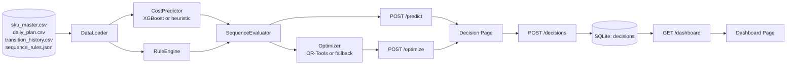
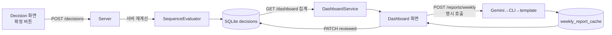

# SmartFactoryV2 기능 시연 & 발표 자료

> 본 문서는 해커톤 발표·시연용 정리본입니다. 발표 슬라이드, 데모 스크립트, Q&A 대비 자료의 단일 출처(single source of truth)로 사용합니다.
>
> 참조 원본: `docs/roadmap.md`, `docs/source/DB_state_v1.3.md`, `docs/architecture.md`, `docs/demo_flow.md`, `docs/design/*.md`, `backend/app/services/*.py`, `frontend/src/**`

---

## 1. 문제 정의

### 1-1. 도메인 상황

다품종 도료(페인트) 제조 라인은 하루에 5~20개의 서로 다른 SKU(색상·점도·광택·포장 규격이 모두 다른 제품)를 같은 설비에서 연속 생산합니다. **어떤 순서로 생산하느냐**가 다음 비용·리스크에 직접 영향을 줍니다.

| 항목 | 설명 |
|---|---|
| 색상 전환 세척 비용(`wash_cost`) | 검정 → 흰색처럼 잔류 안료가 다음 SKU 품질을 오염시키는 전환은 추가 세척과 폐기 손실 발생 |
| 설비 셋업 시간(`setup_time`) | 점도/광택/포장이 크게 달라지면 설비 재조정 시간이 늘어남 |
| 인건비(`labor_cost`) | 셋업 시간 × 인원 × 시급. 야간(`night` shift)·인원 변동에 따라 균일 배수 발생 |
| 자재 손실(`material_loss`) | 전환 시점 잔여 도료 폐기, 불량률 |
| 다운타임(`downtime`) | 라인 정지로 인한 생산성 손실 |
| 포장 시간(`packaging_time`) | 1L/4L/18L 포장 규격이 바뀔 때 라인 교체 시간 |
| 순서 위반 리스크(`sequence_risk`) | 잔류 안료·광택 잔류로 인한 품질 사고 가능성 (rule 기반) |

### 1-2. 현장의 페인포인트

```text
"베테랑 1명의 경험"으로 순서가 정해짐 → 인수인계 단절, 비용 비교 불가
                ↓
야간조·신규 인원이 들어오면 같은 계획도 비용·리스크가 달라짐
                ↓
"왜 이 순서인가"를 설명할 수 없어 의사결정 사후 검토(post-mortem)가 안 됨
                ↓
다음 주에 같은 실수가 재발
```

### 1-3. 우리가 해결하려는 것

> 다품종 도료 제조 생산순서를 **AI가 추천**하고, 운영자가 **드래그&드롭**으로 what-if 조정을 하면 **7차원 비용과 리스크를 실시간 재계산**하여, 확정 결과를 **SQLite 로그**로 누적해 **KPI 대시보드**까지 자동 연결되는 의사결정 지원 시스템.

핵심 성공 기준:

- 추천안 ↔ 현재안의 **objectiveScore 차이를 한 화면에서** 즉시 비교 가능
- AI가 실패해도(XGBoost 모델 없음, OR-tools 미설치, LLM key 없음) **API 전체가 깨지지 않음** (fallback-safe)
- 모든 확정 의사결정이 **재계산 후 로그로 누적**되어 다음 주 리뷰의 근거가 됨

---

## 2. 데이터 및 기술 활용 계획

### 2-1. 합성 데이터 4종 (해커톤 P0 범위)

`scripts/seed_data.py`로 고정 seed 기반 재현 가능하게 생성합니다.

| 파일 | 용도 | 핵심 컬럼 |
|---|---|---|
| `sku_master.csv` | 12개 도료 SKU 기준정보 | `category`(light/mid/dark/metal/special), `color_family`, `pigment_intensity`, `gloss_level`, `viscosity`, `hex_code` |
| `daily_plan.csv` | 일일 생산계획 (시연용 5건) | `plan_item_id`(순서 primary key), `sku_id`, `quantity`, `package_size`(1L/4L/18L) |
| `transition_history.csv` | XGBoost 학습용 전환 이력 | from/to SKU + context + 6개 cost target |
| `sequence_rules.json` | 색상 전환 위험 룰 4종 | SR-001(검정→흰색), SR-002(dark→light), SR-003/004(metal·special→mid/light) |

> **주의:** 순서의 primary key는 항상 `plan_item_id[]`입니다. 같은 SKU가 한 계획에 여러 번 등장할 수 있어 `sku_id[]`로는 순서를 표현할 수 없습니다.

### 2-2. 기술 스택

| 레이어 | 기술 | 역할 |
|---|---|---|
| 백엔드 | Python 3.11 + FastAPI + Pydantic v2 | 8개 라우터(`/health`, `/plans`, `/optimize`, `/predict`, `/validate`, `/decisions`, `/dashboard`, `/explain`, `/reports`) |
| AI – 비용 예측 | **XGBoost** 6개 회귀 모델 + deterministic heuristic fallback | 전환마다 6차원 cost 벡터 출력 |
| AI – 최적화 | **OR-Tools** Routing solver (open path + dummy depot) + brute-force/nearest-neighbor fallback | objectiveScore 최소 순서 탐색 |
| 룰 엔진 | `sequence_rules.json` + specificity 정렬 매칭 | LOW/MEDIUM/HIGH severity + penalty 점수 |
| LLM 설명 | Gemini API → claude CLI → template fallback | `/explain` 호출 시에만 한국어 1~3문장 요약 |
| 저장 | SQLite (`decisions`, `plan_context`, `weekly_report_cache`) | 확정 로그 누적, KPI 원천 |
| 프론트엔드 | React 18 + Vite + **dnd-kit** + Recharts | Decision/Dashboard 두 페이지 |

### 2-3. 전체 데이터 흐름



---

## 3. 왜 AI 기술이며, 왜 XGBoost + OR-Tools인가

### 3-1. AI가 필요한 이유

전환 비용은 단순한 차이값(brightness gap, viscosity gap …)으로 깔끔히 떨어지지 않습니다. 같은 색상군 전환이라도 **작업자 숙련도, 설비 상태, 마지막 세척 후 경과일, 야간/주간 shift, 인원 수**가 비선형으로 얽힙니다. 발표 슬라이드에 쓸 정량 근거는 `backend/app/data/models/training_report.txt`에 학습 시점에 자동 기록됩니다.

```text
dimension       mae_xgboost    mae_heuristic   relative_improvement
setup_time      2.54           17.03           85.1%
labor_cost      6,556.12       20,910.99       68.6%
material_loss   0.25           1.69            85.0%
wash_cost       4,581.70       19,418.60       76.4%
downtime        1.76           4.80            63.3%
packaging_time  1.74           3.33            47.8%
```

→ 6차원 평균 **70% 이상 MAE 개선**. "AI 모델을 쓸 가치가 수치로 증명됨"을 발표에서 그대로 인용합니다.

### 3-2. 왜 XGBoost인가 (비용 예측)

| 후보 | 채택 여부 | 이유 |
|---|---|---|
| Linear Regression | ❌ | brightness × equipment_condition 같은 **비선형 교호작용**을 못 잡음 |
| Random Forest | △ | 정확도는 비슷하나 같은 데이터 규모에서 학습/추론 모두 느림 |
| Deep NN | ❌ | 합성 데이터 수천 행 규모에서 과적합·튜닝 비용이 큼. 해커톤 일정에 맞지 않음 |
| **XGBoost** | ✅ | 표 형식(tabular) 합성 데이터에서 SOTA에 가까운 성능, 학습 1초~수초, **모델 없으면 heuristic fallback이 깔끔하게 가능** |

설계 기준:
- **차원별 독립 회귀 6개** (setup_time, labor_cost, material_loss, wash_cost, downtime, packaging_time). 하나가 망가져도 나머지가 살아남고, 차원별 MAE를 따로 보고할 수 있음.
- **학습/추론 feature 단일 진실원천**: `app/ml/features.py`의 `FEATURE_COLUMNS`로 양쪽이 같은 순서·같은 파생식을 쓰도록 강제. 두 경로 컬럼이 어긋나면 silent하게 잘못된 가중치가 적용되기 때문에 가장 큰 위험 요소.

### 3-3. 왜 OR-Tools인가 (순서 최적화)

생산 순서 문제는 본질적으로 **열린 경로 TSP(Open-Path Traveling Salesman)** 입니다.

| 후보 | 채택 여부 | 이유 |
|---|---|---|
| Brute-force 순열 탐색 | ✅ (fallback) | 5~8개 이하에서는 정확해를 1초 안에 보장. 시연용 fallback으로 유지 |
| Greedy / Nearest-neighbor | ✅ (fallback) | 9개 이상에서 OR-Tools 실패 시 사용. 시연 흐름이 끊기지 않음 |
| 직접 CP-SAT 모델 작성 | ❌ | 후보 코드가 사이클 모델이라 열린 경로 평가 기준과 점수가 어긋남 |
| **OR-Tools Routing Solver + dummy depot** | ✅ (메인) | dummy node를 추가해 마지막→처음 비용을 0으로 만들면 **열린 Hamiltonian path** 그대로 풀 수 있음. PATH_CHEAPEST_ARC + GUIDED_LOCAL_SEARCH 조합 |

설계 기준:
- 목적함수와 evaluator를 **동일 기준**으로 맞춤: `objectiveScore = totalWeightedCost + sequencePenalty`. solver 내부 비용을 신뢰하지 않고 결과 순서만 채택한 뒤 `SequenceEvaluator.evaluate()`로 **재평가**해 응답 — `/predict`, `/decisions`와 기준이 흔들리지 않음.
- **응답 필드 `optimizer_backend`** 에 `ortools-routing-open-path` / `brute-force-fallback` / `nearest-neighbor-fallback` / `trivial`을 노출해 시연 시 어느 경로를 탔는지 한눈에 보여줌.

### 3-4. fallback 정책 (시연 신뢰성)

```text
XGBoost 모델 없음 → heuristic-v1 deterministic predictor (model_version 필드로 표시)
OR-Tools 미설치  → brute-force (≤8개) 또는 nearest-neighbor (>8개)
LLM key 없음    → claude CLI 시도 → template fallback (generation_mode 필드로 표시)
```

→ 발표 메시지: **"AI가 죽어도 시연은 죽지 않는다"**. 면접관/심사위원이 어느 환경에서 돌려도 화면이 깨지지 않습니다.

---

## 4. 전환별 7차원 비용 예측 구현

### 4-1. 차원 정의

| 차원 | 단위 | 산출 출처 |
|---|---|---|
| `setup_time` | min | XGBoost (또는 heuristic) |
| `labor_cost` | KRW | XGBoost (또는 heuristic) — `setup_time × crew × 시급` 구조 |
| `material_loss` | L | XGBoost (또는 heuristic) |
| `wash_cost` | KRW | XGBoost (또는 heuristic) — `family_changed`와 `gloss_gap`에 강하게 반응 |
| `downtime` | min | XGBoost (또는 heuristic) |
| `packaging_time` | min | XGBoost (또는 heuristic) — `package_changed` 시 +5 |
| `sequence_risk` | pt | Rule Engine (LOW=1, MEDIUM=18, HIGH=35) |

→ "6차원 cost(XGBoost) + 1차원 risk(rule)" = **7차원 화면 표시**. UI에서 7개 막대로 동시에 보여줍니다. `applied_weights`는 6차원 cost에만 곱해지고 `sequence_risk`는 `sequence_penalty`로만 objectiveScore에 합산됩니다.

### 4-2. 핵심 코드 경로

```text
SequenceEvaluator.evaluate()  ← backend/app/services/optimizer.py
  → 인접 plan item 쌍마다 반복
     ├─ CostPredictor.predict_transition()  ← cost_predictor.py
     │    ├─ XGBoost 6개 모델 (model_registry.load_models)
     │    └─ heuristic fallback (deterministic)
     ├─ RuleEngine.evaluate_transition()    ← rule_engine.py
     │    → sequence_risk + penalty + warning
     └─ 운영 컨텍스트 균일 배수 적용 (operating_context_multiplier)
```

### 4-3. Feature 13종 (XGBoost 입력)

`app/ml/features.py:FEATURE_COLUMNS`

```text
운영 컨텍스트 (6) : worker_skill, crew_size, days_since_last_clean,
                  equipment_condition, day_of_week, shift_night
전환 파생 (6)    : brightness_gap, viscosity_gap, gloss_gap,
                  family_changed, metallic_change, package_changed
```

> 학습 파이프라인(`train_xgboost.py`)과 추론 분기(`_predict_xgboost`)가 같은 함수에서 같은 순서로 feature를 만들어 silent 컬럼 어긋남을 방지합니다.

### 4-4. Heuristic Fallback 식 (시연용 설명)

```text
complexity = 1.0
  + brightness_gap / 75
  + viscosity_gap / 120
  + gloss_gap / 140
  + 0.25 (포장 변경)
  + 0.35 (색상군 변경)
  + 0.45 (메탈릭 토글)
  + days_since_last_clean × 0.03
  + (1 - equipment_condition) × 0.25
  - worker_skill × 0.12

setup_time     = max(6,  11 × complexity)
downtime       = max(3,  5  × complexity)
packaging_time = 5 + (5 if 포장변경 else 1.2) + complexity
material_loss  = max(0.5, 1.2 × complexity + brightness_gap/90)
wash_cost      = 14,000 × complexity + (6,500 if 색상군변경 else 1,500) + 90 × gloss_gap
labor_cost     = setup_time × 3 (baseline crew) × 850 KRW/min
```

이 식은 발표 슬라이드에 그대로 띄워 "AI가 없어도 어떤 신호를 보는지" 직관적으로 설명하는 자료로 사용합니다.

### 4-5. 운영 컨텍스트 균일 배수 (shift/crew_size)

`night` shift는 baseline 비용에 **×1.15**, crew_size는 baseline 3인 대비 **1인당 ±10%** 균일 배수를 6차원 전체에 곱합니다(`_operating_context_multiplier`).

> **핵심 결정**: 균일 배수이므로 **추천 순서의 상대 순위는 바뀌지 않음**. 단, 절대 비용·objectiveScore는 운영 상황을 반영해 변동 → "야간 시연" 데모가 자연스럽게 성립.

### 4-6. UI 표시 위치

- `TransitionAnalysisTable.tsx` — 인접 전환마다 7차원 막대
- `KpiSummaryBar.tsx` — 전체 합계 + 추천안 대비 delta
- `KpiRadarChart.tsx` (대시보드) — 결정 간 7차원 모양 비교

---

## 5. 가중치와 제약을 반영한 추천 순서 산출

### 5-1. 운영자 우선순위 패널 (5단계 라벨)

`backend/app/services/priority.py`

| Label | Multiplier |
|---|---|
| VERY_LOW | 0.70 |
| LOW | 0.85 |
| NORMAL | 1.00 |
| HIGH | 1.15 |
| VERY_HIGH | 1.30 |

운영자가 슬라이더로 조절하는 5차원: `wash_cost`, `downtime`, `material_loss`, `packaging_time`, `labor_cost`. `setup_time`은 서버 고정, `sequence_risk`는 priority 대상이 아닙니다.

### 5-2. 가중치 계산식

```text
공장 기본 가중치 (factory_default_v1):
  setup_time     0.1360
  wash_cost      0.2047   ← 도료 공장에서 가장 비싼 신호
  downtime       0.2354
  material_loss  0.1360
  packaging_time 0.1063
  labor_cost     0.1816

raw_weights[d]    = base_weights[d] × priority_multiplier[d]
applied_weights[d] = raw_weights[d] / Σraw_weights   (합 = 1)
```

> multiplier만 단순 곱하면 합이 1을 벗어나 차원 간 비교가 망가집니다. **합=1로 재정규화**해 cost dimension 간 상대 비중만 바뀌도록 했습니다.

### 5-3. objectiveScore 계산

```text
totalWeightedCost = Σ aggregated_cost[d] × applied_weights[d]   (6차원, sequence_risk 제외)
sequencePenalty   = Σ rule.penalty                              (Rule Engine)
objectiveScore    = totalWeightedCost + sequencePenalty
```

→ `/optimize`, `/predict`, `/decisions` **세 라우터가 모두 같은 식** 사용 → 비교 기준이 흔들리지 않음.

### 5-4. OR-Tools 호출 흐름

```mermaid
sequenceDiagram
  participant API as POST /optimize
  participant Opt as Optimizer
  participant Pred as CostPredictor
  participant Rule as RuleEngine
  participant ORT as OR-Tools Routing
  participant Eval as SequenceEvaluator

  API->>Opt: plan_item_ids + priority + context
  loop 모든 (i,j) 쌍
    Opt->>Pred: predict_transition(i→j)
    Opt->>Rule: evaluate_transition(i→j)
  end
  Opt->>Opt: score_matrix (objectiveScore × 100, 정수)
  Opt->>ORT: dummy depot + PATH_CHEAPEST_ARC + GUIDED_LOCAL_SEARCH
  ORT-->>Opt: ordered indices
  Opt->>Eval: evaluate(sequence) ← 동일 기준 재평가
  Eval-->>API: recommended_sequence + transition_costs + objective_score
```

### 5-5. fallback 분기 한눈에

| 항목 수 | OR-Tools 성공 | OR-Tools 실패 |
|---|---|---|
| 0~1 | `trivial` | `trivial` |
| 2~8 | `ortools-routing-open-path` | `brute-force-fallback` (정확해 보장) |
| 9+ | `ortools-routing-open-path` | `nearest-neighbor-fallback` |

응답 `optimizer_backend` 필드로 시연 중 어느 경로를 탔는지 즉시 확인.

### 5-6. 발표 시연 포인트

1. 기본(NORMAL) 가중치에서 추천 순서 A 표시
2. 운영자 우선순위 패널에서 `wash_cost`를 VERY_HIGH로 변경
3. `applied_weights`가 합=1로 재정규화되며 wash_cost 비중이 0.2047 → 약 0.243으로 상승
4. 새 추천 순서 B 생성 (검정→흰색 전환을 자동 회피)
5. **같은 데이터, 다른 가치판단 → 다른 추천 순서**라는 메시지가 자연스럽게 전달됨

---

## 6. DnD와 운영 우선순위 변경으로 비용 검증

### 6-1. UX 시나리오

```text
페이지 진입
  GET /plans/demo-plan-001  →  planItems + operatingContext + defaultPriorityProfile
  POST /optimize            →  recommendedSequence (기준선으로 고정)
                                currentSequence ← recommendedSequence (초기값)

사용자 드래그&드롭 (dnd-kit)
  currentSequence 낙관적 갱신
  POST /predict
    → baselineEvaluation  (recommendedSequence 재평가)
    → currentEvaluation   (currentSequence 평가)
    → comparison_state    (diff, diff_rate, is_better_than_baseline)
    → comparison_summary  (한 줄 한국어 요약)
  UI 갱신
    - TransitionAnalysisTable : 인접 전환마다 7차원 막대
    - KpiSummaryBar           : 합계 + 추천안 대비 delta
    - ComparisonPanel         : "추천안 대비 +N.N%" / "확정 가능"

운영 우선순위 변경 (EvaluationConditionsPanel)
  priorityProfile 갱신 → POST /predict 자동 재호출
  applied_weights 가 합=1로 재정규화되어 즉시 비교 갱신
```

### 6-2. 비교 결과 페이로드 (실제 응답 구조)

```jsonc
{
  "baseline_evaluation": { "objective_score": 51234.12, "aggregated_cost": {...} },
  "current_evaluation":  { "objective_score": 53870.55, "aggregated_cost": {...} },
  "comparison_state": {
    "basis": "objectiveScore",
    "recommended": 51234.12,
    "current":     53870.55,
    "diff":        +2636.43,
    "diff_rate":   +0.0515,
    "objective_delta":            +2636.43,
    "total_weighted_cost_delta":  +2150.00,
    "sequence_penalty_delta":     +486.43,
    "risk_warning_delta":         +1,
    "is_better_than_baseline":    false
  },
  "comparison_summary": "현재 순서는 추천안보다 목적 점수가 2636.43 높습니다."
}
```

### 6-3. 핵심 구현 파일

| 파일 | 역할 |
|---|---|
| `frontend/src/hooks/useDecisionPage.ts` | 진입 플로우, D&D 후 `POST /predict`, 우선순위 변경 시 재호출 |
| `frontend/src/components/DecisionWorkspace.tsx` | dnd-kit `DndContext` + `SortableContext`, drag handle, drag overlay |
| `frontend/src/components/EvaluationConditionsPanel.tsx` | 운영자 우선순위 슬라이더, 적용 시 부모로 신규 profile 전달 |
| `frontend/src/components/KpiSummaryBar.tsx` | 합계 KPI + 추천안 delta 표시 |
| `frontend/src/components/ComparisonPanel.tsx` | comparison_summary + 차원별 diff 표시 |
| `backend/app/api/routes_predict.py` | `/predict` 라우터, SequenceEvaluator.compare() 호출 |
| `backend/app/services/optimizer.py:SequenceEvaluator.compare()` | baseline ↔ current 동일 기준 평가 |

### 6-4. 발표 시연 포인트

1. 추천 순서 = 현재 순서 → "추천안 대비 +0.0%" "확정 가능" 배지
2. 두 카드를 드래그로 교체 → 카드 빨간 외곽선(고위험 표시) + "+5.1% / 고위험 전환 1건" 배지
3. 운영자 패널에서 `wash_cost`를 VERY_HIGH로 → 같은 순서인데 delta가 다시 늘어남 → "가치판단을 바꾸면 같은 순서도 다른 평가를 받는다"

---

## 7. 위험 전환 경고 및 계산 결과 설명

### 7-1. Rule Engine (`backend/app/services/rule_engine.py`)

`sequence_rules.json`의 4종 룰을 **specificity 내림차순**으로 정렬해 첫 매칭 룰을 채택합니다 (SKU-id 매칭 > category 매칭 > 일반).

| Rule | from | to | severity | penalty | reason |
|---|---|---|---|---|---|
| SR-001 | `SKU-BLACK-001` | `SKU-WHITE-001` | HIGH | 10 | 검정 → 흰색은 잔류 안료 품질 리스크 최고 |
| SR-002 | `dark` | `light` | HIGH | 6 | 어두운색 → 밝은색 잔류 안료 리스크 |
| SR-003 | `metal`/`special` | `mid` | MEDIUM | 7 | 광택 잔류 리스크 |
| SR-004 | `metal`/`special` | `light` | HIGH | 8 | 광택 잔류가 밝은색 품질에 직접 영향 |

→ severity는 화면 색상(LOW=초록 / MEDIUM=노랑 / HIGH=빨강), penalty는 `sequencePenalty`로 objectiveScore에 합산됩니다.

### 7-2. Warning 페이로드

```jsonc
{
  "rule_id": "SR-001",
  "severity": "HIGH",
  "from_plan_item_id": "PI-003",
  "to_plan_item_id":   "PI-005",
  "penalty": 10,
  "message": "검정 이후 흰색 생산은 잔류 안료로 인한 품질 리스크가 가장 높습니다.",
  "recommendation": "흰색 계열을 먼저 생산하거나 중간 세척 단계를 반드시 추가하세요."
}
```

### 7-3. UI 표시 (`WarningPanel.tsx`, `SkuCard.tsx`)

- 카드: 다음 전환이 HIGH/MEDIUM이면 카드에 빨강·노랑 외곽선
- 상단 status: "고위험 전환 N건" 배지
- 우측 패널: 룰 reason + recommendation 풀텍스트 노출
- `/validate` 엔드포인트는 같은 룰 평가 결과를 별도로 제공 (테스트·진단용)

### 7-4. 계산 결과 설명 (`POST /explain`)

핵심 정책 (`docs/roadmap.md` §13, memory `feedback_llm_no_auto_call`):

> **LLM은 자동 호출 금지.** Decision 화면의 명시적 "설명 생성" 버튼을 눌러야만 호출됨. `/dashboard` 같은 조회 API에는 LLM을 임베드하지 않음.

### 7-5. LLM provider chain (`backend/app/services/llm_client.py`)

```text
1. Gemini API     (SMARTFACTORY_LLM_API_KEY가 있으면 시도, 10s timeout)
        ↓ 실패/미설정
2. claude CLI     (which claude로 감지, 15s subprocess timeout)
        ↓ 실패/미설치
3. Template       (prompts.py:_explain_template_fallback, 항상 성공)
```

응답에 `generation_mode` 필드(`"gemini"` / `"cli"` / `"template"`)를 노출해 어느 경로로 생성됐는지 시연 중 그대로 확인 가능.

### 7-6. 설명 페이로드 입력 (Decision 화면 → `/explain`)

```jsonc
{
  "comparison_state":   { "diff": +2636.43, "objective_delta": +2636.43, ... },
  "comparison_summary": "현재 순서는 추천안보다 목적 점수가 2636.43 높습니다.",
  "risk_warnings":      [ { "rule_id": "SR-001", "severity": "HIGH", ... } ],
  "priority_profile":   { "priorities": { "wash_cost": {"label":"VERY_HIGH", ...} } }
}
```

### 7-7. Template fallback 출력 예 (LLM 없이도 동일 메시지 보장)

```text
현재 순서는 추천안보다 목적 점수가 2636.43 높습니다.
검정 이후 흰색 생산은 잔류 안료로 인한 품질 리스크가 가장 높습니다.
세척비(wash_cost) 우선순위가 높게 설정되어 있어 색상군 전환을 줄이는 방향이 권장됩니다.
```

→ **시연 포인트**: API key 없이도 "AI 설명이 안 나옵니다"가 아니라 같은 형식의 한국어 1~3문장이 자동 합성됨. 발표에서 LLM key 없는 환경(노트북 오프라인)에서도 깨지지 않음을 강조.

---

## 8. 확정 의사결정 로그 및 KPI 누적

### 8-1. 확정 정책 (`POST /decisions`)

핵심 결정: **프론트가 보낸 cost 값을 신뢰하지 않는다.**

```text
프론트 confirmedSequence 전송
        ↓
DecisionLogger.save_decision()
        ↓
SequenceEvaluator.compare() ← 서버에서 다시 평가 (model_version, rule_version 고정)
        ↓
재계산된 confirmed_cost를 SQLite decisions 테이블에 저장
        ↓
decision_id (DEC-XXXXXXXXXXXX) 반환
```

→ 프론트 버그나 임의 조작으로 비용이 왜곡될 수 없도록 서버가 **재계산을 항상 수행**합니다.

### 8-2. SQLite `decisions` 테이블 — 저장 필드

`backend/app/services/decision_logger.py`

| 필드 | 내용 |
|---|---|
| `decision_id` / `plan_id` / `user_id` / `confirmed_at` | 기본 메타 |
| `recommended_sequence` / `confirmed_sequence` | plan_item_id[] JSON |
| `priority_profile` / `applied_weights` | 운영자 우선순위 + 적용 가중치 스냅샷 |
| `context_snapshot` | 확정 시점의 운영 컨텍스트(shift, crew, equipment_condition, …) |
| `recommended_cost_vector` / `confirmed_cost_vector` | 양쪽 평가 전체 (aggregated, transition_costs 포함) |
| `transition_costs` | 인접 전환마다 7차원 비용 + warning |
| `total_weighted_cost` / `sequence_penalty` / `objective_score` | 핵심 KPI 3종 |
| `comparison_state` / `comparison_summary` / `cost_delta_vs_recommended` | 추천안 대비 차이 스냅샷 |
| `violation_count` / `violation_details` | 룰 위반 건수·상세 |
| `decision_memo` | 운영자가 남긴 메모 |
| `model_version` / `rule_version` | provenance (시연 후 재현 가능성 확보) |
| `reviewed` | 주간 리뷰에서 토글하는 검토 여부 |

> 스키마가 진화해도 `_table_columns()`로 동적 필터링하여 안전하게 insert. legacy `recommended_cost`/`confirmed_cost` 컬럼도 함께 채워 호환성 유지.

### 8-3. KPI 대시보드 (`GET /dashboard`)

`backend/app/services/dashboard_service.py`

```jsonc
{
  "dashboard_summary": {
    "decision_count":              42,
    "average_objective_score":     51820.34,
    "high_risk_transition_count":  7
  },
  "kpi_trend": [
    { "decision_id": "DEC-...", "confirmed_at": "...", "objective_score": 51234.12,
      "setup_time": 87.2, "labor_cost": 32100, "wash_cost": 18200, ... }
  ],
  "risk_patterns": [
    { "rule_id": "SR-001", "count": 4 },
    { "rule_id": "SR-002", "count": 3 }
  ],
  "recent_decisions": [ { "decision_id": "...", "objective_score": ..., "reviewed": false } ],
  "recent_decisions_meta": { "page": 1, "page_size": 5, "total": 42, "total_pages": 9 },
  "weekly_summary": null,   // 명시 endpoint 전에는 항상 null (LLM 자동호출 금지)
  "weekly_report":  null
}
```

### 8-4. 대시보드 화면 구성 (`frontend/src/pages/DashboardPage.tsx`)

| 컴포넌트 | 역할 |
|---|---|
| `SummaryKpiCard` × 3 | decision_count / average_objective_score / high_risk_transition_count |
| `DashboardCharts` | objective_score + 7차원 누적 BarChart (Recharts) |
| `KpiHeatmap` | 결정 × 차원의 비용 heatmap |
| `KpiRadarChart` | 최대 3건 선택 비교 (Radar) |
| Risk patterns 리스트 | rule_id별 발생 횟수 + reason copy |
| Recent decisions 페이지네이션 | reviewed 토글 (`PATCH /decisions/{id}/reviewed`) |
| `WeeklyReportPanel` | 명시 호출(`POST /reports/weekly`) 시에만 LLM 1회 생성 후 `weekly_report_cache`에 저장 |

### 8-5. 누적 흐름 (Decision → Dashboard)



### 8-6. 발표 시연 포인트

1. 추천 순서 그대로 → "확정" → `decision_id` 알림
2. 대시보드 진입 → decision_count `41 → 42`, average_objective_score 갱신
3. risk_patterns에 방금 위반한 rule_id 카운트가 +1
4. recent_decisions 첫 줄에 방금 확정한 결정 노출, `reviewed` 토글 → DB 즉시 반영
5. (선택) 주간 요약 버튼 → Gemini key가 있으면 `gemini` mode, 없으면 `template` mode로 1~3문장 자동 생성 + `weekly_report_cache` 누적

---

## 부록 A. 발표 슬라이드 권장 순서 (10분 기준)

| # | 슬라이드 | 시간 | 핵심 메시지 |
|---:|---|---:|---|
| 1 | 문제 정의 — 베테랑 1명에 의존하는 색상 전환 | 1:00 | "왜 이 순서인가"를 설명할 수 없는 현장 |
| 2 | 시스템 한 장 아키텍처 (Mermaid) | 0:30 | React → FastAPI → SQLite, fallback-safe |
| 3 | 데이터 4종 + 7차원 비용 | 1:00 | 합성 데이터로 전 흐름 검증 |
| 4 | XGBoost MAE 개선 표 (training_report.txt) | 1:00 | 평균 70%+ MAE 개선 — AI 가치 정량 증명 |
| 5 | OR-Tools open-path + dummy depot | 1:00 | 열린 경로 TSP를 그대로 해결 |
| 6 | 데모 ①: 추천 순서 + 7차원 비용 막대 | 1:30 | `optimizer_backend` 필드로 OR-Tools 실행 확인 |
| 7 | 데모 ②: D&D + 우선순위 변경 → 비교 갱신 | 1:30 | applied_weights 재정규화 |
| 8 | 데모 ③: 검정→흰색 위험 경고 + 설명 생성 | 1:00 | LLM provider chain + template fallback |
| 9 | 데모 ④: 확정 → 대시보드 KPI 누적 | 0:30 | 서버 재계산 정책 |
| 10 | fallback 정책 한 장 | 0:30 | "AI가 죽어도 시연은 죽지 않는다" |
| 11 | 향후 (P2) — 작업자뷰·품질예측·MES/ERP | 0:30 | 확장 로드맵 명시 |

---

## 부록 B. 시연 사전 체크리스트

```bash
# 1. 백엔드
cd backend
source .venv/bin/activate
python ../scripts/seed_data.py              # 합성 데이터 (재현 가능)
python -m app.ml.train_xgboost              # 6개 모델 + training_report.txt
cat app/data/models/training_report.txt     # 발표 슬라이드용 MAE 표 출력
python -m uvicorn app.main:app --reload --port 8000

# 2. 스모크 테스트
curl http://localhost:8000/health
curl http://localhost:8000/plans/demo-plan-001

# 3. 프론트엔드
cd ../frontend
npm install
npm run dev                                 # http://localhost:5173

# 4. LLM (선택)
# backend/.env 에 SMARTFACTORY_LLM_API_KEY 설정 → generation_mode=gemini
# 미설정이면 자동으로 template fallback (generation_mode=template)
```

발표 후 API key는 즉시 rotate (memory `project_llm_provider_chain`).

---

## 부록 C. Q&A 대비 핵심 답변

| 질문 | 답변 요지 |
|---|---|
| 왜 LLM을 자동 호출하지 않는가? | 조회 API 응답 지연·비용·실패 시 시연 흐름 깨짐. 명시 버튼 + 별도 endpoint 정책. |
| 가중치를 합=1로 재정규화하는 이유? | multiplier를 곱한 값을 그대로 쓰면 차원 간 상대 비중이 임의로 커져 비교가 망가짐. |
| OR-Tools가 cycle TSP가 아니라 open path인 이유? | 생산 순서는 시작·끝 노드가 자유로운 열린 경로. dummy depot으로 마지막→처음 비용을 0으로 만들어 같은 solver로 해결. |
| 프론트 cost를 그대로 저장하지 않는 이유? | 임의 조작·버전 어긋남 방지. 서버가 model_version/rule_version 고정한 채 재계산. |
| 야간/인원 변동을 어떻게 모델링했는가? | 6차원 비용에 균일 배수만 곱해서 추천 순서 상대 순위는 보존, 절대값만 운영 상황을 반영. |
| 모델 학습은 얼마나 걸리나? | XGBoost 6개 × num_boost_round=200 → 노트북에서 수 초 이내. 서버 기동과 분리된 오프라인 배치. |
