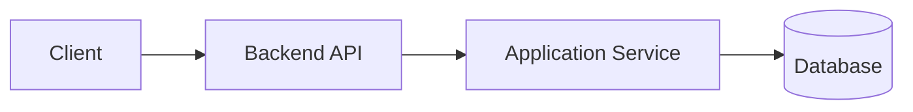
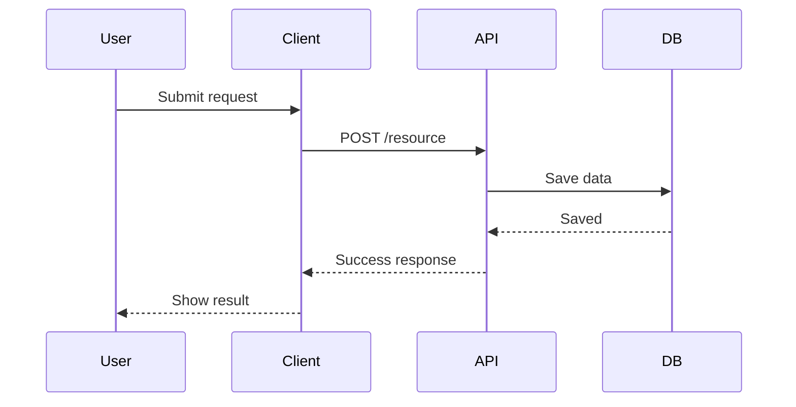
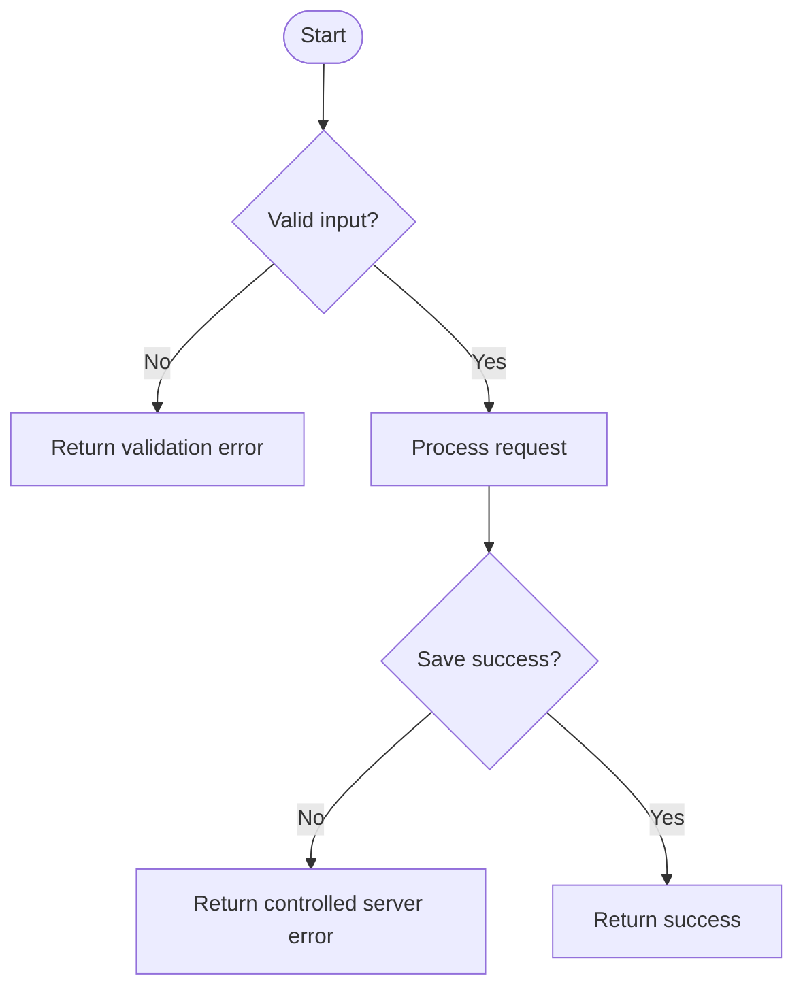
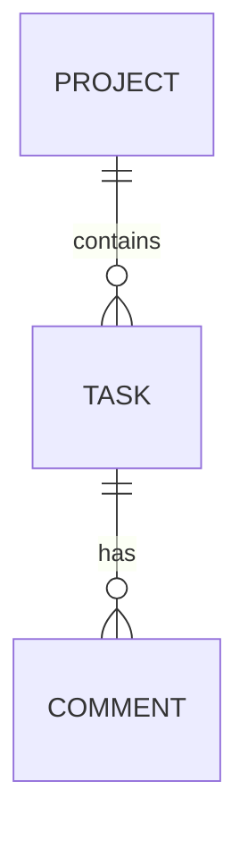
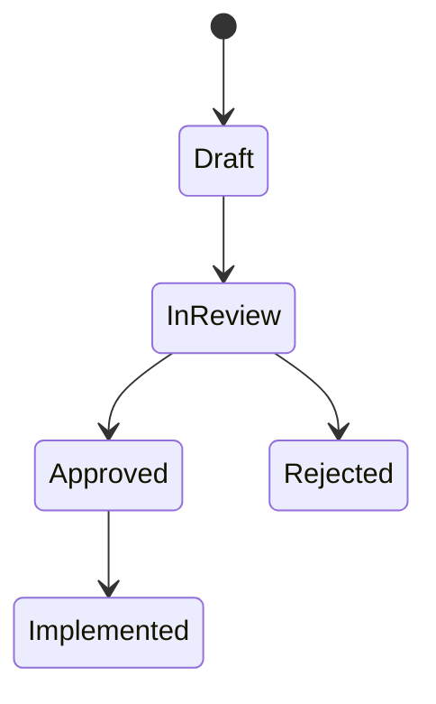
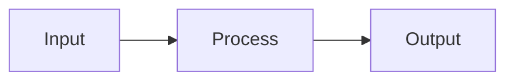
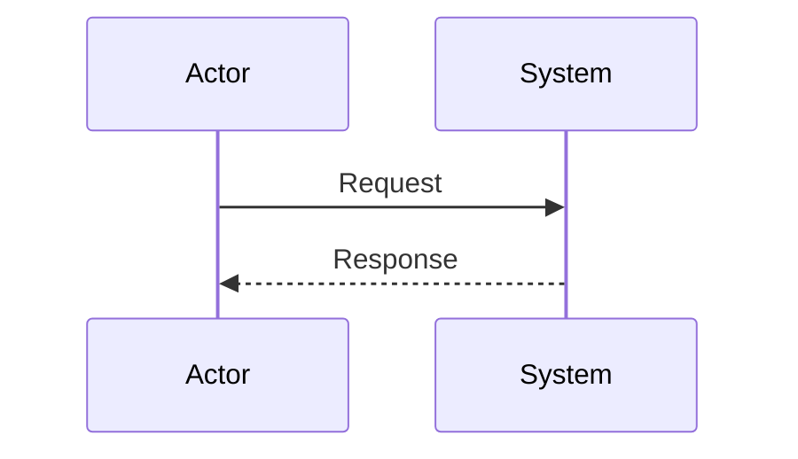
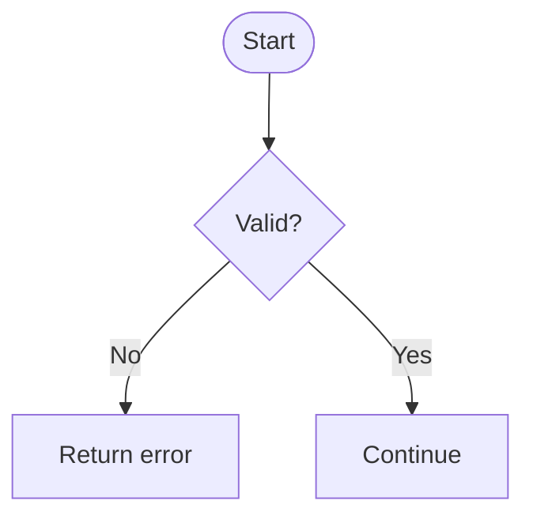

# 설계 문서 작성 규칙

이 문서는 새 기능이나 큰 변경을 구현하기 전에 작성하는 설계 문서의 구조, 문체, 검토 기준을 정의합니다.  
설계 문서는 코드 작성 전에 범위, 구조, 결정 근거, 위험 요소, 검증 방법을 합의하기 위한 문서입니다.

## 워크플로우

```text
Design
  ↓
User Review
  ↓
Implementation
  ↓
Code Review
  ↓
PR
```

규칙은 다음과 같습니다.

| 규칙 | 설명 |
|---|---|
| 설계 우선 | 새 기능이나 큰 변경은 구현 전에 설계 문서를 작성합니다. |
| 합의 후 구현 | 사용자가 설계를 검토하고 승인한 뒤 구현합니다. |
| 설계 변경 우선 | 구현 중 설계가 바뀌면 코드를 수정하기 전에 설계 문서를 먼저 갱신합니다. |
| 문맥 보존 | 미래의 개발자와 에이전트가 판단 근거를 재사용할 수 있도록 레포지토리 안에 문서를 둡니다. |

## 위치

설계 문서는 아래 경로에 작성합니다.

```text
docs/design/
```

파일명은 다음 형식을 권장합니다.

```text
docs/design/<feature-or-change-name>.md
```

예시는 다음과 같습니다.

```text
docs/design/file-upload-version-extraction.md
docs/design/project-task-approval-flow.md
docs/design/api-authentication-redesign.md
```

## 필수 섹션

모든 설계 문서는 아래 섹션을 포함합니다.  
해당사항이 없는 경우에도 헤더는 유지하고 `_해당없음_`이라고 작성합니다.

## 1. Context

이 변경이 왜 필요한지 설명합니다.

다음 내용을 3~7문장으로 작성합니다.

| 항목 | 설명 |
|---|---|
| 현재 문제 | 지금 무엇이 부족하거나 불편한지 |
| 필요 시점 | 왜 지금 이 변경이 필요한지 |
| 대상 | 어떤 사용자, 시스템, 업무 요구를 다루는지 |
| 미수행 영향 | 이 변경을 하지 않으면 어떤 문제가 남는지 |

“X 기능 추가가 필요합니다.”처럼 한 문장으로 끝내지 않습니다.

## 2. Goals & Non-Goals

이번 작업에서 다룰 것과 다루지 않을 것을 구분합니다.

### Goals

이번 작업이 달성해야 하는 결과를 작성합니다.

| Goal | Description |
|---|---|
| TODO | TODO |

### Non-Goals

의도적으로 제외하는 범위를 작성합니다.

| Non-Goal | Reason |
|---|---|
| TODO | TODO |

Non-Goals는 스코프 크리프를 막기 위한 필수 항목입니다.

## 3. Architecture

정적인 구조를 설명합니다.

다음 내용을 포함합니다.

| 항목 | 설명 |
|---|---|
| 주요 컴포넌트 | 어떤 모듈이나 계층이 참여하는지 |
| 책임 | 각 컴포넌트가 무엇을 담당하는지 |
| 경계 | 어디까지가 해당 컴포넌트의 책임인지 |
| 의존성 | 어떤 외부 시스템이나 내부 모듈에 의존하는지 |
| 데이터 소유 | 필요 시 어떤 컴포넌트가 데이터를 소유하는지 |

Mermaid 도식을 우선 사용합니다.



텍스트와 도식은 함께 작성합니다.  
구조를 글로만 설명하지 않습니다.

## 4. Sequence / Flow

동적인 처리 흐름을 설명합니다.

정상 흐름과 주요 에러 흐름을 모두 포함합니다.

### 정상 흐름



| Step | Description |
|---:|---|
| 1 | TODO |
| 2 | TODO |

### 주요 에러 흐름



| Case | Handling |
|---|---|
| TODO | TODO |

정상 흐름만 작성하면 구현 단계에서 예외 처리가 즉흥적으로 만들어질 가능성이 높습니다.

## 5. Decisions & Rationale

중요한 결정은 대안과 근거까지 함께 기록합니다.

각 결정은 다음 형식을 사용합니다.

```markdown
### Decision 1: <Short title>

| Item | Description |
|---|---|
| Decision |  |
| Alternatives |  |
| Rationale |  |
| Impact |  |
```

결정만 있고 대안이 없으면 설계가 충분히 검토되지 않은 것으로 봅니다.

## 6. Edge Cases & Error Handling

예상되는 경계 조건과 실패 시나리오를 작성합니다.

| Case | Expected Handling | User/System Impact |
|---|---|---|
| Invalid input | Return validation error | User can correct input |
| External API timeout | Retry once or return controlled error | Request fails safely |
| Duplicate request | Use idempotency or reject duplicate | Prevents double processing |

다음과 같은 표현은 피합니다.

| 피해야 할 표현 | 이유 |
|---|---|
| 적절히 처리합니다 | 실제 동작이 불명확합니다 |
| 필요시 재시도합니다 | 재시도 조건과 횟수가 없습니다 |
| 로그를 남기고 계속합니다 | 실패 영향이 설명되지 않았습니다 |
| 검증을 수행합니다 | 무엇을 어떻게 검증하는지 알 수 없습니다 |

## 선택 섹션

해당하는 변경에만 추가합니다.  
한번 추가한 섹션은 비워두지 않고, 해당사항이 없으면 `_해당없음_`이라고 작성합니다.

## Data Model

테이블, 스키마, 엔티티, DTO, JSON 구조가 추가되거나 변경될 때 사용합니다.

필드 표와 Mermaid 관계 도식을 함께 작성합니다.

| Field | Type | Required | Default | Description |
|---|---|---:|---|---|
| id | UUID | Yes | generated | Primary identifier |
| status | string | Yes | draft | Current state |



## API / Interface

API, CLI, webhook, event, 외부 interface가 추가되거나 변경될 때 사용합니다.

포함할 내용은 다음과 같습니다.

| 항목 | 설명 |
|---|---|
| endpoint / command | 호출 경로 또는 명령 |
| request format | 요청 형식 |
| response format | 응답 형식 |
| error responses | 에러 응답 |
| compatibility notes | 호환성 주의사항 |

예시는 다음과 같습니다.

| Method | Path | Description |
|---|---|---|
| POST | `/api/tasks` | Create task |
| GET | `/api/tasks/{id}` | Read task detail |

## Workflow

사용자 절차나 시스템 절차가 중요한 경우 사용합니다.

권장 도식은 다음과 같습니다.

| 목적 | Mermaid Type |
|---|---|
| 절차 흐름 | `sequenceDiagram` |
| 상태 전이 | `stateDiagram-v2` |
| 조건 분기 | `flowchart` |



## Performance

응답 시간, 처리량, 메모리, 배치 크기, 파일 크기 등 성능 기준이 있을 때 사용합니다.

| Item | Target |
|---|---|
| API response time | p95 under TODO ms |
| Batch size | up to TODO records |
| File size | up to TODO MB |

## Security

다음 항목이 관련될 때 사용합니다.

| 항목 | 예시 |
|---|---|
| authentication | 로그인, 토큰, 세션 |
| authorization | 권한, role, scope |
| secrets | API key, private key |
| external input | 사용자 입력, 파일 업로드 |
| personal information | 개인정보, 식별자 |
| network boundary | 내부망, 외부망, third-party API |

신뢰 경계와 악용 가능성을 함께 설명합니다.

## Observability

로그, 메트릭, 트레이싱, 감사 이력, 운영 가시성이 필요할 때 사용합니다.

| 항목 | 설명 |
|---|---|
| logs | 어떤 이벤트를 로그로 남기는지 |
| metrics | 어떤 수치를 수집하는지 |
| audit records | 어떤 변경 이력을 남기는지 |
| failure signals | 어떤 실패를 감지할 수 있는지 |
| alert conditions | 어떤 조건에서 알림이 필요한지 |

## Migration / Rollback

DB schema, 데이터 형식, 인프라, 동작 방식 변경에 배포 통제가 필요할 때 사용합니다.

| 항목 | 설명 |
|---|---|
| migration steps | 변경 적용 순서 |
| backward compatibility | 이전 버전과의 호환성 |
| rollback method | 되돌리는 방법 |
| data recovery concerns | 데이터 복구 시 고려사항 |

## Open Questions

아직 결정되지 않은 항목을 작성합니다.

| Question | Owner | Blocking? | Notes |
|---|---|---:|---|
| TODO | TODO | Yes/No | TODO |

Open Questions가 문서의 절반 이상을 차지하면 설계 문서가 아니라 브레인스토밍 메모에 가깝습니다.  
구현을 막는 질문은 명확히 표시합니다.

## Out of Scope

이번 작업과 관련 있어 보이지만 명시적으로 제외하는 항목을 작성합니다.

| Item | Reason |
|---|---|
| TODO | TODO |

## 문체 규칙

설계 문서는 전문적이되 과하게 딱딱하지 않은 설명체로 작성합니다.

| 원칙 | 설명 |
|---|---|
| 기본 어투 | 한국어 문서는 `~합니다`, `~입니다`, `~할 수 있습니다`를 사용합니다. |
| 결론 우선 | 독자가 빠르게 판단할 수 있도록 결론을 먼저 제시합니다. |
| 근거 포함 | 판단 기준과 근거를 함께 작성합니다. |
| 표 우선 | 단순 나열보다 표를 우선 사용합니다. |
| 불릿 제한 | 불릿은 필요한 경우에만 사용하고, 항목이 많으면 표로 전환합니다. |
| 과장 금지 | 마케팅성 표현, 감탄형 표현, 모호한 수식어를 피합니다. |
| 합의 중심 | 구현 지시서가 아니라 설계 합의 문서처럼 작성합니다. |

피해야 할 표현과 개선 예시는 다음과 같습니다.

| Weak | Better |
|---|---|
| 에러를 적절히 처리합니다. | 파일 크기가 50MB를 초과하면 업로드를 중단하고 413 응답을 반환합니다. |
| 향후 확장 가능한 구조입니다. | 저장소 인터페이스를 분리해 Local Storage와 S3 구현체를 교체할 수 있습니다. |
| 사용자 편의성을 높입니다. | 승인 상태를 목록에서 바로 확인할 수 있어 상세 화면 진입 없이 검토 대상을 구분할 수 있습니다. |
| 필요시 재시도합니다. | 외부 API timeout이 발생하면 1회 재시도하고, 재실패 시 504 응답을 반환합니다. |

## 도식 규칙

Mermaid를 우선 사용합니다.

| 목적 | Mermaid Type |
|---|---|
| 컴포넌트 구조 | `graph` |
| 요청/응답 흐름 | `sequenceDiagram` |
| 상태 변경 | `stateDiagram-v2` |
| 데이터 관계 | `erDiagram` |
| 조건 분기 | `flowchart` |

PNG/JPG 도식은 Mermaid로 표현하기 어려운 경우에만 사용합니다.

## 날짜 표기 규칙

상대 날짜를 피하고 절대 날짜를 사용합니다.

| 피할 표현 | 권장 표현 |
|---|---|
| 다음 주 | 2026-W21 |
| 곧 | 2026-05-19 이전 |
| 나중에 | Phase 2 |
| 내일 | 2026-05-15 |

## 리뷰 체크리스트

리뷰를 요청하기 전에 다음 항목을 확인합니다.

| Check | Done |
|---|---|
| Context가 변경 필요성을 설명합니다 |  |
| Goals와 Non-Goals가 모두 있습니다 |  |
| Architecture에 텍스트와 도식이 있습니다 |  |
| Sequence / Flow에 정상 흐름과 에러 흐름이 있습니다 |  |
| Decisions에 대안과 근거가 있습니다 |  |
| Edge Cases가 구체적입니다 |  |
| Data Model 변경이 있다면 표와 도식이 있습니다 |  |
| API / Interface 변경이 있다면 요청·응답·에러가 있습니다 |  |
| Security가 필요한 경우 신뢰 경계를 설명합니다 |  |
| Open Questions가 작고 구체적입니다 |  |
| 검증 방법이 명확합니다 |  |

## 복사 템플릿

```markdown
# <Feature Name> Design Document

> Status: Draft / In Review / Approved / Superseded  
> Created: 2026-MM-DD  
> Owner: TODO

## Context

TODO

## Goals & Non-Goals

### Goals

| Goal | Description |
|---|---|
| TODO | TODO |

### Non-Goals

| Non-Goal | Reason |
|---|---|
| TODO | TODO |

## Architecture



TODO

## Sequence / Flow

### Normal Flow



| Step | Description |
|---:|---|
| 1 | TODO |
| 2 | TODO |

### Error Flow



| Case | Handling |
|---|---|
| TODO | TODO |

## Decisions & Rationale

### Decision 1: TODO

| Item | Description |
|---|---|
| Decision | TODO |
| Alternatives | TODO |
| Rationale | TODO |
| Impact | TODO |

## Edge Cases & Error Handling

| Case | Handling | Impact |
|---|---|---|
| TODO | TODO | TODO |

---

## Data Model

_해당없음_

## API / Interface

_해당없음_

## Workflow

_해당없음_

## Performance

_해당없음_

## Security

_해당없음_

## Observability

_해당없음_

## Migration / Rollback

_해당없음_

## Open Questions

_해당없음_

## Out of Scope

_해당없음_
```
