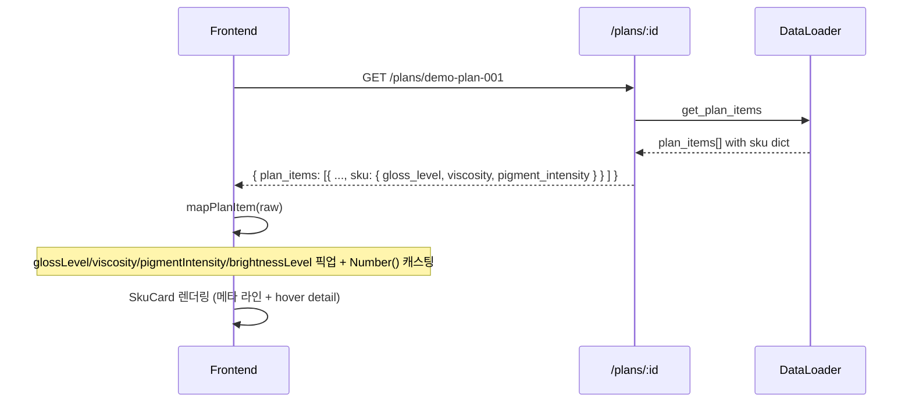
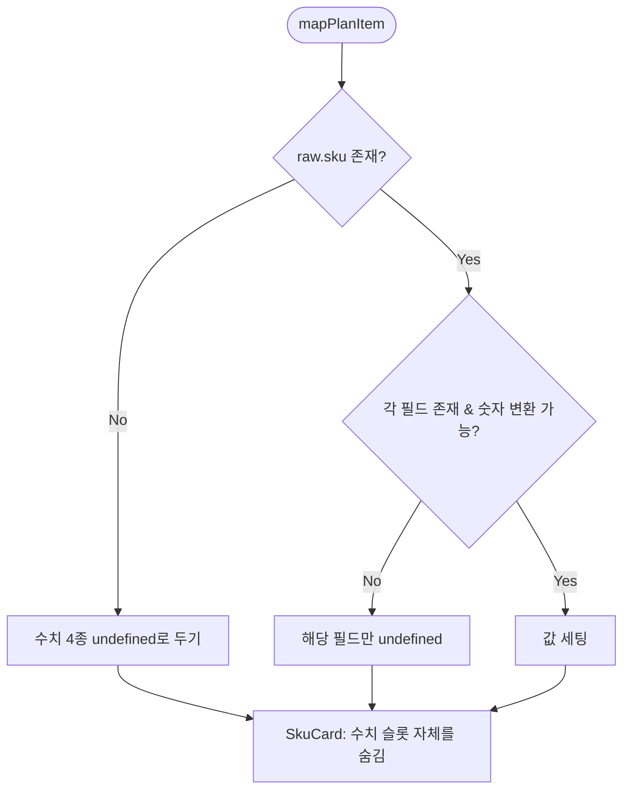
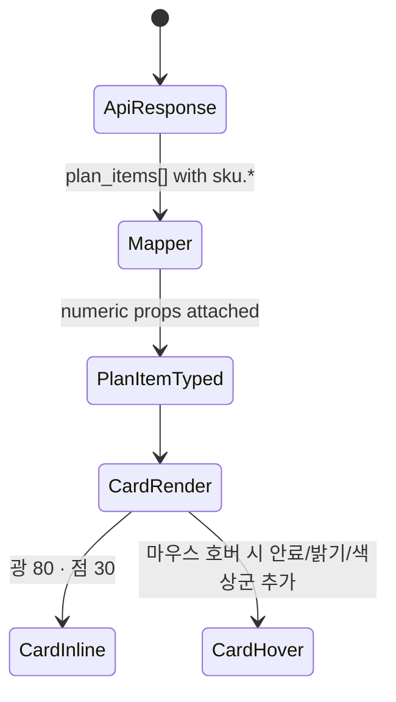

# SkuCard SKU 속성 표시 Design Document

> Status: Draft
> Created: 2026-05-20
> Owner: frontend

## Context

`sku_master.csv`는 `pigment_intensity`, `gloss_level`, `viscosity` 같은 수치 속성을 보유하고 `DataLoader`가 이를 `item["sku"]` dict에 통째로 실어 `/plans/{plan_id}` 응답에 내려주지만, 프론트의 `PlanItem` 타입(`frontend/src/api/types.ts:336-339`)과 `mapPlanItem`(`frontend/src/api/mappers.ts:242-261`)은 `category`, `colorFamily`, `hexCode`만 픽업하고 나머지는 버립니다. 결과적으로 사용자는 결정 화면에서 두 SKU 사이의 광택·점도·안료 차이를 카드만 보고는 판단할 수 없고, 색상 점과 카테고리 라벨만으로 추론해야 합니다. 본 변경은 `CostPredictor`가 계산 입력으로 쓰는 속성 중 사용자에게 의미 있는 것들을 카드에 노출해, 추천안과 현재안을 사람이 직접 비교할 수 있도록 만드는 것이 목표입니다. 백엔드 API는 이미 데이터를 내려보내고 있으므로 변경 범위는 프론트엔드에 한정됩니다.

## Goals & Non-Goals

### Goals

| Goal | Description |
|---|---|
| 의사결정 신호 노출 | 광택·점도·안료(밝기) 수치를 결정 화면 카드에 표시해 정성/정량 판단을 함께 가능하게 한다 |
| 일관 표시 | 추천안·현재안·드래그 오버레이 세 위치에서 동일한 표시 형식 유지 |
| 카드 밀도 보존 | 한 줄짜리 카드 레이아웃을 깨지 않고 정보를 얹는다 |
| Hover/펼침으로 상세 | 핵심 1~2개만 카드에 상시 표시하고 나머지는 hover/펼침 영역에 둔다 |

### Non-Goals

| Non-Goal | Reason |
|---|---|
| 백엔드 응답 스키마 확장 | `/plans/{plan_id}`가 이미 nested `sku` dict로 전체 컬럼을 내려보내고 있음 |
| `schemas/plan.py` Pydantic 강제 | 현재 라우터가 `-> dict`로 raw 반환하는 contract drift는 별건 PR로 처리 |
| 수치 편집 기능 | 표시 전용. 운영자가 카드에서 수치를 바꿀 수 있게 하지 않음 |
| Dashboard/Transition table 변경 | 본 변경은 SKU 카드 한정 |
| 신규 카테고리/색상군 추가 | 데이터 모델 확장 아님 |

## Architecture

```mermaid
graph LR
  CSV[sku_master.csv] --> Loader[DataLoader.get_plan_items]
  Loader -->|item.sku raw dict| Plans[GET /plans/:id 응답<br/>plan_items[].sku.*]
  Plans --> Mapper[mapPlanItem<br/>api/mappers.ts]
  Mapper -->|PlanItem 타입 확장| Card[SkuCard.tsx]
  Card -->|상시 표시| Inline[색상 점 + 이름 + 카테고리 + 메타 라인]
  Card -->|hover/펼침| Detail[광택/점도/안료 수치 + 밝기 derived]
```

| 컴포넌트 | 책임 |
|---|---|
| `DataLoader` | sku_master.csv를 dict로 로드. 이미 충족. 변경 없음. |
| `routes_plans.py` | raw dict 응답. 변경 없음. |
| `frontend/src/api/types.ts` | `PlanItem`/`PlanItemRaw`에 옵션 수치 필드 추가 |
| `frontend/src/api/mappers.ts` | `sku?.gloss_level` 등을 `Number()`로 안전 캐스팅해 PlanItem에 매핑. 밝기는 `1 - pigment_intensity`로 derive. |
| `frontend/src/components/SkuCard.tsx` | 카드에 메타 라인 추가 + hover/펼침 상세 슬롯 |

## Sequence / Flow

### 정상 흐름



| Step | Description |
|---:|---|
| 1 | DecisionPage 진입 시 `/plans/:id` 호출 |
| 2 | mapper가 nested sku에서 수치 4종 추출, Number 변환 |
| 3 | SkuCard가 카드 본문에 핵심 1~2개, hover 또는 펼침에 4종 모두 표시 |

### 주요 에러 흐름



| Case | Handling |
|---|---|
| `raw.sku`가 없는 flat 응답 | 수치 4종 undefined. 카드는 기존 모양으로 fallback. |
| 수치 필드가 문자열(`"0.80"`) | `Number()`로 캐스팅. `Number.isFinite` 검사 통과만 사용. |
| 수치 필드가 `""` 또는 누락 | `undefined`로 두고 표시 슬롯에서 해당 항목 생략. |
| 모든 수치가 undefined인 SKU | 카드는 기존 모양과 동일하게 렌더 (회귀 없음) |

## Decisions & Rationale

### Decision 1: 표시할 속성과 표기 형식

| Item | Description |
|---|---|
| Decision | 광택, 점도, 안료(또는 밝기) 세 가지를 0~100 정수 레벨로 표기. 단위 없이 카드 메타 라인에 `광 80 · 점 30 · 안 10` 같은 약식 표기. |
| Alternatives | (a) 0~1 소수 표기, (b) bar/sparkline 시각화, (c) 색상-only 추상화 유지 |
| Rationale | 백엔드 헬퍼(`_gloss_level`, `_viscosity_level`)가 이미 0~100 레벨을 사용하므로 동일 척도. 소수는 한 줄 폭을 잡아먹고, bar는 한 줄 카드에 시각 잡음. 약식 한글 라벨이 카드 폭에 맞다. |
| Impact | 사용자가 백엔드 계산 입력값과 동일한 척도로 SKU를 비교 가능. |

### Decision 2: 밝기 derive 위치

| Item | Description |
|---|---|
| Decision | 밝기는 `(1 - pigment_intensity) * 100`을 mapper에서 파생. 백엔드는 손대지 않음. |
| Alternatives | (a) 백엔드 응답에 `brightness_level` 필드를 derive해서 내려보내기, (b) SkuCard에서 매번 계산 |
| Rationale | 백엔드 cost_predictor가 동일 공식을 사용 중(`cost_predictor.py:70-73`). 백엔드를 손대면 schema 확장과 contract drift 정리까지 끌고 와야 한다. mapper 한 곳에서 derive하면 SkuCard는 단순 표시에 집중. |
| Impact | 만약 향후 brightness 계산식이 바뀌면 두 곳(백엔드 cost predictor + 프론트 mapper)을 같이 갱신해야 한다. Open Questions에 명시. |

### Decision 3: 상시 표시 vs hover/펼침

| Item | Description |
|---|---|
| Decision | 광택·점도 두 항목만 카드 본문 메타 라인에 상시 표시. 안료/밝기와 색상군(영문)은 hover tooltip에 추가. 펼침은 도입하지 않음. |
| Alternatives | (a) 4종 모두 상시 표시, (b) 모두 hover로 숨김, (c) 카드 아래 펼침 영역 추가 |
| Rationale | 사용자가 의사결정 시 가장 자주 비교하는 두 축은 광택·점도(세척·교반 부담의 직접 신호). 안료/밝기는 색상 점에서 시각적으로 인지되므로 보조 정보. 펼침은 dnd-kit 드래그 영역과 충돌 위험. |
| Impact | 카드 한 줄에 메타 라인 1줄 추가(약 12~15자) — 기존 레이아웃의 padding 안에 들어감. |

### Decision 4: 결측 처리

| Item | Description |
|---|---|
| Decision | 어떤 수치든 결측이면 해당 토큰만 메타 라인에서 제거. 카드 자체는 항상 렌더. |
| Alternatives | (a) 결측 시 `—`로 표시, (b) 카드 전체 fallback 모드 |
| Rationale | 데모 데이터는 결측이 없지만, 향후 외부 SKU 추가 시 부분 결측 가능. `—` 토큰은 시각 잡음. |
| Impact | 결측 SKU에서도 카드 모양이 깨지지 않음. |

## Edge Cases & Error Handling

| Case | Handling | Impact |
|---|---|---|
| `raw.sku` 없는 flat 응답(legacy contract) | 수치 4종 undefined. 메타 라인 자체를 숨김. | 카드는 기존 모양 유지 |
| 백엔드가 0~100 스케일로 보내는 경우 | mapper에서 `value > 1 ? value : value * 100`로 정규화 | 향후 백엔드 단위 변경 대응 |
| metal/special 카테고리(광택 0.95+) | 정상 처리. 약식 표기 `광 95`. | 시각적으로 메탈 카드의 광택이 두드러짐 |
| 같은 라인 안 두 카드의 수치가 동일 | 동일 텍스트가 두 번 나옴. 별도 강조 없음. | 의도된 동작 |
| dnd-kit 드래그 중 카드(`DragOverlay`) | 메타 라인 그대로 유지 | 사용자가 드래그 중에도 정보 확인 |

## Workflow



## Open Questions

| Question | Owner | Blocking? | Notes |
|---|---|---:|---|
| 밝기 derive 공식이 양쪽(백엔드 cost_predictor / 프론트 mapper)에 중복되는 것을 OK 하고 갈지, 백엔드 응답에 derived 필드로 단일화할지 | backend/frontend | No | 본 PR에서는 mapper derive로 진행. 차기 PR에서 응답 스키마 정리 시 일원화. |
| 메타 라인 약식 표기(`광 80`)가 폭에 정말 들어가는지 다국어 폭 검증 | frontend | No | 영어 fallback 시 `Gl 80 · Vi 30`처럼 2글자 약어 사용. CSS `text-overflow: ellipsis`로 안전망. |
| Pydantic `PlanItem` 응답 모델 강제 시점 | backend | No | 응답 모델을 강제하면 현재 raw dict 누출이 막혀 sku nested가 사라진다. 그 시점에 본 design의 mapper도 백엔드 derived 필드 의존으로 전환. |

## Out of Scope

| Item | Reason |
|---|---|
| `schemas/plan.py`에 응답 모델 강제 | contract drift 정리는 별건 |
| `transition_history.csv`에 gloss/viscosity 컬럼 추가 | XGBoost 학습기가 살아날 때 같이 처리 |
| Dashboard KPI 차트에 광택 트렌드 노출 | 본 변경은 결정 화면 한정 |
| SkuCard에서 수치 편집 | what-if 시뮬레이션은 별도 기능 |

---

## Data Model

### PlanItem 타입 확장(frontend)

| Field | Type | Required | Default | Description |
|---|---|---:|---|---|
| `glossLevel` | `number \| undefined` | No | undefined | 0~100 정수 레벨. mapper에서 `Number(sku.gloss_level)`를 ×100/그대로 정규화 후 round |
| `viscosityLevel` | `number \| undefined` | No | undefined | 동일 패턴 |
| `pigmentIntensity` | `number \| undefined` | No | undefined | 0~100 정수 레벨 |
| `brightnessLevel` | `number \| undefined` | No | undefined | `100 - pigmentIntensity`로 derive |

백엔드 스키마 변경 없음.

## API / Interface

_해당없음_ (백엔드 응답은 이미 `plan_items[].sku.*`로 모든 컬럼 노출 중)

## Performance

_해당없음_ (카드 렌더 비용 변화 미미)

## Security

_해당없음_

## Observability

_해당없음_

## Migration / Rollback

본 변경은 프론트엔드 표시 전용으로, 데이터 마이그레이션이 없습니다. 롤백은 해당 커밋 revert로 충분합니다.
