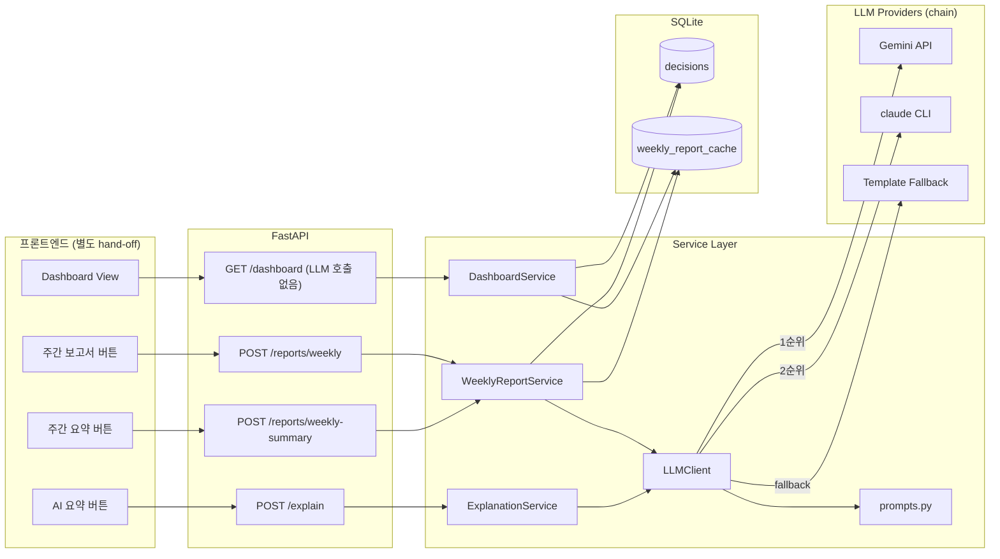
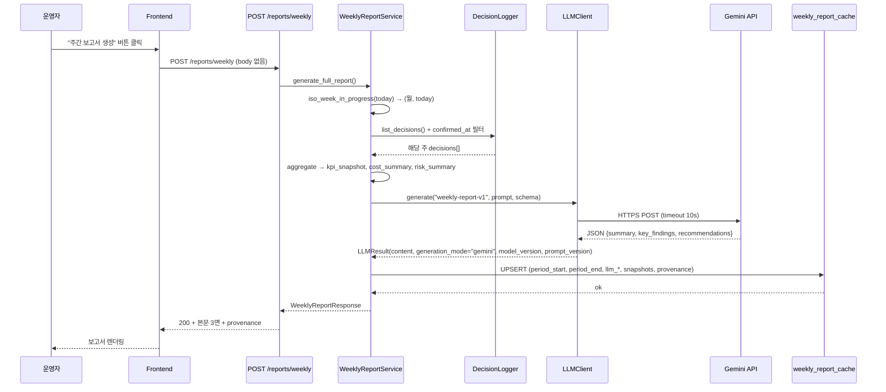
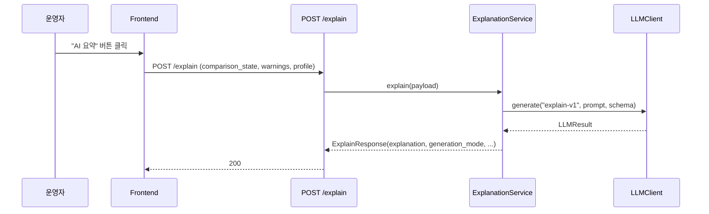
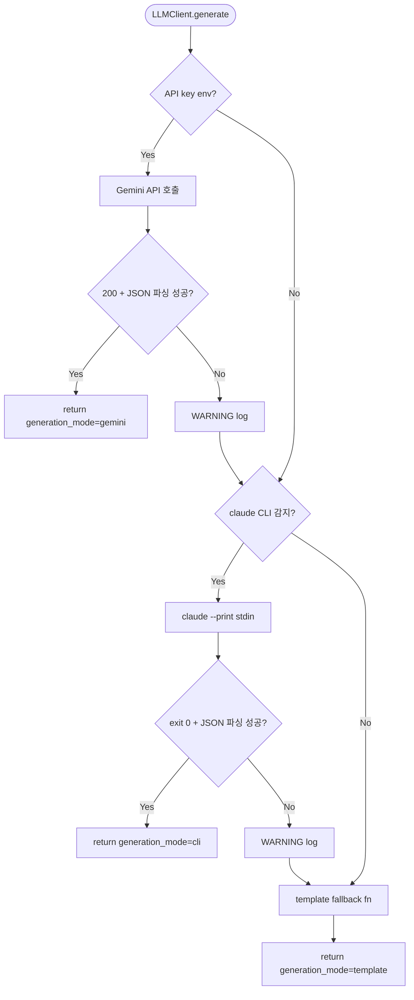
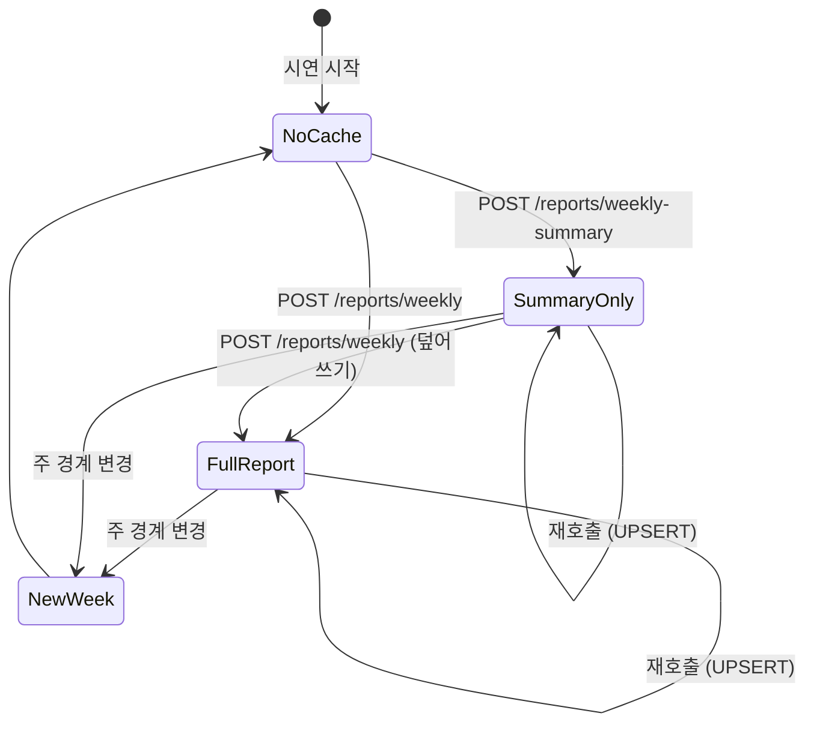

# LLM 분기 + 주간보고서 백엔드 통합 Design Document

> Status: Draft
> Created: 2026-05-21
> Owner: backend

## Context

SmartFactoryV2 MVP는 2026-05-21 시점에 P0 데모 흐름(페이지 진입 → 최적화 → DnD → 비교 → 확정 → 대시보드)이 완성되어 있고 OR-tools 라우팅·XGBoost 비용 예측·SQLite 의사결정 로그·기본 대시보드까지 동작합니다. 그러나 본선 발표에서 "AI가 직접 설명·보고서를 만든다"는 데모 서사를 뒷받침해야 하는 세 호출지점이 모두 template-only로 남아 있어 시연 완성도가 떨어집니다. 구체적으로 `POST /explain`은 `ExplanationService`가 100% 템플릿이고, `GET /dashboard`가 반환하는 `weekly_summary`는 하드코딩 문자열이며, DB_state v1.3 §5.7에 정의된 `weekly_report_cache` 테이블은 INSERT/SELECT 코드가 0건이어서 본문이 채워지지 않습니다. 본 설계는 세 호출지점에 공통 LLM client를 도입해 Gemini API → 로컬 `claude` CLI → template 순으로 graceful degradation을 보장하고, 주간보고서 백엔드를 본격화해 cache 적재까지 마무리합니다. 본 변경을 수행하지 않으면 발표 중 "AI 설명·요약·보고서" 자리가 모두 똑같은 패턴 문구로 채워져 데모의 핵심 차별화가 약해집니다.

## Goals & Non-Goals

### Goals

| Goal | Description |
|---|---|
| 단일 LLM client 인터페이스 도입 | `backend/app/services/llm_client.py`가 provider chain·timeout·output 파싱을 책임집니다. caller는 `generate(prompt_id, prompt, output_schema)` 하나만 사용합니다. |
| 3개 호출지점에 LLM 분기 도입 | `/explain`, `POST /reports/weekly-summary`, `POST /reports/weekly` 모두 LLM 시도 후 실패 시 template fallback. 응답에 `generation_mode`/`model_version`/`prompt_version` 동반 노출. |
| 주간보고서 실집계 + 캐시 적재 | `weekly_report_cache`에 KPI/cost/risk snapshot + LLM 본문 저장. `/dashboard`는 LLM 호출 없이 cache 조회만 수행. |
| 자동 호출 0건 정책 정립 | 모든 LLM 호출은 명시적 endpoint 호출에서만 발생. `/dashboard`·`/optimize`·`/predict`에는 LLM 호출 코드를 두지 않습니다. |
| API key 안전 취급 | `SMARTFACTORY_LLM_API_KEY` env로만 관리. plan/design doc/코드/PR/commit 어디에도 평문 기록 금지. |

### Non-Goals

| Non-Goal | Reason |
|---|---|
| `/optimize`(AI 추천안)에 LLM 도입 | XGBoost + OR-tools가 조합 최적화에 적합하며 LLM은 설명 역할로 분리되어 있습니다. 추천안 생성 자체를 LLM에 위임하면 비교 패널 정합이 깨지고 시연 안정성이 낮아집니다. |
| 자동 LLM 호출 (페이지 진입·드롭·페이지 새로고침 등) | `docs/roadmap.md` §13 명시 금지. 본 설계는 명시 호출만 채택합니다. |
| MES/ERP 연동, 다중 라인, 인증/권한 | `docs/roadmap.md` §3 P2. |
| `weekly_report_cache` schema 변경 | 현재 컬럼 구성으로 충분합니다. CRUD만 신설합니다. |
| 학습 모델 파일 `.gitignore` 재정리, `@app.on_event` → `lifespan` 마이그레이션 | 별도 chore PR (`mvp-completion-plan.md` cleanup #10·#11). |
| 프론트엔드 버튼·UI 컴포넌트 구현 | 프론트 영역. 본 설계는 backend endpoint·응답 schema 제공까지. |
| Streaming 응답 | MVP 범위 초과. 본 설계는 동기 호출 + 캐시 모델. |

## Architecture



| 컴포넌트 | 책임 | 경계 |
|---|---|---|
| `LLMClient` (`services/llm_client.py`) | provider chain·timeout·JSON 파싱·fallback 라우팅 | prompt 문안 내용·domain aggregation 책임 없음 |
| `prompts.py` | `prompt_id` → (`template_str`, `prompt_version`, `template_fallback_fn`) 매핑 | 호출 로직 없음, 순수 데이터·함수 등록 |
| `WeeklyReportService` | 주간 기간 계산, decisions aggregation, LLM client 호출, cache UPSERT | LLM 호출 로직 자체는 LLMClient에 위임 |
| `weekly_report_repo` (`db/weekly_report_repo.py`) | `weekly_report_cache` SELECT/UPSERT helper | 비즈니스 로직 없음 |
| `ExplanationService` | 비교 결과·warning을 LLM payload로 가공 → LLMClient 호출 → fallback content 반환 | cache 없음. 호출당 실시간 생성 |
| `DashboardService` | decisions 집계 + cache 조회로 응답 구성 | **LLM 호출 0회** |

## Sequence / Flow

### 정상 흐름 — `POST /reports/weekly`



| Step | Description |
|---:|---|
| 1 | 사용자가 명시 버튼 클릭. 자동 호출 없음. |
| 2 | 서버가 오늘 날짜로 in-progress ISO 주를 계산해 (period_start, period_end) 결정. |
| 3 | `DecisionLogger.list_decisions()` 결과를 `confirmed_at` 필터로 좁혀 입력 구성. |
| 4 | aggregation 결과(JSON snapshot 3종)와 prompt를 LLMClient에 전달. |
| 5 | LLMClient는 provider chain 1순위(Gemini)부터 시도. 성공 시 JSON 응답을 schema 검증. |
| 6 | cache UPSERT. 동일 `(period_start, period_end)` row가 있으면 update, 없으면 insert. |
| 7 | 응답에 본문 + `generation_mode`/`model_version`/`prompt_version`/`generated_at` 동봉. |

### 정상 흐름 — `POST /reports/weekly-summary`

`POST /reports/weekly`와 동일한 기간 계산·aggregation을 수행하되, LLM 호출은 `prompt_id="weekly-summary-v1"`로 짧은 한 줄 요약만 생성합니다. cache UPSERT는 동일 row의 `llm_summary` 컬럼만 업데이트합니다(다른 컬럼은 보존).

### 정상 흐름 — `POST /explain`



cache 없음. 호출당 실시간 생성.

### 정상 흐름 — `GET /dashboard`

`DashboardService`는 기존 decisions 집계에 더해 `weekly_report_repo.get_for_period(today)`로 cache row 1건을 조회합니다. cache가 있으면 `weekly_summary` (string) + `weekly_report` (object)을 응답에 채우고, 없으면 둘 다 `null`을 반환합니다. **LLM 호출 코드는 본 경로에 존재하지 않습니다.**

### 주요 에러 흐름



| Case | Handling |
|---|---|
| `SMARTFACTORY_LLM_API_KEY` 미설정 | Gemini 단계 skip, CLI 시도. WARNING 로그 없음(정상 경로). |
| Gemini 401 / 403 | WARNING 로그 + CLI 단계로 진행. caller에 예외 노출 없음. |
| Gemini 429 / 5xx | WARNING 로그 + CLI 단계. 재시도 없음(시연 latency 보호). |
| Gemini timeout (10초 초과) | `httpx.TimeoutException` 캐치 → WARNING 로그 + CLI 단계. |
| Gemini 응답 JSON 파싱 실패 | code fence 추출 1회 재시도 → 실패 시 WARNING + CLI 단계. |
| CLI 미감지 | template 단계로 직행. WARNING 로그 없음(정상 경로). |
| CLI exit non-zero / timeout 15초 | WARNING 로그 + template 단계. |
| CLI 응답 JSON 파싱 실패 | code fence 추출 1회 재시도 → 실패 시 WARNING + template. |
| template fallback fn 미등록 | 5xx 응답 + 명시적 ERROR 로그. caller가 prompt_id를 잘못 보낸 케이스. |
| 해당 주 decisions 0건 | aggregation snapshot은 빈 값으로 채움. LLM 호출 skip하고 바로 template fallback ("이번 주에는 확정된 결정이 없습니다…"). cache row는 생성. |
| `weekly_report_cache` UNIQUE 위반 | `INSERT … ON CONFLICT(period_start, period_end) DO UPDATE`로 UPSERT. 동시 호출 race condition은 SQLite 단일 writer 가정에서 발생 가능성 낮음. |

## Decisions & Rationale

### Decision 1: 호출 endpoint를 3개로 분리

| Item | Description |
|---|---|
| Decision | `POST /explain` (기존), `POST /reports/weekly-summary` (신규), `POST /reports/weekly` (신규) 세 개의 명시 endpoint. `/dashboard`는 cache 조회만. |
| Alternatives | (a) `POST /reports/{kind}` 단일 endpoint로 kind 구분, (b) `/dashboard` 응답에 LLM 호출을 임베드 (auto-generate) |
| Rationale | 사용자가 "호출 버튼이 따로 프론트에 있어야 한다"고 명시 정정. 자동 호출은 `roadmap §13` 금지. 단일 endpoint는 라우팅 수는 적어지지만 cache 정책·prompt_id·output schema가 분기되어 응답 모델이 union 타입이 되며 가독성이 떨어집니다. |
| Impact | 라우트 2개 신설. 프론트에는 3개 명시 버튼이 필요(별도 hand-off). 코드 경로는 단순하고 cache 정책이 endpoint별로 명확합니다. |

### Decision 2: LLM provider 우선순위 — Gemini API → claude CLI → template

| Item | Description |
|---|---|
| Decision | env var 보유 시 Gemini, 미보유 시 `claude` CLI, 둘 다 실패 시 template fallback. |
| Alternatives | (a) CLI 우선, (b) Gemini 전용 (CLI 경로 제거), (c) Anthropic API 직접 |
| Rationale | 사용자가 Gemini API key를 보유하고 있어 1순위로 지정. 시연 환경에 따라 키가 없을 수 있어 로컬 `claude` CLI를 2순위 fallback으로 두면 API 의존성 없이도 동작 가능. template은 항상 동작 보장. |
| Impact | provider별 응답 파싱 분기 2개. `generation_mode` 값을 통해 운영자가 어떤 경로로 생성됐는지 확인 가능. |

### Decision 3: 주간 기간을 in-progress 주(월요일~기준일)로 정의

| Item | Description |
|---|---|
| Decision | `iso_week_in_progress(reference_date)`가 reference_date를 포함한 ISO 주의 월요일부터 reference_date까지를 반환. 기본 reference_date는 서버의 오늘. |
| Alternatives | (a) 직전 완결 주(월~일), (b) 롤링 7일, (c) 전체 누적 |
| Rationale | 사용자가 "수요일이라면 그 주의 월·화·수 데이터를 묶어준다"고 명시. 시연 당일 데이터를 즉시 보고서에 반영할 수 있어 데모 즉시성이 높습니다. ISO 8601 주(월요일 시작)를 기준으로 잡아 운영 리듬과도 일치. |
| Impact | 월요일 호출 시 1일치만 집계되는 edge case 존재. 0건 시 template fallback으로 안전 처리. |

### Decision 4: cache 적재는 단일 row UPSERT

| Item | Description |
|---|---|
| Decision | `weekly_report_cache`의 unique key `(period_start, period_end)` 기준. weekly-summary 호출은 `llm_summary` 컬럼만, weekly 호출은 본문 3컬럼 모두 업데이트. 두 endpoint가 같은 row를 공유. |
| Alternatives | (a) 두 종류를 별도 row로 (`report_kind` 컬럼 추가), (b) 별도 테이블 분리 |
| Rationale | 두 결과는 같은 기간·같은 입력 데이터를 다른 prompt로 가공한 산출물입니다. 같은 row에 두면 `/dashboard` 응답에서 한 번의 SELECT로 두 면을 함께 노출할 수 있고, 스키마 변경 없이 기존 컬럼만 활용 가능합니다. |
| Impact | 호출 순서가 보존됩니다. 시연 중 weekly-summary 호출 후 weekly 호출 시 summary가 weekly의 prompt 결과로 덮어쓰입니다(이는 의도된 동작 — weekly가 더 풍부한 컨텍스트로 생성). |

### Decision 5: 자동 호출 0건 원칙

| Item | Description |
|---|---|
| Decision | `/dashboard`, `/optimize`, `/predict` 어디에도 LLM 호출을 두지 않음. 명시 endpoint 외에는 LLMClient를 import하지 않음. |
| Alternatives | (a) `/dashboard` 진입 시 cache 없으면 auto-generate, (b) decisions 저장 시 background 생성 |
| Rationale | `roadmap §13`. (a)는 첫 진입 시 1~3초 지연이 발생하고 발표 흐름을 깹니다. (b)는 background worker 구조 도입을 강제합니다. 본 MVP는 동기·명시·단순 흐름이 가장 안정적입니다. |
| Impact | 운영자가 명시적으로 보고서를 생성한 적이 없으면 `/dashboard.weekly_report = null`. 프론트는 null 처리 UI(예: "주간 보고서 버튼을 눌러 생성하세요") 필요. |

### Decision 6: Gemini SDK 채택 — `google-genai` 라이브러리 사용

| Item | Description |
|---|---|
| Decision | `google-genai` PyPI 패키지를 추가하여 Gemini API 호출에 사용합니다. |
| Alternatives | (a) 직접 `httpx`로 REST 호출, (b) `google-generativeai` (legacy 패키지) |
| Rationale | (a)는 의존성을 줄이지만 API 변경 추적·retry·streaming 등을 직접 관리해야 하며 시연 안정성에 부정적입니다. (b)는 2026년 기준 legacy로, 신규 라이브러리는 `google-genai`로 통합되었습니다. SDK 사용으로 인한 추가 의존성은 시연 환경에서 허용 가능합니다. |
| Impact | `pyproject.toml`에 `google-genai` 의존성 추가. 패키지 크기 ~2MB. |

### Decision 7: `generation_mode` enum 값 단순화

| Item | Description |
|---|---|
| Decision | 응답의 `generation_mode`는 `"gemini"` / `"cli"` / `"template"` 3가지만. 실패는 응답에 노출하지 않고 fallback 단계로 graceful degradation. |
| Alternatives | `"error"` 값 추가, fallback 사유를 응답에 동봉 |
| Rationale | 시연 화면에서 "AI 생성"인지 "템플릿"인지 단순 표기가 더 직관적입니다. 실패는 서버 로그(WARNING)와 metrics에 남고, 사용자 화면에는 항상 결과가 노출됩니다. |
| Impact | provider별 실패 추적은 로그 기반으로만 가능. 디버깅 시 `grep "WARNING.*llm_client"` 필요. |

## Edge Cases & Error Handling

| Case | Handling | Impact |
|---|---|---|
| API key 무효 / 만료 | Gemini 단계 401 → WARNING 로그 + CLI 단계 진행. 응답 200 유지. | 운영자는 `generation_mode == "cli"` 또는 `"template"`로 확인 가능. |
| Gemini rate limit (429) | WARNING 로그 + 즉시 CLI 단계. 재시도 없음. | 시연 중 latency 보호. 운영자가 잠시 후 재호출 가능. |
| Gemini timeout 10초 초과 | `httpx.TimeoutException` 캐치 → WARNING + CLI 단계. | latency 상한 보장. |
| Gemini 응답이 markdown code fence로 감싼 JSON | 1차 `json.loads` 실패 시 ` ```json ... ``` ` 추출 후 재시도. 그래도 실패면 WARNING + CLI. | 흔한 LLM 출력 형태 대응. |
| Gemini 응답이 schema 미준수 (필수 키 누락) | 필수 키 없으면 WARNING + CLI. 추가 키는 허용. | 안정성 보호. |
| CLI binary 없음 | `shutil.which("claude")` None → 단계 skip. WARNING 없음. | 정상 경로. |
| CLI exit non-zero | stderr 일부를 WARNING 로그 + template 단계. | 시연 흐름 유지. |
| CLI timeout 15초 초과 | `subprocess.TimeoutExpired` 캐치 → WARNING + template. | latency 상한 보장. |
| CLI 응답 비-JSON | 1차 fence 추출 실패 시 WARNING + template. | LLM 출력 변동성 대응. |
| 해당 주 decisions 0건 | aggregation snapshot은 빈 값(0/[]). LLM 호출 skip. template fallback fn이 "이번 주에는 확정된 결정이 없습니다." 반환. cache row 생성. | 빈 주 그래프도 시연 가능. |
| `weekly_report_cache` UNIQUE 위반 | `INSERT … ON CONFLICT(period_start, period_end) DO UPDATE SET …` UPSERT. | race 발생 가능성 낮음(SQLite single-writer). |
| `/dashboard` 호출 시 cache row 0건 | `weekly_summary = null`, `weekly_report = null` 응답. | 프론트가 명시 메시지 표시("주간 보고서 버튼으로 생성"). |
| `prompt_id` 미등록 | 5xx + ERROR 로그. caller 버그로 간주. | 개발 단계에서만 발생. |
| 환경변수 `SMARTFACTORY_LLM_API_KEY` 빈 문자열 | None과 동일하게 취급(공백 trim 후 falsy). | `.env` 부분 설정 흔한 실수 대응. |
| 시간대 차이 (서버가 UTC인데 한국 운영자 기준) | `datetime.now(timezone.utc).astimezone(KST)`로 KST 변환 후 ISO 주 계산. design doc 기준 KST 고정. | 월요일 자정 경계 시연 시 헷갈림 방지. |

## Data Model

`weekly_report_cache`의 기존 컬럼을 그대로 사용합니다(`schema.sql:185-204`). 본 설계에서 스키마는 변경되지 않습니다.

| Field | Type | Required | Default | Description |
|---|---|---:|---|---|
| `report_id` | TEXT (UUID) | Yes | generated | 보고서 row 식별자 |
| `period_start` | TEXT (ISO date) | Yes | — | ISO 주 월요일 (KST) |
| `period_end` | TEXT (ISO date) | Yes | — | 보고 기준일 (호출 시점 KST 오늘) |
| `source_decision_ids` | TEXT (JSON array) | Yes | `[]` | 집계에 포함된 decision_id 목록 |
| `kpi_snapshot` | TEXT (JSON) | Yes | — | `{decision_count, average_objective_score, high_risk_transition_count}` |
| `cost_summary` | TEXT (JSON) | Yes | — | 7차원 평균 cost |
| `risk_summary` | TEXT (JSON) | Yes | — | `{rule_id: count, ...}` |
| `llm_summary` | TEXT | Yes (post-UPSERT) | — | 한 줄 요약 (weekly-summary endpoint 호출 시 갱신) |
| `llm_key_findings` | TEXT (JSON array) | Optional | NULL | 발견 사항 3~5건 (weekly endpoint 호출 시 갱신) |
| `llm_recommendations` | TEXT (JSON array) | Optional | NULL | 권장 사항 3~5건 (weekly endpoint 호출 시 갱신) |
| `prompt_version` | TEXT | Yes | — | 호출 시점 prompt_id의 버전 (예: `weekly-report-v1`) |
| `model_version` | TEXT | Yes | — | 사용된 모델 (예: `gemini-2.0-flash`, `claude-cli-local`, `template-v1`) |
| `rule_version` | TEXT | Yes | — | aggregation에 사용된 rule engine 버전 (기존 응답의 `rule_version` 재사용) |
| `generation_mode` | TEXT | Yes | — | `"gemini"` / `"cli"` / `"template"` 중 하나 |
| `generated_at` | TEXT (ISO datetime) | Yes | now() | UPSERT 시점 |

UNIQUE 제약: `(period_start, period_end)` (기존 인덱스).

UPSERT 정책:
- weekly-summary endpoint: `llm_summary`, provenance 4종, `generated_at`만 업데이트. `llm_key_findings`/`llm_recommendations` 보존.
- weekly endpoint: `llm_summary` + `llm_key_findings` + `llm_recommendations` 모두 + provenance + snapshots 갱신.

## API / Interface

### POST /explain (변경 — response 확장)

기존 request 그대로. response에 provenance 3 필드 추가.

| Field | Type | Description |
|---|---|---|
| `explanation` | string | 자연어 설명 본문 |
| `model_version` | string | `"gemini-2.0-flash"` / `"claude-cli-local"` / `"template-v1"` |
| `prompt_version` | string | `"explain-v1"` |
| `generation_mode` | enum | `"gemini"` / `"cli"` / `"template"` |

### POST /reports/weekly-summary (신규)

| 항목 | 값 |
|---|---|
| Request body | 없음 |
| Auth | 없음 (MVP) |
| 동작 | 오늘 기준 in-progress 주 aggregation → LLMClient(`weekly-summary-v1`) → cache UPSERT (llm_summary만) |

Response (200):
```json
{
  "period_start": "2026-05-18",
  "period_end": "2026-05-21",
  "summary": "이번 주 들어 4건의 결정 중 2건이 고위험 전환을 포함했습니다.",
  "kpi_snapshot": { "decision_count": 4, "average_objective_score": 76012.3, "high_risk_transition_count": 2 },
  "model_version": "gemini-2.0-flash",
  "prompt_version": "weekly-summary-v1",
  "generation_mode": "gemini",
  "generated_at": "2026-05-21T10:23:45+09:00"
}
```

### POST /reports/weekly (신규)

| 항목 | 값 |
|---|---|
| Request body | 없음 |
| 동작 | 오늘 기준 in-progress 주 aggregation → LLMClient(`weekly-report-v1`) → cache UPSERT (본문 3컬럼 + snapshots) |

Response (200):
```json
{
  "period_start": "2026-05-18",
  "period_end": "2026-05-21",
  "summary": "이번 주는 ...",
  "key_findings": ["블랙→화이트 전환이 2회로 가장 빈번", "..."],
  "recommendations": ["수요일 오전에 블랙 계열을 연속 배치 권장", "..."],
  "kpi_snapshot": { ... },
  "cost_summary": { "setup_time": 12.4, "labor_cost": 7203.1, ... },
  "risk_summary": { "SR-001": 2, "SR-003": 1 },
  "model_version": "gemini-2.0-flash",
  "prompt_version": "weekly-report-v1",
  "generation_mode": "gemini",
  "generated_at": "2026-05-21T10:24:11+09:00"
}
```

### GET /dashboard (변경 — response 확장, 동작 변경)

기존 모든 필드 유지. 변경:

| Field | 변경 | 설명 |
|---|---|---|
| `weekly_summary` | 동작 변경 | 하드코딩 문자열 제거. cache의 `llm_summary` 값. cache 없으면 `null`. |
| `weekly_report` | 신규 | cache의 본문 3종 + provenance. cache 없으면 `null`. |

`weekly_report` schema:
```json
{
  "period_start": "...",
  "period_end": "...",
  "summary": "...",
  "key_findings": [...],
  "recommendations": [...],
  "kpi_snapshot": {...},
  "cost_summary": {...},
  "risk_summary": {...},
  "model_version": "...",
  "prompt_version": "...",
  "generation_mode": "...",
  "generated_at": "..."
}
```

### Error responses

| Code | Case | Body |
|---|---|---|
| 500 | `prompt_id` 미등록 (caller 버그) | `{"detail": "Unknown prompt_id: ..."}` |
| 500 | DB UPSERT 실패 (예상 외 IO) | `{"detail": "Failed to persist weekly report"}` |

LLM 단계 실패는 fallback chain으로 graceful degradation되어 모두 200을 반환합니다.

## Workflow



## Performance

| Item | Target |
|---|---|
| `POST /reports/weekly` p95 latency | Gemini 경로 5초 이내, CLI 경로 10초 이내, template 1초 이내 |
| `POST /reports/weekly-summary` p95 latency | Gemini 경로 3초 이내 |
| `POST /explain` p95 latency | Gemini 경로 3초 이내 |
| `GET /dashboard` p95 latency | 300ms 이내 (LLM 호출 없음, cache 조회 1건 추가) |
| Aggregation 데이터량 | 주당 decisions 50건 이내 가정 |

Gemini timeout: 10초. CLI timeout: 15초. 두 단계 모두 timeout 시 다음 단계로 graceful degradation됩니다.

## Security

| 항목 | 내용 |
|---|---|
| API key 관리 | `SMARTFACTORY_LLM_API_KEY` env var로만. `.env` 파일에 저장하고 `.gitignore`로 commit 제외. `.env.example`은 placeholder만. |
| 평문 노출 사고 | 사용자가 2026-05-21 채팅으로 키를 평문 전달함. **시연 후 즉시 rotate** 권장. 본 문서·코드·commit·PR 어디에도 평문 기록하지 않음. |
| 외부 호출 신뢰 경계 | Gemini API는 외부 신뢰 경계 너머 HTTPS. timeout·error masking으로 caller에 raw error 노출 안 함. |
| Prompt injection | 본 시스템은 사용자가 임의 텍스트를 입력해 LLM을 거치는 구조가 아닙니다(SKU·decisions·rule_id 같은 구조화 데이터만 prompt에 포함). 그러나 SKU 이름 등 사용자 입력 필드를 prompt에 직접 삽입하지 않고 ID로만 참조해 인젝션 표면을 줄입니다. |
| CLI subprocess | `subprocess.run([...], shell=False)`로 호출. shell=True 절대 금지. stdin으로만 prompt 전달. argv에 사용자 입력 직접 삽입 금지. |
| Cache 데이터 노출 | `weekly_report_cache`는 운영 KPI snapshot. 외부 노출 면 없음(SQLite 로컬). |
| Logging | API key 값을 어떤 로그에도 출력하지 않음. WARNING 로그는 status code/예외 type만 포함. |

## Observability

| 항목 | 내용 |
|---|---|
| logs | LLMClient에서 각 provider 시도 결과를 INFO/WARNING으로 기록. 형식: `llm_client provider=gemini status=ok prompt_id=weekly-report-v1 elapsed_ms=842` |
| metrics | (MVP 범위 외, 별도 PR) |
| failure signals | provider별 실패는 WARNING 로그로 추적. `grep "WARNING.*llm_client"`로 시연 후 분석 가능. |
| audit records | `weekly_report_cache.generated_at`, `model_version`, `prompt_version`, `generation_mode`로 재현 가능. |
| alert conditions | (MVP 범위 외) |

## Migration / Rollback

| 항목 | 설명 |
|---|---|
| migration steps | 1) DB 스키마 변경 없음 (기존 테이블 사용). 2) 신규 endpoint 추가는 backward compatible. 3) `/dashboard.weekly_summary`는 string에서 nullable string으로 변경 — 프론트 hand-off 필요. |
| backward compatibility | 프론트가 `weekly_summary`를 `string` 단언하면 null 케이스에서 에러. 프론트 type 변경(`string \| null`) 동시 hand-off 필요. `/explain` 응답 확장은 신규 필드 추가만이라 backward compatible. |
| rollback method | 신규 endpoint·코드를 git revert. cache row는 그대로 잔존 가능(읽는 코드만 제거됨). 환경변수 `SMARTFACTORY_LLM_API_KEY`는 unset해도 무방. |
| data recovery concerns | 시연용 cache row 손상 시 `POST /reports/weekly` 재호출로 복구 가능. |

## Open Questions

| Question | Owner | Blocking? | Notes |
|---|---|---:|---|
| Gemini 호출 시 사용 모델명 (`gemini-2.0-flash` vs `gemini-2.5-flash`) | backend | No | 기본 `gemini-2.0-flash`로 시작. env로 override 가능 (`SMARTFACTORY_LLM_MODEL`). |
| weekly_report 본문 `key_findings` / `recommendations` 항목 수 상한 | backend | No | 제안: 각 3~5건. prompt 본문에 명시. |
| weekly_summary 한 줄 최대 길이 | backend | No | 제안: 200자. prompt에 명시. |
| `claude` CLI의 출력이 ANSI escape 코드를 포함할 가능성 | backend | No | strip 함수 도입. 발견 시 추가. |
| 프론트 측 LLM 호출 버튼 UX (loading state, 재호출 confirm) | frontend | No | 별도 design doc(주간 보고서 UI)에서 처리. |
| `/dashboard.weekly_summary`를 string에서 null 허용으로 바꾸는 프론트 hand-off 일정 | frontend | No | 프론트 개발자 합의 필요. 동시 머지 권장. |
| 시연 시 KST 자정 경계 사례 | demo runbook | No | 시연 직전 mock data 확인. |

## Out of Scope

| Item | Reason |
|---|---|
| `/optimize`(AI 추천안)에 LLM 도입 | XGBoost + OR-tools가 정답. LLM은 설명 역할. 별도 ADR 필요. |
| 자동 LLM 호출 (페이지 진입·DnD 등) | roadmap §13 명시 금지. |
| MES/ERP 연동, 다중 라인, 인증/권한 | roadmap §3 P2. |
| `weekly_report_cache` schema 변경 | 기존 컬럼으로 충분. |
| Streaming 응답 | 동기 호출 + 캐시로 충분. SSE/WebSocket 도입은 MVP 범위 초과. |
| 학습 모델 파일 `.gitignore` 정리, `@app.on_event` → `lifespan` 마이그레이션 | 별도 chore PR. |
| 프론트엔드 버튼·UI 컴포넌트 구현 | 프론트 영역. 본 design doc은 backend endpoint·응답 schema 제공까지. |
| metrics·alert·tracing 인프라 | MVP 범위 외. 본선 후 검토. |

---

## Implementation Plan

### Phase B 변경 파일 순서

| Step | 파일 | 작업 | Verify |
|---:|---|---|---|
| 1 | `backend/pyproject.toml` | `google-genai` 의존성 추가 | `pip install -e .` 성공 |
| 2 | `backend/.env.example` | `SMARTFACTORY_LLM_API_KEY=`, `SMARTFACTORY_LLM_MODEL=gemini-2.0-flash`, `SMARTFACTORY_LLM_TIMEOUT_SEC=10` placeholder | 파일 존재, `.gitignore`에 `.env` 포함 |
| 3 | `backend/app/core/config.py` | env var 4종 정의 | import 정상 |
| 4 | `backend/app/services/prompts.py` (신규) | `PROMPT_REGISTRY: dict[str, PromptDef]` — `explain-v1`, `weekly-summary-v1`, `weekly-report-v1` 등록 + template fallback 함수 | 단위 호출로 등록 검증 |
| 5 | `backend/app/services/llm_client.py` (신규) | `LLMClient.generate(prompt_id, prompt, output_schema) -> LLMResult` + provider chain | `test_llm_client.py` 신규 케이스 통과 |
| 6 | `backend/tests/test_llm_client.py` (신규) | Gemini mock / CLI mock / fallback / timeout / JSON parse 케이스 | pytest 통과 |
| 7 | `backend/app/db/weekly_report_repo.py` (신규) | `upsert(report)`, `get_for_period(period_start, period_end)`, `get_latest()` | smoke 통과 |
| 8 | `backend/app/services/weekly_report_service.py` (신규) | `iso_week_in_progress()`, `aggregate()`, `generate_summary()`, `generate_full_report()` | unit + smoke 통과 |
| 9 | `backend/app/schemas/reports.py` (신규) | 두 endpoint의 response Pydantic 모델 | import 정상 |
| 10 | `backend/app/api/routes_reports.py` (신규) | 두 endpoint 핸들러 | smoke 통과 |
| 11 | `backend/app/main.py` | 신규 라우터 include | `/health` + 신규 endpoint 200 |
| 12 | `backend/app/services/explanation_service.py` | LLMClient 호출 + template fallback 유지. provenance 반환 | 단위 + `/explain` smoke |
| 13 | `backend/app/schemas/explain.py` | provenance 3 필드 추가 | `/explain` smoke |
| 14 | `backend/app/api/routes_explain.py` | response 모델 확장 | `/explain` smoke |
| 15 | `backend/app/services/dashboard_service.py` | `_weekly_summary` 제거, cache 조회로 대체. response에 `weekly_report` 동봉 | `/dashboard` smoke |
| 16 | `backend/app/schemas/dashboard.py` | `weekly_summary: str \| None`, `weekly_report: WeeklyReportPayload \| None` | `/dashboard` smoke |
| 17 | `backend/app/api/routes_dashboard.py` | response 모델 확장 | `/dashboard` smoke |
| 18 | `backend/tests/test_weekly_report.py` (신규) | 기간 계산 / aggregation / cache UPSERT / 두 endpoint 통합 / `/dashboard` cache 노출 | pytest 통과 |
| 19 | `docs/api_contract.md` | `/dashboard`, `/explain`, `POST /reports/*` 명세 갱신 | 문서 정합 |
| 20 | `docs/source/DB_state_v1.3.md` | §5.7 `generation_mode` enum 값 (`"gemini"` / `"cli"` / `"template"`) 추가 | 문서 정합 |
| 21 | `docs/implementation_log.md` | 2026-05-21 변경 기록 | 문서 정합 |

### Verification Plan (Phase B)

| 단계 | 명령/방법 | 통과 기준 |
|---|---|---|
| 단위 lint | `cd backend && ruff check app/ tests/` | 0 error |
| 단위 test | `cd backend && python -m pytest tests/ -q` | 기존 17 + 신규 모두 pass |
| LLM Gemini mock 분기 | `test_llm_client.py::test_gemini_path` | `generation_mode == "gemini"` |
| LLM CLI mock 분기 | `test_llm_client.py::test_cli_path` (env 없음 + `shutil.which` patch) | `generation_mode == "cli"` |
| LLM template fallback | `test_llm_client.py::test_template_path` | `generation_mode == "template"` |
| 주간 기간 계산 | `test_weekly_report.py::test_iso_week_in_progress` (월·수·일 케이스) | period_start <= period_end, 모두 같은 ISO 주 |
| Cache UPSERT 분리 | `test_weekly_report.py::test_upsert_preserves_other_columns` | weekly-summary 호출 후 weekly 호출 → 본문 3컬럼 모두 채워짐. row 1개. |
| `POST /explain` smoke | TestClient 호출 | 200 + provenance 3 필드 존재 |
| `POST /reports/weekly-summary` smoke | seed decisions 후 호출 | 200 + cache row 1건 |
| `POST /reports/weekly` smoke | 호출 후 cache 검증 | 200 + 본문 3면 |
| `/dashboard` cache 조회 | weekly 호출 후 호출 | `weekly_report` 본문 존재, `weekly_summary` non-null |
| `/dashboard` 0건 케이스 | cache 비운 상태 호출 | `weekly_report == null`, `weekly_summary == null` |
| `/dashboard` LLM 자동 호출 없음 | LLMClient에 mock + call counter 확인 | 호출 0회 |
| 회귀 | 기존 smoke 14 + XGBoost 3 무손상 | 모두 pass |
