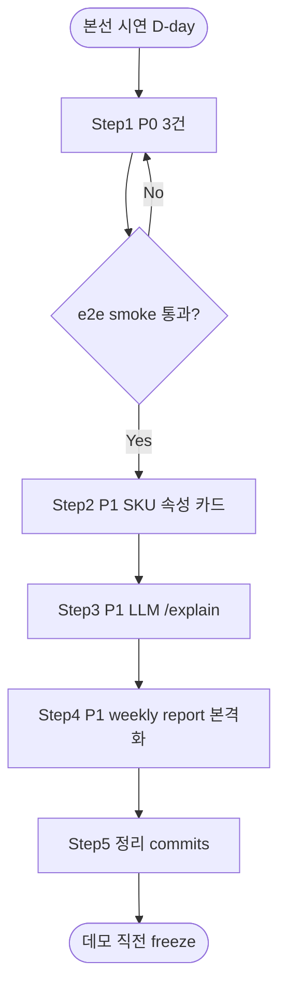
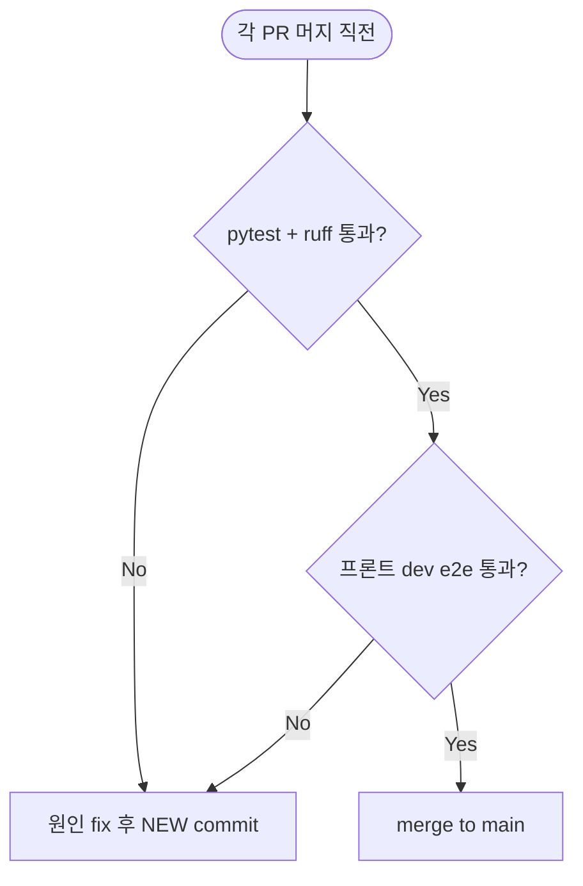

# MVP 완성 잔여 작업 플랜 Design Document

> Status: Draft
> Created: 2026-05-21
> Owner: backend + frontend

## Context

본선 시연 MVP는 `docs/roadmap.md` §3의 P0/P1 범위와 `docs/source/DB_state_v1.3.md`의 state/API/DB 계약을 모두 충족할 때 완성으로 간주합니다. 2026-05-21 기준으로 P0 데모 흐름(페이지 진입 → 최적화 → DnD → 비교 → 확정 → 대시보드)은 코드상 거의 완성되었고, XGBoost 통합·OR-tools 라우팅·priority profile contract·decisions CRUD·기본 대시보드까지 동작합니다. 그러나 다음 세 가지 P0 갭이 남아 시연 중 정렬 불일치 또는 commit-blocking 분기 누락이 발생할 위험이 있고, P1 영역(주간 보고서 본문·LLM 분기·SKU 속성 표시)은 demo flow의 마감 완성도를 떨어뜨립니다. 본 문서는 잔여 작업을 단일 표로 정리해 다음 PR 순서를 합의하기 위한 메타 로드맵입니다. 각 항목은 별도 세부 설계 문서를 가질 수 있으며, 본 문서는 그 인덱스 역할을 합니다.

## Goals & Non-Goals

### Goals

| Goal | Description |
|---|---|
| 잔여 코드 작업의 단일 목록화 | P0/P1 갭을 한 표로 모아 PR 단위와 순서를 합의 가능하게 한다 |
| 검증·정리 작업과의 분리 | 코드 작성과 별개로 진행해야 하는 런타임 e2e·dead code 정리를 별도 섹션으로 명시 |
| 세부 설계 문서로의 라우팅 | 이미 존재하는 design 문서(SkuCard 속성 표시 등)와 본 문서 사이의 관계를 명확히 |

### Non-Goals

| Non-Goal | Reason |
|---|---|
| 각 항목의 상세 구현 결정 | 항목별 세부 설계는 별도 문서. 본 문서는 인덱스. |
| P2 범위 작업 | `docs/roadmap.md` §3에 명시된 의도적 out-of-scope. |
| 백엔드 인프라/배포 변경 | 시연 환경은 로컬 dev 기준. CI/CD는 본선 후 검토. |

## Architecture

```mermaid
graph LR
  subgraph Done["완료(2026-05-21)"]
    D1[/health · /plans · /optimize · /predict · /decisions · /dashboard/]
    D2[XGBoost cost predictor + heuristic fallback]
    D3[OR-tools open-path + brute/NN fallback]
    D4[Priority profile contract nested]
    D5[Decisions CRUD + legacy DB recovery]
    D6[Dashboard 기본 KPI + 차트]
  end
  subgraph P0Gap["P0 갭(시연 차단성)"]
    P0a[/validate Warning schema 정렬]
    P0b[sequence_risk continuous→binary]
    P0c[Frontend /validate 호출 + commit-blocking]
  end
  subgraph P1Gap["P1 갭(완성도)"]
    P1a[/explain LLM 분기]
    P1b[Weekly report 본격화 + cache 적재]
    P1c[Weekly report 본문 UI]
    P1d[SkuCard SKU 속성 표시]
    P1e[Dashboard 7차원 차트 보강]
  end
  subgraph Cleanup["정리"]
    C1[on_event → lifespan]
    C2[model file 정책 재정리]
  end
  Done --> P0Gap --> P1Gap --> Cleanup
```

## Sequence / Flow

### 정상 흐름 (작업 순서)



| Step | Description |
|---:|---|
| 1 | P0 3건을 한 PR로 묶어 시연 차단성 해결. validate 응답·sequence_risk·프론트 호출. |
| 2 | SKU 속성 표시(설계 문서 이미 존재) — 시연 시각적 완성도 큰 항목. |
| 3 | LLM `/explain` 분기 — env var 가드 + fallback 유지. |
| 4 | Weekly report 본격화 + `weekly_report_cache` 적재 + 프론트 본문 UI. UI는 별도 design doc 선행. |
| 5 | on_event → lifespan, 모델 파일 정책 재정리 등. |

### 주요 에러 흐름



| Case | Handling |
|---|---|
| pytest 실패 | 원인 디버깅 후 새 commit. amend 금지(이미 push된 경우). |
| 프론트 e2e 시 DnD가 `/predict` 트리거 안 함 | `hooks/useDecisionPage.ts` onDrop 핸들러 점검. P0 갭 #3과 묶어 처리. |
| LLM 환경변수 누락 | template fallback 자동 동작. `model_version`/`prompt_version` 필드만 표시 차이. |

## Decisions & Rationale

### Decision 1: P0 3건을 단일 PR로 묶는다

| Item | Description |
|---|---|
| Decision | `/validate` 응답 정렬, `sequence_risk` binary 변환, 프론트 `/validate` 호출을 한 PR. |
| Alternatives | 3개를 각각 별 PR로 분리 |
| Rationale | 세 항목 모두 commit-blocking 분기와 연결되어 한 PR에서 e2e 검증이 가장 자연스럽다. 분리하면 머지 사이 frontend가 잠시 깨진 상태가 된다. |
| Impact | PR 본문이 조금 길어지지만 검증 일관성 확보. |

### Decision 2: SKU 속성 표시는 LLM `/explain`보다 먼저 진행

| Item | Description |
|---|---|
| Decision | P1에서 #8(SKU 속성) → #4(LLM) → #5–7(Weekly) 순으로 진행 |
| Alternatives | LLM 먼저 |
| Rationale | SKU 속성은 설계 문서가 이미 합의 완료(`docs/design/sku-card-property-display.md`)고 시연 화면 시각 완성도에 큰 영향. LLM은 fallback이 이미 동작하므로 시연 중요도 낮음. |
| Impact | 시연 시 광택/점도 수치가 카드에 보이는 변화는 첫인상에 직접 기여. |

### Decision 3: 학습된 모델 파일 commit 유지

| Item | Description |
|---|---|
| Decision | `backend/app/data/models/*.json`을 본 PR 단계까지 commit 유지. 시연 직후 별도 PR에서 정리. |
| Alternatives | 즉시 .gitignore에 추가 |
| Rationale | 시연 환경에서 `python -m app.ml.train_xgboost` 실행을 신뢰할 수 없는 경우 대비. 합의된 임시 자산. |
| Impact | repo 크기 ~4MB 증가. 본선 후 정리 PR에서 제거. |

### Decision 4: Weekly report 본문 UI는 별도 design doc 선행

| Item | Description |
|---|---|
| Decision | P1 #7(주간보고서 본문 UI)은 본 plan 문서에서 항목만 등록하고, 구현 전에 별도 design doc를 작성한다. |
| Alternatives | 본 문서에 UI 사양까지 포함 |
| Rationale | 본문/주요 발견/권장 사항 컴포넌트의 정보 밀도·반응형·loading state 등은 본 plan 범위를 넘는다. 별도 합의 필요. |
| Impact | 본 plan은 인덱스 역할 유지. |

## Edge Cases & Error Handling

| Case | Handling | Impact |
|---|---|---|
| P0 PR 머지 후 frontend 캐시된 client.ts가 옛 응답 형식 기대 | dev 환경에서 hard reload + e2e 한 번. | 시연 직전 한 사이클 점검 필수. |
| `sequence_risk` binary 전환 후 기존 decisions 로그가 continuous 값을 가진 채 잔존 | `aggregated_cost.sequence_risk` 표시 시 0/1로 normalize, legacy는 그대로 두기. | 대시보드 평균값에 약간 영향 가능, 시연용으로는 무시 가능. |
| LLM 환경변수 설정됐지만 호출 실패 | template fallback. `model_version` 필드에 명시. | 시연 안정성 확보. |
| `weekly_report_cache` 적재 실패(예: 동시 INSERT) | UNIQUE 제약 위반 시 UPSERT 또는 skip + log. | 대시보드는 가장 최신 row 1개만 노출. |
| 학습 모델 파일 누락 채로 배포 | `CostPredictor`가 heuristic으로 자동 fallback. README/CLAUDE.md에 명시됨. | 정상 동작 보장. |

## Decisions Index — 잔여 작업

### P0 (시연 차단성, 한 PR로 묶음 권장)

| # | 카테고리 | 파일 | 작업 요약 |
|---|---|---|---|
| 1 | backend | `backend/app/schemas/sequence.py`, `backend/app/api/routes_validate.py` | `Warning` 스키마에 `type`, `commit_blocking`, `transition_id` 추가 + 라우터 응답 채움. DB_state §12 정렬. |
| 2 | backend | `backend/app/services/optimizer.py`, `backend/app/services/dashboard_service.py` | `sequence_risk` continuous → binary(0/1) 변환. `aggregated_cost`·`kpi_trend`에 동일 적용. |
| 3 | frontend | `frontend/src/api/client.ts`, `frontend/src/api/mappers.ts`, `frontend/src/components/CommitSection.tsx` | `/validate` 호출 함수 + 요청·응답 mapper + commit-blocking 분기. |

### P1 (시연 완성도)

| # | 카테고리 | 파일 | 작업 요약 | 세부 설계 |
|---|---|---|---|---|
| 4 | backend | `backend/app/services/explanation_service.py` | LLM 환경변수 가드 + 호출 + 실패 시 template fallback. 인터페이스 유지. | (필요시 신규) |
| 5 | backend | `backend/app/services/dashboard_service.py:82-88` | `_weekly_summary` 실집계(비용·다운타임·리스크) + LLM 분기. | 본 문서로 충분 |
| 6 | backend | `backend/app/db/sqlite.py`, `dashboard_service.py` | `weekly_report_cache` INSERT/SELECT 경로 + `/dashboard` 응답에 `key_findings`·`recommendations` 노출. | 본 문서 + 신규 |
| 7 | frontend | `frontend/src/pages/DashboardPage.tsx` (신규 컴포넌트) | 주간 보고서 본문/주요 발견/권장 사항 UI. | **별도 design doc 선행 필요** |
| 8 | frontend | `frontend/src/api/types.ts`, `mappers.ts`, `components/SkuCard.tsx` | PlanItem에 점도·안료·밝기·광택 확장 + 카드 메타 라인 표시. | `docs/design/sku-card-property-display.md` (완료) |
| 9 | frontend | `frontend/src/components/DashboardCharts.tsx` | Draft 설계와 대조해 누락 차원 차트 보강. | `docs/design/dashboard-kpi-chart-7dim-frontend.md` |

### 정리(코드 작성 포함)

| # | 카테고리 | 파일 | 작업 요약 |
|---|---|---|---|
| 10 | backend | `backend/app/main.py:44-47` | `@app.on_event("startup")` → FastAPI lifespan handler 마이그레이션. DeprecationWarning 제거. |
| 11 | backend | `backend/app/data/models/` | 모델 파일 정책 재정리(`.gitignore` 추가 + 학습 가이드 README). 시연 직후 PR. |

## Verification Plan

| 단계 | 명령/방법 | 기준 |
|---|---|---|
| 단위 lint | `cd backend && ruff check app/` | 0 error |
| 단위 test | `cd backend && python -m pytest tests/ -q` | all pass |
| 백엔드 smoke | `GET /health` → `/plans/demo-plan-001` → `POST /optimize` → `POST /predict` → `POST /validate` → `POST /decisions` → `PATCH /reviewed` → `GET /dashboard` | 모든 응답 200 + 필수 필드 존재 |
| 프론트 dev | `cd frontend && npm run dev` 후 결정 화면 진입 → 5개 아이템 swap → 점수·warning 갱신 → commit-blocking 시 차단 → 대시보드 진입 차트·주간 요약 노출 | 막힘 없음 |
| 회귀 | 기존 `test_smoke.py` 14건 무손상 + 신규 항목별 회귀 테스트 | 모두 pass |

## Out of Scope

| Item | Reason |
|---|---|
| 작업자 뷰, 품질 영향 예측, MES/ERP 연동, 다중 라인, 실시간 설비 로그 | `docs/roadmap.md` §3 P2 — 본 MVP 명시 out-of-scope |
| 인증/권한 화면 | 본 MVP scope 외 |
| 배포/CI/CD 파이프라인 | 본선 시연은 로컬 dev 기준 |
| SQLite → 외부 DB 마이그레이션 | 본 MVP scope 외 |

---

## Data Model

본 문서는 신규 데이터 모델 변경을 도입하지 않습니다. 각 항목별 데이터 모델은 해당 항목의 세부 설계 문서가 정의합니다.

## API / Interface

본 문서는 신규 API를 도입하지 않습니다. 기존 API의 응답 정렬(P0 #1) 외에 인터페이스 변경 없음.

## Workflow

_해당없음_

## Performance

_해당없음_

## Security

_해당없음_

## Observability

_해당없음_

## Migration / Rollback

본 plan 문서는 코드 변경을 포함하지 않으므로 롤백 대상이 아닙니다. 항목별 PR은 각 commit revert로 롤백.

## Open Questions

| Question | Owner | Blocking? | Notes |
|---|---|---:|---|
| `sequence_risk` binary 변환 시 기존 decisions 로그의 continuous 값 호환 정책 | backend | No | 시연용으로는 normalize 시점에만 처리. legacy 그대로 두기. |
| Weekly report 본문 UI 디자인 mock 준비 | frontend | No | 별도 design doc에서. |
| LLM 환경변수 명명 규칙 (`OPENAI_API_KEY` vs 자체 prefix) | backend | No | fallback이 default이므로 시연 차단 아님. |
