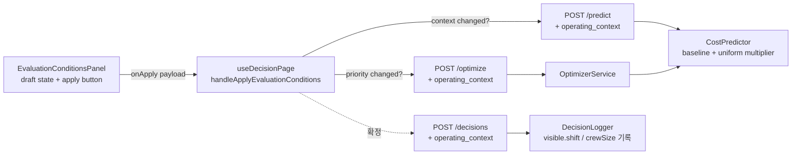
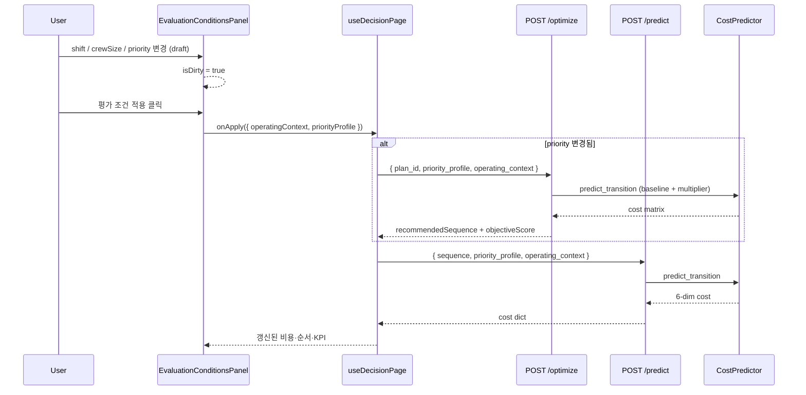
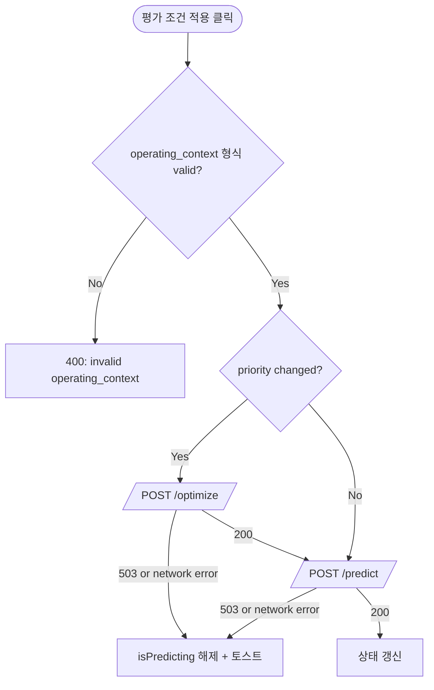
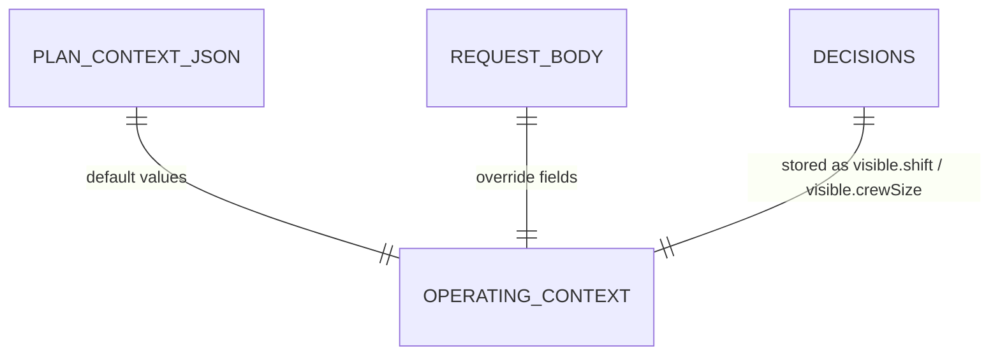
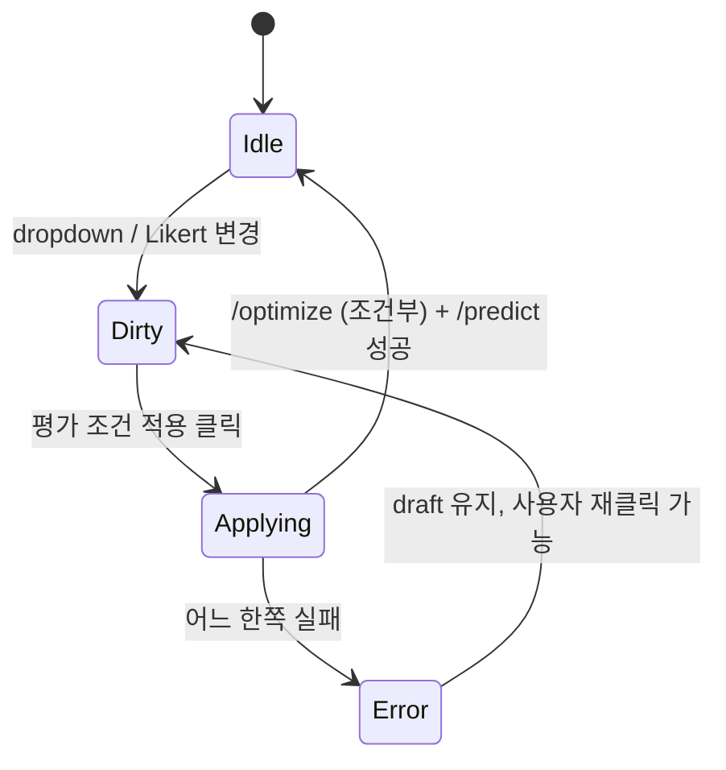

# Operating Context Cost Multiplier & Explicit Recompute Design Document

> Status: Draft
> Created: 2026-05-21
> Owner: Ease113

## Context

`EvaluationConditionsPanel`은 wireframe v5 시점에 draft / apply 패턴으로 만들어졌고, "평가 조건 적용" 버튼(`eval-apply-btn`)이 이미 존재합니다 (`EvaluationConditionsPanel.tsx:429-436`). 다만 현재 hook(`useDecisionPage.handleApplyEvaluationConditions`)은 우선순위 변경 시에만 `/predict`를 호출하고 `/optimize`는 호출하지 않아 추천 순서가 갱신되지 않습니다. `operatingContext`는 어떤 요청 바디에도 실리지 않아 백엔드의 `plan_context.json` 고정값(LINE-01 / day / 3명)으로만 비용이 계산됩니다. 패널 UI 텍스트도 "추천 순서는 바뀌지 않고 KPI·비교 결과에만 반영됩니다"라고 명시되어 있습니다. 이번 작업으로 운영 컨텍스트는 절대 비용을 균일 곱셈으로 보정하는 신호로, 운영 우선순위는 추천 순서를 재구성하는 신호로 역할을 분리하고, 양쪽 모두 "평가 조건 적용" 클릭으로 반영되도록 백엔드 계약·hook·UI 텍스트를 정합화합니다. 미수행 시 dropdown과 우선순위 슬라이더가 시연 신뢰성을 흐리며, 향후 작업자 뷰(P2) 확장 시 같은 단절을 다시 처리해야 합니다.

## Goals & Non-Goals

### Goals

| Goal | Description |
|---|---|
| 운영 컨텍스트 → 절대 비용 반영 | shift, crewSize 변경이 6개 비용 차원에 균일 곱셈으로 적용되어 추천 순서는 보존하되 절대 비용은 변동합니다. |
| 운영 우선순위 → 추천 순서 변경 | priority_profile 변경 시 `/optimize` 재호출로 추천 순서가 갱신되어 "AI/ML이 우선순위 신호에 반응한다"는 시연 메시지를 표현합니다. |
| 단일 진입점 UX | 이미 존재하는 "평가 조건 적용" 버튼을 그대로 사용하고, 클릭 시 변경된 항목에 따라 `/predict` 단독 또는 `/optimize + /predict`를 묶어 호출합니다. |
| heuristic·XGBoost 경로 일관성 | `CostPredictor` 내부에서 baseline 입력 후 균일 배수를 곱하는 단일 진실원천 패턴으로 두 경로 모두 동일 비율을 적용합니다. |
| 확정 스냅샷 정합성 | 확정 시점의 dropdown 값이 `visible.shift` / `visible.crewSize`로 SQLite에 기록됩니다. |

### Non-Goals

| Non-Goal | Reason |
|---|---|
| shift별 비균일 비용 모델 (옵션 C) | 현장 인터뷰·근거가 부족하고 시연 메시지를 흐립니다. |
| dropdown 변경 시 자동 재요청 | 이미 draft / apply 패턴이 자리잡혀 있으므로 동일 UX를 유지합니다. |
| 작업자 뷰·다중 라인 (P2) | LINE-01 단일 라인 범위로 한정합니다. |
| XGBoost 재학습 | 학습 모델은 그대로 두고 추론 시 균일 배수만 post-hoc 적용합니다. |
| 새 컴포넌트 도입 | 기존 패널·hook 구조를 재사용하고, "재계산" 버튼을 신설하지 않습니다. |

## Architecture

| 컴포넌트 | 책임 | 경계 |
|---|---|---|
| `EvaluationConditionsPanel` | shift·crewSize·priority dropdown 렌더, draft state 보유, "평가 조건 적용" 버튼 노출 | dirty 판정만 자체 계산, API 호출은 부모에 위임 |
| `useDecisionPage` | `operatingContext` / `priorityProfile` 상태 보유, `handleApplyEvaluationConditions`에서 변경 항목에 따라 `/optimize`·`/predict` 오케스트레이션 | 비즈니스 규칙은 백엔드 위임 |
| `routes_predict` / `routes_optimize` / `routes_decisions` | 요청 바디 검증, `plan_context.json` 기본값과 merge | merge 후 predictor·optimizer·logger 호출 |
| `OptimizerService` | merge된 context로 predictor를 호출해 비용 행렬·추천 순서 산출 | 자체적으로 배수를 적용하지 않음 |
| `CostPredictor` | 내부 호출 시 baseline context로 6차원 비용을 산출하고 균일 배수를 곱해 반환 | heuristic·XGBoost 양 경로의 단일 진실원천 |
| `DecisionLogger` | 확정 요청의 context를 merge해 `visible.shift` / `visible.crewSize`에 기록 | 추가 audit 테이블은 도입하지 않음 |

## Sequence / Flow

### 정상 흐름 — "평가 조건 적용" 클릭

| Step | Description |
|---:|---|
| 1 | dropdown / Likert 변경은 draft state에만 반영됩니다. |
| 2 | 사용자가 "평가 조건 적용"을 클릭합니다 (`isDirty && !isPredicting` 일 때만 활성). |
| 3 | hook이 변경 종류를 판정합니다. priority가 바뀌었으면 `/optimize`를 먼저 호출해 추천 순서를 갱신합니다. |
| 4 | `/predict`로 현재 sequence의 6차원 비용을 갱신합니다. 두 호출 모두 `operating_context`를 포함합니다. |
| 5 | `CostPredictor`는 내부적으로 baseline context로 비용을 계산한 뒤 균일 배수를 곱해 반환하므로, 두 경로 모두 컨텍스트 변경은 절대 비용만 흔들고 순위에는 영향을 주지 않습니다. |

### 주요 에러 흐름

| Case | Handling |
|---|---|
| `shift`에 허용되지 않은 값 | Pydantic `Literal["day","night"]` 검증으로 400 반환 |
| `crew_size`가 정수가 아님 / 범위 밖 | `ge=1, le=6` 검증으로 400 반환. 프론트는 select 옵션으로 2~5로 제약 |
| `/optimize` 실패 후 `/predict` 미호출 | 기존 추천 순서 유지, hook의 `isPredicting` 플래그 해제 |
| `/optimize` 성공 후 `/predict` 실패 | 추천 순서는 갱신되었지만 cost는 이전 값. `isPredicting` 해제 + 경고 표시 |
| XGBoost 추론 실패 | 기존 heuristic fallback. 균일 배수는 동일하게 적용 |

## Decisions & Rationale

### Decision 1: 운영 컨텍스트는 균일 곱셈으로 절대 비용에만 반영

| Item | Description |
|---|---|
| Decision | `CostPredictor.predict_transition` 내부에서 baseline (`shift=day`, `crew_size=3`)으로 6차원 비용을 계산하고, 결과 dict 전체에 `_operating_context_multiplier(context)`를 곱해 반환합니다. |
| Alternatives | (A) shift complexity 가산만 적용 — crew는 여전히 비균일. (B) complexity 곱셈 — 비균일 잔존. (C) 차원별 비균일 가중치 — 근거 약하고 시연 메시지 흐림. |
| Rationale | "우선순위가 순서를 결정한다"는 시연 메시지를 보호하려면 컨텍스트는 순위에 영향을 주지 않아야 합니다. 균일 배수는 결정론적으로 순위 보존을 보장하고 heuristic·XGBoost 양 경로에 동일하게 적용됩니다. |
| Impact | 기존 `_predict_heuristic`의 `labor_cost = setup_time * crew_size * 850` 식은 `setup_time * CREW_BASELINE * 850`으로 바뀌고, crew 영향은 외부 배수로만 들어갑니다. |

### Decision 2: 우선순위 변경 시 `/optimize` 재호출, 컨텍스트만 변경되면 `/predict`만

| Item | Description |
|---|---|
| Decision | `handleApplyEvaluationConditions`에서 priority 변경 여부에 따라 `/optimize`를 조건부 호출하고, `/predict`는 무조건 호출합니다. |
| Alternatives | (A) 항상 `/optimize + /predict` 호출 — 컨텍스트만 바뀐 경우 불필요한 optimize. (B) priority 변경만 `/predict` 호출 — 컨텍스트 변경 시 cost가 갱신되지 않음. |
| Rationale | 컨텍스트는 순위에 영향 없으므로 `/optimize`가 불필요합니다. priority는 `objectiveScore` 가중치를 바꾸므로 `/optimize`로 추천 순서를 재계산해야 합니다. |
| Impact | hook 코드에 priority 변경 분기 추가. 기존 `priorityChanged` 판정 로직 재사용. |

### Decision 3: 기존 "평가 조건 적용" 버튼·draft 패턴 유지

| Item | Description |
|---|---|
| Decision | 이미 구현된 `eval-apply-btn`과 `draftContext` / `draftPriority` 상태를 그대로 사용합니다. 새 버튼이나 별도 dirty 인디케이터를 도입하지 않습니다. |
| Alternatives | (A) "재계산" 버튼 신설 — 중복 UX. (B) dropdown 변경 시 자동 호출 — 시연 흐름 흐림. |
| Rationale | 패널에 draft / dirty / apply 패턴이 이미 자리잡고 있으며 사용자 흐름이 일관됩니다. UI 텍스트 일부만 의미가 달라진 동작에 맞춰 수정합니다. |
| Impact | "추천 순서는 바뀌지 않고 KPI·비교 결과에만 반영됩니다" 문구를 "우선순위는 추천 순서를, 운영 컨텍스트는 절대 비용을 갱신합니다" 류로 수정. |

### Decision 4: shift·crew 배수 상수의 수치

| Item | Description |
|---|---|
| Decision | `NIGHT_SHIFT_MULTIPLIER = 1.15`, `CREW_BASELINE = 3`, `CREW_PER_PERSON_DELTA = 0.10`. |
| Alternatives | (A) shift 1.20, crew 0.05. (B) shift 1.10, crew 0.15. |
| Rationale | shift 1.15는 `seed_data.py:119` 기존 `shift_factor`와 일치시켜 학습 분포와 정합. crew 0.10/명은 2~5명 범위에서 시각적으로 인지 가능하면서 비현실적 외삽 없는 중간값. |
| Impact | 시연 리허설 후 두 상수만 조정해 튜닝 가능. 모듈 상단에 두어 가시성을 확보합니다. |

## Edge Cases & Error Handling

| Case | Handling | Impact |
|---|---|---|
| `operating_context` 필드 없음 | `loader.get_plan_context`의 기본값 사용 | 기존 호출자는 호환 유지 |
| 일부 필드만 옴 | merge 시 누락 필드는 plan_context 값으로 채움 | 부분 갱신 허용 |
| `crew_size = 0` 또는 음수 | `ge=1, le=6` 검증으로 400 | 비현실 입력 차단 |
| 적용 중 중복 클릭 | `disabled={!isDirty || isPredicting}` (현재 동작) | 중복 요청 방지 |
| `/optimize` 성공, `/predict` 실패 | 추천 순서는 갱신, cost는 이전 값 유지, `isPredicting` 해제 | 부분 갱신 상태가 KPI 영역에 노출되지만 클릭 재시도로 회복 |
| context 배수 0 이하 | `max(0.1, multiplier)` 클램프 | 음수 비용 방지 |

---

## Data Model

| Field | Type | Required | Default | Description |
|---|---|---:|---|---|
| `shift` | `Literal["day","night"]` | No | `day` | 작업 시기 |
| `crew_size` | int (1~6) | No | 3 | 라인 작업 인원수 |

신규 테이블 없이 SQLite `decisions.visible_json`에 동일 구조로 직렬화됩니다.

## API / Interface

| Method | Path | 변경 |
|---|---|---|
| POST | `/predict` | request에 optional `operating_context: { shift?, crew_size? }` 추가. response 변경 없음 |
| POST | `/optimize` | 동일 |
| POST | `/decisions` | 동일. merge 결과를 `visible.shift` / `visible.crewSize`에 저장 |
| GET | `/plans/{id}` | 변경 없음 (기존 `operating_context` 응답 유지) |

호환성: 모든 신규 필드는 optional이며 누락 시 `plan_context.json`의 값을 사용합니다. 기존 클라이언트는 변경 없이 동작합니다.

## Workflow

## Performance

| Item | Target |
|---|---|
| `/predict` p95 | 100ms 미만 (heuristic), 300ms 미만 (XGBoost) |
| `/optimize` p95 | 500ms 미만 (MVP 합성 plan 규모 ≤ 12개) |
| 평가 조건 적용 한 사이클 | 1초 이내 화면 갱신 |

균일 배수 적용은 dict 6개 항목 곱셈이므로 무시 가능한 비용입니다.

## Security

_해당없음_ — 인증·권한 변경 없음. 입력 검증은 Pydantic 범위 검증으로 처리합니다.

## Observability

| 항목 | 설명 |
|---|---|
| logs | `routes_predict` / `routes_optimize` / `routes_decisions`에서 `plan_id`, merged context, fallback 발생 여부를 INFO 로그로 남깁니다. |
| audit records | 확정 시 `visible.shift` / `visible.crewSize`가 기록되어 사후 검토 가능합니다. |
| failure signals | XGBoost fallback 발생 시 기존 `logger.warning` 신호 유지. |

## Migration / Rollback

| 항목 | 설명 |
|---|---|
| migration steps | 백엔드 배포 후 프론트 배포. 백엔드는 신규 필드를 optional로 받아 기존 프론트와 호환됩니다. |
| backward compatibility | `operating_context` 누락 시 기존 동작과 동일하므로 무중단 배포 가능합니다. |
| rollback method | 균일 배수만 비활성화하려면 `_operating_context_multiplier`가 항상 1.0을 반환하도록 한 줄 수정. 라우트 변경은 그대로 둬도 무해합니다. |
| data recovery concerns | SQLite `visible_json` 스키마는 기존 키만 사용하므로 마이그레이션 불필요. |

---

## Current Frontend State (작업 전 스냅샷)

| 항목 | 상태 |
|---|---|
| draft / apply 패턴 | `EvaluationConditionsPanel.tsx:129-148` — 이미 구현됨 (`draftContext`, `draftPriority`, `isDirty`) |
| "평가 조건 적용" 버튼 | `EvaluationConditionsPanel.tsx:429-436` — 이미 존재 |
| `handleApplyEvaluationConditions` | `useDecisionPage.ts:127-143` — 존재하나 `/optimize`를 호출하지 않음. priority 변경 시에만 `/predict` 호출 |
| `operatingContext` 요청 전파 | 어디에도 실리지 않음. `postOptimize`·`postPredict`·`postDecisions` 시그니처에 없음 |
| UI 안내 텍스트 | "추천 순서는 바뀌지 않고 KPI·비교 결과에만 반영됩니다" (`EvaluationConditionsPanel.tsx:283-286`) — 새 정책과 불일치 |
| `crew_size` 옵션 | 2~5명 (`EvaluationConditionsPanel.tsx:259`) — 백엔드 검증 범위(1~6)와 정합 |

## Ownership

| Part | Owner | 상태 |
|---|---|---|
| 백엔드 (B1~B8) | 백엔드 담당 | 본 작업 사이클에서 구현 |
| 프론트엔드 (F1~F6) | 프론트엔드 담당 | 별도 사이클에서 구현 (본 문서에 명세만 포함) |
| 통합 검증 | 양측 합류 | 백엔드 배포 후 프론트 dev 서버 연결 시 함께 확인 |

백엔드 변경은 모든 신규 필드를 optional로 두므로 프론트 작업 전에도 무중단 배포가 가능합니다. 프론트가 요청 바디에 `operating_context`를 넣지 않으면 기존 동작과 동일하게 `plan_context.json` 기본값으로 계산됩니다.

## Backend Tasks (본 사이클 작업 범위)

| # | 파일 | 변경 내용 |
|---:|---|---|
| B1 | `backend/app/services/cost_predictor.py` | 모듈 상단에 `NIGHT_SHIFT_MULTIPLIER=1.15`, `CREW_BASELINE=3`, `CREW_PER_PERSON_DELTA=0.10` 상수 추가. `_operating_context_multiplier(context)` 헬퍼 추가. `predict_transition`에서 predictor 내부 호출 시 baseline context로 치환하고 결과 6개 값에 배수를 곱한 뒤 `max(0.0, ...)` round. `_predict_heuristic`의 `labor_cost` 식에서 `crew_size` 의존을 `CREW_BASELINE`으로 교체. |
| B2 | `backend/app/api/routes_predict.py` | 요청 모델에 optional `operating_context: { shift?, crew_size? }` 추가. 처리 시 `loader.get_plan_context(plan_id)`와 merge 후 evaluator/predictor 호출 경로에 전달. |
| B3 | `backend/app/api/routes_optimize.py` | 동일하게 요청 모델 확장. merge 결과를 `OptimizerService.optimize_sequence`에 인자로 주입. |
| B4 | `backend/app/services/optimizer.py` (`:48`, `:277`) | optional `context: dict` 인자 추가. 미제공 시 기존 `loader.get_plan_context` 호출로 fallback. 제공된 context를 `cost_predictor.predict_transition`에 그대로 전달. |
| B5 | `backend/app/services/decision_logger.py` (`:176`) | 확정 요청 바디에서 `operating_context`를 받아 merge한 결과를 `visible.shift` / `visible.crewSize`에 반영. |
| B6 | `backend/app/data/seed_data.py` (`:119`) | 기존 `shift_factor = 1.15` 리터럴을 `cost_predictor.NIGHT_SHIFT_MULTIPLIER` import로 교체. |
| B7 | `backend/tests/test_cost_predictor.py` | shift day/night, crew 3/5, 두 변경 조합 케이스 추가. 6개 차원 모두 배수가 정확히 적용되는지 assert. baseline 호출과 multiplier 적용이 분리되어 있음을 회귀 테스트로 잠금. |
| B8 | `backend/tests/test_optimizer.py` / 또는 routes 테스트 | 동일 plan에 context만 바꿔도 추천 `plan_item_id[]` 시퀀스가 동일함을 assert. priority weights를 바꾼 경우는 시퀀스 변동을 별도 케이스로 확인. |

## Frontend Tasks (프론트엔드 담당자 인계)

> 본 사이클에서는 구현하지 않습니다. 프론트엔드 담당자가 아래 명세대로 별도 PR로 진행합니다. 백엔드 변경은 optional 필드만 추가하므로 본 PR 머지 후에도 기존 프론트는 계속 동작합니다.

| # | 파일 | 변경 내용 |
|---:|---|---|
| F1 | `frontend/src/api/types.ts` (`:262`, `:283`, `:300`) | `OptimizeRequest`, `PredictRequest`, `DecisionsRequest`에 optional `operatingContext?: { shift?: 'day' \| 'night'; crewSize?: number }` 추가. |
| F2 | `frontend/src/api/mappers.ts` (`toOptimizeRequest` `:326`, `toPredictRequest` `:339`, `toDecisionsRequest` `:354`) | input에서 `operatingContext`를 받아 snake_case `operating_context: { shift, crew_size }`로 직렬화. 누락 시 필드 자체 생략 (백엔드는 fallback). |
| F3 | `frontend/src/api/client.ts` (`postOptimize` `:78`, `postPredict` `:90`, `postDecisions` `:103`) | input 시그니처에 optional `operatingContext` 추가하고 mapper에 그대로 전달. |
| F4 | `frontend/src/hooks/useDecisionPage.ts` (`handleApplyEvaluationConditions` `:127-143`) | 분기 로직 재설계:  - `contextChanged = !operatingContextEqual(operatingContext, prev.operatingContext)` 판정.  - `priorityChanged` 기존 그대로.  - `priorityChanged` 시: `postOptimize({ ..., operatingContext })`로 추천 순서 갱신 후 `applyOptimizeResponse`, 이어서 `runPredict(newRecommendedSequence, ..., priorityProfile, operatingContext)`.  - `priorityChanged` 없고 `contextChanged`만: 기존 `recommendedSequence`로 `runPredict` 한 번만.  - `runPredict` 시그니처에 `operatingContext` 인자 추가.  - 진입 플로우의 초기 `postOptimize` 호출(`:48-52`)에도 `operatingContext: planData.operatingContext` 전달. |
| F5 | `frontend/src/api/mappers.ts` (`applyOptimizeResponse`, `applyPredictResponse`) | optimize 응답에 `recommendedSequence`·`objectiveScore`가 갱신될 때 화면 KPI도 함께 재계산되는지 확인. 시그니처 변경 없음. |
| F6 | `frontend/src/components/EvaluationConditionsPanel.tsx` | InfoTip 문구(`:283-286`)와 footer note(`:424-428`) 수정.  - 운영 우선순위 안내: "「평가 조건 적용」을 누르면 우선순위는 추천 순서를 갱신하고 운영 컨텍스트는 절대 비용을 보정합니다." 류.  - footer note: dirty 상태에 따라 "우선순위 변경은 추천 순서를, 운영 컨텍스트는 절대 비용을 갱신합니다." 류.  - 운영 컨텍스트 안내 InfoTip(`:227-230`): "교대·투입 인원은 화면 표시용입니다" 문구를 "교대·투입 인원은 절대 비용에만 균일하게 반영되며 추천 순서는 바꾸지 않습니다."로 교체. |

### 프론트엔드 인계 시 백엔드가 제공하는 계약 요약

| 항목 | 보장 |
|---|---|
| 요청 필드 | `operating_context` (snake_case)는 optional. 누락 시 `plan_context.json` 기본값 사용 |
| 부분 필드 | `shift`만 또는 `crew_size`만 보내도 됨. 누락 필드는 서버에서 기본값으로 채움 |
| 응답 스키마 | 기존 응답 형태 동일. 신규 필드 없음 |
| 순서 보존 | `priority_profile` 동일·`operating_context`만 변경 시 `/optimize` 응답의 `plan_item_id[]`는 baseline과 완전히 동일 |
| 절대 비용 | 6개 비용 차원 모두 동일 배수 (`NIGHT_SHIFT_MULTIPLIER × (1 + 0.10 × (crew_size - 3))`) 적용 |
| 확정 스냅샷 | `POST /decisions` 요청의 `operating_context`가 그대로 `visible.shift` / `visible.crewSize`에 기록됨 |

## Verification

### 백엔드 (본 사이클)

| 검증 항목 | 방법 | 기대 결과 |
|---|---|---|
| heuristic 균일 배수 | `pytest backend/tests/test_cost_predictor.py -k multiplier` | shift night → 6차원 모두 ×1.15, crew 5 → 모두 ×1.20, 조합 → ×1.38 |
| XGBoost 균일 배수 | 모델 로드 환경에서 동일 케이스 실행 | heuristic과 동일 비율 |
| 순서 보존 | `/optimize` smoke (httpx 또는 curl): 동일 plan·priority에 다양한 context 전달 | `plan_item_id[]` 완전 동일 |
| 우선순위 변경 시 순서 변동 | `/optimize` smoke: priority weights 변경 | `plan_item_id[]` 변동 가능 |
| 확정 스냅샷 정합성 | `/decisions` 호출 후 `GET /decisions/{id}` | `visible.shift` / `visible.crewSize`가 요청값과 일치 |
| 호환성 | `operating_context` 누락 요청 | 기존 동작과 동일 (`plan_context.json` 기본값으로 계산) |

### 프론트엔드 (FE 담당)

| 검증 항목 | 방법 | 기대 결과 |
|---|---|---|
| 프론트 UX | dev 서버에서 dropdown 변경 → draft만 갱신, "평가 조건 적용" 클릭 → 우선순위 변경 시 추천 순서 변동·컨텍스트만 변경 시 순서 유지·절대 비용 변동 | 디자인 의도와 일치 |
| 통합 시나리오 | FE+BE 합류 후 시연 시나리오 1회 리허설 | shift·crew·priority 조합 변경이 KPI/순서/스냅샷에 일관되게 반영 |

## Open Questions

| Question | Owner | Blocking? | Notes |
|---|---|---:|---|
| 시연 리허설 후 `CREW_PER_PERSON_DELTA = 0.10`의 시각적 효과 적정성 | 도메인 책임자 | No | ±0.05 범위 내 미세 조정 가능 |
| `/optimize` 실패 시 사용자 피드백 UX | 프론트 담당 | No | 토스트·재시도 버튼 어느 쪽이든 첫 구현은 토스트로 |

## Out of Scope

| Item | Reason |
|---|---|
| 다중 라인 (LINE-02 이상) | P2 범위 |
| XGBoost 재학습 | post-hoc 배수로 충분 |
| shift별 비균일 비용 모델 | Decision 1 참조 |
| 운영 컨텍스트 변경 이력 audit log | 확정 스냅샷에 기록되는 것으로 충분 |
| "재계산" 별도 버튼 신설 | 기존 "평가 조건 적용" 재사용 |
