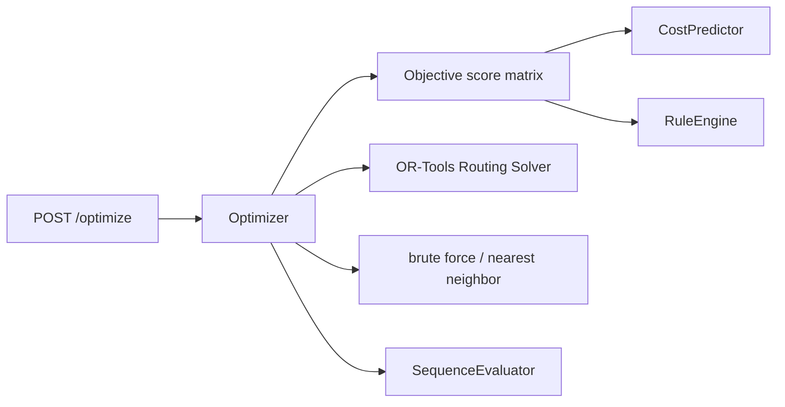
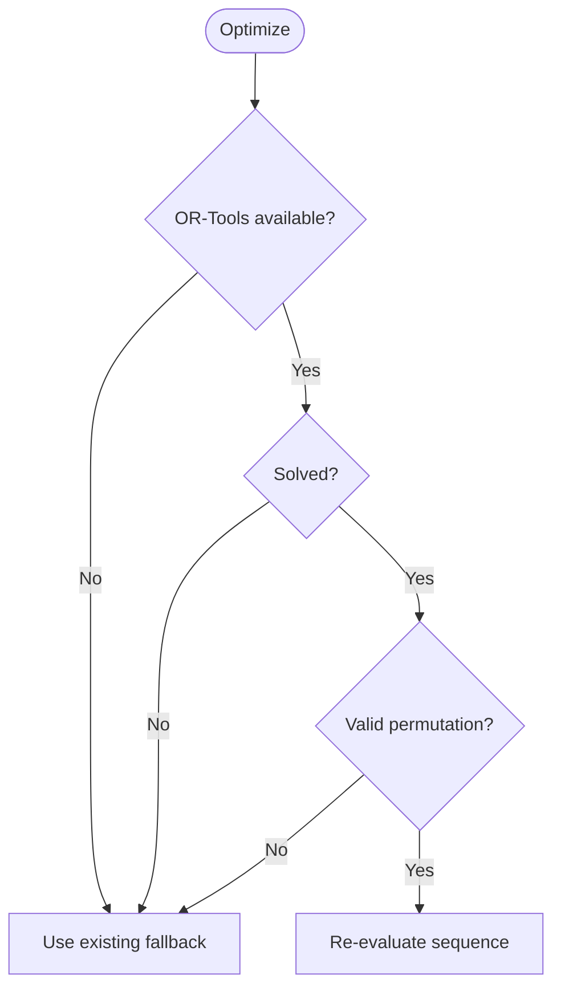

# OR-Tools 최적화 채택 설계

## 1. Context

로드맵 Day 2는 `/optimize`가 OR-Tools 또는 fallback으로 `plan_item_id[]` 추천 순서를 반환하도록 요구합니다. 현재 `Optimizer`는 OR-Tools 설치 여부를 감지하지만 실제 최적화는 8개 이하 brute force, 그 외 nearest neighbor로 처리하고 있어 P0 기준의 OR-Tools 채택이 완료되지 않았습니다. 사용자가 제공한 후보 `optimizer.py`는 비용 행렬을 만든 뒤 OR-Tools로 순서를 찾는 방향은 적합하지만, 독립 실행형 모델/CSV 경로와 자체 dataclass를 사용해 현재 서비스 구조와 직접 맞지 않습니다. 또한 후보 CP-SAT 모델은 마지막 노드에서 시작 노드로 돌아오는 cycle 목적함수를 풀기 때문에 MVP의 열린 생산 순서 평가 기준과 점수가 달라질 수 있습니다. 이번 변경은 후보의 비용 행렬 기반 접근을 채택하되, 현재 `SequenceEvaluator`, `CostPredictor`, `RuleEngine` contract를 유지하면서 열린 경로 최적화를 구현합니다.

## 2. Goals & Non-Goals

### Goals

| Goal | Description |
|---|---|
| OR-Tools backend 실제 사용 | `/optimize`에서 OR-Tools가 설치되어 있으면 열린 생산 순서를 최적화합니다. |
| sequence contract 유지 | 추천 순서는 계속 `plan_item_id[]`이며 API 응답 구조를 바꾸지 않습니다. |
| objective 기준 일치 | solver 목적함수와 `SequenceEvaluator.evaluate()`가 모두 `totalWeightedCost + sequencePenalty` 기준을 사용합니다. |
| fallback 보존 | OR-Tools import, solve, 결과 추출 실패 시 기존 fallback으로 정상 응답합니다. |

### Non-Goals

| Non-Goal | Reason |
|---|---|
| XGBoost 모델 registry 채택 | 현재 프로젝트는 `CostPredictor` fallback 구조를 사용하며 모델 파일 경로가 후보 코드와 다릅니다. |
| API request/response 변경 | 프론트와 decision 저장 흐름을 보호하기 위해 응답 필드는 유지합니다. |
| 납기/시간창/다중 라인 제약 추가 | DB_state v1.3에서 MVP OR-Tools 제약은 색상 전환 penalty로 제한합니다. |

## 3. Architecture



`Optimizer`는 plan item map과 context를 읽어 각 전환 후보의 objective score 행렬을 계산합니다. OR-Tools가 있으면 dummy depot을 포함한 단일 route 문제로 열린 Hamiltonian path를 풉니다. 최종 응답 비용은 solver 내부 누적값을 신뢰하지 않고 기존 `SequenceEvaluator.evaluate()`로 재평가해 `/predict`, `/decisions`와 같은 기준을 유지합니다.

## 4. Sequence / Flow

### 정상 흐름

```mermaid
sequenceDiagram
  participant API
  participant Opt as Optimizer
  participant Rule as RuleEngine
  participant Pred as CostPredictor
  participant ORT as OR-Tools
  participant Eval as SequenceEvaluator

  API->>Opt: optimize(plan_id, plan_item_ids, priority)
  Opt->>Pred: predict each transition
  Opt->>Rule: apply sequence penalty
  Opt->>ORT: solve open path with dummy depot
  ORT-->>Opt: ordered plan item indices
  Opt->>Eval: evaluate recommended sequence
  Eval-->>API: objective score and warnings
```

| Step | Description |
|---:|---|
| 1 | `Optimizer`가 입력 `plan_item_id[]`를 검증 가능한 plan item map으로 변환합니다. |
| 2 | 모든 서로 다른 전환 쌍에 대해 `objectiveScore`를 계산하고 정수 스케일로 변환합니다. |
| 3 | OR-Tools routing solver가 dummy depot을 시작/종료점으로 사용해 열린 순서를 찾습니다. |
| 4 | solver 결과 순서를 기존 evaluator로 다시 평가한 뒤 API 응답을 구성합니다. |

### 주요 에러 흐름



| Case | Handling |
|---|---|
| OR-Tools 미설치 또는 import 실패 | 기존 brute force / nearest neighbor fallback을 사용합니다. |
| solver time limit 초과 또는 해 없음 | fallback을 사용하고 API는 계속 200 응답을 반환합니다. |
| 추출 결과가 입력 순열과 다름 | 유효하지 않은 결과로 보고 fallback을 사용합니다. |

## 5. Decisions & Rationale

### Decision 1: Routing solver와 dummy depot 사용

| Item | Description |
|---|---|
| Decision | OR-Tools `RoutingModel`에 dummy depot을 추가해 열린 생산 순서를 풉니다. |
| Alternatives | 후보 CP-SAT cycle 모델 직접 채택, MTZ path 모델 직접 작성 |
| Rationale | dummy depot은 마지막에서 처음으로 돌아가는 비용을 0으로 만들어 열린 경로 목적함수와 evaluator 기준을 맞춥니다. |
| Impact | API contract 변경 없이 실제 OR-Tools backend를 사용할 수 있습니다. |

### Decision 2: 최종 비용은 evaluator로 재계산

| Item | Description |
|---|---|
| Decision | solver가 찾은 순서만 채택하고 비용 상세는 `SequenceEvaluator.evaluate()` 결과를 반환합니다. |
| Alternatives | solver 내부 비용 행렬에서 transition detail을 조립 |
| Rationale | `/predict`, `/decisions`와 동일한 계산 경로를 사용해야 비교 기준이 흔들리지 않습니다. |
| Impact | 일부 비용 계산이 중복되지만 MVP 규모에서는 응답 시간 영향이 작고 일관성이 높습니다. |

## 6. Edge Cases & Error Handling

| Case | Expected Handling | User/System Impact |
|---|---|---|
| plan item 0~1개 | 입력 순서를 그대로 반환합니다. | 불필요한 solver 실행이 없습니다. |
| 8개 이하 입력 | brute force가 exact fallback으로 유지됩니다. | 작은 데모 계획은 OR-Tools 실패 시에도 최적값에 가깝게 동작합니다. |
| 9개 이상 입력에서 OR-Tools 실패 | nearest neighbor fallback을 사용합니다. | 시연 흐름이 중단되지 않습니다. |
| solver 결과에 누락/중복 발생 | fallback으로 대체합니다. | 잘못된 추천 순서가 API로 나가지 않습니다. |

## API / Interface

| Method | Path | Description |
|---|---|---|
| `POST` | `/optimize` | 요청/응답 필드는 유지하고 `optimizer_backend` 값으로 사용 backend를 표시합니다. |
