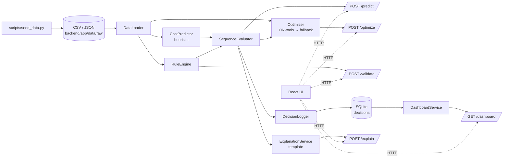

# SmartFactoryV2 Repo 분석 (research.md)

> 최초 작성: 2026-05-18 · 최근 갱신: 2026-05-19 · 작성 기준 branch: `backend`
> 본 문서는 **레퍼런스 스냅샷**입니다. 신규 기능 설계 문서가 아니라 현재 repo가 어떤 모습인지 빠르게 파악하기 위한 단일 진입 문서입니다.

---

## 1. 문서 목적과 범위

| 항목 | 내용 |
|---|---|
| 목적 | repo 전체 구조와 구현 상태를 한 곳에서 파악할 수 있게 한다. |
| 독자 | 신규 합류 팀원, 미래의 Claude/Codex 세션. |
| 범위 | 백엔드/프론트엔드/문서/데이터/테스트의 현재 모습. |
| 범위 밖 | 합성 데이터 품질 평가, 모델 성능 분석, 다음 작업 제안 (단 §11.2에서 후속 task 후보는 명시). |
| 갱신 트리거 | `train_xgboost.py` 구현, dnd-kit 통합, Recharts 차트 실구현, LLM 연동, P2 신기능, schema/contract 변경. |

### 1.1 최근 갱신 이력

- **2026-05-19 v2 (현재)**: Task #1 (DB init idempotency) + Task #2 (priority_profile contract 정합 + sequence_penalty 재조정) 반영. backend smoke test 6→13개, design docs 2개 신규, sequence_rules.json penalty 재조정.
- **2026-05-18 v1**: 초기 repo 스냅샷.

본 문서가 다루지 않는 내용은 다음 문서에 위치한다.

- 구현 우선순위와 일정: `docs/roadmap.md`
- API/DB/state 정본 계약: `docs/source/DB_state_v1.3.md`, `docs/api_contract.md`, `docs/db_schema.md`
- 비즈니스 의도와 데모 시나리오: `docs/source/final_proposal.pdf`, `docs/demo_flow.md`
- 최근 변경 이력: `docs/implementation_log.md`

---

## 2. 프로젝트 정체성

| 항목 | 값 |
|---|---|
| 이름 | SmartFactoryV2 |
| 도메인 | 다품종 도료 제조 생산순서 의사결정 지원 |
| 산출물 | 해커톤 MVP (수직 슬라이스 우선) |
| 모노레포 구성 | `backend/` (FastAPI) + `frontend/` (React/Vite) + `docs/` + `scripts/` |
| 작성 언어 규약 | 한국어 자연어 문서, 영문 코드/식별자 원문 표기 |

문서 우선순위 (`AGENTS.md` 기준):

1. `docs/roadmap.md` — 구현 순서의 기준
2. `docs/source/DB_state_v1.3.md` — state/API/DB 계약
3. `docs/source/final_proposal.pdf` — 비즈니스/데모 의도
4. `docs/source/roadmap.jpeg` — 원본 증거

---

## 3. 도메인 컨텍스트

### 3.1 핵심 흐름

```
[페이지 진입]
  ↓ GET /plans/{plan_id}
[plan_items 표시]
  ↓ POST /optimize
[recommended_sequence(=plan_item_id[]) 표시]
  ↓ 사용자 D&D 편집
  ↓ POST /predict (추천 vs 현재 비교)
[비용/위험 재계산]
  ↓ POST /decisions (서버 재평가 후 저장)
  ↓ GET /dashboard
[KPI 반영]
```

### 3.2 핵심 개념

- **plan_item_id 규약** — 추천/현재/확정 순서는 항상 `plan_item_id[]`로 직렬화한다. `sku_id`는 같은 SKU가 동일 plan에 여러 plan_item으로 등장할 수 있어 순서 키로 부적절하다. `schema.sql:10` 주석에 명시.
- **objectiveScore** — `totalWeightedCost + sequencePenalty`. 추천안과 현재안 비교, OR-tools 최적화의 모든 비교 기준.
- **7차원 비용** (`backend/app/services/priority.py:3-11`):

| 차원 | 출처 |
|---|---|
| `setup_time` | CostPredictor |
| `labor_cost` | CostPredictor |
| `material_loss` | CostPredictor |
| `wash_cost` | CostPredictor |
| `downtime` | CostPredictor |
| `packaging_time` | CostPredictor |
| `sequence_risk` | RuleEngine severity → {LOW:1.0, MEDIUM:18.0, HIGH:35.0} |

CostPredictor가 직접 만드는 차원은 6개이고, `sequence_risk`는 RuleEngine이 별도로 채워서 SequenceEvaluator가 합본한다 (`optimizer.py:61-64`).

- **PriorityLabel과 multiplier** (`priority.py:42-48`)

| Label | Multiplier |
|---|---:|
| `VERY_LOW` | 0.70 |
| `LOW` | 0.85 |
| `NORMAL` | 1.00 |
| `HIGH` | 1.15 |
| `VERY_HIGH` | 1.30 |

- **priority_profile 형식** (DB_state v1.3 §6.1 정합, 2026-05-19 Task #2 적용)

  ```json
  {
    "base_weight_profile_id": "factory_default_v1",
    "priorities": {
      "wash_cost": {"label": "HIGH", "multiplier": 1.15},
      "downtime": {"label": "NORMAL", "multiplier": 1.0},
      ...
    }
  }
  ```

  운영자 조절 5차원: `wash_cost`, `downtime`, `material_loss`, `packaging_time`, `labor_cost`. `setup_time`은 서버 기본 가중치에만 존재(운영자 미조절), `sequence_risk`는 priority 대상이 아님. `normalize_priority_profile`은 nested + legacy flat 입력을 모두 graceful 수용.

- **`FACTORY_DEFAULT_V1_BASE_WEIGHTS`** (`priority.py:52-59`) — contract §6.2 예시 역산값, 합=1.0

  | dim | weight |
  |---|---:|
  | setup_time | 0.1360 |
  | wash_cost | 0.2047 |
  | downtime | 0.2354 |
  | material_loss | 0.1360 |
  | packaging_time | 0.1063 |
  | labor_cost | 0.1816 |

- **`applied_weights`** = base × multiplier 후 **합=1로 재정규화**, 6차원만 (`sequence_risk` 제외).

- **`totalWeightedCost = Σ (aggregated[dim] × applied_weights[dim])`** for `BASE_WEIGHT_DIMENSIONS` 6차원 (`optimizer.py:88-93`). `sequence_risk`는 `aggregated_cost` 7차원 display에만 남고 `total_weighted_cost`에는 포함되지 않음. `objective_score = total_weighted_cost + sequence_penalty`.

---

## 4. 시스템 아키텍처 한눈에 보기



---

## 5. 백엔드 상세

### 5.1 디렉토리 구조

```
backend/
├── app/
│   ├── main.py                # create_app(), 라우터 등록, CORS, 시작 시 schema 초기화
│   ├── api/
│   │   ├── routes_health.py
│   │   ├── routes_plans.py
│   │   ├── routes_optimize.py
│   │   ├── routes_predict.py
│   │   ├── routes_validate.py
│   │   ├── routes_decisions.py
│   │   ├── routes_dashboard.py
│   │   └── routes_explain.py
│   ├── core/config.py         # MODEL_VERSION, RULE_VERSION 등 상수
│   ├── data/raw/              # 합성 CSV/JSON 원천 (시연 데이터)
│   ├── db/
│   │   ├── schema.sql         # 6 테이블 DDL
│   │   └── sqlite.py          # get_connection / initialize_database
│   ├── ml/
│   │   ├── model_registry.py  # 모델 파일 경로 helper
│   │   └── train_xgboost.py   # stub (P1 예정)
│   ├── schemas/               # Pydantic 요청/응답 모델
│   │   ├── cost.py
│   │   ├── dashboard.py
│   │   ├── decision.py
│   │   ├── plan.py
│   │   └── sequence.py
│   └── services/
│       ├── cost_predictor.py
│       ├── data_loader.py
│       ├── dashboard_service.py
│       ├── decision_logger.py
│       ├── explanation_service.py
│       ├── optimizer.py
│       ├── priority.py
│       └── rule_engine.py
├── tests/
│   ├── conftest.py            # SMARTFACTORY_DB_PATH를 tmp 경로로 세팅 (실DB 격리)
│   └── test_smoke.py          # 13개 케이스
└── pyproject.toml             # Python 3.11+, FastAPI≥0.110, Pydantic≥2.6, xgboost≥2.0, ortools≥9.8
```

라우터는 `app/main.py:35-42`에서 명시적으로 `include_router` 호출되어 등록된다. CORS는 `localhost:5173`만 허용 (`main.py:27-33`).

### 5.2 API 엔드포인트 카탈로그

| # | Method | Path | 요청 스키마 | 핵심 응답 필드 | 라우터 파일 |
|---|---|---|---|---|---|
| 1 | GET | `/health` | — | `status`, `service` | `routes_health.py` |
| 2 | GET | `/plans/{plan_id}` | path param | `plan_items[]`, `operating_context`, `default_priority_profile` | `routes_plans.py` |
| 3 | POST | `/optimize` | `OptimizeRequest` | `recommended_sequence`, `transition_costs[]`, `objective_score`, `optimizer_backend` | `routes_optimize.py` |
| 4 | POST | `/predict` | `PredictRequest` | `current_evaluation`, `baseline_evaluation`, `comparison_state`, `comparison_summary` | `routes_predict.py` |
| 5 | POST | `/validate` | `ValidateRequest` | `violation_count`, `warnings[]` | `routes_validate.py` |
| 6 | POST | `/decisions` | `DecisionCreateRequest` | `decision_id`, `committed_at` | `routes_decisions.py` |
| 7 | GET | `/decisions/{decision_id}` | path param | 전체 decision record (JSON 디코드된 형태) | `routes_decisions.py` |
| 8 | PATCH | `/decisions/{decision_id}/reviewed` | `ReviewedUpdateRequest` | `decision_id`, `reviewed` | `routes_decisions.py` |
| 9 | GET | `/dashboard` | — | `dashboard_summary`, `kpi_trend[]`, `risk_patterns[]`, `recent_decisions[]`, `weekly_summary` | `routes_dashboard.py` |
| 10 | POST | `/explain` | `ExplainRequest` | `explanation` (한국어 단문 결합) | `routes_explain.py` |

라우터 파일은 모두 얇은 어댑터다. 비즈니스 로직은 `services/`에 위치한다.

### 5.3 핵심 서비스

#### 5.3.1 `services/cost_predictor.py` — 휴리스틱 비용 예측

XGBoost 모델 미연동 상태. 휴리스틱 complexity가 primary path다 (`cost_predictor.py:22-24` docstring 명시).

```python
complexity = 1.0
complexity += brightness_gap / 75.0           # 밝기 차이
complexity += viscosity_gap / 120.0           # 점도 차이
complexity += 0.25 if package_changed else 0
complexity += 0.35 if family_changed else 0   # color_family 변경
complexity += 0.45 if metallic_change else 0
complexity += days_since_last_clean * 0.03
complexity += (1.0 - equipment_condition) * 0.25
complexity -= worker_skill * 0.12
```
(`cost_predictor.py:43-51`)

산출 6개 차원:
- `setup_time = max(6.0, 11.0 * complexity)`
- `downtime = max(3.0, 5.0 * complexity)`
- `packaging_time = 5.0 + (5.0 if package_changed else 1.2) + complexity`
- `material_loss = max(0.5, 1.2 * complexity + brightness_gap/90)`
- `wash_cost = 14000.0 * complexity + (6500.0 if family_changed else 1500.0)` (원)
- `labor_cost = setup_time * crew_size * 850.0` (원)

SKU 속성은 두 가지 경로로 읽는다: `pigment_intensity` (DB_state v1.3 canonical) 또는 `brightness_level` (합성 데이터 호환). `_brightness_level` / `_viscosity_level` / `_is_metallic` helper가 둘 다 지원한다 (`cost_predictor.py:70-85`).

#### 5.3.2 `services/optimizer.py` — SequenceEvaluator + Optimizer

`SequenceEvaluator.evaluate()` (`optimizer.py:24-104`)는 인접 plan_item 쌍마다 CostPredictor + RuleEngine을 호출하고 7차원 비용을 누적·6차원만 가중하여 `objective_score`를 만든다.

```python
# 2026-05-19 Task #2 이후 — 합산 범위가 BASE_WEIGHT_DIMENSIONS 6차원으로 한정됨.
total_weighted_cost = sum(
    aggregated[dimension] * applied_weights[dimension]
    for dimension in BASE_WEIGHT_DIMENSIONS
)
objective_score = total_weighted_cost + sequence_penalty
```
(`optimizer.py:88-93`)

`aggregated_cost`는 여전히 `sequence_risk` 포함 7차원이지만, `total_weighted_cost`/`applied_weights`에는 6차원만 적용된다 (DB_state v1.3 §74).

`SequenceEvaluator.compare()`는 추천안(`baseline`)과 현재안(`current`)을 각각 평가하고 `comparison_state` (`basis="objectiveScore"`, `recommended`, `current`, `diff`, `diff_rate`)와 한국어 `comparison_summary`를 만든다 (`optimizer.py:106-162`). 이 5개 핵심 필드는 DB_state v1.3 §6.8 / §7.1 / §12와 정합 (구현 로그 2026-05-17 참조).

`Optimizer.optimize()` (`optimizer.py:177-216`) 우선순위:

| 시도 | 함수 | 조건 |
|---:|---|---|
| 1 | `_ortools_sequence` | `ortools` import 성공 + routing 솔버 성공 |
| 2 | `_brute_force` | OR-tools 실패 AND 항목 수 ≤ 8 |
| 3 | `_nearest_neighbor` | OR-tools 실패 AND 항목 수 > 8 |

OR-tools 경로는 dummy node를 추가한 open-path Hamiltonian 풀이다 (`_solve_open_path`, `optimizer.py:305-348`). `score_matrix` 셀은 `max(0, int(round(objective_score * SCORE_SCALE)))`로 정수 변환한다 (`SCORE_SCALE = 100`, line 168·300). OR-tools 실패는 `_log.warning("OR-tools sequence failed: %s", exc)`로 기록된다 (`optimizer.py:251`).

응답의 `optimizer_backend`는 다음 중 하나: `trivial`, `ortools-routing-open-path`, `brute-force-fallback`, `nearest-neighbor-fallback` (`optimizer.py:218-225`).

#### 5.3.3 `services/rule_engine.py` — 색상 전환 규칙 평가

`sequence_rules.json` 룰을 specificity 내림차순으로 정렬해 첫 매칭만 적용한다.

```python
def _specificity(rule):
    score = 0
    for key in ["from_sku_id", "to_sku_id", "from_category",
                "to_category", "from_category_in", "to_category_in"]:
        if rule.get(key) is not None:
            score += 1
    if rule.get("from_sku_id") or rule.get("to_sku_id"):
        score += 10   # SKU 매칭 보너스
    return score
```
(`rule_engine.py:71-85`)

매칭 결과는 `{rule_id, severity, penalty, sequence_risk, warning}` 형식이며 (`_result`, `rule_engine.py:104-133`):
- 매칭 없음 → `rule_id=None`, `severity=None`, `sequence_risk=1.0` (DB_state v1.3 §12의 `ruleId: string | null` 부합)
- severity → sequence_risk: `LOW=1.0`, `MEDIUM=18.0`, `HIGH=35.0`

#### 5.3.4 `services/decision_logger.py` — 확정 로그

`save_decision`은 클라이언트가 보낸 confirmed_sequence를 **서버에서 다시 평가**해 저장한다 (roadmap §7 정책). 저장 직전 `_table_columns`를 조회해 스키마에 없는 컬럼은 자동 필터링하므로 legacy DB와도 안전하다 (`decision_logger.py:78-86`).

저장하는 핵심 필드 (`schema.sql:134-169`):
- `recommended_sequence`, `confirmed_sequence` (JSON 직렬화 plan_item_id[])
- `priority_profile`, `applied_weights`, `context_snapshot`
- `recommended_cost_vector`, `confirmed_cost_vector`, `transition_costs`
- `total_weighted_cost`, `sequence_penalty`, `objective_score`
- `comparison_state`, `comparison_summary`, `cost_delta_vs_recommended`
- `violation_count`, `violation_details`
- `reviewed` flag, `confirmed_at` (UTC ISO8601)

`update_reviewed`는 P1 검토 처리에 사용된다 (`decision_logger.py:109-116`).

#### 5.3.5 `services/dashboard_service.py` — KPI 집계

저장된 decisions를 전부 읽어 다음을 만든다 (`dashboard_service.py:12-62`):

| 키 | 계산 |
|---|---|
| `dashboard_summary.decision_count` | 전체 row 수 |
| `dashboard_summary.average_objective_score` | `confirmed_cost.objective_score` 평균 |
| `dashboard_summary.high_risk_transition_count` | `violation_details[].severity == "HIGH"` 누적 카운트 |
| `kpi_trend[]` | 모든 결정의 (objective_score, wash_cost, sequence_risk)을 confirmed_at 시간 순으로 배열 |
| `risk_patterns[]` | rule_id별 위반 빈도 내림차순 |
| `recent_decisions[]` | 최신 5건 |
| `weekly_summary` | 한국어 템플릿 문장 |

DB hit만 있고 별도 캐시 테이블(`weekly_report_cache`)은 아직 사용하지 않는다.

#### 5.3.6 `services/explanation_service.py` — 템플릿 설명

LLM 미연동 (`explanation_service.py:1` 모듈 docstring 명시). 한국어 단문 3개를 다음 순서로 조합한다 (`explanation_service.py:25-50`):

1. `objective_delta`에 따른 점수 비교 문장
2. HIGH 경고가 있으면 첫 번째 warning 메시지, 없고 다른 warning이 있으면 일반 문장
3. `wash_cost` 우선순위가 HIGH/VERY_HIGH면 세척 비용 권고 문장. 2026-05-19 Task #2 이후 nested priority_profile(`profile["priorities"]["wash_cost"]["label"]`)과 legacy flat(`profile["wash_cost"]["label"]`) 둘 다 graceful 추출.
4. 아무 문장도 없으면 안정 평가 문장 (line 49-50)

#### 5.3.7 보조 서비스

- `services/priority.py` — 차원 상수 3종 + 공장 기본 가중치 + nested-graceful normalize.
  - `COST_DIMENSIONS` (7차원, sequence_risk 포함, aggregated/display 용)
  - `BASE_WEIGHT_DIMENSIONS` (6차원, total_weighted_cost & applied_weights 적용 대상, sequence_risk 제외)
  - `OPERATOR_PRIORITY_DIMENSIONS` (5차원, 운영자 슬라이더로 조절. setup_time/sequence_risk 제외)
  - `FACTORY_DEFAULT_V1_BASE_WEIGHTS` (합=1, contract §6.2 역산값)
  - `default_priority_profile()` — nested 정본 형식 반환 (`base_weight_profile_id`+`priorities`, 5차원만 NORMAL)
  - `normalize_priority_profile(profile)` — nested + flat + None 입력 graceful, 항상 nested + 6차원 합=1 `applied_weights` 반환
- `services/data_loader.py` — CSV/JSON을 메모리 dict로 로드해 plan_item_map/sku_map/rules/context를 제공.

### 5.4 데이터 모델 (SQLite 6개 테이블)

`backend/app/db/schema.sql` 기준. WAL journal_mode + FK ON (`schema.sql:13-14`).

| # | 테이블 | PK | 핵심 컬럼 / 제약 |
|---|---|---|---|
| 1 | `sku_master` | `sku_id` | `category IN (light,mid,dark,metal,special,normal)`, `pigment_intensity/gloss_level/viscosity` BETWEEN 0~1, hex_code 또는 color_hex 둘 중 하나 NOT NULL |
| 2 | `sequence_rules` | `rule_id` | `from/to_sku_id`, `from/to_category`, `from/to_category_in`, `penalty REAL ≥ 0`, `risk IN (low,mid,high)`, `commit_blocking IN (0,1)` |
| 3 | `daily_plan` | (`plan_id`,`plan_item_id`) | `package_size IN (1L,4L,18L)`, `due_priority` 1~5, indexes on plan/date/sku |
| 4 | `plan_context` | `plan_id` | `shift IN (day,night)`, `worker_skill IN (0.3,0.6,0.9)`, `equipment_condition IN (0.3,0.7,1.0)`, `days_since_last_clean` 0~7 |
| 5 | `decisions` | `decision_id` | recommended/confirmed_sequence/priority_profile/applied_weights/context_snapshot 모두 JSON TEXT, `objective_score`, `violation_count`, `reviewed`, `confirmed_at`. 인덱스: plan / confirmed_at / reviewed |
| 6 | `weekly_report_cache` | `report_id` | `generation_mode IN (live,cached,template)`, P1 캐시 슬롯 (현재 미사용) |

런타임 마스터 데이터(sku_master, daily_plan, sequence_rules, plan_context)는 여전히 **CSV/JSON 원천에서 직접 로드**되고, SQLite는 의사결정 로그 + 대시보드용으로만 쓴다 (`schema.sql:7-9` 주석).

**legacy 자동 복구** (2026-05-19 Task #1): `initialize_database()` (`db/sqlite.py:30-60`)가 schema.sql 실행 전에 `decisions` 테이블의 sentinel 컬럼 (`confirmed_at`, `applied_weights`, `context_snapshot`, `confirmed_cost_vector`)을 점검한다. 누락된 경우 (구 `created_at` 14컬럼 스키마 등) WARNING 로그와 함께 `DROP TABLE decisions` 후 schema.sql을 재실행해 fresh 상태로 복구한다. 데모 행 손실은 발생하지만 시연 데이터는 `scripts/seed_data.py`로 재생성 가능하다.

**경로 오버라이드** (2026-05-19 Task #1): `app/core/config.py:11-14`의 `SQLITE_PATH`는 `SMARTFACTORY_DB_PATH` 환경변수로 오버라이드 가능. 테스트(`backend/tests/conftest.py`)는 module-level에서 tmp 디렉토리 경로를 세팅해 실DB(`backend/app/data/smartfactory.sqlite3`) 오염을 차단한다.

### 5.5 테스트 현황

`backend/tests/test_smoke.py` 13 케이스 + `conftest.py` (실DB 격리). 2026-05-19 기준.

| # | 테스트 | 검증 내용 | 도입 시점 |
|---:|---|---|---|
| 1 | `test_health` | `/health` → 200, `status == "ok"` | v1 |
| 2 | `test_rule_engine_black_to_white` | BLACK→WHITE = `SR-001`/HIGH | v1 |
| 3 | `test_rule_engine_metal_to_light` | METAL→WHITE = `SR-004`/HIGH | v1 |
| 4 | `test_ortools_open_path_does_not_pay_return_arc` | 1000짜리 복귀 arc를 피하는 open-path 풀이 확인 | v1 |
| 5 | `test_optimize_uses_ortools_when_available` | `optimizer_backend == "ortools-routing-open-path"` | 2026-05-17 |
| 6 | `test_optimize_returns_plan_item_permutation` | 응답이 plan_item_id 순열이고 `objective_score == total_weighted_cost + sequence_penalty` | v1 |
| 7 | `test_initialize_database_recovers_from_legacy_decisions_schema` | legacy `created_at` 스키마 자동 DROP + 재생성 | Task #1 |
| 8 | `test_decisions_lifecycle_post_get_patch_dashboard` | POST → GET → PATCH reviewed → /dashboard 반영 | Task #1 |
| 9 | `test_normalize_priority_profile_nested_shape` | contract nested 입력 → 정본 구조 + 합=1 6차원 weights + HIGH가 NORMAL보다 큼 | Task #2 |
| 10 | `test_normalize_priority_profile_flat_shape_graceful` | legacy flat 입력 → 동일 결과 | Task #2 |
| 11 | `test_plans_default_priority_profile_uses_nested_shape` | `/plans` 응답이 `base_weight_profile_id` + 5차원 `priorities` | Task #2 |
| 12 | `test_optimize_high_wash_priority_shifts_objective` | wash_cost=HIGH 입력이 `objective_score`에 반영됨 (silently 무시되지 않음) | Task #2 |
| 13 | `test_optimize_aggregated_cost_keeps_sequence_risk_display` | `applied_weights` 6차원에는 sequence_risk 미포함, `aggregated_cost` 7차원에는 포함 | Task #2 |

단위 테스트는 CostPredictor, DecisionLogger, DashboardService 단독 단위로는 아직 없고, smoke 경로에서 간접 검증됨.

---

## 6. 프론트엔드 상세

### 6.1 디렉토리 구조

```
frontend/src/
├── App.tsx                       # 탭 토글 루트 (Decision ↔ Dashboard)
├── main.tsx
├── styles.css
├── api/
│   ├── client.ts                 # fetch wrapper + 3 endpoints
│   └── types.ts                  # 백엔드와 동기된 TS 인터페이스
├── components/
│   ├── SequenceWorkspace.tsx     # plan_items 카드 리스트 (dnd-kit 추후)
│   ├── SkuCard.tsx
│   ├── PriorityProfilePanel.tsx  # placeholder
│   ├── CostSummaryPanel.tsx      # placeholder
│   ├── WarningPanel.tsx          # placeholder
│   ├── TransitionDetailPanel.tsx # placeholder
│   └── DashboardCharts.tsx       # placeholder
├── pages/
│   ├── DecisionPage.tsx
│   └── DashboardPage.tsx
├── state/decisionState.ts        # DecisionState 타입 정의
└── utils/costFormat.ts           # locale-aware 숫자 포맷
```

### 6.2 화면 / 라우팅

React Router를 도입하지 않고 `App.tsx:14-46`의 `useState<'decision' | 'dashboard'>`로 탭을 토글한다. 의도는 라우터 의존성 배제 (`App.tsx:9-13` JSDoc).

### 6.3 상태 관리

- 글로벌 상태 라이브러리 없음 (Redux/Zustand/Context 미사용)
- 페이지 단위 `useState`로 plan, evaluation, currentSequence 보관
- `state/decisionState.ts`의 `DecisionState` 인터페이스가 화면 state shape를 선언적으로 정의

### 6.4 핵심 컴포넌트 현황

| 컴포넌트 | 상태 | 비고 |
|---|---|---|
| `SequenceWorkspace.tsx` | 카드 리스트만 | "드래그-드롭 편집은 추후 P1에서 추가된다" (`SequenceWorkspace.tsx:13` JSDoc) |
| `SkuCard.tsx` | 동작 | 컬러 스왓치 + SKU 이름 + 수량 + 패키지 |
| `PriorityProfilePanel.tsx` | placeholder | 7차원 슬라이더 미구현 |
| `CostSummaryPanel.tsx` | placeholder | 차원별 비용 바 미구현 |
| `WarningPanel.tsx` | placeholder | rule violation 목록 미구현 |
| `TransitionDetailPanel.tsx` | placeholder | 전환 구간 detail 미구현 |
| `DashboardCharts.tsx` | placeholder | Recharts 차트 미적용 (현재 `data.length`만 텍스트로 노출) |

### 6.5 API 클라이언트 / 타입 계약

- `api/client.ts` — `VITE_API_BASE` 환경변수 (기본 `http://localhost:8000`). 현재 구현된 호출은 `getHealth()`, `getPlan(planId)`, `getDashboard()` 3개만. `/optimize`, `/predict`, `/decisions`, `/explain`, `/validate` 호출은 아직 추가되지 않음.
- `api/types.ts` — 백엔드 Pydantic 스키마와 동기된 TS 인터페이스 (`types.ts:1-49`):

| 타입 | 핵심 필드 |
|---|---|
| `PriorityLabel` | `'VERY_LOW' \| 'LOW' \| 'NORMAL' \| 'HIGH' \| 'VERY_HIGH'` |
| `PrioritySetting` | `{label, multiplier}` |
| `Sku` | `sku_id`, `sku_name`, `category`, `color_family`, `pigment_intensity`, `gloss_level`, `viscosity`, `hex_code`, `color_hex?` |
| `PlanItem` | `plan_id`, `plan_item_id`, `plan_date`, `sku_id`, `quantity`, `package_size`, `due_priority`, `line_id`, `sku` |
| `PlanResponse` | `plan_id`, `plan_items[]`, `operating_context`, `default_priority_profile` |
| `DashboardResponse` | `dashboard_summary`, `kpi_trend[]`, `risk_patterns[]`, `recent_decisions[]`, `weekly_summary` |

`Sku` 인터페이스에서 pigment/gloss/viscosity가 `string`으로 선언되어 있다 — CSV에서 직접 흘려보내는 형태. CostPredictor는 `float()` 변환을 내부에서 수행하므로 현재는 문제가 없다.

**Task #2 hand-off pending** (2026-05-19): `PriorityProfile`이 아직 flat `Record<string, PrioritySetting>`. backend는 nested + flat 둘 다 graceful 수용하므로 즉시 깨지지는 않지만, contract 정합을 위해 다음 갱신이 필요하다. 별도 담당자(FE owner)에게 위임됨.

```ts
// 추가해야 할 타입
export type OperatorPriorityDimension =
  | 'wash_cost' | 'downtime' | 'material_loss' | 'packaging_time' | 'labor_cost';
export interface PriorityProfile {
  base_weight_profile_id: string;
  priorities: Partial<Record<OperatorPriorityDimension, PrioritySetting>>;
}
// PlanResponse.default_priority_profile 타입을 PriorityProfile로 교체
```

상세는 `docs/design/priority/priority-profile-contract.md` "Frontend Hand-off Note" 절.

### 6.6 빌드 / 린트 설정

- Vite 5.2, TypeScript 5.4 (strict)
- `@dnd-kit/core`, `@dnd-kit/sortable`, `@dnd-kit/utilities` **6.1/8.0/3.2 설치만 됨** (실제 import 사용처 없음)
- `recharts` 2.12 **설치만 됨** (DashboardCharts에서 미사용)
- `lucide-react` 0.468 — App.tsx에서 탭 아이콘으로 사용 중
- ESLint 9.39 + `eslint-plugin-jsdoc` (require-jsdoc 강제)
- 스크립트: `dev` / `build` (tsc -b → vite build) / `preview` / `lint`

---

## 7. 데이터 자산

### 7.1 합성 데이터 파일 (`backend/app/data/raw/`)

| 파일 | 행수/크기 | 비고 |
|---|---|---|
| `sku_master.csv` | 12행 | light(3) / mid(4) / dark(3) / metal(1) / special(1). 색상명은 한국어, sku_id는 영문 |
| `daily_plan.csv` | 5행 | `demo-plan-001` 기준. PI-001 ~ PI-005 |
| `plan_context.json` | — | demo-plan-001의 운영 컨텍스트 (shift, crew_size, worker_skill, equipment_condition, days_since_last_clean 등) |
| `sequence_rules.json` | 2.8 KB | 색상 전환 penalty/risk 룰. SR-001 (BLACK→WHITE, penalty=35), SR-002 (dark→light, penalty=30), SR-003 (metal/special→mid, penalty=18), SR-004 (metal/special→light, penalty=32). 2026-05-19 Task #2에서 severity-tier 기준 재조정 (sequence_risk 제외분 보상) |
| `transition_history.csv` | 1,500행 | XGBoost 학습용 전환 이력 |
| `transition_history_train.csv` | 1,200행 | train split |
| `transition_history_test.csv` | 300행 | test split |
| `generation_report.txt` | — | 14개 검증 모두 PASS, violation 비율 19.3%, 패턴별 10~14건 |

### 7.2 생성 스크립트

- `scripts/seed_data.py` (22 KB) — 고정 seed 기반 결정론적 생성기. 위 8개 산출물을 모두 만든다.
- `scripts/reset_demo_db.py` — SQLite 런타임 DB 파일을 초기화하기 위한 헬퍼.

---

## 8. 문서 자산

### 8.1 우선순위 문서

| 파일 | 크기 | 역할 |
|---|---|---|
| `docs/roadmap.md` | 14.2 KB | Day 1~7 실행 로드맵 (정본) |
| `docs/source/DB_state_v1.3.md` | 64.1 KB | state/API/DB 정본 계약 |
| `docs/api_contract.md` | 29.6 KB | 엔드포인트 스펙과 응답 예시 |
| `docs/db_schema.md` | 3.7 KB | SQLite 스키마 설명 |
| `docs/data_schema.md` | 2.0 KB | 합성 데이터 스키마 |
| `docs/architecture.md` | 3.1 KB | 시스템 아키텍처 개요 |
| `docs/demo_flow.md` | 1.5 KB | 시연 시나리오 |
| `docs/implementation_log.md` | 6.9 KB | 날짜별 작업 기록 |
| `docs/source/final_proposal.pdf` | 2.3 MB | 비즈니스/데모 의도 (원본) |
| `docs/source/roadmap.jpeg` | 175 KB | 원본 로드맵 이미지 |

### 8.2 `docs/design/` 디렉토리

| 파일 | 주제 |
|---|---|
| `design-doc.md` | 설계 문서 작성 규칙 (템플릿, 글로벌 `~/.claude/templates/design-doc.md` 참조) |
| `sqlite-schema-adoption.md` | SQLite 스키마 도입 결정 |
| `seed-rule-sku-adoption.md` | 룰/SKU seed 데이터 채택 |
| `ortools-optimizer-adoption.md` | OR-tools open-path routing 채택 |
| `dashboard-kpi-service.md` | KPI 대시보드 서비스 설계 |
| `priority-label-mapping.md` | PriorityLabel 한↔영 매핑 (commit 58f1724) |
| `db-init-idempotency.md` | **Task #1** (2026-05-19): legacy decisions 자동 DROP+재생성 + SMARTFACTORY_DB_PATH env override + conftest 격리 |
| `priority-profile-contract.md` | **Task #2** (2026-05-19): nested priority_profile 정합 + 6차원 applied_weights 재정규화 + sequence_risk total_weighted_cost 제외 + sequence_rules penalty 재조정. Frontend hand-off note 포함 |
| `research.md` | (본 문서) repo 분석 스냅샷 |

---

## 9. 로드맵과 우선순위

`docs/roadmap.md:53-57` 원문 인용:

| 구분 | 범위 | 구현 기준 |
|---|---|---|
| **P0** | 합성 데이터, XGBoost 비용 예측, OR-tools 최적화, D&D UI, sequence risk validation, priority profile, SQLite 저장 | 실시간 동작 필수 |
| **P1** | LLM-style 설명, KPI 대시보드 차트, 7차원 비용 추이, 주간 요약 | 시연 포함. 단, template/cache fallback 허용 |
| **P2** | 작업자 뷰, 품질 영향 예측, 실 MES/ERP 연동, 다중 라인 최적화, 실시간 설비 로그 | 이번 MVP에서는 구현하지 않음 |

Day별 흐름 (`docs/roadmap.md` §4~§9):

| Day | 목표 | 산출물 핵심 |
|---|---|---|
| Day 1 | 스키마 + 합성 데이터 | `schema.sql`, raw CSV/JSON, `seed_data.py` |
| Day 2 | FastAPI 골격 + XGBoost 1차 | P0 라우터 + heuristic/fallback predictor + OR-tools |
| Day 3 | React UI + D&D | Decision page, dnd-kit, `/predict` 연결 |
| Day 4 | 비교 계산 통합 + 로그 DB | `objectiveScore` 통일, `/decisions` 저장 |
| Day 5 | KPI 대시보드 | `/dashboard` + Recharts + weekly summary |
| Day 6~7 | 통합 시연 + fallback 점검 | 시연 리허설, fallback 안정성, README |

API 구현 우선순위 (`docs/roadmap.md:240-252`): `/health` → `/plans` → `/optimize` → `/predict` → `/validate` → `/decisions` (P0) → `/decisions/{id}`, `/dashboard`, `/explain`, `PATCH /decisions/{id}/reviewed` (P0/P1).

---

## 10. Fallback 정책 요약

| 컴포넌트 | Primary | Fallback | Trigger | 코드 위치 |
|---|---|---|---|---|
| CostPredictor | XGBoost | heuristic complexity 공식 | 모델 파일 없음 또는 import 실패 (현재 상시 fallback) | `cost_predictor.py` 전체 |
| Optimizer | OR-tools open-path routing | brute-force(≤8) / nearest-neighbor(>8) | `_check_ortools()` 실패 또는 routing 실패 (`_log.warning`) | `optimizer.py:227-235,247-262,387-393` |
| ExplanationService | LLM | 한국어 템플릿 단문 조합 | LLM 미연동 (현재 상시 fallback) | `explanation_service.py:25-47` |
| Dashboard | live 집계 | `weekly_report_cache` (template/cached 모드) | 캐시 hit (현재 미사용, P1 시연용) | `schema.sql:185-208` |
| RuleEngine | 매칭 룰 적용 | 매칭 없음 → `rule_id=None`, `sequence_risk=1.0` | rules 배열 전체 미스 | `rule_engine.py:48-49` |

원칙: XGBoost / OR-tools / LLM이 실패해도 API 응답 자체는 깨지지 않아야 한다 (`AGENTS.md` "fallback 정책" 절).

---

## 11. 현재 상태 스냅샷 / Known Gaps

> 2026-05-19 기준, branch `backend`. 가장 최근 작업: Task #2 priority_profile contract 정합 + sequence_penalty 재조정.

### 11.1 구현 완료

#### Backend 기본 골격 (v1, 2026-05-17까지)
- 10개 API 엔드포인트가 모두 등록되어 200 응답 (`main.py:35-42`, smoke test 통과)
- SQLite 6개 테이블 + 시작 시 자동 초기화 (`main.py:44-47`)
- 합성 데이터 1,500행 + train/test split + 검증 리포트 생성
- OR-tools open-path routing 실동작 검증 (`test_optimize_uses_ortools_when_available`)
- 휴리스틱 비용 예측 (6 + sequence_risk = 7차원)
- decisions 로깅 (서버 재평가 후 저장) + `reviewed` 플래그 PATCH
- 대시보드 집계 (decision count, average score, high-risk count, trend, patterns, recent, weekly summary)
- 한국어 템플릿 설명 (LLM 없이)
- `comparison_state`의 5개 core 필드를 DB_state v1.3 정본과 정합 (구현 로그 2026-05-17)

#### Task #1 — DB Init Idempotency (2026-05-19, 설계: `docs/design/db-schema/db-init-idempotency.md`)
- `initialize_database()`가 legacy `decisions` 스키마(`created_at` 14컬럼 등)를 sentinel 컬럼으로 감지해 자동 DROP + 재생성. WARNING 로그에 행 수 표기
- `SMARTFACTORY_DB_PATH` 환경변수로 SQLITE 경로 오버라이드 가능 (`app/core/config.py:11-14`)
- `backend/tests/conftest.py` 신규 — module-level에서 tmp 디렉토리 경로 세팅으로 실DB 격리
- smoke test 2건 신규: legacy 자동 복구 회귀 + `/decisions` 라이프사이클(POST→GET→PATCH→/dashboard)

#### Task #2 — Priority Profile Contract Conformance (2026-05-19, 설계: `docs/design/priority/priority-profile-contract.md`)
- `priority.py` 재작성: `BASE_WEIGHT_DIMENSIONS(6)`, `OPERATOR_PRIORITY_DIMENSIONS(5)`, `FACTORY_DEFAULT_V1_BASE_WEIGHTS` 도입. `normalize_priority_profile`이 nested contract + legacy flat + None 입력을 모두 graceful 수용
- `default_priority_profile()`이 contract nested 형식 (`base_weight_profile_id` + 5차원 `priorities`) 반환
- `applied_weights`가 6차원 합=1로 재정규화, sequence_risk 제외
- `total_weighted_cost`가 `BASE_WEIGHT_DIMENSIONS` 6차원만 합산 (`optimizer.py:88-93`, `_build_score_matrix`)
- `aggregated_cost`는 7차원 그대로 유지 (display)
- `sequence_rules.json` penalty 재조정: SR-001 10→35, SR-002 6→30, SR-003 7→18, SR-004 8→32 (severity-tier 기준, 기존 상대 순서 보존)
- `explanation_service`가 nested + flat priority_profile 모두 graceful 처리
- smoke test 5건 신규: nested 입력, flat graceful, `/plans` nested 응답, `/optimize` HIGH 영향, aggregated_cost sequence_risk 보존
- `docs/api_contract.md` 예시 숫자 일괄 갱신 (`total_weighted_cost` 404349.64→76155.71, `objective_score`, `sequence_penalty` 17→53 등)

### 11.2 미구현 / Gap

| 영역 | 상태 | 위치 / 비고 |
|---|---|---|
| **Task #3 — 프론트엔드 D&D + API client** | **다음 task 예정** | `@dnd-kit/*` 6.1/8.0/3.2 설치만 됨, import 사용처 0. `frontend/src/api/client.ts`는 `getHealth`/`getPlan`/`getDashboard` 3개만 구현. `/optimize`, `/predict`, `/validate`, `/decisions`, `/explain`, PATCH `/decisions/{id}/reviewed` 호출 추가 + `SequenceWorkspace.tsx`에 dnd-kit 통합 필요 |
| **Task #4 — XGBoost 학습** | stub | `train_xgboost.py:7-12` — heuristic primary path 유지 가능 (fallback 정책). transition_history 1,500행 기반 학습 + 모델 저장 + CostPredictor에서 모델 로드 |
| Frontend types.ts hand-off (Task #2 일부) | pending | `PriorityProfile` 인터페이스 nested 갱신 + `PlanResponse.default_priority_profile` 타입 교체. 별도 FE 담당자에게 위임됨. backend는 nested + flat 둘 다 수용해 깨지지 않음 |
| Recharts 차트 | placeholder | `DashboardCharts.tsx`가 텍스트 출력만 — Recharts 컴포넌트 import 없음 |
| PriorityLabel ko↔en 매핑 | 디자인만 | `docs/design/priority/priority-label-mapping.md`는 있으나 UI 적용 없음 |
| LLM 연동 | 없음 | `ExplanationService`는 template 전용 (P1에서 template 유지도 허용됨) |
| 단위 테스트 추가 | 부분 | smoke 13건 (Task #1·#2 포함). CostPredictor/DecisionLogger/DashboardService 단독 단위 테스트는 아직 부재 |
| `weekly_report_cache` 사용 | 미사용 | 테이블만 존재, 로직 미작성 |
| `sequence_risk` continuous vs binary 정렬 | 보류 | DB_state는 `sequenceViolation` binary, 본 구현은 1/18/35 continuous (구현 로그 2026-05-17 + 2026-05-19 `priority-profile-contract.md` Open Questions 참조) |
| `Warning.type` / `Warning.commitBlocking` 필드 | 보류 | DB_state §12 정의 부합용. api_contract가 의도적 단순화 선언 영역 |
| `@app.on_event("startup")` deprecation | 보류 | FastAPI lifespan handler로 마이그레이션 필요 (`main.py:44`) |

### 11.3 후속 task 후보 (참고)

| Task | 우선순위 | 비고 |
|---|---|---|
| #3 Frontend D&D + API client | 다음 진행 | demo narrative 핵심. priority slider도 함께 |
| #4 XGBoost 학습 | 후순위 | heuristic primary가 데모를 지탱하므로 P0 blocker 아님 |
| sequence_risk binary 정렬 | 별도 | DB_state §6.4 부합용. `priority-profile-contract.md` Open Questions |
| lifespan 마이그레이션 | 작음 | startup 핸들러 정리 |

---

## 12. 핵심 제약과 규약

| 규약 | 출처 |
|---|---|
| 순서 key는 항상 `plan_item_id[]` (`sku_id[]` 금지) | `AGENTS.md`, `schema.sql:10`, `docs/roadmap.md:86` |
| 비교 기준은 `objectiveScore = totalWeightedCost + sequencePenalty` (6차원만 weighted) | `optimizer.py:93`, `docs/roadmap.md:164`, `docs/source/DB_state_v1.3.md` §74 |
| XGBoost / OR-tools / LLM 실패해도 API는 살아 있어야 함 | `AGENTS.md` "fallback 정책" |
| 한국어 자연어 문서, 영문 코드 식별자 | `AGENTS.md` "문서 규칙" |
| 큰 변경 전 `docs/design/<feature>.md` 선작성 | `AGENTS.md` "문서 규칙", `docs/design/design-doc.md` |
| 백엔드 변경 후 `GET /health`, seed, 관련 smoke test 확인 의무 | `AGENTS.md` "검증 기준" |
| Docstring/JSDoc 누락은 ruff/eslint 에러 | `CLAUDE.md` "코드 품질" |
| 모노레포 명령 진입점 | `cd backend && python -m uvicorn app.main:app --reload --port 8000`, `cd frontend && npm run dev` (`CLAUDE.md` "개발 서버") |

### 12.1 데모 smoke 확인 순서 (`CLAUDE.md` 권장)

```
GET /health
  → seed data (scripts/seed_data.py)
  → GET /plans/demo-plan-001
  → POST /optimize
  → POST /predict
  → POST /decisions
  → GET /dashboard
```

---

## 부록 A — 핵심 파일 빠른 인덱스

| 카테고리 | 파일 |
|---|---|
| 비교 기준 산식 (6차원 weighted sum) | `backend/app/services/optimizer.py:88-93` |
| OR-tools open-path | `backend/app/services/optimizer.py:305-348` |
| 휴리스틱 complexity | `backend/app/services/cost_predictor.py:43-58` |
| 룰 specificity | `backend/app/services/rule_engine.py:71-85` |
| DB DDL | `backend/app/db/schema.sql` |
| DB 자동 복구 (legacy) | `backend/app/db/sqlite.py:30-60` |
| SQLite 경로 env override | `backend/app/core/config.py:11-14` |
| 테스트 격리 conftest | `backend/tests/conftest.py` |
| 라우터 등록 | `backend/app/main.py:35-42` |
| 7차원 + multiplier + base weights | `backend/app/services/priority.py` (구조 상수 + normalize) |
| nested priority normalize | `backend/app/services/priority.py:80-138` |
| TS 타입 계약 (hand-off pending) | `frontend/src/api/types.ts` |
| 탭 토글 루트 | `frontend/src/App.tsx:14-46` |
| 합성 데이터 생성기 | `scripts/seed_data.py` |
| 로드맵 (정본) | `docs/roadmap.md` |
| state/API/DB 계약 (정본) | `docs/source/DB_state_v1.3.md` |
| API 응답 contract | `docs/api_contract.md` |
| 최근 작업 로그 | `docs/implementation_log.md` |
| Task #1 설계 | `docs/design/db-schema/db-init-idempotency.md` |
| Task #2 설계 + frontend hand-off | `docs/design/priority/priority-profile-contract.md` |
