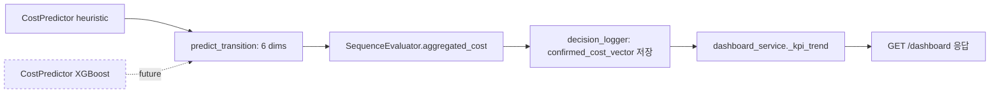
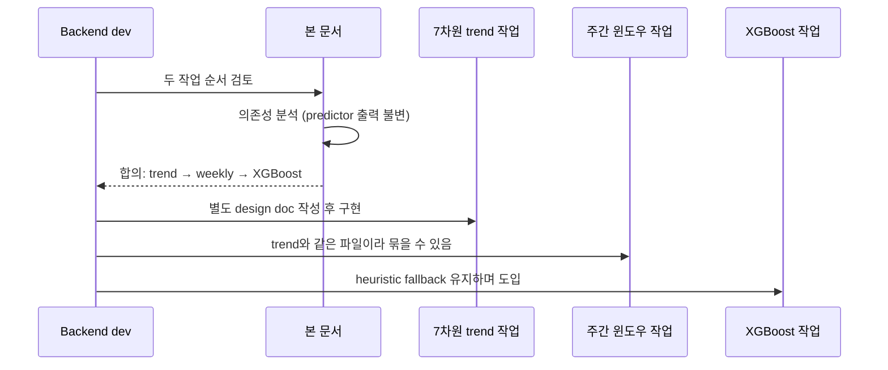
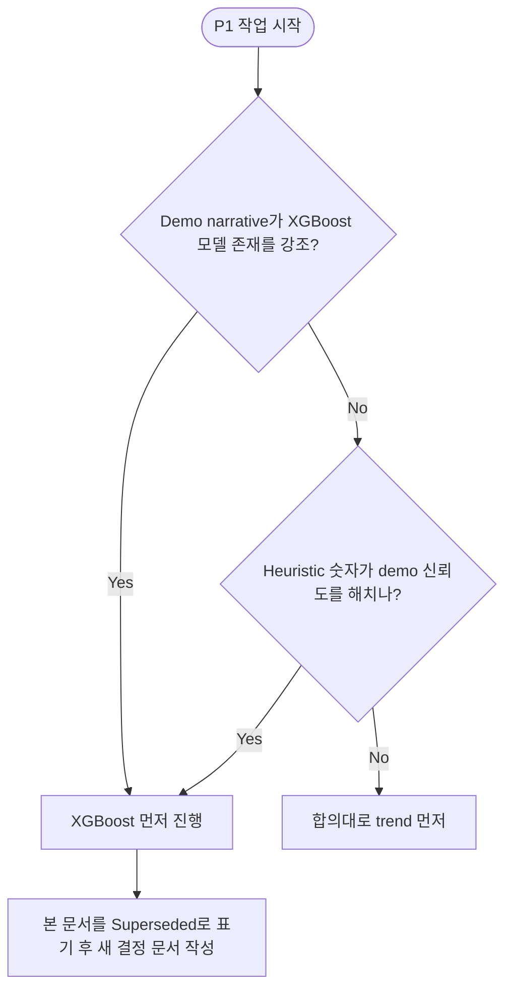

# P1 백엔드 작업 순서 합의 Design Document

> Status: Draft
> Created: 2026-05-19
> Owner: backend

## Context

현재 백엔드의 P0 수직 슬라이스(`GET /plans` → `POST /optimize` → `POST /predict` → `POST /decisions` → `GET /dashboard`)는 동작하며, P1 항목 다섯 가지(template 설명, KPI 차트, 7차원 비용 추이, 주간 요약, reviewed 표시) 중 백엔드 표면은 대부분 채워져 있습니다. 다만 `GET /dashboard` 응답이 7차원 중 3차원만 노출하고 있고, XGBoost는 `train_xgboost.py:6-12`가 stub 상태로 남아 heuristic이 primary path입니다.

이 시점에 백엔드 단독으로 다음에 무엇을 진행할지 결정해야 하는데, 후보로 "XGBoost 도입을 먼저 끝낸 뒤 trend 확장"과 "7차원 trend 확장 먼저, XGBoost는 별도 작업"이 거론되었습니다. 둘 사이의 의존성을 정리하지 않으면 demo flow에 회귀를 유발할 수 있는 큰 작업(XGBoost)이 demo에 즉시 가치를 주는 작은 작업(trend 노출)을 막게 됩니다.

본 문서는 두 작업의 의존 관계를 분석해 **7차원 trend 확장을 먼저 진행하고 XGBoost는 후속 별도 작업으로 분리**한다는 합의를 남기는 것을 목적으로 합니다. 합의 후 구현은 별도 design doc(예: `docs/design/dashboard-kpi-7dim-trend.md`)에서 다룹니다.

## Goals & Non-Goals

### Goals

| Goal | Description |
|---|---|
| 백엔드 단독 가능 P1 작업 식별 | 프론트 변경 없이 backend만으로 끝낼 수 있는 항목을 목록화합니다. |
| 작업 순서 합의 | 7차원 trend → 주간 윈도우 → XGBoost 순서로 진행한다는 결정을 기록합니다. |
| 결정 근거 보존 | 이후 다른 contributor가 동일 질문을 재논의하지 않도록 trade-off를 남깁니다. |

### Non-Goals

| Non-Goal | Reason |
|---|---|
| 7차원 trend 구현 자체 | 본 문서는 순서 합의용입니다. 실제 응답 shape·코드 변경은 후속 설계 문서에서 다룹니다. |
| XGBoost 학습 파이프라인 설계 | 같은 이유로 본 문서 범위 밖입니다. |
| 프론트엔드 작업 | reviewed 토글 UI, 차트 라인 추가 등은 프론트 별도 design doc에서 정의합니다. |
| Reviewed PATCH 백엔드 변경 | `PATCH /decisions/{id}/reviewed`는 이미 구현되어 있어 백엔드 신규 작업이 없습니다. |

## Architecture

본 문서는 코드 구조 변경을 수반하지 않습니다. 의존 관계 분석만 다룹니다.

| 컴포넌트 | 책임 | 본 결정과의 관계 |
|---|---|---|
| `CostPredictor` | 6차원 transition cost 산출 | XGBoost는 이 모듈의 backend만 교체. 반환 dict의 키·시그니처 불변. |
| `SequenceEvaluator` | sequence 단위 aggregated_cost 산출, `sequence_penalty` 합산 | 7차원(6 cost + sequence_risk)의 원천. |
| `decision_logger` | `confirmed_cost_vector` JSON 저장 | 이미 6 dim 전체를 영속화 중. `decision_logger.py:59` |
| `dashboard_service._kpi_trend` | 저장된 cost vector에서 trend payload 구성 | 현재 3 dim만 선택. 본 결정의 변경 지점. `dashboard_service.py:31-40` |

핵심 관찰: **CostPredictor의 출력 모양은 XGBoost로 교체되어도 동일**합니다. 따라서 `dashboard_service`의 응답 확장은 predictor 구현체와 독립적으로 진행할 수 있습니다.

## Sequence / Flow

### 정상 흐름 (의사결정)

| Step | Description |
|---:|---|
| 1 | 백엔드 dev가 다음 P1 작업 후보를 정리합니다. |
| 2 | 두 후보(7차원 trend, XGBoost)의 데이터 흐름을 비교해 응답 contract 의존성이 없음을 확인합니다. |
| 3 | risk·value 비율을 근거로 trend → weekly → XGBoost 순서를 합의합니다. |
| 4 | 합의 결과를 본 문서에 남기고, 구현은 후속 design doc로 분리합니다. |

### 에러 흐름 (합의가 무너지는 경우)

| Case | Handling |
|---|---|
| Demo script가 학습 모델 존재를 강조해야 함 | 본 문서를 Superseded로 표기하고 XGBoost 우선 design doc로 대체합니다. |
| heuristic 숫자가 demo 신뢰도를 떨어뜨림 | 동일하게 본 문서를 갱신 후 우선순위를 바꿉니다. |
| trend 작업 도중 응답 shape 합의가 어긋남 | 구현용 design doc(`dashboard-kpi-7dim-trend.md`)에서 Open Question으로 다루고, 본 문서는 수정하지 않습니다. |

## Decisions & Rationale

### Decision 1: 7차원 trend 확장을 XGBoost 도입보다 먼저 진행

| Item | Description |
|---|---|
| Decision | `dashboard_service._kpi_trend` 응답을 7차원으로 확장하는 작업을 XGBoost 학습·연동보다 먼저 진행합니다. XGBoost는 별도 작업으로 분리합니다. |
| Alternatives | (A) XGBoost를 먼저 끝낸 뒤 trend 확장. (B) 두 작업을 한 PR에 묶어 동시 진행. |
| Rationale | CostPredictor의 출력 dict 키는 heuristic과 XGBoost가 동일하므로 trend payload shape가 XGBoost 도입 여부와 무관합니다. 7차원 trend는 `confirmed_cost_vector`에 이미 영속화된 데이터를 매핑만 다시 하는 작업이라 risk가 거의 0이고, XGBoost는 학습 데이터·산출물·로더·fallback 분기를 모두 추가해야 하는 0→1 작업입니다. trend를 먼저 내보내면 demo 시각화 가치가 즉시 발생하고, XGBoost가 들어와도 응답 contract는 유지됩니다. |
| Impact | XGBoost 도입 완료 시점이 늦어집니다. 그동안 trend의 절대값 정확도는 heuristic 수준에 머무릅니다. demo narrative가 모델 정확도를 강조하지 않는다면 수용 가능합니다. |

### Decision 2: 주간 윈도우 필터를 trend 작업과 같은 PR로 묶을 수 있음

| Item | Description |
|---|---|
| Decision | `_weekly_summary`의 "최근 7일" 필터 보강은 trend 확장과 같은 `dashboard_service.py`를 건드리므로 같은 변경 단위로 묶을 수 있습니다. 다만 강제하지 않고, 작업 크기에 따라 분리해도 됩니다. |
| Alternatives | weekly 필터를 별도 PR로 항상 분리. |
| Rationale | 동일 파일·동일 응답 모델을 건드리는 작업을 두 번에 나누면 review 비용이 중복됩니다. 다만 trend payload shape 결정이 길어지면 weekly만 따로 먼저 내보낼 수도 있습니다. |
| Impact | PR 단위는 후속 구현 design doc에서 최종 결정합니다. |

### Decision 3: XGBoost 도입은 fallback 정책을 유지하며 별도 작업으로 진행

| Item | Description |
|---|---|
| Decision | `CostPredictor`에 XGBoost 분기를 추가할 때 heuristic 경로를 그대로 유지합니다. 모델 로드·추론 실패 시 자동으로 heuristic을 사용합니다. |
| Alternatives | XGBoost가 들어오면 heuristic 코드를 제거. |
| Rationale | AGENTS.md fallback 정책이 명시적으로 heuristic 유지를 요구합니다. demo path에서 모델 파일 부재·추론 실패가 API 전체를 깨뜨리지 않아야 합니다. |
| Impact | `CostPredictor`가 두 경로를 동시에 안고 가게 되어 약간의 복잡도가 늘어납니다. 대신 demo·CI 환경에서 모델 산출물 부재가 blocker가 되지 않습니다. |

## Edge Cases & Error Handling

| Case | Expected Handling | User/System Impact |
|---|---|---|
| 본 문서 합의 후 demo narrative가 변경되어 XGBoost 우선이 필요해짐 | 본 문서를 `Superseded`로 바꾸고 새 결정 design doc를 작성합니다. | 결정 이력이 보존됩니다. |
| trend payload shape가 contract와 어긋남 | 후속 구현 design doc(`dashboard-kpi-7dim-trend.md`)의 Open Question으로 다루고, DB_state v1.3의 `aggregated_cost` 구조와 일관성을 유지합니다. | 본 문서 범위 밖이므로 본 문서는 그대로 둡니다. |
| XGBoost 도입 시 heuristic과 결과가 크게 어긋남 | fallback 정책상 heuristic을 유지하므로 모델 출력만 따로 검증하고, 검증 통과 전에는 모델 로드를 비활성화합니다. | demo 흐름은 영향 없음. |

---

## Data Model

_해당없음_

## API / Interface

_해당없음_

## Workflow

본 문서는 결정 문서이므로 구현 절차는 후속 design doc에서 다룹니다. 권장 후속 문서는 다음과 같습니다.

| 후속 문서 (예시 파일명) | 목적 |
|---|---|
| `docs/design/dashboard-kpi-7dim-trend.md` | `_kpi_trend` payload 7차원 확장과 응답 shape 결정. |
| `docs/design/dashboard-weekly-window.md` (선택) | `_weekly_summary`의 ISO week·최근 7일 필터 도입. trend 문서와 합칠 수도 있음. |
| `docs/design/xgboost-cost-predictor.md` | XGBoost 학습·로더·fallback 분기 도입. |

## Performance

_해당없음_

## Security

_해당없음_

## Observability

_해당없음_

## Migration / Rollback

_해당없음_

## Open Questions

| Question | Owner | Blocking? | Notes |
|---|---|---:|---|
| `kpi_trend` payload를 평탄 키로 둘지 `cost_breakdown` 하위 객체로 묶을지 | backend | No | 본 문서가 아니라 후속 구현 design doc(`dashboard-kpi-7dim-trend.md`)에서 결정합니다. DB_state v1.3의 `aggregated_cost`가 객체이므로 nested 쪽이 contract와 더 일관됩니다. |
| 주간 윈도우 기준을 "최근 7일"로 할지 ISO week로 할지 | backend | No | 후속 구현 design doc에서 결정합니다. 데모 시점이 주 후반이면 ISO week가 빈약하게 보일 수 있습니다. |

## Out of Scope

| Item | Reason |
|---|---|
| 프론트엔드 변경 (Recharts 라인 추가, reviewed 토글 UI) | 프론트 design doc에서 별도 합의합니다. |
| `GET /decisions` 목록 라우트 추가 | "의사결정 로그" Nav 항목은 P2 placeholder입니다. 본 P1 결정과 분리합니다. |
| LLM 실제 호출 연동 | template fallback이 P1에서 명시적으로 허용되어 있습니다. |
