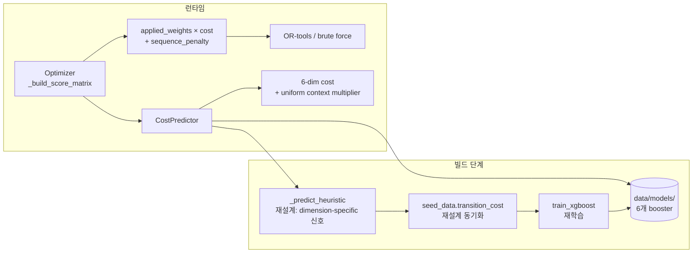
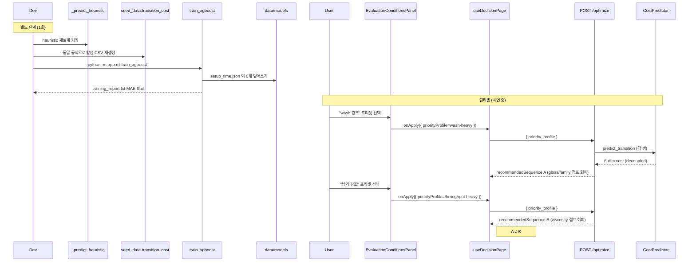
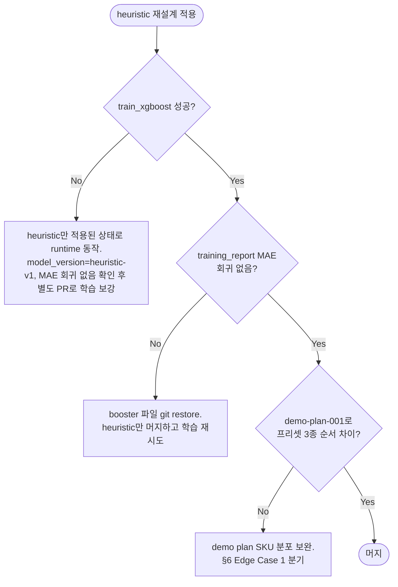
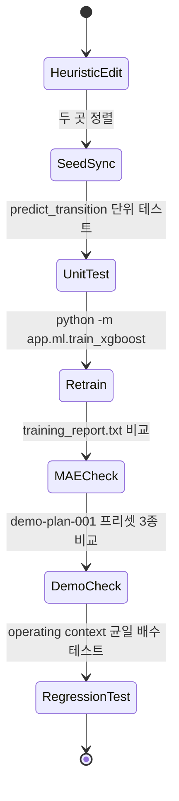

# Priority-Cost Decoupling Design Document

> Status: Draft
> Created: 2026-05-21
> Owner: Ease113
> Related: `docs/design/operating-context-cost-multiplier.md`, `docs/design/cost-predictor-mvp-scope-and-extension.md`, `docs/design/xgboost-cost-predictor-integration.md`, `backend/app/services/cost_predictor.py`, `backend/app/services/optimizer.py`

## Context

`operating-context-cost-multiplier` 작업으로 운영 컨텍스트는 절대 비용만 흔들고, 운영 우선순위(`priority_profile`)는 `/optimize`를 재호출해 추천 순서를 바꾸도록 역할을 분리했습니다. 그러나 실제 시연에서 우선순위 슬라이더를 어떤 조합으로 바꿔도 `recommended_sequence`가 그대로 유지됩니다. `objective_score`만 3~12% 변동할 뿐이라 "AI/ML이 운영 신호에 반응한다"는 데모 메시지가 성립하지 않습니다.

원인은 `/optimize` 로직이 아닙니다. `_build_score_matrix`는 `applied_weights`를 정확히 곱합니다. 문제는 비용 예측기가 만들어내는 6개 차원이 사실상 `complexity` 한 축에 거의 선형 비례한다는 점입니다. heuristic은 `setup_time = 11·complexity`, `downtime = 5·complexity`, `labor_cost = setup_time × 3 × 850`, `wash_cost = 14000·complexity + (~6500 또는 ~1500) + 90·gloss_gap` 등으로 정의되어 있고, XGBoost 모델도 동일 heuristic 출력으로 학습되어 같은 상관 구조를 그대로 학습했습니다. `applied_weights`는 합=1로 재정규화되므로 `Σ w_i · k_i · complexity`가 `complexity × const`로 수렴해 쌍별 ranking이 흔들리지 않습니다.

이 단절을 그대로 두면 `EvaluationConditionsPanel`의 "운영 방침 템플릿" / 5축 Likert가 시연에서 시각적 효과만 있고 실효가 없어 보이고, 본선 Q&A에서 "왜 우선순위를 바꿔도 같은 순서가 나오나" 질문에 우회 답변만 가능합니다. 이번 작업은 6개 비용 차원이 서로 다른 SKU 특성에 dominant하게 반응하도록 비용 구조를 분리하고, XGBoost를 재학습해 우선순위 변경이 추천 순서를 실제로 바꾸도록 정렬합니다.

## Goals & Non-Goals

### Goals

| Goal | Description |
|---|---|
| 우선순위 → 순서 반응성 확보 | "wash 강조", "납기 강조", "포장 안정" 프리셋이 각각 다른 `recommended_sequence`를 만들어내야 합니다. 데모 검증 기준은 §6 Edge Cases에서 정의합니다. |
| 도메인 정합성 유지 | 차원별 dominant 변수가 실제 도료 공정 직관과 어긋나지 않게 매핑합니다. 청중이 "왜 wash가 gloss·family에 반응하나" 질문에 한 줄로 답할 수 있어야 합니다. |
| heuristic·XGBoost 일관성 | 두 경로가 동일한 dimension-feature 매핑을 따르도록 heuristic을 재설계 후 동일 합성 데이터로 XGBoost를 재학습합니다. |
| MAE 회귀 없음 | 재학습 후 `training_report.txt`의 6개 차원 MAE가 현재 수치 대비 동등 또는 개선이어야 합니다. |
| 운영 컨텍스트 균일 배수 보존 | shift·crew_size 변경은 여전히 6차원 전체에 균일 배수로만 곱해져 추천 순서는 보존됩니다 (`operating-context-cost-multiplier` 계약 유지). |

### Non-Goals

| Non-Goal | Reason |
|---|---|
| 실 측정 데이터 도입 | MES/ERP 연동은 P2이며 본 작업 범위 밖입니다 (`cost-predictor-mvp-scope-and-extension` §한계 2). |
| 프론트엔드 UI 변경 | 패널 텍스트와 슬라이더 구조는 이미 의도된 동작을 설명합니다. UI 수정 없이 백엔드 정합화만으로 메시지를 회복합니다. |
| 새 비용 차원 추가 | 7차원 KPI 계약(`DB_state v1.3`)을 유지합니다. setup_time·labor_cost·material_loss·wash_cost·downtime·packaging_time·sequence_risk 그대로. |
| 가중치 정규화 정책 변경 | `priority.py`의 합=1 재정규화는 contract이므로 건드리지 않습니다. |
| 새 XGBoost hyperparameter 튜닝 | `xgboost-cost-predictor-integration`이 정의한 `HYPERPARAMS`를 그대로 사용합니다. |
| OR-tools / brute-force 알고리즘 변경 | 최적화기는 이미 score matrix를 정확히 다룹니다. 입력만 바꿉니다. |

## Architecture

| 컴포넌트 | 책임 | 경계 |
|---|---|---|
| `CostPredictor._predict_heuristic` | 6차원이 각자 dominant feature에 강하게 의존하도록 비용을 산출합니다. complexity 의존은 약화하거나 차원에서 제거합니다. | 운영 컨텍스트 균일 배수는 `predict_transition`에서 그대로 곱합니다. |
| `scripts/seed_data.transition_cost` | heuristic과 동일 매핑으로 합성 라벨을 생성해 train/test CSV의 6 target 컬럼을 만듭니다. | drift 방지를 위해 heuristic과 1:1 동기화 후 단위 테스트로 보장합니다. |
| `app/ml/train_xgboost` | 재생성된 CSV로 6개 booster를 재학습해 `data/models/*.json`을 덮어씁니다. | hyperparameters·feature 컬럼은 변경하지 않습니다. |
| `Optimizer._build_score_matrix` | 변경 없음. 새 cost로 score matrix만 달라집니다. | applied_weights 정책은 유지합니다. |
| 시연 데이터 | `demo-plan-001`의 5개 plan item이 우선순위별로 의미 있는 순서 차이를 만들어야 합니다. | 차이가 안 보이면 §6에 정의한 추가 SKU 변형으로 보완합니다. |

## Sequence / Flow

### 정상 흐름 — 빌드와 런타임

| Step | Description |
|---:|---|
| 1 | heuristic 함수가 차원별 dominant 변수로 6개 비용을 산출합니다. complexity의 공통 비례 항은 setup_time/labor_cost에 한정합니다. |
| 2 | seed_data가 같은 공식 + 가우스 노이즈로 train/test CSV를 만듭니다. heuristic과 1:1 동기화. |
| 3 | XGBoost 재학습이 6 booster를 덮어쓰고 `training_report.txt`가 갱신됩니다. |
| 4 | 런타임에 `/optimize`가 받는 6-dim cost가 차원별로 서로 다른 패턴을 가져 `applied_weights` 재배분이 ranking을 실제로 흔듭니다. |
| 5 | 운영 컨텍스트 균일 배수는 마지막 단계에서 곱해져 순서 영향 없음을 유지합니다 (`operating-context-cost-multiplier` 계약). |

### 주요 에러 흐름

| Case | Handling |
|---|---|
| heuristic만 변경되고 XGBoost 학습이 깨진 상태 | `model_registry`가 모델 로드 실패 시 자동 heuristic fallback. API는 정상 동작하고 추천 순서 분리 효과도 유지. `training_report.txt`는 이전 값 보존. |
| 재학습 후 MAE 회귀 (>10% 악화) | booster 파일을 `git restore` 후 heuristic 변경분만 머지. 학습 데이터 분포 점검 별도 PR로 처리. |
| demo-plan-001에서 프리셋 간 순서 차이가 없음 | seed plan의 SKU 다양성이 충분치 않을 수 있음. `daily_plan.csv` SKU 조합을 viscosity·gloss·family 분산이 큰 5개로 교체하거나, 합성 SKU 1~2개를 추가해 보완. |
| operating context 균일 배수가 깨짐 | 회귀 테스트 1건 추가 (§Verification): 동일 priority + 다른 shift에서 추천 순서 동일성 검증. |

## Decisions & Rationale

### Decision 1: 차원별 dominant 변수 매핑

| Item | Description |
|---|---|
| Decision | 6차원을 다음 dominant 변수에 강하게 의존하도록 재설계합니다. (1) `setup_time` ← complexity baseline (현재 유지) (2) `labor_cost` ← setup_time × baseline crew × 임금률 (현재 유지) (3) `wash_cost` ← gloss_gap + family_changed (4) `downtime` ← viscosity_gap + equipment 영향 (5) `material_loss` ← brightness_gap + metallic 전환 (6) `packaging_time` ← package_changed + 잔여 complexity. |
| Alternatives | (A) 모든 차원을 독립적으로 무작위 노이즈로 흔들기 — 도메인 의미가 사라져 청중 설명 불가. (B) 가중치 정규화를 제거하고 합>1 허용 — `priority.py` 계약·테스트 다수 변경. (C) score matrix에 dimension-specific noise 주입 — 빠르지만 도메인 정합성 약화. (D) 학습 데이터만 재생성하고 heuristic은 그대로 — 두 경로가 drift됨. |
| Rationale | 매핑이 도메인 직관과 일치합니다. 광택 점프는 세척 부담, 점도 점프는 라인 클리어링 시간, 명도/메탈릭 점프는 폐기/색조 안정화 자원, 포장 변경은 라인 셋업 시간으로 1:1 연결됩니다. 청중 Q&A 한 줄 답이 가능합니다. setup_time/labor_cost는 모든 전환의 공통 셋업 비용이므로 complexity baseline을 유지해 "기본 셋업은 항상 든다"는 신호를 보존합니다. 본 매핑의 정당성은 MVP 단계에서는 도메인 직관 + 일반적 도료 공정 상식 수준에서만 보장합니다. 실 측정값이 누적되면 동일 XGBoost 파이프라인이 각 차원의 실 기여도를 데이터에서 자동 학습해 매핑 정확도를 보정합니다 (`cost-predictor-mvp-scope-and-extension` §4.2 참고). |
| Impact | heuristic 약 40~60줄 재작성. seed_data 동일 함수 동기화. XGBoost 6모델 재학습 (≈10초). 학습 후 `training_report.txt` MAE는 차원별로 비슷하거나 더 낮을 가능성이 큼 (각 모델이 자기 dominant feature에 집중). |

### Decision 2: complexity 의존을 setup/labor에 한정

| Item | Description |
|---|---|
| Decision | wash_cost·downtime·material_loss·packaging_time의 complexity 의존을 0 또는 약한 trim 항으로 제거하고, dominant feature와 baseline 상수에 집중합니다. |
| Alternatives | (A) complexity 항을 전부 유지하고 dimension-specific 항만 키우기 — 절대값 차이가 묻혀 ranking 변화가 미약. (B) complexity 자체를 차원별로 분해 — 도메인 의미가 흐릿. |
| Rationale | 현재 ranking이 흔들리지 않는 가장 큰 원인이 4개 차원에 공통 곱해진 complexity 항입니다. 이를 제거해야 가중치 재분배가 실제로 ranking을 흔듭니다. setup_time/labor_cost는 "공통 셋업 비용" 의미를 가지므로 complexity 유지가 자연스럽습니다. |
| Impact | wash_cost는 family/gloss 신호 강도가 14000·complexity 항을 대체할 만큼 키워져야 합니다. 현 `wash_cost = 14000·complexity + family_jump + 90·gloss_gap` → `wash_cost = base + family_jump + α·gloss_gap`로 단순화. α는 §Performance에서 정의합니다. |

### Decision 3: seed_data와 heuristic 1:1 동기화 + 단위 테스트

| Item | Description |
|---|---|
| Decision | `seed_data.transition_cost`가 `_predict_heuristic`을 직접 호출하도록 리팩터합니다. 가우스 노이즈는 호출 후 별도 단계로 추가합니다. |
| Alternatives | (A) 두 곳을 따로 유지 — 미래 drift 위험 (이미 한 번 발생). (B) `_predict_heuristic`을 seed_data로 옮기고 CostPredictor가 import — 모듈 의존 역전. |
| Rationale | `_predict_heuristic`이 단일 진실원천이 되고 seed_data는 라벨 생성 wrapper 역할만 합니다. 향후 비용 모델 변경 시 1곳만 수정하면 됩니다. |
| Impact | seed_data 함수 시그니처가 단순해집니다. 기존 회귀 테스트 1건은 동일 입력에 대해 동일 6차원 값을 검증합니다. |

### Decision 4: 회귀 방어 — operating context 균일 배수 보존 테스트

| Item | Description |
|---|---|
| Decision | `test_optimize_operating_context_uniform`을 추가해 동일 priority + 동일 plan_items + 다른 shift 조합에서 `recommended_sequence`가 일치함을 검증합니다. |
| Alternatives | (A) 기존 통합 smoke만으로 충분 — 회귀 시 디버깅 비용 큼. (B) `predict_transition` 단위 테스트만 — end-to-end가 깨질 가능성 잔존. |
| Rationale | 비용 구조를 바꾸면서 균일 배수 경로(`_baseline_context` + `_operating_context_multiplier`)를 무심코 건드릴 위험이 큽니다. e2e 테스트가 가장 빠른 안전 그물입니다. |
| Impact | 테스트 1건 추가, 약 30줄. CI 영향 미미. |

## Edge Cases & Error Handling

| Case | Expected Handling | User/System Impact |
|---|---|---|
| demo-plan-001 SKU 다양성 부족으로 프리셋 간 순서 차이 미발생 | `daily_plan.csv` 5개 SKU를 viscosity 분산·gloss 분산이 큰 조합으로 교체 또는 1~2개 추가. SKU master는 그대로. | 시연 narrative가 시각적으로 명확해짐. roadmap 영향 없음. |
| family_changed 점프가 너무 커서 wash가 항상 dominant | wash_cost dimension-specific 상수 α (gloss_gap 계수)를 조정해 family_changed 점프(약 5000원)와 동일 스케일로 유지. §Performance에 수치 기준. |
| 재학습 후 booster MAE 회귀 | booster 파일을 git restore. 학습 데이터 분포 점검 별도 PR. 런타임은 heuristic 경로로 동작. |
| 운영자가 모든 차원을 VERY_LOW로 설정 | 정규화 후 합=1로 재분배되어 NORMAL과 동일 결과 (현재 contract 유지). 시연에서는 발생하지 않음. |
| context 균일 배수 보존 회귀 | `test_optimize_operating_context_uniform` 실패 → 머지 차단. |
| XGBoost와 heuristic 결과 분포가 크게 어긋남 | `tests/test_xgboost.py`의 fallback 비교 케이스를 활용해 MAE 차이를 threshold(<20%)로 검증. |
| sequence_risk가 wash_cost를 가려 순서를 고정시킴 | sequence_risk는 priority 가중치 대상 아니지만 sequence_penalty로 합산됨. 데모 plan에서 risk 페널티가 wash_cost 차이를 가리지 않는지 확인 (`docs/source/DB_state_v1.3.md` §74 참고). |

---

## Data Model

_해당없음_ — 7차원 KPI 계약과 train/test CSV 컬럼은 그대로 유지합니다.

## API / Interface

_해당없음_ — `/optimize`·`/predict`·`/decisions` 요청·응답 shape는 변경 없습니다.

## Workflow

## Performance

| Item | Target |
|---|---|
| heuristic 1회 호출 (`predict_transition`) | 현재 수준 유지 (수십 µs). |
| XGBoost 재학습 1회 | 10초 이내 (Apple Silicon, 기존과 동일). |
| `/optimize` 응답 (N=5 plan items) | 5초 이내 (기존과 동일, OR-tools 시간이 dominant). |
| 6차원 MAE | 차원별 현 값 대비 ±20% 이내 유지 또는 개선. |
| wash_cost 절대 스케일 | family_changed 점프 ≈ gloss_gap·α (α는 family_jump / max gloss_gap ≈ 5000 / 70 = 71 정도로 조정). |
| downtime / material_loss 절대 스케일 | 현재 평균과 동일 자릿수 유지 (downtime 분 단위, material_loss L 단위). |

## Security

_해당없음_ — 비용 산출 로직 변경, 외부 입력·인증·시크릿 영향 없음.

## Observability

| 항목 | 설명 |
|---|---|
| 학습 로그 | `training_report.txt`에 재학습 시각·6차원 MAE 누적 표시 (기존 포맷 유지). |
| 런타임 로그 | XGBoost 추론 실패 시 기존 `_log.warning("XGBoost predict failed ...")` 그대로 사용. |
| 회귀 신호 | `test_optimize_operating_context_uniform`이 회귀 시 CI 실패로 가시화. |

## Migration / Rollback

| 항목 | 설명 |
|---|---|
| Migration steps | (1) heuristic 패치 (2) seed_data 동기화 (3) 단위 테스트 통과 (4) `python -m app.ml.train_xgboost` 1회 (5) demo-plan-001로 프리셋 3종 순서 차이 시각 확인 (6) 회귀 테스트 추가 (7) 커밋. |
| Backward compatibility | API shape·CSV 컬럼·SQLite 스키마 변경 없음. 프론트엔드 호환성 영향 없음. |
| Rollback method | `git revert` 후 `python -m app.ml.train_xgboost` 재실행 또는 booster 파일 `git restore`. heuristic만 롤백할 경우 booster가 새 heuristic 분포 학습 상태로 남으므로 booster도 함께 롤백 필요. |
| Data recovery concerns | 합성 데이터이므로 영구 보존 대상 없음. `transition_history_train.csv` / `transition_history_test.csv`는 매 빌드 재생성되는 산출물. |

## Verification

| 검증 항목 | 방법 |
|---|---|
| heuristic 단위 일치 | `predict_transition`에 wash 강조 vs 납기 강조 SKU 쌍을 넣어 6차원 비율 변화 측정. |
| seed_data 동기화 | `transition_cost(seed_input)` 결과가 `_predict_heuristic(seed_input)`와 노이즈 외에 동일함을 단위 테스트로 검증. |
| 재학습 정상 | `training_report.txt`의 6차원 MAE가 현 값 대비 ±20% 이내. |
| 우선순위 → 순서 변경 | demo-plan-001로 (a) 전체 NORMAL (b) "wash VERY_HIGH 나머지 LOW" (c) "downtime VERY_HIGH 나머지 LOW" 3개 호출. (a), (b), (c) 중 최소 2쌍이 서로 다른 `recommended_sequence`를 반환. |
| 운영 컨텍스트 균일 배수 보존 | 동일 priority + day vs night 두 호출의 `recommended_sequence`가 동일. |
| 통합 smoke | `pytest tests/`, `GET /health`, `/plans` → `/optimize` → `/predict` → `/decisions` → `/dashboard` 정상. |

## Open Questions

| Question | Owner | Blocking? | Notes |
|---|---|---:|---|
| 5개 plan item이 충분한 다양성을 가지나? | Ease113 | No | 미달이면 Decision 1 Impact에 따라 SKU 1~2개 추가. 시연 직전 확인. |
| wash α 계수(71)가 적절한가? | Ease113 | No | `training_report.txt` 분포로 1회 보정. |
| sequence_risk 페널티가 비용 차이를 가리는가? | Ease113 | No | demo plan의 rule_engine 페널티가 wash_cost / downtime 차이보다 작도록 `sequence_rules.json` 검토. |

## Out of Scope

| Item | Reason |
|---|---|
| MES/ERP 실 측정 데이터 도입 | P2, 본 작업과 독립 |
| 다중 라인 / 작업자 뷰 | P2 |
| sequence_rules.json 규칙 추가 | 별도 PR로 분리 가능 |
| XGBoost hyperparameter 튜닝 | `xgboost-cost-predictor-integration` 결정 유지 |
| 프론트엔드 텍스트·UI 변경 | 본 작업으로 메시지가 실효를 가지므로 추가 카피 변경 불필요 |

## Implementation Plan

> 본 섹션은 사용자 승인 후 코드 변경 직전에 구체화합니다. 합의 시점에 target file·step·verify 기준을 채워 넣습니다.

| Step | Target | Verify |
|---|---|---|
| 1 | `backend/app/services/cost_predictor.py` `_predict_heuristic` 재설계 (Decision 1·2 매핑) | `pytest backend/tests/test_cost_predictor.py` 통과, wash 강조 vs 납기 강조 입력으로 6차원 비율 차이 출력 |
| 2 | `backend/scripts/seed_data.py` `transition_cost`를 heuristic 호출 wrapper로 정리 (Decision 3) | 동일 seed 입력 두 곳 결과 동일성 단위 테스트 |
| 3 | `python -m app.ml.train_xgboost` 1회 실행, `data/models/*.json` 갱신 | `training_report.txt`에 MAE 회귀 없음 |
| 4 | `backend/tests/test_optimize_priority_decoupling.py` 신규: 프리셋 3종 순서 차이 검증 | 최소 2쌍이 서로 다른 sequence |
| 5 | `backend/tests/test_optimize_operating_context_uniform.py` 신규 (Decision 4) | day/night 비교 후 sequence 일치 |
| 6 | demo-plan-001 시각 확인 (`/optimize`로 priority 3종 호출 후 직접 비교) | 사람 눈으로 sequence 차이 확인 |
