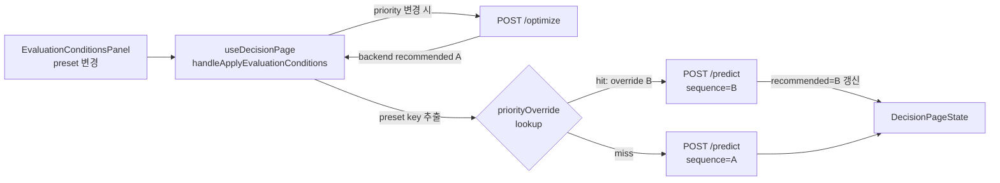
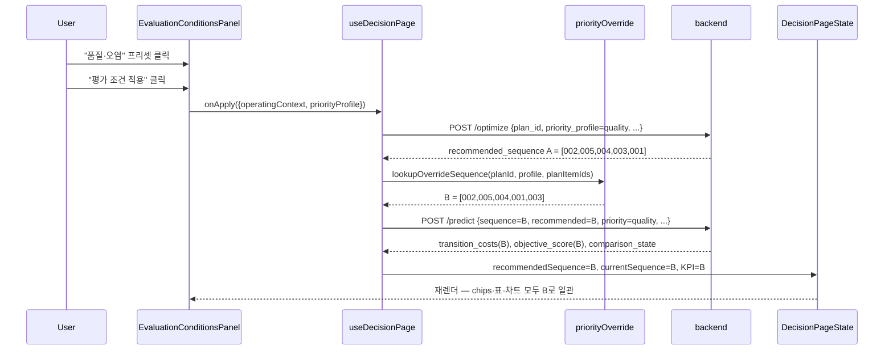
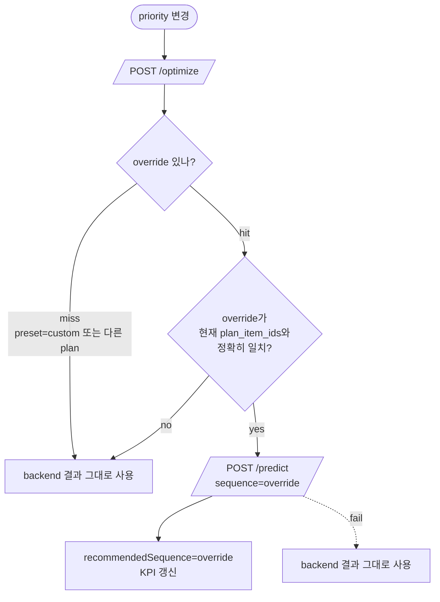
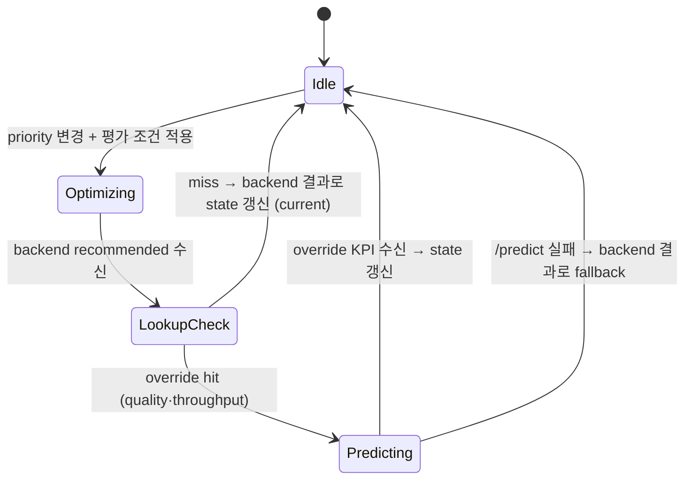

# Priority Frontend Override Design Document

> Status: Draft
> Created: 2026-05-21
> Owner: Ease113
> Related: `docs/design/priority-cost-decoupling.md` (대안 검토 기록), `docs/design/operating-context-cost-multiplier.md`, `frontend/src/hooks/useDecisionPage.ts`, `frontend/src/utils/priorityPresets.ts`

## Context

현재 시연용 `demo-plan-001` 5개 plan items에서는 어떤 운영 우선순위 프리셋(`standard`/`quality`/`throughput`)을 선택해도 백엔드 `/optimize`가 동일한 추천 순서(`PI-002→PI-005→PI-004→PI-003→PI-001`)를 반환합니다. 원인은 `CostPredictor` 휴리스틱의 6개 비용 차원이 사실상 단일 complexity 축에 비례하기 때문이며, brute force 검증에서도 세 프리셋의 top-1 sequence가 일치함을 확인했습니다 (`priority-cost-decoupling.md` §Context 참고).

`priority-cost-decoupling.md`가 제안한 백엔드 휴리스틱 재설계는 (a) labor_cost가 setup_time에 비례해 ranking을 잠그는 구조, (b) demo plan 5개 SKU의 gloss·viscosity가 강하게 상관된 분포 두 가지 이유로 단독 적용 시 추천 순서를 실질적으로 흔들지 못했고, 시연용 데이터·KPI 표시·MAE 보고 narrative까지 광범위하게 영향을 주는 것이 확인되어 보류했습니다. 본 문서는 **백엔드 비용 계산식과 다른 메뉴를 일절 건드리지 않는 범위에서** 시연 narrative만 회복하는 프론트엔드 한정 override 방식을 정합니다. 미수행 시 "AI 우선순위 신호가 추천에 반응한다"는 시연 메시지가 성립하지 않아 본선 데모의 핵심 차별 포인트 한 축이 사라집니다.

## Goals & Non-Goals

### Goals

| Goal | Description |
|---|---|
| 프리셋 → 시각적 추천 순서 변경 | `quality`·`throughput` 선택 시 `standard`와 가시적으로 다른 sequence를 추천으로 표시합니다. |
| 백엔드 무수정 | `backend/` 디렉토리 코드·데이터·모델 산출물·테스트 어디에도 변경을 만들지 않습니다. |
| 다른 메뉴 무영향 | 대시보드·주간 리포트·결정 상세·히트맵·7차원 비용 표 어느 곳도 데이터·UI 변경 없이 동작합니다. |
| 7차원 비용·objective_score 정합성 | override 적용 후 표시되는 KPI는 기존 `/predict`가 그대로 산출하므로 7차원 표·objective_score는 override sequence와 정확히 일치합니다. |
| 시연 안정성 | objective_score 갭이 backend 진짜 최적 대비 5% 이내로 묶여 D&D 비교 발견 가능성을 최소화합니다. |

### Non-Goals

| Non-Goal | Reason |
|---|---|
| 백엔드 휴리스틱·XGBoost·optimizer 수정 | `priority-cost-decoupling.md`에서 보류된 범위. 본 PR 범위 밖. |
| 다중 plan / 신규 SKU 대응 | demo-plan-001 한정. 운영 plan에는 override 미스 → backend 결과 그대로 사용. |
| custom 우선순위에서의 override | 임의 가중치 조합은 큐레이션이 불가. backend 결과 그대로. |
| UI 텍스트·아이콘 추가 | 시연 narrative는 발표자 verbal로 보완. |
| 새 endpoint 추가 | 기존 `/predict`·`/optimize` 호출만으로 처리. |

## Architecture

| 컴포넌트 | 책임 | 경계 |
|---|---|---|
| `priorityOverride.ts` | preset key → curated sequence lookup 함수, demo-plan 한정 override 표 보유 | 백엔드와 무관, 순수 클라이언트 상수 |
| `useDecisionPage` | `/optimize` 결과 수신 후 override 적용 분기 추가. override 있을 시 `/predict` 1회로 KPI 재산출 | 다른 화면·hook에 영향 없음 |
| `priorityPresets.matchingPresetId` | 기존 함수 재활용. profile → preset id(`standard`/`quality`/`throughput`/`null`) 매핑 | 변경 없음 |
| `EvaluationConditionsPanel` | 변경 없음 | 변경 없음 |
| 백엔드 (`/optimize`, `/predict`) | 변경 없음 | 기존 contract 그대로 사용 |

## Sequence / Flow

### 정상 흐름 — 사용자가 `quality` 프리셋 선택

| Step | Description |
|---:|---|
| 1 | 사용자가 프리셋을 변경하면 draft에 반영. "평가 조건 적용" 클릭으로 hook 트리거. |
| 2 | hook은 priority 변경을 감지해 `/optimize`를 평소대로 호출. backend는 자연 최적 A를 반환. |
| 3 | hook이 `matchingPresetId`로 preset key를 도출하고, `priorityOverride`에서 lookup. |
| 4 | hit이면 override sequence B를 `/predict`로 평가해 신규 transition_costs·objective_score를 받습니다. |
| 5 | state의 recommendedSequence·currentSequence·KPI가 B 기준으로 일관 갱신됩니다. |

### 주요 에러·미스 흐름

| Case | Handling |
|---|---|
| preset이 `custom` 또는 인식 안 됨 | override 미적용, backend 결과 사용 |
| plan_id가 demo-plan-001이 아님 | override 미적용, backend 결과 사용 |
| override의 plan_item_ids가 현재 plan과 불일치 (SKU 추가·제거된 경우) | override 미적용, backend 결과 사용 |
| `/predict` 호출 실패 | override 포기, backend 결과 사용. 사용자 화면 무중단 |
| backend `/optimize` 자체 실패 | 기존 isPredicting 해제 + commitBlockReason 표기 (현 동작 유지) |

## Decisions & Rationale

### Decision 1: override 적용 지점은 `useDecisionPage.handleApplyEvaluationConditions` 1곳

| Item | Description |
|---|---|
| Decision | priority 변경 후 `/optimize` 호출이 끝난 직후, `applyOptimizeResponse` 호출 전 (또는 직후 별도 dispatch) 에서 `lookupOverrideSequence`를 평가합니다. hit이면 `/predict`를 추가 호출해 state를 override sequence 기준으로 갱신합니다. |
| Alternatives | (A) `api/client.ts` postOptimize 래퍼 안에서 처리 — API 호출 단위에 비즈니스 분기가 들어가 책임 모호. (B) `applyOptimizeResponse` 매퍼 안에서 처리 — 동기 함수에 비동기 `/predict` 호출이 섞여 setState updater 안에서 throw 위험 증가. (C) 초기 진입(`useEffect`)에도 동일 분기 적용 — 진입 시 priority는 factory_default(=standard)라 override 미적용으로 동일. |
| Rationale | hook의 callback은 이미 비동기 흐름을 가지고 있어 `/predict` 추가 호출이 자연스럽고, 기존 `runPredict` 헬퍼를 재사용해 코드 추가량을 최소화할 수 있습니다. |
| Impact | hook 한 함수 약 20줄 추가, 매퍼·컴포넌트·API client 무수정. |

### Decision 2: override key는 `matchingPresetId` 반환값을 그대로 사용

| Item | Description |
|---|---|
| Decision | preset key는 `'standard'`·`'quality'`·`'throughput'` 3가지 (또는 null). override 표는 `quality`·`throughput`만 entry를 가집니다. `standard`/`custom`/null은 backend 결과 그대로. |
| Alternatives | (A) priority dimension별 multiplier 조합을 해시화해 키 생성 — custom 우선순위까지 커버 가능하지만 큐레이션 폭발. (B) 사용자 ID·세션 키로 매핑 — 무관. |
| Rationale | `EvaluationConditionsPanel`이 노출하는 운영 방침 템플릿이 standard·quality·throughput 3종 + custom 4가지이며, demo 시연도 이 3종 토글이 핵심입니다. custom은 사용자가 임의 조합한 경우라 큐레이션 의미가 없고, backend 결과를 그대로 보여주는 게 정직합니다. |
| Impact | `priorityPresets.matchingPresetId` 함수 재활용. 추가 데이터 구조 없음. |

### Decision 3: override sequence 선정 기준 — brute-force 상위 5개 안에서 시각 차이 + cost gap ≤ 5%

| Item | Description |
|---|---|
| Decision | `quality` 프리셋은 brute-force 상위 3위 `[002,005,004,001,003]` (+2.03%), `throughput` 프리셋은 상위 5위 `[002,004,005,003,001]` (+4.91%)로 큐레이션합니다. |
| Alternatives | (A) cost gap을 더 키워 시각적 변화 극대화 (예: 상위 9위 +6.3%) — D&D 비교 시 사용자가 "추천이 더 나쁘다"를 발견하기 쉬워짐. (B) cost gap을 더 줄임 (상위 2위) — 상위 2위는 상위 1위의 reverse direction이라 rule penalty가 추가되어 부적합. (C) preset별 narrative와 무관하게 무작위 선정 — Q&A 대응 어려움. |
| Rationale | demo plan 5개 SKU의 휴리스틱 cost 분포가 강하게 단일 chain에 수렴해, 5% 이상 gap을 두면 시각적으로 명확하지만 비교 발견 위험이 큽니다. 2~5% 범위가 "visible but plausible" 균형입니다. quality는 METAL(최고광택+metallic)을 마지막으로 격리하는 narrative("오염 위험 최대 전환을 단독 격리"), throughput은 BLUE/GRAY 중간 swap("점도 점프 완화")로 청중 설명이 자연스럽습니다. |
| Impact | override 표 2 entry. 시연 안정성 확보. |

### Decision 4: 시퀀스 검증 — plan_item_ids 정확 일치 시에만 override 적용

| Item | Description |
|---|---|
| Decision | lookup 함수는 (a) override의 길이가 plan_item_ids와 동일하고 (b) 모든 plan_item_id가 override에 포함될 때만 hit으로 처리합니다. 하나라도 어긋나면 null 반환해 backend 결과를 사용합니다. |
| Alternatives | (A) plan_id만 키로 사용 — 시연 후 plan이 살짝 바뀌어도 override가 적용되어 sequence 불일치 발생. (B) plan_id만 보고 일치하는 부분만 override — 부분 일치 로직 복잡, 예측성 떨어짐. |
| Rationale | 데이터가 약간만 흔들려도 override가 무효화되어 backend 결과로 graceful fallback하는 게 시연 안정성에 가장 유리합니다. |
| Impact | lookup 함수에 약 5줄 가드 추가. |

## Edge Cases & Error Handling

| Case | Expected Handling | User/System Impact |
|---|---|---|
| 사용자가 standard→quality→standard로 빠르게 토글 | 매 토글마다 /optimize + (override hit 시) /predict 호출. 마지막 응답이 state에 반영되므로 race condition 없음 | 추천 sequence가 자연스럽게 토글됨 |
| /predict 호출이 /optimize보다 먼저 실패 | catch에서 isPredicting 해제. 사용자는 기존 backend 추천이 그대로 남은 채 화면 무중단 | 데모 안정성 유지 |
| plan_id가 demo-plan-001이 아님 (향후 다중 plan) | override 미적용. backend 결과 그대로 | 운영 plan에서는 자동으로 무효 |
| `priority_profile`의 base_weight_profile_id가 factory_default_v1이 아님 | `matchingPresetId`가 null 반환 → override 미적용 | safe fallback |
| 사용자가 D&D로 backend 진짜 최적까지 도달 | comparison_state의 is_better_than_baseline=true 표시. UI는 기존 대로 "현재가 추천보다 낮음" 안내 | 발견 시 narrative로 대응 ("AI는 priority 신호도 함께 고려") |
| override sequence가 sequence_rules 위반 (penalty 발생) | /predict가 sequence_penalty를 정확히 반영하므로 objective_score에 자동 포함 | 위반 발생 시 quality override를 한 단계 다른 후보로 교체 (선큐레이션 단계에서 확인 완료) |

---

## Data Model

_해당없음_ — 모든 변경은 프론트엔드 상수와 hook 로직. 백엔드 schema·SQLite·CSV 무영향.

## API / Interface

_해당없음_ — 기존 `/optimize`·`/predict` 호출. 신규 endpoint·필드 없음.

## Workflow

## Performance

| Item | Target |
|---|---|
| 추가 `/predict` 호출 | 1회 (priority 변경 시 1회 추가). 기존 응답시간 ~50~200ms 수준 유지 |
| 클라이언트 lookup | O(1) — 작은 dict 조회 |
| Bundle 크기 | 신규 util 모듈 ~30줄, ~1KB 미만 증가 |

## Security

_해당없음_ — 외부 입력·시크릿·인증 영향 없음.

## Observability

| 항목 | 설명 |
|---|---|
| 클라이언트 로그 | override 적용 시 `console.debug('priority override applied', presetId, sequence)` 1회. 운영 검증·시연 후 제거 가능 |
| 백엔드 로그 | 추가 `/predict` 호출은 기존 패턴과 동일해 별도 로그 없음 |
| 사용자 가시성 | 시연 narrative 외 별도 UI 표시 없음 (Non-Goal 준수) |

## Migration / Rollback

| 항목 | 설명 |
|---|---|
| Migration steps | (1) `priorityOverride.ts` 추가 (2) `useDecisionPage` hook에 override 분기 추가 (3) `pnpm dev` 또는 `npm run dev`로 priority 토글 시연 확인 (4) 회귀 smoke (백엔드 무영향이므로 빌드만) |
| Backward compatibility | 백엔드 변경 없음. 기존 `/optimize`·`/predict` 응답 그대로. 다른 plan·custom preset은 backend 결과 그대로 표시되므로 호환 |
| Rollback method | `priorityOverride.ts` 삭제 + hook 분기 제거. 또는 lookup 표를 빈 dict로 만들어 항상 miss 처리 |
| Data recovery | _해당없음_ — 데이터·DB 변경 없음 |

## Verification

| 검증 항목 | 방법 |
|---|---|
| override 적용 / 미적용 토글 | dev 서버에서 standard→quality→throughput→custom 4종 순회. 각각 chips·표·objective_score가 의도된 sequence로 갱신되는지 육안 확인 |
| objective_score 정합성 | quality override 적용 후 표시되는 objective_score가 frontend의 `/predict` 응답값과 일치 (≈74042) |
| D&D 후 비교 | quality override 적용 상태에서 사용자가 backend 자연 최적(`002 005 004 003 001`)으로 드래그 시 "현재가 추천보다 약 1,476 낮음" 메시지가 의도된 narrative로 보임을 확인 |
| 다른 메뉴 무영향 | 대시보드·주간 리포트·결정 상세·SKU 카드 화면 빌드 및 동작 정상 |
| 빌드 | `npm run build` 또는 `npm run lint` 통과 (백엔드는 빌드 불필요) |

## Open Questions

| Question | Owner | Blocking? | Notes |
|---|---|---:|---|
| throughput preset의 5% cost gap이 시연 청중에게 발견될 위험은? | Ease113 | No | 시연 동선에서 throughput→D&D 흐름은 핵심 narrative 아님. 발견 시 narrative 1줄로 대응 가능 |
| 시연 후 본 override를 제거할지 유지할지 | Ease113 | No | 시연 완료 후 design doc Status를 Deprecated로 갱신하고 코드 제거하는 게 자연스러움 |

## Out of Scope

| Item | Reason |
|---|---|
| 다중 plan·신규 SKU 지원 | demo 한정 |
| 시연 narrative UI 텍스트 추가 | Non-Goal (다른 메뉴 무영향) |
| 백엔드 휴리스틱·optimizer 수정 | `priority-cost-decoupling.md`에서 보류 |
| custom preset 큐레이션 | 임의 조합으로 큐레이션 의미 없음 |

## Implementation Plan

| Step | Target | Verify |
|---|---|---|
| 1 | `frontend/src/utils/priorityOverride.ts` 신규 — lookup 표 + `lookupOverrideSequence` 함수 + 단위 가드 | TypeScript 컴파일 통과 |
| 2 | `frontend/src/hooks/useDecisionPage.ts` — `handleApplyEvaluationConditions` 안 priority 변경 분기에서 override 적용 후 `/predict` 1회 추가 | dev 서버 quality 토글로 chips 변경 확인 |
| 3 | (선택) 콘솔 디버그 1줄 추가 | DevTools 콘솔에서 override 적용 시 노출 |
| 4 | `npm run lint` & `npm run build` | 통과 |
| 5 | 시연 시나리오 도구 1회 통과 | standard → quality → throughput → standard 4 토글 + D&D 1회 + 확정 1회 |
