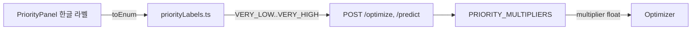
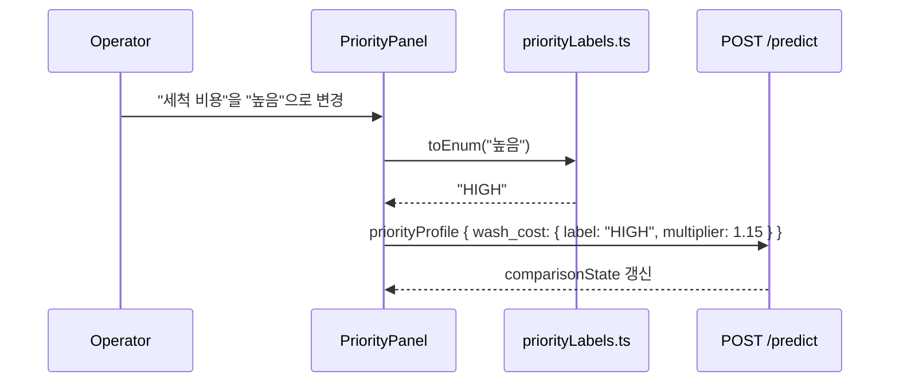
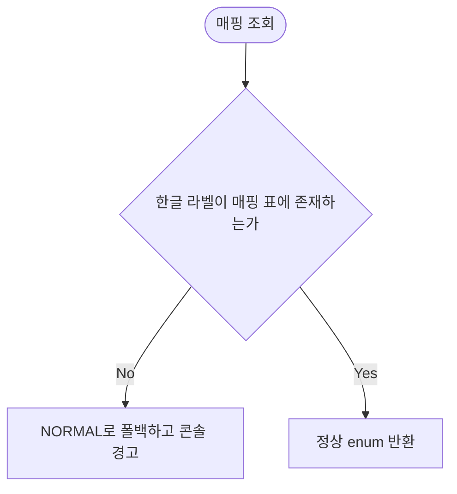

# PriorityLabel 한↔영 매핑 Design Document

> Status: Draft
> Created: 2026-05-17
> Owner: backend (Lee Yuan)

## Context

`PriorityPanel`은 운영자가 비용 차원별 우선순위를 5단계로 조정하는 UI입니다.
와이어프레임 v4는 한글 라벨(`최저 / 낮음 / 보통 / 높음 / 최고`)을 노출하지만,
백엔드 계약은 영문 enum `PriorityLabel = VERY_LOW | LOW | NORMAL | HIGH | VERY_HIGH`
(`frontend/src/api/types.ts:1`, `backend/app/services/priority.py:13`)를 사용합니다.

지금까지 한글 라벨과 영문 enum, 그리고 multiplier 기본값(`PRIORITY_MULTIPLIERS`)을
1:1로 묶어 둔 문서가 없어, 프론트엔드 구현자가 임의 매핑이나 임의 multiplier 값을
하드코딩할 위험이 있습니다. 본 문서는 그 매핑을 단일 source of truth로 고정해
구현 시 결정 비용과 PR 왕복을 줄이는 것을 목적으로 합니다.

## Goals & Non-Goals

### Goals

| Goal | Description |
|---|---|
| 라벨 매핑 고정 | 한글 UI 라벨, 영문 enum, multiplier 기본값을 한 표로 명문화합니다. |
| 매핑 위치 합의 | 프론트엔드에서 라벨 변환을 담당할 단일 모듈 위치를 합의합니다. |
| 계약 출처 정리 | 매핑이 어느 백엔드 코드/문서에 근거하는지 링크합니다. |

### Non-Goals

| Non-Goal | Reason |
|---|---|
| 프론트엔드 유틸 모듈 신규 작성 | 본 문서는 계약 정의에 한정합니다. 실제 모듈은 PriorityPanel 구현 PR에서 생성합니다. |
| multiplier 값 자체 재조정 | 기존 backend 값을 그대로 채택합니다. 값 변경 제안은 별도 문서로 다룹니다. |
| 다국어 확장 | MVP는 한국어 UI만 다룹니다. |

## Architecture

라벨 변환은 프론트엔드 단방향 매핑입니다. 백엔드는 영문 enum만 인식합니다.



| 컴포넌트 | 책임 |
|---|---|
| `PriorityPanel` (frontend) | 한글 라벨 표시, 사용자 입력 수집 |
| `priorityLabels.ts` (frontend, 예정) | 한글 ↔ 영문 enum ↔ multiplier 기본값 매핑 단일 source |
| `backend/app/services/priority.py` | `PRIORITY_MULTIPLIERS` 보유, `normalize_priority_profile`로 영문 enum 해석 |

## Sequence / Flow

### 정상 흐름



| Step | Description |
|---:|---|
| 1 | 운영자가 한글 라벨로 우선순위를 변경합니다. |
| 2 | 프론트엔드가 `priorityLabels.ts`로 영문 enum과 multiplier 기본값을 조회합니다. |
| 3 | `POST /predict` 요청에 영문 enum 형태의 `priority_profile`을 포함합니다. |
| 4 | 백엔드 `normalize_priority_profile`이 enum을 검증하고 multiplier를 적용합니다. |

### 주요 에러 흐름



| Case | Handling |
|---|---|
| 매핑 표에 없는 한글 라벨 | `NORMAL`로 폴백하고 콘솔에 경고를 남깁니다. UI는 차단하지 않습니다. |
| 백엔드가 모르는 enum 수신 | `normalize_priority_profile`이 `NORMAL`로 폴백합니다 (`backend/app/services/priority.py:54`에 이미 구현). |

## Decisions & Rationale

### Decision 1: 라벨 매핑은 프론트엔드 단일 모듈에 둡니다

| Item | Description |
|---|---|
| Decision | 한글 ↔ 영문 enum 변환은 `frontend/src/utils/priorityLabels.ts` 한 곳에서만 수행합니다. |
| Alternatives | (a) 컴포넌트마다 인라인 매핑 객체 사용, (b) 백엔드가 한글 라벨까지 수용 |
| Rationale | (a)는 컴포넌트 분기 시마다 표가 흩어집니다. (b)는 백엔드 계약을 UI 언어에 종속시킵니다. 영문 enum은 이미 다국어 안전 형태이므로 변환 경계만 좁히면 됩니다. |
| Impact | PriorityPanel 외에도 ComparisonPanel 등에서 표시할 때 같은 모듈을 import합니다. |

### Decision 2: multiplier 기본값은 backend 상수를 그대로 채택합니다

| Item | Description |
|---|---|
| Decision | `PRIORITY_MULTIPLIERS`(0.70 / 0.85 / 1.00 / 1.15 / 1.30)를 매핑 표 기본값으로 사용합니다. |
| Alternatives | 프론트엔드에서 별도 기본값을 두거나, `GET /plans` 응답의 `default_priority_profile`을 매번 신뢰해 채움 |
| Rationale | backend가 이미 `default_priority_profile()`로 같은 값을 반환합니다. 표를 별도로 두면 두 곳이 어긋날 위험이 있어, "표는 참고용, 실제 값은 API 응답을 신뢰"가 안전합니다. |
| Impact | 매핑 표의 multiplier 열은 backend 변경 시 함께 갱신해야 합니다. |

## Edge Cases & Error Handling

| Case | Expected Handling | User/System Impact |
|---|---|---|
| 알 수 없는 한글 라벨 입력 | `NORMAL`로 폴백, 콘솔 경고 | UI는 동작 유지, 개발자가 매핑 누락 인지 |
| backend `PRIORITY_MULTIPLIERS` 변경 | 본 문서 매핑 표 즉시 갱신 | 미갱신 시 UI 가이드와 실제 가중치가 어긋남 |
| `GET /plans`의 `default_priority_profile`이 표와 다른 multiplier 반환 | API 응답을 우선시함 | 표는 참고용, 실제 계산은 영향 없음 |

---

## Data Model

매핑 표는 단일 source입니다. 5행 1:1입니다.

| UI 라벨 (ko) | API enum (`PriorityLabel`) | Multiplier 기본값 |
|---|---|---:|
| 최저 | `VERY_LOW` | 0.70 |
| 낮음 | `LOW` | 0.85 |
| 보통 | `NORMAL` | 1.00 |
| 높음 | `HIGH` | 1.15 |
| 최고 | `VERY_HIGH` | 1.30 |

비용 차원 7종(`COST_DIMENSIONS`, `backend/app/services/priority.py:3`)에 동일한 매핑이
공통 적용됩니다.

| Dimension | UI 표기 후보 |
|---|---|
| `setup_time` | 셋업 시간 |
| `labor_cost` | 작업자 비용 |
| `material_loss` | 원자재 손실 |
| `wash_cost` | 세척 비용 |
| `downtime` | 다운타임 |
| `sequence_risk` | 색상 전환 리스크 |
| `packaging_time` | 패키징 전환 |

차원 한글 표기 확정은 별도 작업입니다(본 문서 Out of Scope).

## API / Interface

`POST /optimize`, `POST /predict`, `POST /decisions/commit` 요청의
`priority_profile` 필드는 항상 영문 enum 구조로 전송합니다.

```json
{
  "priority_profile": {
    "wash_cost": { "label": "HIGH", "multiplier": 1.15 },
    "downtime":  { "label": "NORMAL", "multiplier": 1.00 }
  }
}
```

| 항목 | 규약 |
|---|---|
| `label` | `PriorityLabel` enum 값 (영문). 한글 라벨을 그대로 보내지 않습니다. |
| `multiplier` | 본 매핑 표 기본값 또는 사용자가 슬라이더로 조정한 float. 백엔드는 `multiplier`를 우선 사용합니다. |
| 누락 차원 | backend `default_priority_profile()`이 `NORMAL`로 채웁니다. |

## Workflow

_해당없음_

## Performance

_해당없음_

## Security

_해당없음_

## Observability

| 항목 | 설명 |
|---|---|
| logs | 알 수 없는 한글 라벨이 `toEnum`에 들어오면 `console.warn`으로 라벨 문자열과 폴백 enum을 남깁니다. |

## Migration / Rollback

_해당없음_

## Open Questions

| Question | Owner | Blocking? | Notes |
|---|---|---:|---|
| 비용 차원 7종의 한글 UI 표기를 어디에 확정할지 | frontend | No | 본 문서는 매핑만 다룹니다. 차원 라벨은 후속 design doc 후보. |
| 슬라이더 미세 조정으로 multiplier가 기본값을 벗어날 때 UI 라벨을 어떻게 표시할지 | frontend | No | MVP에서는 5단계 고정으로 가정합니다. |

## Out of Scope

| Item | Reason |
|---|---|
| `priorityLabels.ts` 실제 구현 | PriorityPanel 구현 PR에서 만듭니다. |
| 비용 차원 한글 표기 확정 | 별도 design doc |
| multiplier 값 자체 튜닝 | 별도 design doc |
