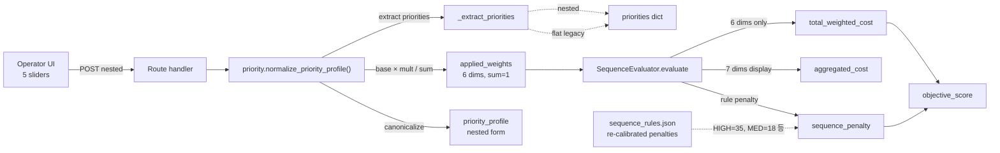
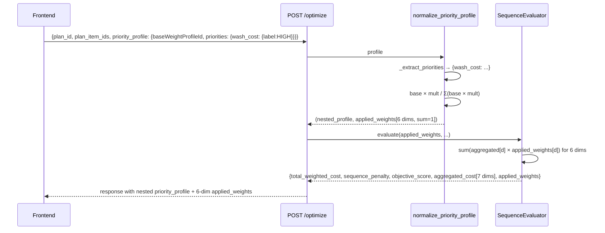
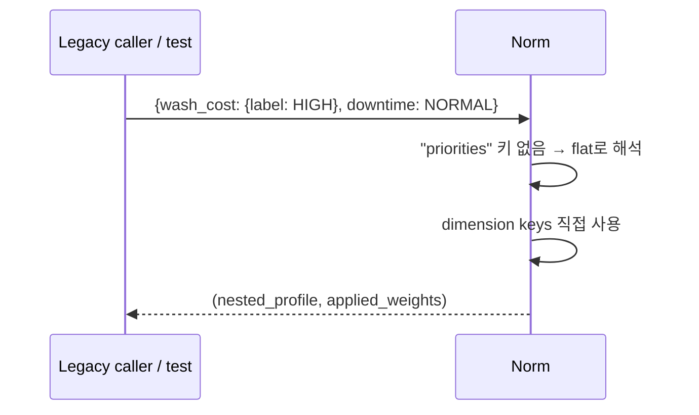
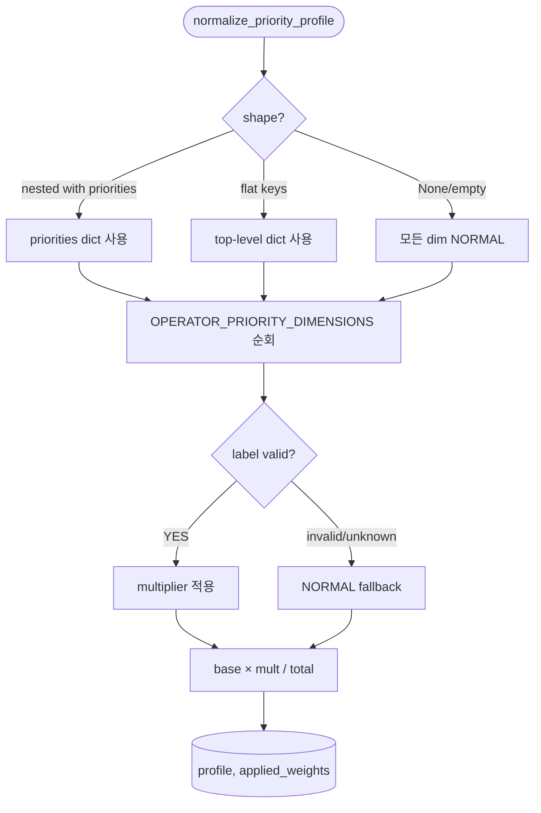

# Priority Profile Contract Conformance + Sequence Penalty Re-calibration

> Status: Design Approved (2026-05-19) · Backend Implementation Done · **Frontend Hand-off Pending**
> Created: 2026-05-19

## Context

현재 백엔드의 `priority_profile` 처리가 정본 계약(`docs/source/DB_state_v1.3.md` §6.1-6.2, `docs/api_contract.md` §29-77)과 3가지 측면에서 어긋나 있었습니다:

1. **구조 불일치**: 정본은 `{baseWeightProfileId, priorities: {dimension: {label, multiplier}}}` nested 구조인데, 코드(`services/priority.py:30-61`)는 flat `{dimension: {label, multiplier}}` 만 인식. contract 형식으로 호출하면 모든 차원이 NORMAL로 silently fallback (2026-05-18 라이브 reproduce 확인).
2. **applied_weights 의미 불일치**: 정본은 "공장 base × multiplier 재정규화(합=1), 6차원만, sequence_risk 제외"인데, 코드는 raw multiplier 7차원 그대로 반환 (합=7.15 등).
3. **total_weighted_cost 계산 범위**: DB_state §74는 "XGBoost 6차원 비용에 applied_weights 적용"으로 sequence_risk를 제외하지만, 코드는 sequence_risk × multiplier도 함께 더함.

영향:
- 프론트엔드가 contract대로 priority_profile을 보내도 우선순위 슬라이더가 무력화됨 → Task #3(D&D + UI) 의미가 사라짐.
- `decisions` 테이블의 저장 데이터가 contract 형식이 아님 → 향후 외부 분석/대시보드 통합 시 재가공 필요.
- explanation_service가 nested 구조를 받으면 wash_cost 우선순위를 인식하지 못함.

부수적으로 sequence_risk 제외에 따라 HIGH 전환의 objective 기여도가 45(35 sequence_risk × 1.0 + 10 penalty) → 10(penalty만)으로 축소됩니다. 위반 회피 신호 약화를 막기 위해 `sequence_rules.json`의 penalty 값을 함께 재조정했습니다.

## Goals & Non-Goals

### Goals
- `priority_profile` 입력을 **nested 정본 형식** + flat legacy 형식 모두 graceful 수용.
- API 응답의 `priority_profile`(normalized form)을 **항상 nested 정본 형식**으로 반환.
- `applied_weights`를 **6차원, 합=1로 재정규화**, `sequence_risk` 제외, 정본 `FACTORY_DEFAULT_V1_BASE_WEIGHTS` 사용.
- `total_weighted_cost = Σ(aggregated[d] × applied_weights[d])` for 6차원만 (sequence_risk 제외).
- `aggregated_cost`는 sequence_risk 포함 7차원 유지 (display 용).
- `sequence_rules.json` penalty 값을 re-calibrate해 HIGH/MID 전환의 objective 기여도가 spec 적용 후에도 유의미하게 유지.
- `explanation_service`가 nested priority_profile에서 wash_cost 라벨 정상 추출.
- 회귀 방지 smoke test 추가 (정본 형식 입력, applied_weights 합 검증, sequence_risk 제외 검증, HIGH 전환 비용 영향 검증).

### Non-Goals
- `sequence_risk` continuous(1/18/35) → binary(0/1) 정렬 (DB_state §6.4 sequenceViolation): 별도 task.
- 여러 base_weight_profile_id 지원: `factory_default_v1` 단일 hardcode.
- Pydantic 스키마 강화: `priority_profile: dict[str, Any]` 유지.
- XGBoost 학습 / 프론트엔드 D&D / API client 확장 (각각 Task #3, #4).
- decisions 테이블의 legacy 행 마이그레이션: Task #1의 자동 재생성에 의존.

## Architecture



## Sequence / Flow

### Happy Path (contract nested 입력)



### Legacy flat 입력 (backward graceful)



### Error Paths



## Decisions & Rationale

### Decision 1: 입력은 nested + flat 둘 다 수용, 출력은 항상 nested
- **Decision**: `normalize_priority_profile`이 입력 dict에 `"priorities"` 키 존재 여부로 분기. 결과는 항상 nested.
- **Alternatives**: strict nested only / strict flat / Pydantic discriminated union.
- **Rationale**: 점진적 마이그레이션 + 기존 smoke test 호환. 향후 strict 모드로 좁히고 싶으면 deprecation 경고 추가만 하면 됨.
- **Impact**: 호출처 변경 없이 contract 정합 달성.

### Decision 2: factory_default_v1 base weights를 contract 예시 역산값으로 고정
- **Decision**: `FACTORY_DEFAULT_V1_BASE_WEIGHTS = {setup_time: 0.1360, wash_cost: 0.2047, downtime: 0.2354, material_loss: 0.1360, packaging_time: 0.1063, labor_cost: 0.1816}` (합=1).
- **Alternatives**: 균등 1/6 / 임의 비즈니스 가중치.
- **Rationale**: contract §6.2 예시 `applied_weights`에서 역산해 문서/구현 정합. downtime/wash가 큰 비중을 갖는 구조가 도료 제조 비용 driver 직관과 부합.
- **Impact**: `/plans` 기본 응답의 `applied_weights`가 contract 예시 §6.2와 정확히 일치. `total_weighted_cost` 자릿수는 ~382K → ~76K로 축소되지만 순위는 보존.

### Decision 3: `applied_weights`는 6차원, 합=1 재정규화, sequence_risk 제외
- **Decision**: `BASE_WEIGHT_DIMENSIONS = [setup_time, wash_cost, downtime, material_loss, packaging_time, labor_cost]`. setup_time의 multiplier는 1.0 고정.
- **Alternatives**: raw multiplier 그대로 / 7차원에 sequence_risk 1.0.
- **Rationale**: DB_state §6.2 / api_contract §60 정본. 재정규화는 UI 차트(파이/스택바)와 직관 정합.
- **Impact**: `aggregated_cost`는 7차원 유지(display), `applied_weights`는 6차원.

### Decision 4: `total_weighted_cost`는 6차원만, sequence_risk는 aggregated_cost로만 표시
- **Decision**: `optimizer.evaluate()` / `_build_score_matrix()` 의 weighted sum을 `BASE_WEIGHT_DIMENSIONS`로 한정.
- **Alternatives**: 현재처럼 7차원 모두 가중 합산.
- **Rationale**: DB_state §74. sequence_risk는 Rule Engine 산출이고 이미 sequence_penalty로 별도 합산.
- **Impact**: HIGH 전환의 objective 기여도 단독 = 45 → 10. Decision 5와 짝.

### Decision 5: sequence_rules.json penalty 값을 severity-tier 기준으로 재조정
- **Decision**: SR-001 10→35, SR-002 6→30, SR-003 7→18, SR-004 8→32. 기존 상대 순서(SKU > category specific > general) 유지.
- **Alternatives**: penalty 유지 / 모든 high를 35로 통일 / 자동 가산 매핑.
- **Rationale**: HIGH 전환의 absolute objective 기여도를 spec 적용 전 수준(45)에 근사하게 유지하면서 per-rule 미세 조정 보존.
- **Impact**: 추천 sequence vs 위반 sequence cost gap 보존. demo narrative 유지.

### Decision 6: explanation_service는 nested + flat 둘 다 graceful 처리
- **Decision**: `priority_profile.get("priorities", priority_profile)` 패턴.
- **Rationale**: `/explain` 라우터가 normalize 거치지 않고 client-provided profile을 그대로 받음. 표현 계층에서 흡수.

## Edge Cases & Error Handling

- 빈 priorities dict → 모든 dim NORMAL, applied_weights = base normalized (합=1).
- `setup_time`을 priorities에 포함 → 무시 (operator-adjustable 5개만 처리).
- `sequence_risk`를 priorities에 포함 → 무시.
- 알 수 없는 label → NORMAL fallback.
- multiplier 키 누락 → label에서 재계산.
- base × mult 합이 0 → 방어적으로 0 반환.
- decisions 테이블의 legacy 행 → Task #1 자동 DROP+재생성.

---

## (Optional) Data Model

### `priority_profile` wire format

```json
{
  "base_weight_profile_id": "factory_default_v1",
  "priorities": {
    "wash_cost": {"label": "HIGH", "multiplier": 1.15},
    "downtime": {"label": "NORMAL", "multiplier": 1.0},
    "material_loss": {"label": "NORMAL", "multiplier": 1.0},
    "packaging_time": {"label": "LOW", "multiplier": 0.85},
    "labor_cost": {"label": "NORMAL", "multiplier": 1.0}
  }
}
```

### `applied_weights` wire format

```json
{
  "setup_time": 0.134,
  "wash_cost": 0.232,
  "downtime": 0.232,
  "material_loss": 0.134,
  "packaging_time": 0.089,
  "labor_cost": 0.179
}
```

| 필드 | 타입 | 비고 |
|---|---|---|
| 6 dimensions | number | 합 = 1.0 (rounding tolerance ±0.0001) |
| `sequence_risk` | — | 포함 안 됨 |

### `FACTORY_DEFAULT_V1_BASE_WEIGHTS`

| dimension | weight |
|---|---:|
| setup_time | 0.1360 |
| wash_cost | 0.2047 |
| downtime | 0.2354 |
| material_loss | 0.1360 |
| packaging_time | 0.1063 |
| labor_cost | 0.1816 |
| **sum** | **1.0000** |

### sequence_rules.json penalty 갱신

| rule_id | severity (derived) | penalty (old → new) |
|---|---|---|
| SR-001 | HIGH | 10 → **35** |
| SR-002 | HIGH | 6 → **30** |
| SR-003 | MID | 7 → **18** |
| SR-004 | HIGH | 8 → **32** |

## (Optional) API / Interface

응답 본문의 `priority_profile`, `applied_weights` 구조 변경. 엔드포인트 시그니처 동일.

## (Optional) Performance

`normalize_priority_profile` 호출 비용 증가 무시 가능. Optimizer hot loop는 1회 normalize 후 weights 재사용.

## (Optional) Open Questions

- `sequence_risk` continuous→binary 정렬 (DB_state §6.4): 본 task 범위 밖. 별도 follow-up.
- `Warning.type` / `Warning.commitBlocking` 필드 추가: implementation_log 2026-05-17 보류 항목과 통합 결정 필요.

## (Optional) Out of Scope

- Pydantic 스키마 강화 (discriminated union 등)
- 다중 `base_weight_profile_id` 지원
- 프론트엔드 client.ts에 `/optimize`/`/predict`/`/decisions` 추가 (Task #3)
- XGBoost 학습 (Task #4)

---

# Implementation Plan

## Target Files

| File | Action | Status |
|---|---|---|
| `backend/app/services/priority.py` | Modify | Done (2026-05-19) |
| `backend/app/services/optimizer.py` | Modify | Done |
| `backend/app/services/explanation_service.py` | Modify | Done |
| `backend/app/data/raw/sequence_rules.json` | Modify | Done |
| `backend/tests/test_smoke.py` | Modify | Done (신규 5건) |
| `frontend/src/api/types.ts` | Modify | **Pending — hand-off to FE owner** |
| `docs/api_contract.md` | Modify | Done (숫자 갱신) |

## Frontend Hand-off Note

> 이 task의 frontend 변경은 별도 담당자가 수행할 예정이라 본 작업에서는 코드 변경을 하지 않았습니다.

**대상 파일**: `frontend/src/api/types.ts`

**변경해야 할 내용**:

1. `PriorityProfile` 인터페이스를 nested 정본 형식으로 정의합니다 (현재는 flat `Record<string, PrioritySetting>`).

   ```ts
   // 추가
   export type OperatorPriorityDimension =
     | 'wash_cost'
     | 'downtime'
     | 'material_loss'
     | 'packaging_time'
     | 'labor_cost';

   // 추가
   export interface PriorityProfile {
     base_weight_profile_id: string;
     priorities: Partial<Record<OperatorPriorityDimension, PrioritySetting>>;
   }
   ```

2. `PlanResponse.default_priority_profile`의 타입을 `Record<string, PrioritySetting>` → `PriorityProfile`로 교체.

   ```ts
   export interface PlanResponse {
     plan_id: string;
     plan_items: PlanItem[];
     operating_context: Record<string, unknown>;
     default_priority_profile: PriorityProfile;  // ← 변경
   }
   ```

3. 사용처 점검:
   - 현재 `frontend/src/api/client.ts`는 `getPlan(planId)`만 호출하며 priority_profile을 직접 사용하지 않음.
   - `frontend/src/components/PriorityProfilePanel.tsx`는 placeholder. 실제 slider 구현 시 `priorities[dim]` 형태로 접근.
   - `frontend/src/state/decisionState.ts`에 `PriorityProfile` 타입을 참조하는 곳이 있다면 동일 타입으로 갱신.

4. 검증: `cd frontend && npm run lint && npm run build` 통과해야 함.

**참고**: backend는 nested + flat 입력 모두 graceful 수용하므로 frontend 변경 전에도 backend 동작은 정상입니다. 다만 contract 의도대로 slider가 효과를 내려면 nested 형식으로 보내야 합니다.

## 검증 결과 (2026-05-19)

- `cd backend && python -m pytest tests/ -v` → **13 passed** (기존 8 + Task #2 신규 5)
- `cd backend && ruff check app/ tests/` → All checks passed
- 라이브 reproduce:
  - `/optimize` with contract nested + wash=HIGH → `objective_score = 76155.71` (이전 ~404K), `applied_weights[wash_cost] = 0.232`
  - `/predict` baseline vs 위반 sequence → `objective_delta = 13839.47`, `comparison_state` 정본 5 core 필드 정합
  - `/validate` BLACK→WHITE 전환 → `penalty: 35.0` (재조정 반영)
- contract §6.2 예시 `applied_weights` (setup:0.134, wash:0.232, downtime:0.232, material:0.134, packaging:0.089, labor:0.179) **정확히 일치**
