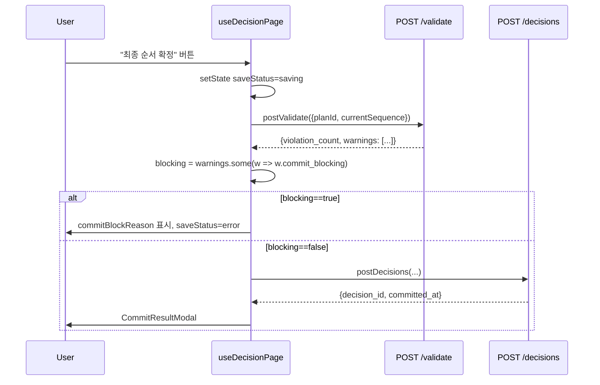
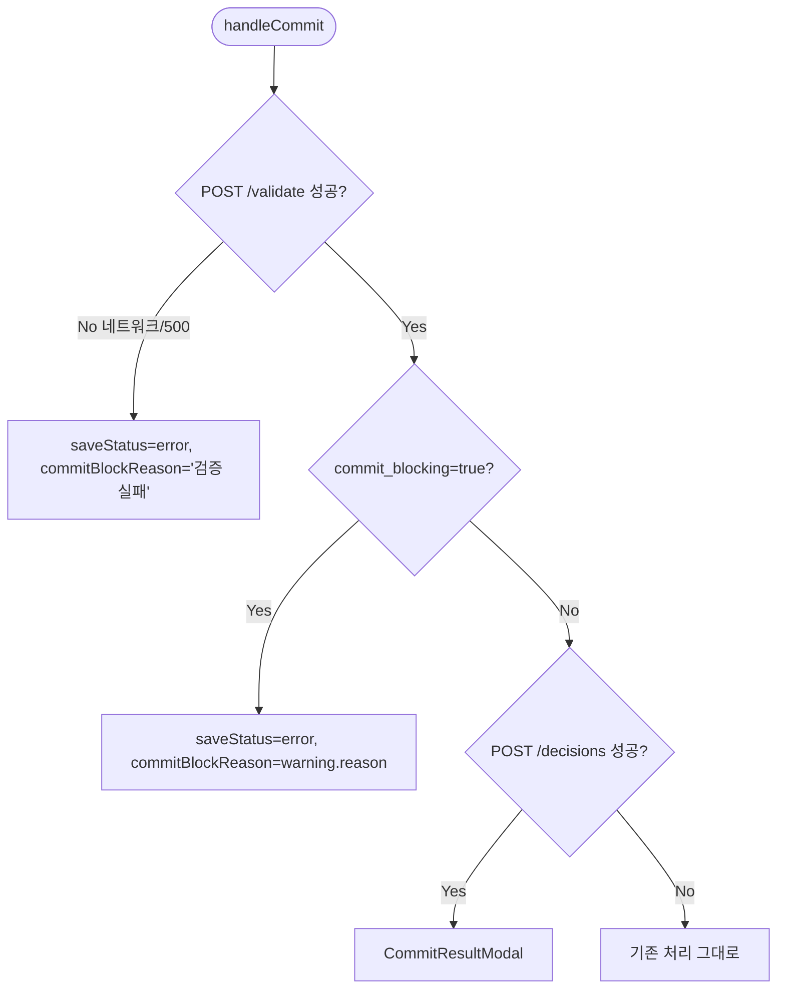

# P0 — `/validate` 응답·`sequence_risk` 의미·프론트 호출 정렬 Design Document

> Status: Draft
> Created: 2026-05-21
> Owner: backend + frontend

## Context

`docs/design/overview/mvp-completion-plan.md`의 P0 갭 3건을 한 PR로 묶기 위한 세부 설계입니다. 현재 상태와 목표 사양은 다음과 같습니다.

| 영역 | 현재 | 목표 (DB_state v1.3) | 갭 |
|---|---|---|---|
| `Warning` 응답 형식 | `{rule_id, severity, from_plan_item_id, to_plan_item_id, penalty, message, recommendation}` (`rule_engine.py:114-124`) | `{ruleId, type, fromPlanItemId, toPlanItemId, risk, penalty, commitBlocking, reason, recommendation}` (§12) | `type`·`risk`(소문자)·`commit_blocking`·`reason` 키 부재 |
| `sequence_risk` 값 의미 | `{LOW:1.0, MEDIUM:18.0, HIGH:35.0, default:1.0}` (`rule_engine.py:126`) | 0/1 binary, aggregated는 sum = 위반 건수 (§6.4 `sequenceViolation`) | 의미 불일치 (정량 점수 vs 위반 카운트) |
| Frontend `/validate` 호출 | 호출 path 없음. `commitBlockReason`은 외부 에러 처리에서만 설정 (`useDecisionPage.ts:58, 66, 152`) | commit 직전 호출 → `commit_blocking: true` warning 있으면 차단 (§7.5) | 호출 함수·매퍼·hook 분기 부재 |

DB_state §6.7은 `commitBlocking`을 응답에 포함하라고 명시하면서도 §7.5에서 "P0 룰은 모두 `commit_blocking: false`"라고 못 박습니다. 즉 본 PR의 frontend 작업은 **실제 차단 시연이 아니라 contract 정렬 + 호출 path 확보**가 목적입니다. 향후 commit-blocking 룰이 추가되면 별도 변경 없이 동작하도록 구조를 갖춰두는 것이 핵심입니다.

## Goals & Non-Goals

### Goals

| Goal | Description |
|---|---|
| Warning shape 정렬 | `/validate`·`/optimize`·`/predict` 응답의 risk_warnings 모두 DB_state §12 키를 포함하도록 통일 |
| `sequence_risk` 의미 정렬 | 값 자체를 0/1 binary로. aggregated와 kpi_trend가 위반 건수가 되도록 |
| Frontend `/validate` 호출 path 확보 | client.ts·mappers.ts·useDecisionPage에 호출 분기 추가. commit 직전 1회 호출 |
| 회귀 안전 | 기존 14건 smoke test + 신규 분기에 회귀 테스트 추가 |

### Non-Goals

| Non-Goal | Reason |
|---|---|
| 키 이름 `sequence_risk` → `sequence_violation` 변경 | DB_state §6.4는 `sequenceViolation`이지만 frontend types/mapper에 광범위 영향. 별도 follow-up. |
| `severity` 필드 제거 | dashboard_service의 high_risk 카운트, frontend SEVERITY_UI 매핑이 `severity`에 의존. 우선 superset 유지. |
| commit-blocking 룰 신설 | §7.5는 P0 모두 `commit_blocking: false`. 룰 정책 변경은 별도 design. |
| 응답 키 camelCase 전환 | 다른 API와 일관성 유지(snake_case in wire, camelCase in frontend via mapper). |

## Architecture

```mermaid
graph LR
  Rules[sequence_rules.json<br/>commit_blocking 필드 활용] --> RuleEngine[RuleEngine.evaluate_transition]
  RuleEngine -->|Warning v12 shape| Routes
  Routes --> V[/validate]
  Routes --> O[/optimize]
  Routes --> P[/predict]
  V & O & P --> Mapper[frontend mappers.ts]
  Mapper --> Hook[useDecisionPage]
  Hook -->|commit 직전 await postValidate| CommitGate{commit_blocking=true?}
  CommitGate -->|Yes| Block[commitBlockReason 설정]
  CommitGate -->|No| Save[postDecisions]
```

| 컴포넌트 | 책임 |
|---|---|
| `RuleEngine._result` | warning dict에 §12 키를 추가해 반환. `sequence_risk` 값을 0/1로. |
| `routes_validate.py` | 응답 그대로 패스. 추가 변환 없음. |
| `optimizer.py`·`SequenceEvaluator` | aggregated_cost·transition_costs에 동일 shape의 warning을 흘려보냄. binary sum 자동 적용. |
| `dashboard_service.py` | `severity == "HIGH"` 카운트 로직 유지(superset 유지로 호환). |
| `frontend/src/api/types.ts` | `ValidateResponseRaw`·`WarningRaw` 확장. 신규 필드 옵션 추가. |
| `frontend/src/api/mappers.ts` | `toValidateRequest`·`mapValidateResponse` 신규. `mapRiskWarning`은 reason/message 양쪽 흡수. |
| `frontend/src/api/client.ts` | `postValidate` 신규. |
| `frontend/src/hooks/useDecisionPage.ts` | `handleCommit`에서 `postValidate` 선행 호출. `commit_blocking=true` warning 있으면 `commitBlockReason` 세팅하고 저장 중단. |

## Sequence / Flow

### 정상 흐름 (commit 시점)



| Step | Description |
|---:|---|
| 1 | 사용자가 확정 버튼 클릭 |
| 2 | 훅이 `saveStatus=saving`으로 전환 |
| 3 | `/validate`로 현재 순서 룰 검사 |
| 4 | 응답의 warnings 중 `commit_blocking=true` 가 하나라도 있으면 차단 |
| 5 | 차단 시 `commitBlockReason` 메시지 세팅, `saveStatus=error` |
| 6 | 미차단 시 기존 `postDecisions` 흐름 진행 |

### 주요 에러 흐름



| Case | Handling |
|---|---|
| `/validate` 호출 자체 실패 | `commitBlockReason='순서 검증 실패: <err.message>'` + `saveStatus=error`. 시연 차단 방지 위해 fallback으로 commit 진행할지는 Open Question. |
| `commit_blocking=true` warning 발견 | 첫 번째 blocking warning의 `reason`을 commitBlockReason에 사용. |
| `warnings` 비어 있음 | 기존 `postDecisions` 흐름. |
| 데모 데이터 한정으로 `commit_blocking=true` 없음 | 사용자 시연 시 항상 미차단 path만 동작. 시각적 회귀 없음. |

## Decisions & Rationale

### Decision 1: warning dict는 superset으로 유지

| Item | Description |
|---|---|
| Decision | 기존 키(`severity`, `message`)를 제거하지 않고 새 키(`type`, `risk`, `commit_blocking`, `reason`)를 추가한다. |
| Alternatives | (a) 기존 키 제거 후 §12만 노출, (b) `message`만 `reason`으로 rename |
| Rationale | `severity`는 dashboard_service.py:29, frontend SEVERITY_UI 매핑에 광범위 사용. 한 PR에서 다 정리하면 회귀 위험 큼. 정렬은 새 키 추가로 충족. 후속 정리 PR에서 deprecate. |
| Impact | 응답 dict가 약 4 키 증가. 시연 영향 없음. |

### Decision 2: `sequence_risk` 키 이름은 유지, 값만 0/1

| Item | Description |
|---|---|
| Decision | `rule_engine._result`의 `risk_score`를 `1.0 if rule_id else 0.0`으로 변경. aggregated/kpi_trend는 키 그대로, 값만 위반 건수가 됨. |
| Alternatives | 키 이름을 `sequence_violation`으로 동시 변경 |
| Rationale | 키 rename은 schemas/cost.py, frontend types.ts, mappers.ts, dashboard 차트 라벨까지 영향. P0 본질은 "값의 의미 정렬"이지 명명 정렬이 아님. 후속 follow-up PR로 분리. |
| Impact | 차트 라벨이 그대로 `sequence_risk`로 노출되지만 값이 작은 정수가 되어 의미가 자연스러워짐. |

### Decision 3: Frontend는 commit 직전 1회 호출

| Item | Description |
|---|---|
| Decision | `useDecisionPage.handleCommit` 안에서 `postValidate`를 await으로 호출. 드래그·우선순위 변경 시점에는 호출하지 않음. |
| Alternatives | (a) 드래그 완료마다 호출, (b) 별도 "검증" 버튼 |
| Rationale | DB_state §7.2 API 호출 규칙: validate는 commit 직전. 매 드래그마다 호출하면 네트워크 부담 + 시각 잡음. /predict가 이미 매 드래그마다 호출됨. |
| Impact | 시연 시 확정 버튼 클릭 → validate → decisions 순. 약간의 지연(<200ms 예상). |

### Decision 4: validate 실패 시 보수적으로 차단

| Item | Description |
|---|---|
| Decision | `/validate` 네트워크 실패·5xx 시 `commitBlockReason='순서 검증에 실패했습니다. 다시 시도해주세요.'`로 차단. fallback commit 허용하지 않음. |
| Alternatives | validate 실패 시 그냥 commit 진행 |
| Rationale | 시연 환경은 로컬 dev로 신뢰성 높음. 미검증 commit이 더 위험. |
| Impact | 데모 중 백엔드 다운 시 commit 차단. 명시적 에러 메시지로 운영자가 인지 가능. |

### Decision 5: 브랜치 전략

| Item | Description |
|---|---|
| Decision | 현재 `backend` 브랜치에서 `p0-validate-and-risk` 분기. PR base는 `main`. |
| Alternatives | backend에 직접 commit (#16에 포함) |
| Rationale | P0 3건은 review 단위가 다름. 별도 PR로 분리해야 review 가능. PR #16 머지 후 본 PR 자동 rebase 또는 GitHub UI에서 충돌 없음. |
| Impact | PR이 2개 동시 open. #16 머지 시 main 기준으로 본 PR도 자동 정렬. |

## Edge Cases & Error Handling

| Case | Handling | Impact |
|---|---|---|
| `sequence_rules.json` 룰에 `commit_blocking` 키 부재 | `rule.get("commit_blocking", False)` — 기본 False. | 기존 룰 11건 모두 false 명시되어 있음. 안전. |
| `evaluate_transition`이 룰 매칭 0 (default branch) | warning=None 그대로. `sequence_risk=0.0`. | 기존 동작과 의미 동일(위반 없음). |
| /validate 호출 시 `current_sequence` 길이 0 또는 1 | warnings=[], violation_count=0. zip이 빈 결과. | 정상. |
| frontend에서 mapper가 옛 백엔드 응답(superset 미적용)을 만남 | `reason ?? message`, `risk ?? severity?.toLowerCase()`로 흡수. | 마이그레이션 안전망. |
| `/validate` 응답 후 사용자가 빠르게 재드래그 | `saveStatus=saving` 중 버튼 비활성화(이미 `CommitSection.tsx:80`에 처리). | 추가 보호 불필요. |

## Implementation Plan

### Step 1 — backend warning shape 정렬
파일: `backend/app/services/rule_engine.py`, `backend/tests/test_smoke.py`

`_result` 내 warning dict에 신규 키 추가:
```python
warning = {
    "rule_id": rule_id,
    "type": "color_transition",
    "severity": severity,               # superset 유지
    "from_plan_item_id": from_plan_item_id,
    "to_plan_item_id": to_plan_item_id,
    "risk": (severity or "low").lower() if severity else None,  # high|mid|low
    "penalty": penalty,
    "commit_blocking": False,           # MVP P0 모두 false
    "message": message,                  # superset 유지
    "reason": message,                   # §12 정렬
    "recommendation": recommendation,
}
```
Verify: `pytest tests/test_smoke.py::test_rule_engine_black_to_white -v` — 기존 단언 모두 통과.

### Step 2 — `sequence_risk` binary 변환
파일: `backend/app/services/rule_engine.py`

`_result`에서 `risk_score`:
```python
risk_score = 1.0 if rule_id else 0.0
```
Verify: 새 회귀 테스트 `test_sequence_risk_is_binary` — 매칭 시 1, 미매칭 시 0.

### Step 3 — backend 회귀 테스트
파일: `backend/tests/test_smoke.py`

- `test_validate_warning_has_v12_shape` — POST /validate 응답의 warnings[0]에 `type`, `risk`, `commit_blocking`, `reason` 키 존재 검증.
- `test_sequence_risk_is_binary` — RuleEngine 직접 호출. 위반 시 1, 미위반 시 0.
- `test_aggregated_sequence_risk_counts_violations` — POST /optimize의 aggregated_cost.sequence_risk가 정수 위반 수와 일치.

Verify: `pytest tests/ -q` 모두 pass.

### Step 4 — frontend types + mapper
파일: `frontend/src/api/types.ts`, `frontend/src/api/mappers.ts`

- `WarningRaw`에 `type?`, `risk?`, `commit_blocking?`, `reason?` 옵션 필드 추가.
- 도메인 `Warning`에 `type`, `risk`, `commitBlocking`, `reason` 추가(읽기 시 fallback `severity?.toLowerCase()` / `message`).
- `ValidateRequestRaw`, `ValidateResponseRaw` 신규.
- `toValidateRequest({planId, currentSequence})` 신규.
- `mapValidateResponse(raw)` 신규.

Verify: `npm run lint` — no error. `tsc --noEmit` (CI에 없으면 vscode/IDE 확인).

### Step 5 — frontend client + hook
파일: `frontend/src/api/client.ts`, `frontend/src/hooks/useDecisionPage.ts`

- `postValidate({planId, currentSequence})` export.
- `handleCommit`에서:
  ```ts
  try {
    const v = await postValidate({ planId: DEMO_PLAN_ID, currentSequence });
    const blocking = v.warnings.find(w => w.commitBlocking);
    if (blocking) {
      setState(prev => ({
        ...prev,
        saveStatus: 'error',
        commitBlockReason: blocking.reason,
      }));
      return;
    }
  } catch (err) {
    setState(prev => ({
      ...prev,
      saveStatus: 'error',
      commitBlockReason: '순서 검증에 실패했습니다. 다시 시도해주세요.',
    }));
    return;
  }
  // 기존 postDecisions 흐름
  ```

Verify: `npm run dev` → 결정 화면 → 확정 버튼 → Network 탭에서 `/validate` 호출 1회 → `/decisions` 호출 → CommitResultModal 표시.

### Step 6 — 통합 검증
- `cd backend && ruff check app/` clean.
- `cd backend && python -m pytest tests/ -q` all pass.
- `cd frontend && npm run lint` clean.
- 수동 e2e: 결정 화면 진입 → DnD 1회 → 확정 → 정상 저장. Dashboard 진입 → kpi_trend의 sequence_risk가 정수처럼 표시.

## Out of Scope

| Item | Reason |
|---|---|
| `sequence_risk` → `sequence_violation` rename | 별도 정리 PR. Decision 2 참조. |
| `severity` 필드 deprecate | 별도 정리 PR. Decision 1 참조. |
| Commit-blocking 룰 신설 | DB_state §7.5는 P0 모두 false. 룰 정책 변경은 별도 design. |
| Dashboard kpi_trend 차트 라벨 변경 | 키 이름을 유지하므로 라벨도 그대로. |
| `/validate`를 별도 "검증" 버튼으로 노출 | DB_state §7.2는 commit 직전 호출이 정본. |

---

## Data Model

본 변경은 응답 dict의 키만 추가합니다. DB schema 변경 없음.

## API / Interface

### `POST /validate` 응답 (변경)

| Field | Type | Description |
|---|---|---|
| `violation_count` | `int` | warning 개수 |
| `warnings` | `Warning[]` | DB_state §12 shape (`type`, `risk`, `commit_blocking`, `reason` 포함, `severity`·`message`도 함께) |

### 공통 Warning dict

| Field | Type | Description |
|---|---|---|
| `rule_id` | `string` | 매칭된 룰 ID |
| `type` | `string` | 항상 `"color_transition"` |
| `severity` | `"HIGH"\|"MEDIUM"\|"LOW"` | 호환용. 신규 클라이언트는 risk 권장 |
| `risk` | `"high"\|"mid"\|"low"` | DB_state §12 정렬 |
| `from_plan_item_id` / `to_plan_item_id` | `string` | 전환 양 끝 |
| `penalty` | `number` | 룰 페널티 |
| `commit_blocking` | `boolean` | 차단 여부. P0 모두 false. |
| `message` / `reason` | `string` | 동일 내용. reason이 §12 권장 명. |
| `recommendation` | `string \| null` | 권장 조치 |

## Workflow

_해당없음_

## Performance

`/validate` 추가 호출 1회는 ~50ms 이하(로컬 dev 기준). commit 흐름 총 지연 증가는 무시 가능.

## Security

_해당없음_

## Observability

`/validate` 실패 시 `commitBlockReason`에 명시적 메시지가 들어가 운영자에게 노출.

## Migration / Rollback

코드 변경만 포함. 데이터 마이그레이션 없음. 커밋 revert로 롤백 가능.

## Open Questions

| Question | Owner | Blocking? | Notes |
|---|---|---:|---|
| `/validate` 실패 시 fallback commit 허용 여부 | backend | No | Decision 4에서 차단 결정. 시연 후 재검토. |
| `sequence_risk` 키명 rename PR 일정 | backend | No | P0 follow-up backlog. |
| frontend SEVERITY_UI를 risk 기반으로 전환 일정 | frontend | No | 별도 정리 PR. |
