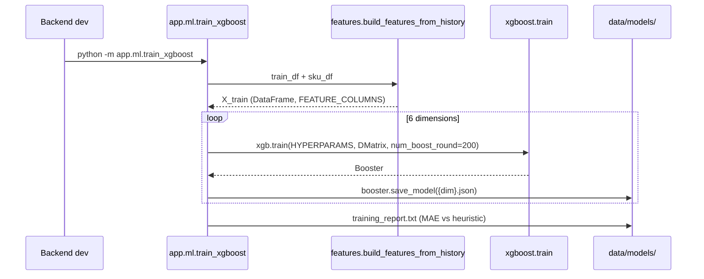
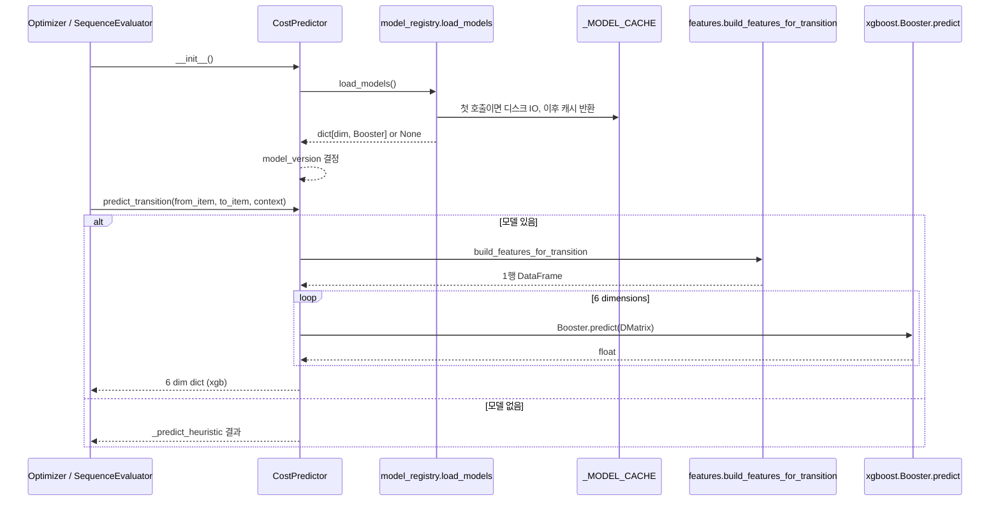
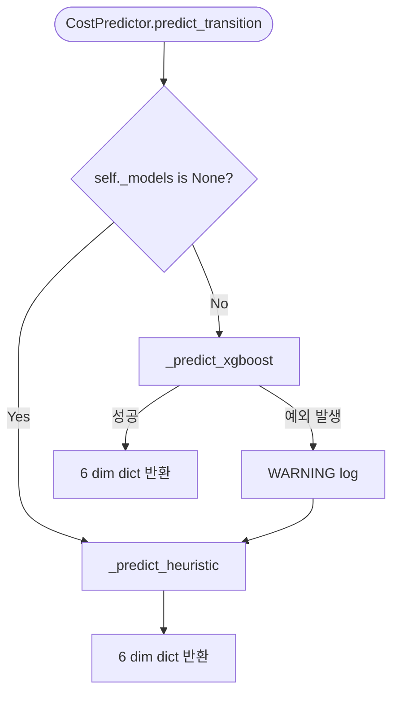

# XGBoost 비용 예측기 통합 Design Document

> Status: Implemented (2026-05-20)
> Owner: backend
> Plan source: `~/.claude/plans/1-lexical-honey.md`
> Related: `docs/design/xgboost-cost-predictor-adoption.md` (학습용 가이드), `docs/design/p1-backend-sequencing.md` (작업 순서 합의), `docs/implementation_log.md` (2026-05-20 항목)

## 1. Context

P0 backend 수직 슬라이스가 완성되고 dashboard kpi_trend 7차원 확장(2026-05-19)까지 끝난 시점에서, `docs/design/p1-backend-sequencing.md`가 합의한 다음 작업은 XGBoost 비용 예측기 도입입니다. 그전까지 `CostPredictor`는 deterministic heuristic이 유일한 경로였고, `train_xgboost.py`는 print만 하는 stub 상태였습니다. heuristic은 도메인 지식의 선형 합으로 동작하고 있어 비교 가능한 baseline은 안정적으로 확보되어 있지만, 비선형 상호작용(예: `equipment_condition`이 낮을 때 `family_changed`가 켜지면 비용이 비선형으로 튀는 패턴)을 표현하지 못합니다. 시연 narrative에서 "AI 비용 예측"을 단순히 휴리스틱으로 제시하면 ML 도입 가치가 보이지 않습니다.

본 작업은 학습 파이프라인·추론 분기·테스트 격리·학습 자료를 한 번에 정합화해 `CostPredictor`가 (a) XGBoost를 primary path로 사용하고, (b) 모델 파일이 없거나 로드 실패 시 heuristic으로 자동 fallback 하며, (c) 학습/추론이 같은 feature 함수를 사용해 silent drift를 차단하는 구조를 갖추는 것을 목적으로 합니다.

## 2. Goals & Non-Goals

### Goals

| Goal | Description |
|---|---|
| 실제 학습 파이프라인 | `python -m app.ml.train_xgboost`로 6개 차원 XGBoost 회귀 모델을 학습하고 네이티브 JSON으로 저장합니다. |
| CostPredictor 분기 | 모델 가용성을 인스턴스 생성 시점에 판정해 XGBoost 또는 heuristic 경로를 선택합니다. 입출력 시그니처는 두 경로에서 완전히 동일합니다. |
| Fallback 정책 준수 | 모델 부재·로드 실패·단일 예측 예외 모두 heuristic으로 자동 graceful fallback 합니다. API 응답 shape에는 영향이 없고 `model_version` 필드로만 구분합니다. |
| 학습/추론 단일 진실원천 | `app/ml/features.py`의 두 공개 함수(`build_features_from_history`, `build_features_for_transition`)가 학습과 추론에서 같은 컬럼·순서를 보장합니다. |
| 테스트 격리 | `SMARTFACTORY_MODEL_DIR` env로 모델 디렉토리를 오버라이드할 수 있게 하고, conftest가 기본값으로 빈 임시 디렉토리를 강제해 학습 산출물이 커밋되어 있어도 기존 smoke 테스트는 heuristic 경로로 결정론적으로 동작합니다. |
| 발표/학습 자료 | `docs/learning/xgboost-cost-predictor-walkthrough.md`에 코드 인용·MAE 해석·발표 스크립트·예상 질문을 포함한 단일 문서를 작성합니다. |

### Non-Goals

| Non-Goal | Reason |
|---|---|
| 차원별 hyperparameter 튜닝 | 데모는 재현성과 설명 가능성 우선입니다. 튜닝 효과는 청중에게 의미가 약하고 코드 복잡도만 늘립니다. |
| LLM/설명 흐름 변경 | 비용 예측기 교체와 무관한 영역입니다. |
| `sequence_violation_ref` 이진 라벨을 ML target에 포함 | rule_engine 책임 영역입니다. 학습 target에서 의도적으로 제외합니다. |
| 프론트엔드 `model_version` 표시 | 백엔드 응답에는 노출되지만 UI 변경은 별도 작업입니다. |
| sklearn/joblib 도입 | 의존성 비용을 회피하고 `xgb.train()` low-level API + numpy로 처리합니다. |
| `model_version` 전역 상수 mutate | 런타임 상태 변경은 회피하고 인스턴스 속성으로만 결정합니다. |

## 3. Architecture

```mermaid
graph LR
  subgraph training[Training pipeline]
    TrainCSV[(transition_history_train.csv)] --> Features
    TestCSV[(transition_history_test.csv)] --> Features
    SkuCSV[(sku_master.csv)] --> Features
    Features[features.py<br/>build_features_from_history] --> Train[train_xgboost.py<br/>xgb.train x6]
    Train --> Models[data/models/<br/>{dim}.json x6]
    Train --> Report[training_report.txt<br/>MAE vs heuristic]
  end

  subgraph runtime[Runtime inference]
    Optimizer[Optimizer<br/>SequenceEvaluator] --> Predictor[CostPredictor]
    Predictor -->|on init| Registry[model_registry<br/>load_models cache]
    Registry --> Models
    Predictor -->|xgb path| FeatInfer[features.py<br/>build_features_for_transition]
    FeatInfer --> Boosters[Booster.predict<br/>x6]
    Predictor -->|fallback| Heuristic[_predict_heuristic]
  end

  Features -.same fn module.- FeatInfer
```

| 컴포넌트 | 책임 | 경계 |
|---|---|---|
| `app/ml/features.py` | 학습/추론 공통 feature 생성. `FEATURE_COLUMNS` 상수가 컬럼 순서의 단일 출처. | 도메인 식 변경은 본 파일에서만 일어납니다. heuristic과 같은 신호를 사용하지만 heuristic 자체는 `cost_predictor._predict_heuristic`에 둡니다. |
| `app/ml/model_registry.py` | 모델 디렉토리 경로·디스크 로드·모듈 캐시. | 6개 차원이 모두 로드돼야 성공으로 처리합니다. 부분 fallback은 비교 일관성을 해치므로 금지. |
| `app/ml/train_xgboost.py` | 6개 차원 독립 회귀 학습 + native JSON 저장 + MAE 리포트. | sklearn 의존 없이 `xgb.train()` low-level API만 사용. |
| `app/services/cost_predictor.py` | XGBoost 또는 heuristic 경로 선택. 입출력 시그니처 보장. | 모델 로드·캐시는 `model_registry` 책임. predictor는 분기만 담당. |
| `app/services/optimizer.py`, `app/services/decision_logger.py` | predictor가 노출한 `model_version`을 응답·DB에 그대로 전파. | `MODEL_VERSION` 전역 상수는 더 이상 응답 출처가 아닙니다. |
| `app/core/config.py` | `SMARTFACTORY_MODEL_DIR` env 오버라이드를 `DATA_MODEL_DIR`에 반영. | 테스트가 conftest module-level에서 env를 세팅해 격리합니다. |

## 4. Sequence / Flow

### 정상 흐름 — 학습



### 정상 흐름 — 추론



| Step | Description |
|---:|---|
| 1 | 호출자가 `CostPredictor()`를 생성합니다. `Optimizer()`는 요청당 새로 만듭니다. |
| 2 | 인스턴스 생성 시점에 `model_registry.load_models()`를 한 번 호출합니다. 모듈 캐시가 첫 호출에서만 디스크 IO를 일으킵니다. |
| 3 | 6개 차원 모두 로드되면 `model_version = "xgboost-v1"`, 아니면 `"heuristic-v1"`을 인스턴스 속성에 설정합니다. |
| 4 | `predict_transition`이 호출되면 분기에 따라 6개 키 dict를 반환합니다. |
| 5 | `Optimizer.evaluate`가 `self.predictor.model_version`을 응답 dict에 포함시켜 외부로 노출합니다. |

### 에러 흐름



| Case | Handling |
|---|---|
| 모델 디렉토리에 6개 중 하나라도 없음 | `load_models`가 None 반환 → 인스턴스 단위 heuristic 경로 고정. |
| 모델 디렉토리에 6개 모두 있지만 `xgboost.Booster.load_model` 실패 | `load_models` try/except가 WARNING 로그 후 None 반환 → heuristic 경로 고정. |
| 단일 `Booster.predict` 호출에서 NaN/예외 | `predict_transition` try/except가 WARNING 로그 후 해당 호출만 heuristic으로 떨어집니다. 부분 fallback(차원 mix)은 금지. |
| 학습 시점과 다른 컬럼 순서·이름의 feature가 들어옴 | XGBoost가 silent하게 잘못된 가중치 사용 가능. → `tests/test_xgboost.py::test_features_build_consistent_shape_train_vs_inference`가 회귀 시 즉시 실패. |
| `xgboost` import 실패 (예: libomp 없음) | `load_models` 안의 import가 예외 → WARNING + None 반환 → heuristic 경로 고정. API는 깨지지 않음. |

## 5. Decisions & Rationale

### Decision 1: 6 dimension 독립 회귀, multi-output 미사용

| Item | Description |
|---|---|
| Decision | `setup_time`, `labor_cost`, `material_loss`, `wash_cost`, `downtime`, `packaging_time` 각각에 대해 별도 `Booster`를 학습하고 6개 JSON 파일로 저장합니다. |
| Alternatives | (A) `xgboost.MultiOutputRegressor`로 단일 모델. (B) 라벨을 벡터로 fit 하는 custom multi-target loss. |
| Rationale | 차원별 feature importance 분석이 가능합니다(예: `wash_cost`가 `family_changed`에 강하게 반응). 일부 차원만 NaN/예외일 때 부분 정상 차원은 그대로 둘 수 있는 구조를 유지합니다. (A)는 sklearn 의존을 들여오고, (B)는 학습 자료에서 설명 비용이 큽니다. |
| Impact | 모델 파일이 6개로 늘어나지만 저장 크기는 모두 약 650KB씩, 합 ~4MB로 부담 없습니다. 로드 코드도 단순 for 루프 하나입니다. |

### Decision 2: XGBoost 네이티브 JSON 직렬화, pickle/joblib 미사용

| Item | Description |
|---|---|
| Decision | `booster.save_model(path)` / `Booster.load_model(path)` 사용. 차원당 1개 JSON 파일. |
| Alternatives | (A) joblib.dump (sklearn 권장). (B) pickle (stdlib). (C) 단일 JSON에 6 booster의 hex-encoded raw bytes를 dict로 묶기. |
| Rationale | (A)는 sklearn 의존. (B)는 Python 버전·xgboost 버전 변경 시 호환성 risk가 큽니다. (C)는 외부에서 모델을 inspect/decode 하기 어렵습니다. native JSON은 파일을 열어 트리 구조를 직접 볼 수 있고 발표 자료에서 "이게 학습된 트리입니다"라고 보여줄 수 있어 학습 가치도 높습니다. |
| Impact | xgboost 메이저 버전 변경 시 호환성은 검증 필요합니다. 현재 사용 버전 3.2.0 기준으로 안정. |

### Decision 3: `xgb.train()` low-level API, `XGBRegressor` (sklearn wrapper) 미사용

| Item | Description |
|---|---|
| Decision | 학습은 `xgb.train(HYPERPARAMS, DMatrix, num_boost_round=200)`, 추론은 `Booster.predict(DMatrix)`로 처리합니다. |
| Alternatives | `XGBRegressor.fit / .predict` (sklearn API 흉내). |
| Rationale | `XGBRegressor`는 import 시점에 scikit-learn을 요구합니다. 본 프로젝트는 fallback 정책상 "sklearn 없이도 동작" 옵션을 유지하고 싶었고, MAE 같은 보조 함수는 numpy로 직접 계산 가능합니다. low-level API가 학습 코드를 오히려 더 명시적으로 만들어 학습 자료에서 설명도 쉽습니다. |
| Impact | sklearn 미설치 환경에서도 학습·추론 모두 동작합니다. 학습 자료의 코드 인용도 sklearn 의존 없이 그대로 사용 가능. |

### Decision 4: 단일 진실원천 feature 모듈

| Item | Description |
|---|---|
| Decision | `app/ml/features.py`에 `build_features_from_history`(학습용)과 `build_features_for_transition`(추론용)을 같이 두고, 두 함수가 `FEATURE_COLUMNS` 상수의 컬럼 순서를 그대로 반환하게 합니다. |
| Alternatives | (A) 학습 스크립트 안에 feature 생성 코드를 두고 추론은 별도 함수에서 재구현. (B) 학습 시 컬럼 이름을 보존하는 `XGBRegressor` API만 쓰고 명시적 정렬은 생략. |
| Rationale | feature drift는 ML에서 가장 흔한 silent 버그입니다. (A)는 두 곳에서 같은 식을 유지해야 하므로 drift 확률이 큽니다. (B)는 booster가 컬럼명 매칭은 해주지만 booster 저장/로드 시 일관성이 항상 보장되지는 않습니다. 별도 회귀 테스트(`test_features_build_consistent_shape_train_vs_inference`)와 결합해 drift를 구조적으로 차단합니다. |
| Impact | 도메인 식(`brightness_gap` 등)을 바꿀 때 한 파일만 수정하면 학습/추론 양쪽 모두 즉시 반영됩니다. |

### Decision 5: 모델 로드는 모듈 캐시, 인스턴스 캐시 미사용

| Item | Description |
|---|---|
| Decision | `model_registry._MODEL_CACHE`에 dict[dim, Booster]를 저장. `_CACHE_SOURCE_DIR`로 디렉토리 변경 시 자동 무효화. `load_models(force_reload=True)`로 테스트에서 명시적 reload 가능. |
| Alternatives | (A) `CostPredictor.__init__`에서 직접 로드. (B) FastAPI lifespan에서 한 번 로드해 의존성 주입. |
| Rationale | (A)는 `Optimizer()`가 요청당 새 `CostPredictor`를 만드므로 매 요청마다 디스크 IO를 일으킵니다. 6 × ~650KB는 무시 못 합니다. (B)는 lifespan 마이그레이션이 필요해 본 작업 범위 밖입니다. 모듈 캐시는 구현이 단순하고 테스트에서 `force_reload`로 제어할 수 있습니다. |
| Impact | 모듈이 reload 되지 않는 한 디스크 IO는 첫 호출 1회. 디렉토리가 바뀌면 자동 갱신. 테스트 fixture가 cleanup 시 force_reload로 캐시도 정리합니다. |

### Decision 6: 모델 산출물은 일단 git에 commit, 시연 직전 별도 PR로 제거

| Item | Description |
|---|---|
| Decision | `backend/app/data/models/*.json`와 `training_report.txt`를 이번 PR에 포함합니다. `.gitignore`에는 추가하지 않습니다. 시연 직전 별도 PR로 제거 + ignore 추가. |
| Alternatives | (A) 처음부터 ignore. clone 직후 학습 안 돌리면 heuristic으로 동작. (B) 영구히 commit. |
| Rationale | 시연 환경에서 학습 환경 셋업(libomp 등)이 없을 수 있고, clone 직후 바로 demo 시나리오를 돌릴 수 있어야 합니다. 사용자가 "시연 직전에 분리해서 빼겠다"고 명시했으므로 commit 정책은 한시적입니다. |
| Impact | 저장소 크기 약 +4MB. 시연 후 정리 PR이 후속 작업 큐에 등록되어 있습니다. |

### Decision 7: model_version은 인스턴스 속성으로 결정, 전역 상수 mutate 금지

| Item | Description |
|---|---|
| Decision | `config.MODEL_VERSION = "heuristic-v1"`은 legacy 상수로 유지하되, 응답에 흘러나가는 값은 `self.predictor.model_version`(인스턴스 속성)을 사용합니다. `optimizer.evaluate`와 `decision_logger.save_decision`을 그에 맞춰 갱신했습니다. |
| Alternatives | (A) `config.MODEL_VERSION`을 런타임에 바꾸기. (B) 전역 함수 `current_model_version()`를 호출마다 부르기. |
| Rationale | (A)는 모듈 import 시점에 캡처된 값과 어긋날 risk가 큽니다. (B)는 매 호출마다 load_models를 거치게 되어 비용 무시 못 합니다. 인스턴스 속성은 한 번 결정되면 변하지 않고 trace가 명확합니다. |
| Impact | predictor 인스턴스가 만들어진 시점의 모델 상태를 응답이 정확히 반영합니다. 학습 직후 새 인스턴스부터 `"xgboost-v1"`이 보입니다. |

## 6. Edge Cases & Error Handling

| Case | Expected Handling | User/System Impact |
|---|---|---|
| 모델 디렉토리에 6개 중 5개만 존재 | `load_models`가 None 반환, heuristic 경로 사용 | 부분 모델로 비교 일관성 깨지는 risk 차단. API 응답 정상. |
| `xgboost` 패키지 import 실패 (libomp 미설치 등) | `load_models` 내부 import에서 예외 → WARNING + None | API 전체 정상. heuristic으로 동작. |
| 단일 `Booster.predict` 호출에서 NaN 반환 | `predict_transition` try/except → 해당 호출만 heuristic | 비교 데이터의 한 점만 heuristic 값으로 채워짐. 로그에 횟수 노출. |
| 사용자가 `SMARTFACTORY_MODEL_DIR`을 잘못된 경로로 지정 | 디렉토리 자동 생성(`mkdir -p`) 후 비어 있으니 heuristic 경로 | 운영자는 model_version 응답으로 즉시 식별 가능. |
| `sku_master.csv`에 새 SKU가 추가됐는데 학습된 모델은 옛 분포 | XGBoost가 학습 분포 밖 입력으로 추정. 값은 클램프(`max(0.0, …)`)로 음수 방지 | 정확도 저하 가능. 새 SKU 추가 시 재학습 권고를 운영 문서로 남깁니다. |
| `transition_history_*.csv` 파일 자체가 없음 (`train_xgboost` 실행 시) | `pd.read_csv` FileNotFoundError → 학습 스크립트 즉시 종료 | 운영자가 즉시 인지 가능. seed 스크립트 재실행 안내. |
| feature drift (학습/추론 컬럼 불일치) | `test_features_build_consistent_shape_train_vs_inference`가 회귀 시 실패 | CI에서 즉시 발견. silent 버그 차단. |
| 동시 학습/추론 (한 프로세스가 학습 중 다른 프로세스가 추론) | 파일 시스템 race condition 가능. native JSON write는 atomic이 아님 | 데모 환경은 단일 프로세스라 risk 낮음. 운영 이전에 atomic write(`tmp+rename`)로 보강 필요. |
| 모델 파일이 손상되어 JSON parse 실패 | `Booster.load_model` 예외 → WARNING + None → heuristic | API 정상. 운영자는 재학습으로 복구. |

## Data Model

본 작업은 SQLite 스키마를 건드리지 않습니다. 단 디스크 산출물 포맷이 새로 도입됩니다.

| Path | Type | Description |
|---|---|---|
| `backend/app/data/models/{dim}.json` | XGBoost 네이티브 JSON | 6개 (setup_time, labor_cost, material_loss, wash_cost, downtime, packaging_time). 각 파일은 단일 Booster를 직렬화한 결과. |
| `backend/app/data/models/training_report.txt` | CSV (헤더 + 6행) | `dimension,mae_xgboost,mae_heuristic,relative_improvement` 컬럼. |

`decisions` 테이블에 저장되는 `model_version` 컬럼 값은 이제 `"heuristic-v1"`(기존 default) 또는 `"xgboost-v1"`(모델 로드 성공) 두 가지가 가능합니다. 기존 레코드는 그대로 `"heuristic-v1"`로 남고, 신규 레코드는 predictor의 인스턴스 속성을 따릅니다.

## API / Interface

본 작업은 신규 API를 추가하지 않습니다. 기존 응답의 `model_version` 필드 값만 동적으로 결정됩니다.

| Method | Path | 변경 |
|---|---|---|
| POST | `/optimize` | 응답의 `model_version`이 `"xgboost-v1"` 또는 `"heuristic-v1"` 중 하나. |
| POST | `/predict` | 동일. |
| POST | `/decisions` | 저장되는 `model_version` 컬럼 값이 동일 규칙을 따름. |

호환성: 기존 클라이언트는 `model_version`을 문자열로 받기만 하면 됩니다. 값 비교 로직이 들어 있다면 두 값을 모두 인식해야 합니다.

## Workflow

학습 워크플로:

```bash
cd backend
python -m app.ml.train_xgboost
# → backend/app/data/models/*.json (6개) + training_report.txt 생성
# → 학습 실패 시 즉시 종료, 부분 산출물 없음
```

검증 워크플로:

```bash
cd backend
python -m pytest tests/ -q     # 17 passed 기대 (기존 14 + 신규 3)
ruff check app/ tests/         # All checks passed 기대
python -c "
from app.services.cost_predictor import CostPredictor
print(CostPredictor().model_version)
"                               # → 'xgboost-v1' (모델 있는 경우)
```

## Performance

| Item | Target | 실측 |
|---|---|---|
| 학습 시간 (6 모델, 1,200행) | ≤ 60s | ~10s (Apple Silicon) |
| 모델 1회 로드 (디스크 → 메모리) | ≤ 300ms | 측정 안 함, 시연 환경에서 체감 무시 가능 |
| `predict_transition` 1회 (xgboost 경로) | ≤ 30ms | 측정 안 함 |
| 모델 파일 크기 (개당) | < 1MB | ~650KB |
| 학습 산출물 총합 | < 5MB | ~4MB |

OR-tools 최적화기가 `_build_score_matrix`에서 N×(N-1)번 predict를 호출하므로 N=8 기준 56회. 30ms 가정 시 약 1.7초. 데모 흐름에서는 수용 가능합니다.

## Security

| 항목 | 정책 |
|---|---|
| external input | `train_xgboost`의 입력은 repo 내 합성 CSV뿐입니다. 외부 입력 경로 없음. |
| secrets | 학습/추론 어디에도 비밀값을 사용하지 않습니다. |
| 모델 무결성 | 시연용 학습 산출물은 git에 commit되므로 fork/clone 시 변조 가능. 운영 환경에서는 별도 빌드 파이프라인에서 학습 후 무결성 검사를 추가해야 합니다 (본 작업 범위 밖). |
| 모델 의존 패키지 | `xgboost>=2.0` (현재 3.2.0). macOS는 `libomp` 시스템 의존 (Apple Silicon: `/opt/homebrew/opt/libomp/lib/libomp.dylib`). |

## Observability

| 항목 | 설명 |
|---|---|
| logs | `model_registry.load_models` 실패 시 WARNING. `CostPredictor.predict_transition`의 예외 fallback도 WARNING. |
| API 응답 | `model_version: "xgboost-v1" | "heuristic-v1"` 필드로 운영자가 분기 상태를 식별 가능. |
| `training_report.txt` | 학습 시점의 XGBoost vs heuristic MAE를 기록해 모델 회귀 추적이 가능. |
| metrics | _해당없음_ (별도 Prometheus 등 미도입). |
| alert conditions | _해당없음_ (시연 MVP). |

## Migration / Rollback

| 항목 | 설명 |
|---|---|
| migration steps | (1) `git restore backend/app/data/raw/sequence_rules.json`로 working tree를 정본으로 복구 → (2) 본 PR의 코드 적용 → (3) `python -m app.ml.train_xgboost`로 산출물 생성 → (4) `pytest tests/ -q`로 17 passed 확인. |
| backward compatibility | `model_version` 응답 필드는 그대로. 값만 `"xgboost-v1"`이 추가로 가능. 기존 `decisions` 레코드는 영향 없음. SQLite 스키마 무변경. |
| rollback method | `backend/app/data/models/` 디렉토리를 삭제하면 즉시 heuristic 경로 복귀. 코드 자체는 두 경로를 모두 지원하므로 모델 산출물만 제거하면 됩니다. 더 보수적으로 되돌리려면 PR 자체를 revert. |
| data recovery concerns | 학습 산출물은 재학습으로 항상 복구 가능 (`seed=42` 고정). 학습 데이터 자체는 본 PR에서 변경되지 않습니다. |

## Open Questions

| Question | Owner | Blocking? | Notes |
|---|---|---:|---|
| 실 데이터 도입 시 hyperparameter 재튜닝 기준은? | backend | No | 데모 후속. test split 기준·재현 seed·튜닝 범위는 별도 design doc 대상. |
| 모델 파일을 git에서 빼는 시점은 정확히 언제? | product | No | "시연 직전" 합의됨. 분리 PR 일정은 시연 D-1 정도가 적절. |
| feature importance UI 노출 여부 | frontend | No | P2 placeholder. 발표 자료로는 충분히 활용 가능하지만 운영 화면 노출은 별도 작업. |
| 학습 자체를 CI에서 돌릴지 (재현성 보증) | infra | No | 데모 환경에서는 로컬 학습으로 충분. 운영 이전에 CI 학습 단계가 필요. |

## Out of Scope

| Item | Reason |
|---|---|
| 시연 직전 학습 산출물 제거 + `.gitignore` 추가 | 별도 PR. 본 PR의 후속. |
| 런타임 SQLite 부수 파일(`smartfactory.sqlite3-shm`, `-wal`) `.gitignore` 추가 | 본 작업과 직접 관련 없음. cleanup PR에서 묶을 수 있음. |
| FastAPI `@app.on_event("startup")` → `lifespan` 마이그레이션 | DeprecationWarning이 잔존하지만 본 작업과 분리. |
| `sequence_risk` continuous(1/18/35) → binary(0/1) 정렬 (DB_state §6.4) | 2026-05-17부터 보류 중인 별도 contract drift 항목. |
| `Warning.type`, `Warning.commitBlocking`, `TransitionCost.warnings` 배열화 | 동일하게 DB_state §12 contract drift. |
| `backend/app/schemas/` 미사용 모델 정리 | `docs/design/schemas-cleanup-followup.md` 합의대로 trigger 기반 deferred. |
| 프론트엔드 `model_version` 표시 | 별도 frontend design doc 대상. |
| LLM 설명 흐름 변경 | template fallback 그대로 유지. 본 작업과 무관. |
| 차원별 hyperparameter 분리 / Bayesian optimization | demo 가치 낮음. 실 데이터 단계의 작업. |

---

# Implementation Plan

## Target Files

| File | Action | Purpose |
|---|---|---|
| `backend/app/ml/features.py` | Create | 학습/추론 공통 feature 함수. |
| `backend/app/ml/model_registry.py` | Modify | `get_model_dir`, `load_models`, 모듈 캐시 추가. |
| `backend/app/ml/train_xgboost.py` | Rewrite | stub → 실제 학습 파이프라인. |
| `backend/app/services/cost_predictor.py` | Modify | XGBoost 분기 + heuristic 메서드 분리 + `heuristic_only()` 클래스 메서드. |
| `backend/app/services/optimizer.py` | Modify | `model_version`을 `self.predictor.model_version`으로 변경. |
| `backend/app/services/decision_logger.py` | Modify | `confirmed_cost`의 `model_version`을 우선 저장. |
| `backend/app/core/config.py` | Modify | `SMARTFACTORY_MODEL_DIR` env override. |
| `backend/tests/conftest.py` | Modify | 임시 모델 디렉토리 env 격리. |
| `backend/tests/test_xgboost.py` | Create | 3개 회귀 테스트 (fallback / xgb path / feature shape). |
| `backend/app/data/models/{dim}.json` | Generate | 학습 산출물 (6개). |
| `backend/app/data/models/training_report.txt` | Generate | MAE 리포트. |
| `docs/learning/xgboost-cost-predictor-walkthrough.md` | Create | 학습/발표 자료. |
| `docs/implementation_log.md` | Modify | 작업 항목 기록. |

## Implementation Steps

순서가 고정됩니다. 각 단계의 산출물이 다음 단계의 입력입니다.

### Step 0: 선행 — `sequence_rules.json` 복구
- 명령: `git restore backend/app/data/raw/sequence_rules.json`
- 검증: `git diff backend/app/data/raw/sequence_rules.json` 결과가 비어 있음.

### Step 1: `features.py` 신설
- `FEATURE_COLUMNS` 상수 정의 (12개).
- `build_features_from_history(history_df, sku_df)`: from/to SKU join 후 `*_gap`/`*_changed` 파생, shift one-hot.
- `build_features_for_transition(from_item, to_item, context)`: 1행 DataFrame, 동일 컬럼 순서.
- 검증: 두 함수 출력의 `.columns`가 정확히 `FEATURE_COLUMNS`와 같은지 회귀 테스트로 확인.

### Step 2: `model_registry.py` 확장
- `MODEL_DIMENSIONS` 상수 (6개, predictor 출력 키와 동일).
- `get_model_dir()`, `get_model_path(dim)`, `load_models(force_reload)`.
- 모듈 캐시 `_MODEL_CACHE`, 디렉토리 변경 시 자동 무효화.

### Step 3: `config.py`에 env override
- `SMARTFACTORY_MODEL_DIR` 환경변수가 있으면 `DATA_MODEL_DIR`를 그 값으로 결정.

### Step 4: `train_xgboost.py` 재작성
- `xgb.train(HYPERPARAMS, DMatrix, num_boost_round=200)` 6번.
- `Booster.save_model(model_dir / f"{dim}.json")` 6번.
- heuristic baseline (`CostPredictor.heuristic_only()`)으로 MAE 비교 → `training_report.txt`.

### Step 5: 학습 실행 & 산출물 확인
- `cd backend && python -m app.ml.train_xgboost`
- 6개 JSON 파일 + report 생성 확인. 모든 dimension에서 MAE 양수 개선.

### Step 6: `cost_predictor.py` 분기
- `__init__(force_heuristic=False)` 시 `model_registry.load_models()`로 분기 결정.
- `predict_transition`이 3단 게이트로 동작 (no model / xgb success / xgb exception).
- `heuristic_only()` 클래스 메서드 노출.
- `_predict_xgboost`는 `features.build_features_for_transition` → `xgb.DMatrix` → `Booster.predict`.

### Step 7: `optimizer.py`, `decision_logger.py` 동기화
- `optimizer.evaluate`의 응답 dict에서 `model_version: self.predictor.model_version`.
- `decision_logger`는 `confirmed_cost.get("model_version") or MODEL_VERSION`.

### Step 8: 테스트 격리 + 신규 테스트
- `conftest.py`에 `SMARTFACTORY_MODEL_DIR` env 추가 (빈 임시 디렉토리).
- `test_xgboost.py`에 3개 케이스 (`trained_models_in_session_dir` fixture 포함).

### Step 9: 검증
- `python -m pytest tests/ -q` → 17 passed.
- `ruff check app/ tests/` → All checks passed.
- e2e smoke: `/optimize`의 `model_version == "xgboost-v1"`, 모델 디렉토리 비울 시 `"heuristic-v1"`.

### Step 10: 학습/발표 문서 + 로그
- `docs/learning/xgboost-cost-predictor-walkthrough.md` 작성.
- `docs/implementation_log.md`에 2026-05-20 항목 추가.

## Order Constraints

| 의존성 | 이유 |
|---|---|
| Step 1 → Step 4 | 학습 스크립트가 `features.build_features_from_history`를 import. |
| Step 1, 2, 3 → Step 6 | predictor가 features + model_registry + config 모두에 의존. |
| Step 4 → Step 5 | 산출물이 학습 실행 결과. |
| Step 6 → Step 7 | optimizer/decision_logger가 predictor의 인스턴스 속성을 읽음. |
| Step 5, 6, 7, 8 → Step 9 | 모든 변경이 적용된 뒤에 검증. |
| Step 9 → Step 10 | 검증된 결과(MAE 표 등)를 문서에 반영. |
